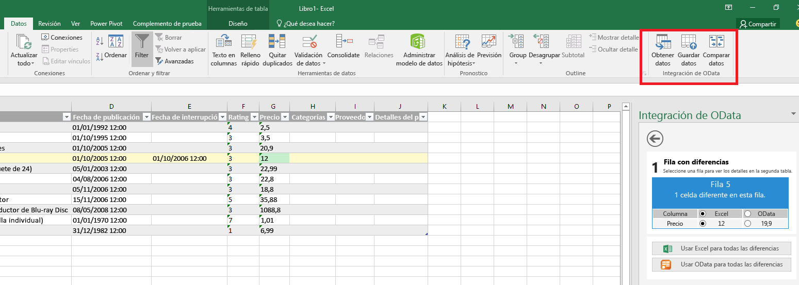
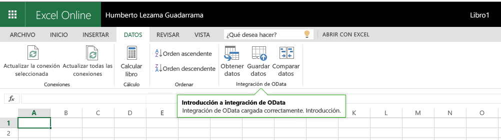

# Comandos de complementos para Excel, Word y PowerPoint

Los comandos de complementos son elementos de la interfaz de usuario que amplían la interfaz de usuario de Office e inician acciones en el complemento. Puede agregar un botón a la cinta, o bien un elemento a un menú contextual. Cuando el usuario selecciona un comando de complemento, se inician acciones como ejecutar código de JavaScript o mostrar una página del complemento en el panel de tareas. Los comandos de complementos ayudan a los usuarios a encontrar y usar su complemento, lo que puede aumentar la adopción y reutilización del complemento y mejorar la retención de clientes.

Para obtener información general sobre la característica, vea el vídeo [Add-in Commands in the Office Ribbon](https://channel9.msdn.com/events/Build/2016/P551) (Comandos de complementos en la cinta de Office).

>**Nota:** Los catálogos de SharePoint no son compatibles con los comandos de complementos. Puede implementar comandos de complementos mediante una [implementación centralizada](https://support.office.com/en-ie/article/Deploy-Office-Add-ins-in-the-Office-365-new-Admin-Center-737e8c86-be63-44d7-bf02-492fa7cd9c3f?ui=en-US&rs=en-IE&ad=IE) o la [Tienda Office](https://msdn.microsoft.com/en-us/library/jj220033.aspx), o usar una [instalación de prueba](https://dev.office.com/docs/add-ins/testing/create-a-network-shared-folder-catalog-for-task-pane-and-content-add-ins) para implementar el comando de complementos para realizar pruebas. 

**Complemento con comandos que se ejecuta en la versión para equipos de escritorio de Excel**

**Complemento con comandos que se ejecuta en Excel Online**

## Capacidades de comando
Actualmente, se admiten las capacidades de comando siguientes.

**Puntos de extensión**

- Pestañas de la cinta: ampliar las pestañas integradas o crear una pestaña personalizada.
- Menús contextuales: ampliar los menús contextuales seleccionados. 

**Tipos de controles**

- Botones sencillos: activan acciones específicas.
- Menús: menú sencillo desplegable con botones que activan acciones.

**Acciones**

- ShowTaskpane: muestra uno o varios paneles donde se cargan páginas HTML personalizadas.
- ExecuteFunction: carga una página HTML invisible y, después, ejecuta una función de JavaScript en la página. Para mostrar la interfaz de usuario dentro de su función (por ejemplo, errores, progreso, entrada adicional) puede usar la API [displayDialog](http://dev.office.com/reference/add-ins/shared/officeui).  

## Plataformas compatibles
Los comandos de complementos se admiten actualmente en las plataformas siguientes:

- Office 2016 para escritorio de Windows (versión 16.0.6769.0000 o posteriores)
- Office Online con cuentas personales
- Office Online con cuentas profesionales o educativas (vista previa)

Estarán disponibles en más plataformas próximamente.

## Introducción a los comandos de complementos

La mejor manera de empezar a usar comandos de complementos es mediante **ejemplos**. Consulte los [ejemplos de comandos de complementos de Office](https://github.com/OfficeDev/Office-Add-in-Commands-Samples/) en GitHub.

Para obtener información detallada sobre la referencia del manifiesto, consulte [Define add-in commands in your manifest](http://dev.office.com/docs/add-ins/outlook/manifests/define-add-in-commands) (Definir comandos de complementos en su manifiesto).

