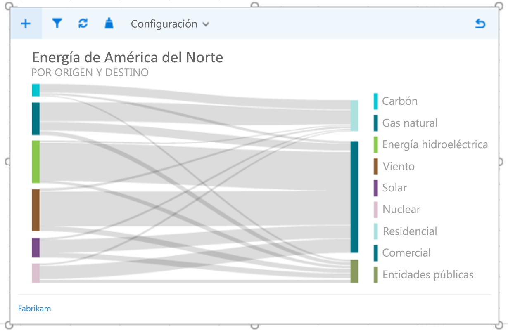
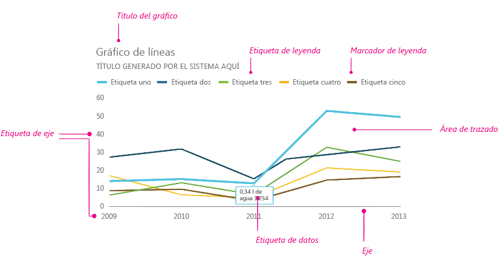
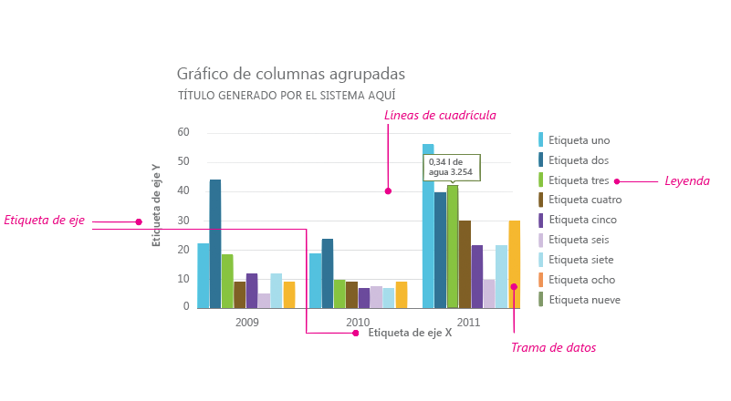
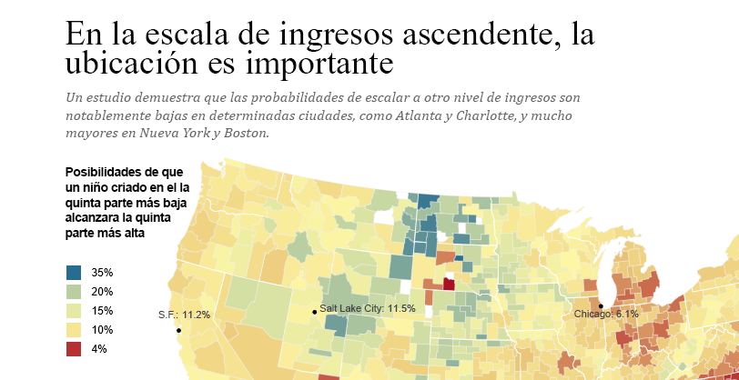
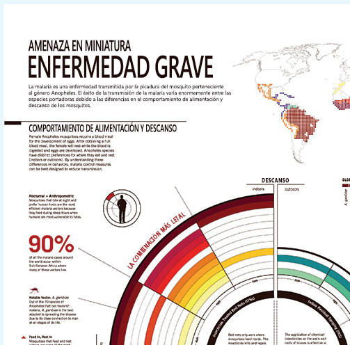
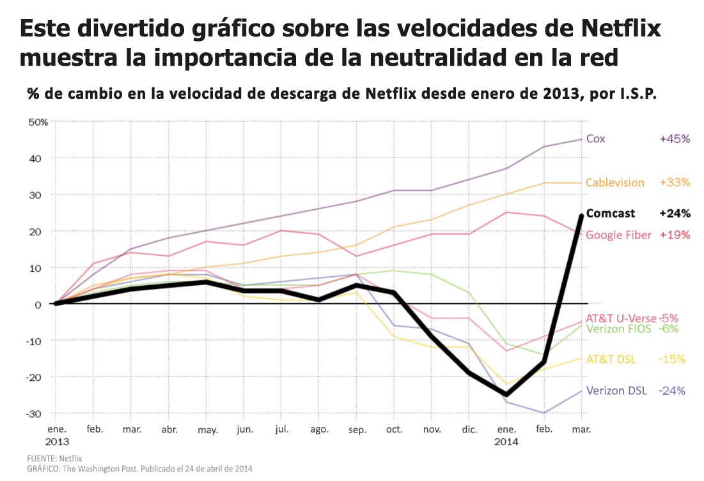

# Directrices de estilo para la visualización de datos en los complementos de Office

Las visualizaciones de datos de calidad ayudan a los usuarios a buscar información en sus datos. Pueden usar esa información para contar historias que informen y convenzan a sus usuarios. Este artículo proporciona instrucciones que le servirán para diseñar visualizaciones de datos eficaces en los complementos de Excel y otras aplicaciones de Office.

Le recomendamos usar [Office UI Fabric](http://dev.office.com/fabric) para crear el cromo para sus visualizaciones de datos. Office UI Fabric incluye estilos y componentes que se integran perfectamente con la apariencia de Office. 

<!--The following figure shows a data visualization in an add-in that uses Fabric.

 

-->

## Elementos de visualización de datos

Las visualizaciones de datos comparten un marco general y tienen elementos visuales e interactivos comunes, como, por ejemplo, títulos, etiquetas y trazados de datos, tal como se muestra en las figuras siguientes.



### Títulos de gráficos

Siga estas instrucciones para los títulos de gráficos:

- Haga que sus títulos de gráficos puedan leerse fácilmente. Colóquelos de forma que se cree una jerarquía visual clara con respecto al resto del gráfico.
- En general, use mayúsculas de frase (ponga en mayúscula la primera palabra). Para crear contraste o reforzar las jerarquías, puede usar texto todo en mayúsculas, pero con moderación.
- Incorpore la [rampa de tipos de letra de Office UI Fabric](http://dev.office.com/fabric/styles#typography) para que los gráficos sean coherentes con la interfaz de usuario de Office, que usa Segoe. También puede usar un tipo de letra distinto para diferenciar el contenido del gráfico de la interfaz de usuario.
- Use tipos de letra sans-serif con contadores grandes.

En los siguientes ejemplos se muestran los tipos de letra serif y sans-serif que se usan en los títulos de gráficos. Observe cómo el contraste de escala y el uso eficaz del espacio en blanco crean una fuerte jerarquía visual.



### Etiquetas de eje

Cree etiquetas de eje que sean suficientemente oscuras como para que se lean claramente, con relaciones de contraste adecuadas entre los colores del texto y el fondo. Asegúrese de que sean más claras que la tinta de datos.

Los grises claros son más efectivos para las etiquetas de eje. Si usa Fabric, consulte la [paleta de colores neutros](http://dev.office.com/fabric/styles#colors).

### Tinta de datos

Los píxeles que representan los datos reales en un gráfico se denominan tinta de datos. Este debe ser el punto central de la visualización. Evite el uso de sombras paralelas, esquemas pesados o elementos de diseño innecesarios que distorsionen los datos o compitan con ellos. Use degradados solo cuando los valores de datos estén ligados a los valores de color. Evite los gráficos tridimensionales, a menos que haya un valor medible y objetivo vinculado a una tercera dimensión.

### Color

Elija colores que se adhieran a los temas de la aplicación o el sistema operativo, en lugar de colores codificados de forma rígida. Al mismo tiempo, asegúrese de que los colores que aplique no distorsionen los datos. El uso incorrecto del color en las visualizaciones de datos puede provocar la distorsión de datos y la lectura incorrecta de la información.

Para conocer los procedimientos recomendados en el uso de color para las visualizaciones de datos, consulte lo siguiente:

- [Why rainbow colors aren't the best option for data visualizations (Por qué los colores del arco iris no son la mejor opción para la visualizaciones de datos)](http://www.poynter.org/2013/why-rainbow-colors-arent-always-the-best-options-for-data-visualizations/224413/)
- [Color Brewer 2.0: Color Advice for Cartography (Color Brewer 2.0: consejos sobre color para la cartografía)](http://colorbrewer2.org/)
- [I Want Hue (Quiero matices)](http://tools.medialab.sciences-po.fr/iwanthue/)

### Líneas de cuadrícula

Las líneas de cuadrícula son a menudo necesarias para poder leer un gráfico con precisión, pero deben presentarse como un elemento visual secundario, que mejore la tinta de datos y no compita con ella. Configure las líneas de cuadrícula estática para que sean delgadas y ligeras, a menos que estén diseñadas específicamente para conseguir un alto contraste. También puede usar la interacción para crear líneas de cuadrícula dinámicas que solo se muestren en contexto cuando un usuario interactúe con el gráfico.

Los grises claros son más efectivos para las líneas de cuadrícula. Si usa Fabric, consulte la [paleta de colores neutros](http://dev.office.com/fabric/styles#color).

La siguiente imagen muestra una visualización de datos con líneas de cuadrícula.

### Leyendas

Si es necesario, puede agregar leyendas para:

- Distinguir entre series
- Presentar cambios de escala o valor

Asegúrese de que las leyendas mejoren la tinta de datos y no compitan con ella. Coloque las leyendas:

- Alineadas a la izquierda sobre el área de trazado de forma predeterminada, si todos los elementos de la leyenda se ajustan sobre el gráfico.
- En la parte superior derecha del área de trazado, si todos los elementos de la leyenda no caben encima del gráfico; haga que sea desplazable, si es necesario.

Para optimizar la accesibilidad y legibilidad, asigne marcadores de leyenda a la forma de gráfico pertinente. Por ejemplo, puede usar marcadores de leyenda circulares para leyendas de gráficos de dispersión y de burbujas. Use marcadores de leyenda de segmento de línea para gráficos de líneas.

### Información de herramientas y etiquetas de datos

Asegúrese de que las etiquetas de datos y la información sobre herramientas tengan suficiente espacio en blanco y variación de tipo de letra. Use algoritmos para minimizar la oclusión y la colisión. Por ejemplo, la información de una herramienta puede aparecer a la derecha de un punto de datos de forma predeterminada y, sin embargo, aparecer a la izquierda si se detectan bordes derechos.

## Principios de diseño

El equipo de diseño de Office ha creado el siguiente conjunto de principios de diseño, que se utilizan para diseñar nuevas visualizaciones de datos en el conjunto de productos de Office.

## Principios de diseño visual

- Las visualizaciones deben respetar y mejorar los datos, de forma que estos puedan entenderse fácilmente. Resalte los datos agregando elementos auxiliares solo cuando sea necesario para ofrecer un contexto. Evite adornos innecesarios (sombras paralelas, contornos, etc.), elementos gráficos no deseados o distorsión de datos.
- Las visualizaciones deben fomentar la exploración proporcionando ricas indicaciones visuales. Use modelos de interacción y controles de interfaz bien consolidados, así como indicaciones del sistema claras.
- Incorpore principios de diseño consagrados. Use los principios de diseño tipográfico y de comunicación visual definidos para mejorar la forma, la legibilidad y el significado.

## Principios de diseño de interacción

- Cree diseños que permitan la exploración.
- Permita las interacciones directas con objetos que revelen nuevos datos (ordenación por medio de arrastre, por ejemplo).
- Use modelos de interacción sencillos, directos y conocidos.

Para obtener más información sobre cómo diseñar visualizaciones de datos interactivas y fáciles de usar, consulte la página [UI Tenets + Traps](http://uitraps.com/).

## Principios de diseño de movimiento

El movimiento sigue los estímulos. Los elementos visuales deben moverse a la misma velocidad y en la misma dirección. Esto es aplicable a:

- Creación de gráficos
- Transición de un tipo de gráfico a otro tipo de gráfico
- Filtrado
- Ordenación
- Suma o resta de datos
- Pulido o fragmentación de datos
- Cambio del tamaño de un gráfico

Cree la impresión de causalidad. Cuando almacene animaciones provisionalmente:

- Almacene una sola cosa a la vez. 
- Almacene los cambios en los ejes antes que en la tinta de datos.
- Almacene temporalmente los objetos y proporcióneles animación como grupo si se van a mover a la misma velocidad y en la misma dirección.
- Almacene los elementos de datos en grupos formados por 4 o 5 objetos como máximo. Los visores tienen dificultades para hacer el seguimiento de más de 4 o 5 objetos de forma independiente.

El movimiento proporciona sentido.

- Las animaciones permiten que el usuario comprenda mejor los cambios realizados en los datos, proporcionan contexto y actúan como una capa de anotación no verbal.
- El movimiento debe producirse en un espacio de coordenadas de la visualización donde tenga sentido.
- Adapte la animación al objeto visual. 
- Evite animaciones innecesarias.

El movimiento debe seguir a los datos.

- Conserve las asignaciones de datos. Si una área está ligada a una medida, mantenga dicha área en la transición.
- Mantenga la coherencia en el lenguaje de diseño de la animación. Siempre que sea posible, asigne la animación de la visualización de datos al lenguaje existente de diseño de movimiento de Office. Use animaciones similares para los tipos de gráfico similares.

## Accesibilidad en visualizaciones de datos

- No use el color como la única forma de comunicar información; esto podría causar problemas a las personas que sufran daltonismo a la hora de interpretar los resultados. Use formas, tamaños y texturas además de color siempre que sea posible para comunicar la información.
- Haga que todos los elementos interactivos (como botones de comando o listas de selección) sean accesibles desde el teclado.
- Envíe eventos de accesibilidad a los lectores de pantalla para anunciar cambios de foco, información sobre herramientas, etc.

## Recursos adicionales 

- [Data + Design: A Simple Introduction to Preparing and Visualizing Information (Datos y diseño: una introducción sencilla para preparar y visualizar información)](https://infoactive.co/data-design)
- [The Five Best Libraries for Building Data Visualizations (Las cinco mejores bibliotecas para compilar visualizaciones de datos)](http://www.fastcompany.com/3029760/the-five-best-libraries-for-building-data-vizualizations)
- [The Visual Display of Quantitative Information (Presentación visual de información cuantitativa)](https://www.edwardtufte.com/tufte/books_vdqi)
