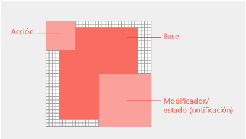

# Diseñe iconos para comandos de complementos

Los [comandos de complementos](add-in-commands.md) agregan botones, texto e iconos a la interfaz de usuario de Office. Los botones de comando del complemento deben proporcionar iconos y etiquetas significativos que identifiquen claramente la acción que está realizando el usuario al usar un comando. Este artículo proporciona directrices estilísticas y de producción que le ayudarán a diseñar iconos que se integren perfectamente en Office. 

## Principios de diseño de iconos para Office

La versión de Office 2013 de los clientes para equipo de escritorio de Office incluye una iconografía renovada. El cambio estilístico por el que se ha reemplazado se basa en la reducción. Los nuevos iconos incluyen solamente elementos comunicativos esenciales. Los elementos que no son esenciales, como la perspectiva, el degradado o la fuente de luz, se han eliminado. Los iconos simplificados admiten un análisis más rápido de comandos y controles. Siga este estilo para adecuarse mejor a Office.

Los iconos de Office se basan en los siguientes principios de diseño: 

- Interpretación moderna de la colección de iconos de Office 
- Novedad que siga resultando familiar  
- Sencillez, claridad y que sean directos 

La siguiente imagen muestra los iconos que aplican los principios de diseño modernos.

## Directrices de los iconos
Siga las siguientes directrices para crear iconos: 

- Ajustarse a la cuadrícula de 1 px y utilizar una herramienta de edición de mapa de bits para obtener mejores resultados.  
- Volver a dibujar, no cambiar el tamaño. Como puede aumentar o disminuir el tamaño de los iconos, dedique tiempo a volver a dibujar los recortes, esquinas y bordes redondeados para maximizar la claridad de la línea. 
- Eliminar los artefactos que hacen que su icono parezca confuso.
- No volver a utilizar los iconos de Office UI Fabric en el menú contextual o de cinta de Office. El estilo de los iconos de Fabric es diferente y los iconos no coincidirán. 
- Evite depender de su logotipo o marca para comunicar lo que hace un comando. Las marcas comerciales no siempre son reconocibles en tamaños de icono más pequeños cuando se aplican los modificadores. Las marcas comerciales a menudo entran en conflicto con los estilos de icono de cinta de Office y pueden competir por la atención del usuario en un entorno saturado.
- Utilice un relleno blanco para mejorar la accesibilidad. La mayoría de los objetos de los iconos requerirá un fondo blanco para sean legibles tanto en los temas de la interfaz de usuario como en los modos de contraste alto.  
- Use el formato PNG con un fondo transparente. 
- Evite el contenido localizable en sus iconos, incluidos los caracteres tipográficos, las indicaciones de los bordes irregulares de párrafo y los signos de interrogación. 
- No reutilice metáforas visuales para distintos comandos. Puede causar confusión utilizar el mismo icono para diferentes acciones. 
- Cree etiquetas de botón claras y concisas. Use una combinación de información textual y visual para transmitir un significado. 

## Requisitos y recomendaciones para el tamaño del icono

Los iconos de escritorio de Office 2016 son imágenes de mapa de bits. Los diferentes tamaños se presentan según la configuración de PPP del usuario y el modo táctil. Incluya los ocho tamaños admitidos para crear la mejor experiencia para todas las resoluciones y contextos compatibles. A continuación encontrará los tamaños admitidos, tres de ellos son obligatorios:

- 16 px (obligatorio)
- 20 px
- 24 px
- 32 px (obligatorio)
- 40 px
- 48 px
- 64 px (recomendado)
- 80 px (obligatorio)  

<!--
The following table shows the icon sizes that render for different modes at different DPI settings.

|DPI |**Small**||**Medium**||**Large**||**Extra large**|
|:---|:---|:---|:---|:---|:---|:---|:---|
|    |**Mouse**|**Touch**|**Mouse**|**Touch**|**Mouse**|**Touch**|-|
|100%|16px|20px|24px||32px|40px|48px|
|125%|20px|24px|||40px|48px|60px|
|150%|24px|24px|36px||48px|48px|72px|
|200%|32px|40px|48px||64px|80px|96px|
|250%|40px||||80px||120px|
|300%|48px||||96px||144px

>**Note:** At DPI settings of 150% or greater, the icon does not get swapped out for a larger size when Touch mode is engaged. At DPI settings greater than 250%, Touch mode is turned off by default.

The following table lists the locations for certain icon sizes.

|Location|100% DPI|200% DPI|250% DPI|
|:-------|:-------|:-------|:-------|
|Small ribbon button|16px|32px|40px|
|Contextual menu|16px|32px|40px|
|Quick access toolbar (QAT)|16px|32px|40px|
|Large ribbon icon|32px|64px|80px|

-->

## Anatomía y diseño del icono

Los iconos de Office se componen por lo general de un elemento base con modificadores conceptuales y de acción superpuestos. Los modificadores de acción representan conceptos tales como agregar, abrir, nuevo o cerrar. Los modificadores conceptuales representan el estado, la alteración o una descripción del icono. 

Para crear los comandos que se alinean con la interfaz de usuario de Office, siga las directrices de diseño para los elementos base y los modificadores. De este modo asegura que los comandos tengan un aspecto profesional y que sus clientes puedan confiar en el complemento. Si hace excepciones a estas directrices, hágalo de forma intencionada.

La imagen siguiente muestra el diseño de los elementos base y los modificadores de un icono de Office.

- Centrar los elementos base en el marco de píxel con relleno vacío alrededor.
- Colocar modificadores de acción en la parte superior izquierda. 
- Colocar modificadores conceptuales en la parte inferior derecha.
- Limitar el número de elementos en sus iconos. En 32 px, limitar el número de modificadores a un máximo de dos. En 16 px, limitar el número de modificadores a un máximo de uno.

Colocar elementos base de forma coherente a través de tamaños. Si no puede centrar los elementos base en el marco, puede alinearlos en la parte superior izquierda, dejando los píxeles adicionales en la parte inferior derecha. Para obtener resultados óptimos, aplique las directrices de relleno enumeradas en la tabla siguiente.

|**Tamaño de icono**|**Relleno alrededor del elemento base**|
|:---|:---|
|16px|0|
|20px|1px|
|24px|1px|
|32px|2px|
|40px|2px|
|48px|3px|
|64px|5px|
|80px|5px|

Todos los modificadores deben tener un recorte transparente de 1 px entre cada elemento, incluido el fondo. Los elementos no deben superponerse directamente. Cree un espacio en blanco entre las reglas y los bordes. Los modificadores pueden variar de tamaño ligeramente, pero utilice estas dimensiones como punto de partida.

|**Tamaño de icono**|**Tamaño de modificador**|
|:---|:---|
|16px|9px|
|20px|10px|
|24px|12px|
|32px|14px|
|40px|20px|
|48px|22px|
|64px|29px|
|80px|38px|

## Colores del icono

Los iconos de Office tienen una paleta de colores limitada. Utilice los colores que se muestran en la tabla siguiente para garantizar una integración sin interrupciones en la interfaz de usuario de Office. Aplique las siguientes directrices para el uso del color: 

- Utilizar colores para comunicar el significado en lugar de para adornar. Debe resaltar o enfatizar una acción, un estado o un elemento que diferencie explícitamente la marca.  
- Si es posible, utilice un solo color adicional además de gris. Limitar los colores adicionales a dos como máximo.
- Los colores deben tener un aspecto coherente en todos los tamaños del icono. Los iconos de Office tienen paletas de color ligeramente diferentes para tamaños de icono diferente. Los iconos de 16 px o más pequeños son un poco más oscuros y más vivos que los iconos de 32 px o más grandes. Sin estos ajustes sutiles, los colores podrían variar dependiendo del tamaño.   

|**Nombre del color**|**RVA**|**Hexa**|**Color**|**Categoría**|
|:---|:---|:---|:---|:---|
|Texto gris (80)|80, 80, 80|#505050||Texto|
|Texto gris (95)|95, 95, 95|#5F5F5F||Texto|
|Texto gris (105)|105, 105, 105|#696969||Texto|
|Gris oscuro 32|128, 128, 128|#808080||32 y superior|
|Gris medio 32|158, 158, 158|#9E9E9E||32 y superior|
|Gris claro TODOS|179, 179, 179|#B3B3B3||Todos los tamaños|
|Gris oscuro 16|114, 114, 114|#727272||16 e inferior|
|Gris medio 16|144, 144, 144|#909090||16 e inferior|
|Azul 32|77, 130, 184|#4d82B8||32 y superior|
|Azul 16|74, 125, 177|#4A7DB1||16 e inferior|
|Amarillo TODOS|234, 194, 130|#EAC282||Todos los tamaños|
|Naranja 32|231, 142, 70|#E78E46||32 y superior|
|Naranja 16|227, 142, 70|#E3751C||16 e inferior|
|Rosa TODOS|230, 132, 151|#E68497||Todos los tamaños|
|Verde 32|118, 167, 151|#76A797||32 y superior|
|Verde 16|104, 164, 144|#68A490||16 e inferior|
|Rojo 32|216, 99, 68|#D86344||32 y superior|
|Rojo 16|214, 85, 50|#D65532||16 e inferior|
|Púrpura 32|152, 104, 185|#9868B9||32 y superior|
|Púrpura 16|137, 89, 171|#8959AB||16 e inferior|

## Recursos adicionales

- [Procedimientos recomendados para el desarrollo de complementos](../overview/add-in-development-best-practices.md)
- [Comandos de complementos para Excel, Word y PowerPoint](../design/add-in-commands.md)
