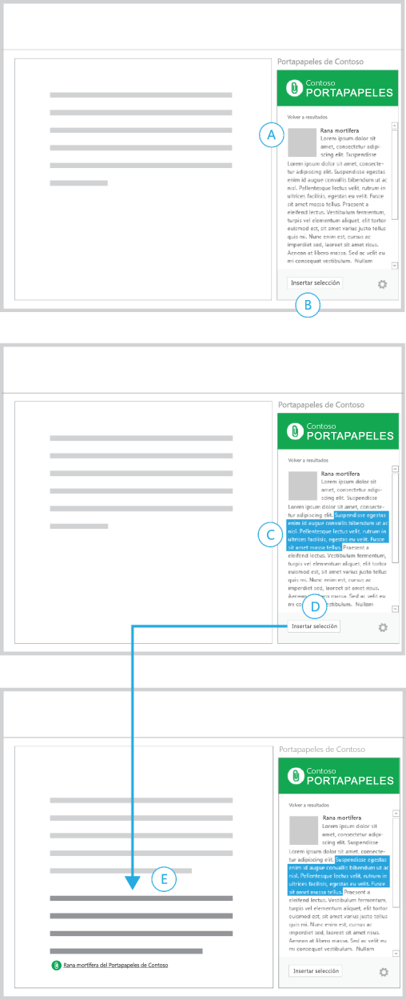

# Patrones de interacción de los complementos de Office

Los Complementos de Office pueden mejorar las experiencias de creación y productividad, así como conectar el contenido de aplicaciones de host de Office a flujos de trabajo mayores basados en web. Hay una serie de escenarios comunes que se aplican a los complementos de contenido, panel de tareas y Outlook que se pueden desarrollar. En este artículo se describen algunos de los escenarios más habituales y se ofrecen patrones de interacción recomendados para la experiencia de usuario del complemento. Puede desglosar, combinar o mezclar y emparejar estos patrones de interacción en función de sus escenarios exclusivos.

 **Escenarios de complementos comunes**

| Tipo de complemento | Escenarios comunes |
| ------ | ------ |
|  Contenido  |  Visualizar datos   Widgets y herramientas  |
|  Panel de tareas  |  Transformación y procesamiento de datos   Creación de forma eficaz y eficiente   Búsqueda de contenido e inserción de datos   Publicar o cargar contenido a un servicio web  |
|  Outlook  |  Hacer de puente entre el contenido de correo y una aplicación externa   Dar más información sobre el contenido en una cita o mensaje de correo   Proporcionar información que le ayude a ser más productivo  |

## Visualizar datos con un complemento de contenido

Este ejemplo muestra un complemento de contenido para Excel que genera un gráfico a partir de los datos de una hoja de cálculo.

En este patrón de interacción, el complemento no se vuelve activo hasta que se selecciona y se enlazan los datos para generar el gráfico. Es importante comunicar el propósito del complemento y los pasos para activarlo en la vista inicial del complemento. 

**Complemento de contenido para Excel que genera un gráfico a partir de los datos de una hoja de cálculo.**
 

 
<ul><li>
Muestra instrucciones junto con un botón deshabilitado (A) para reforzar que es necesario realizar una acción antes de elegir el botón.
</li><li>
Después de seleccionar un rango de celdas, el botón Crear gráfico se activa (B - C).
</li><li>
La visualización se propagará en el contenedor y reemplazará a la vista anterior (D).
</li><li>
Muestre cualquier UI adicional en el borde inferior del complemento, junto con un botón de configuración (un engranaje) que le llevará a una vista donde podrá restablecer o administrar el complemento.
</li></ul>Recomendado para:
<ul><li>
Complementos que requieren que seleccione datos antes de la activación.
</li></ul>

## Transformar contenido con un complemento de panel de tareas

Este ejemplo muestra un complemento de panel de tareas que traduce el texto del documento a otro idioma.

En este patrón de interacción, primero hay que seleccionar el texto del documento que se quiere traducir.

**Complemento de panel de tareas que traduce el texto del documento a otro idioma.**
 

 
<ul><li>
Comunique el propósito del complemento en un título y una sugerencia en el hecho de que primero debe realizar una selección (A).
</li><li>
El menú de idioma y el botón Traducir están deshabilitados, lo que refuerza el hecho de que debe realizar una acción para poder continuar. Después de seleccionar contenido en el documento, estos dos elementos se activarán (D).
</li><li>
Después de elegir Traducir, la interfaz de usuario se despliega para mostrar el contenido traducido junto con un botón que permite insertarlo de nuevo en el documento (E).
</li><li>
Puede proporcionar un botón Borrar o Restablecer que vuelva a la vista inicial.
</li></ul>Recomendado para:
<ul><li>
Complementos que requieren que seleccione datos antes de la activación.
</li><li>
Interfaz de usuario que se despliega o que se muestra conforme va progresando durante el escenario.
</li></ul>

## Procesar datos con un complemento de panel de tareas

Este ejemplo muestra un complemento de panel de tareas que comprueba datos en Excel.

En este patrón de interacción, hay que seleccionar un rango de celdas en la hoja de cálculo para comenzar.

**Complemento de panel de tareas que comprueba datos en Excel**
 

 
<ul><li>
El propósito del complemento se describe en el título. Las instrucciones le ayudan a empezar.
</li><li>
El botón Enviar datos seleccionados está deshabilitado, lo que refuerza el hecho de que debe llevar a cabo una acción para poder continuar (A).
</li><li>
Después de seleccionar un rango de celdas de la hoja de cálculo (B), el botón Enviar datos seleccionados se activa.
</li><li>
Después de elegir este botón, la interfaz de usuario se reemplaza por el rango de celdas seleccionado, una barra de progreso y un botón Cancelar.
</li><li>
La barra de progreso indica el estado del proceso y el botón Cancelar le permite interrumpirlo (D).
</li><li>
Una vez finalizado el proceso, los resultados se muestran automáticamente (E). Al seleccionar un elemento en la lista, se activa la celda correspondiente en la hoja de cálculo.
</li></ul>Recomendado para:
<ul><li>
Procesos cuya duración es indeterminada.
</li></ul>

## Analizar contenido con un complemento de panel de tareas

Este ejemplo muestra un complemento de panel de tareas que muestra definiciones de palabras conforme las escribe.

En este patrón de interacción, hay que seleccionar primero el texto en el documento para ver los resultados.

**Complemento de panel de tareas que muestra definiciones de palabras conforme las escribe**
 

 
<ul><li>
Un titular explica la finalidad del complemento y cómo empezar (A).
</li><li>
La búsqueda automática se activa de forma predeterminada con la opción para deshabilitarla (B).
</li><li>
Después de hacer una selección, el complemento muestra el contenido correspondiente (D).
</li><li>
Proporcione un vínculo para mostrar más información (E).
</li></ul>Recomendado para:
<ul><li>
Complementos que devuelven datos automáticamente conforme crea contenido.
</li><li>
Complementos que requieren que seleccione contenido antes de la activación.
</li></ul>

## Buscar contenido con un complemento de panel de tareas

Este ejemplo muestra un complemento de panel de tareas para buscar contenido.

En este patrón de interacción, se escribe una cadena en el cuadro de búsqueda o se selecciona una opción en una lista de contenido destacado para comenzar.

**Complemento de panel de tareas para la búsqueda de contenido**
 

 
<ul><li>
La vista inicial contiene un cuadro de búsqueda (A) y una lista de contenido presentado (B).
</li><li>
Cuando escribe una cadena en el cuadro de búsqueda, el icono de búsqueda se reemplaza por un icono de cierre (C).
</li><li>
Si elige el icono de cierre, vuelve a la vista inicial.
</li></ul>Recomendado para:
<ul><li>
Complementos que devuelven datos automáticamente conforme crea contenido.
</li><li>
Complementos que requieren que seleccione contenido antes de la activación.
</li></ul>

## Insertar elementos multimedia con un complemento de panel de tareas

En este patrón de interacción, se puede seleccionar una imagen en los resultados de búsqueda para insertarla en su documento.

**Complemento de panel de tareas para insertar una imagen**
 

 
<ul><li>
Ha filtrado una lista de resultados de búsqueda (A) y el contenido seleccionado para insertar (B).
</li><li>
Se muestra una vista detallada del contenido seleccionado (C) junto con un botón que le permite volver a la lista.
</li><li>
En el pie de página hay un botón para insertar foto (D). Después de elegir este botón, la imagen se inserta en el documento.
</li><li>
Junto con el contenido insertado, se incluye una breve descripción del lugar del que procede la imagen (E). 
</li><li>
La interfaz de usuario del complemento confirma visualmente que la acción se ha llevado a cabo correctamente.
</li></ul>Recomendado para:
<ul><li>
Complementos de inserción de contenido.
</li></ul>

## Insertar texto seleccionado con un complemento de panel de tareas

En este patrón de interacción, se selecciona texto en los resultados de búsqueda para insertarlo en el documento.

**Complemento de panel de tareas para insertar texto**
 

 
<ul><li>
Ya ha encontrado un fragmento de contenido (A).
</li><li>
En el pie de página hay un botón deshabilitado para insertar selección (B).
</li><li>
Cuando seleccione una cadena de texto (C), el botón para insertar selección se activa.
</li><li>
Después de elegir este botón, el complemento inserta el texto seleccionado en el documento junto con una referencia al origen del contenido (E).
</li></ul>Recomendado para:
<ul><li>
Complementos para llevar a cabo búsquedas e insertar contenido.
</li></ul>

## Publicar en un servicio web con un complemento de panel de tareas

Este ejemplo muestra un complemento de panel de tareas para publicar un documento como una publicación de blog.

En este patrón de interacción, se ha completado la escritura de contenido en un documento y se quiere publicar en un blog.

**Complemento de panel de tareas para la publicación de un documento como publicación de blog.**
 

 
<ul><li>
En primer lugar, se muestra un formulario de inicio de sesión para escribir sus credenciales (A).
</li><li>
Se proporcionan vínculos para crear una cuenta y tratar los problemas de inicio de sesión más típicos (B). Si elige estos vínculos, se abren estas páginas en un explorador.
</li><li>
Después de haber iniciado sesión, el complemento muestra un formulario para crear una nueva entrada de blog (C).
</li><li>
Hacia la parte superior del complemento se muestra el nombre de la cuenta en la que ha iniciado sesión (y en la que realizará la publicación). El complemento proporciona un vínculo para obtener una vista previa de la publicación (D). Si elige este vínculo, se muestra la vista previa en un explorador.
</li><li>
Después de elegir la opción para crear publicación, el complemento muestra una vista donde se confirma que el contenido del documento se ha publicado (E).
</li><li>
El complemento incluye un vínculo para ver la publicación en un explorador (F), además de un botón para crear otra publicación (G).
</li></ul>Recomendado para:
<ul><li>
Complementos que muestran, publican o comparten contenido en redes sociales, sitios de blogs y servicios web.
</li><li>
Complementos que requieren que inicie sesión en un servicio.
</li></ul>

## Obtener más información sobre personas con un complemento de Outlook

 **Ejemplo 1**

**Página de resultados y detalles**
 

 
Recomendado para:
<ul><li>
Ver la amplitud del contenido en caso de que disponga de grandes conjuntos de datos útiles para mostrar.
</li><li>
Páginas de detalles que usan la capacidad completa del contenedor del complemento.
</li><li>
Modelos de navegación que usan un flujo "hacia adelante y hacia atrás".
</li></ul>
 **Ejemplo 2**

**Página de detalles con navegación persistente**
 

 
Recomendado para:
<ul><li>
Visualización de forma predeterminada del primer resultado de un conjunto de datos.
</li><li>
Estructuras de navegación que funcionan de forma similar a las pestañas (navegación lineal de un único nivel).
</li><li>
Reducción de acciones de selección al mantener la navegación disponible en todo momento.
</li><li>
Espacio para mostrar la navegación en todo momento.
</li></ul>

## Obtener más información sobre contenido con un complemento de Outlook

 **Ejemplo 1**

**Página de resultados y detalles**
 

 
Recomendado para:
<ul><li>
Ver la amplitud del contenido en caso de que disponga de grandes conjuntos de datos útiles para mostrar.
</li><li>
Pedirle que elija una opción o selección antes de mostrar más detalles.
</li><li>
Páginas de detalles que usan la capacidad completa del contenedor del complemento.
</li><li>
Modelos de navegación que usan un flujo "hacia adelante y hacia atrás".
</li></ul>
 **Ejemplo 2**

**Página de detalles con contenido secundario**
 

 
Recomendado para:
<ul><li>
Casos en los que desee incluir parte de un contenido.
</li><li>
Mostar el contenido sin la interacción del usuario.
</li><li>
Navegación persistente (puede agregarse a este modelo para obtener una mezcla de sencillez y facilidad de navegación).
</li></ul>

## Conectar con un servicio en línea y presentar datos

Estos ejemplos muestran patrones de interacción para obtener datos y contenido de un servicio en línea. Se pueden usar en los tres tipos de complementos: complementos de contenido, complementos de panel de tareas y complementos de Outlook.

 **Ejemplo 1**

**Carrusel**
 

 
Recomendado para:
<ul><li>
Pequeñas cantidades de datos que pueden mostrarse de una en una o en grupos.
</li><li>
Visualización de contenido en formato de galería como, por ejemplo, en presentaciones de diapositivas o galerías de imágenes.
</li><li>
Cuando el modelo de navegación hacia adelante/atrás funciona correctamente.
</li></ul>
 **Ejemplo 2**

**Asistente**
 

 
Recomendado para:
<ul><li>
Contenido que debe mostrarse con un orden determinado.
</li><li>
Grandes cantidades de contenido que deben mostrarse en fragmentos de información de menor tamaño.
</li><li>
Experiencias en las que se muestra el contenido a los usuarios en forma de libro.
</li><li>
Cuando es necesario llevar a cabo una serie de pasos o acciones para completar una tarea.
</li></ul>
 **Ejemplo 3**

**Formulario, resultados y detalles**
 

 
Recomendado para:
<ul><li>
Complementos que necesitan entrada de datos.
</li><li>
Punto de entrada para mostrar resultados y patrones de detalles.
</li></ul>

## Recursos adicionales

- [Directrices de diseño para complementos de Office](../add-in-design.md)
    
