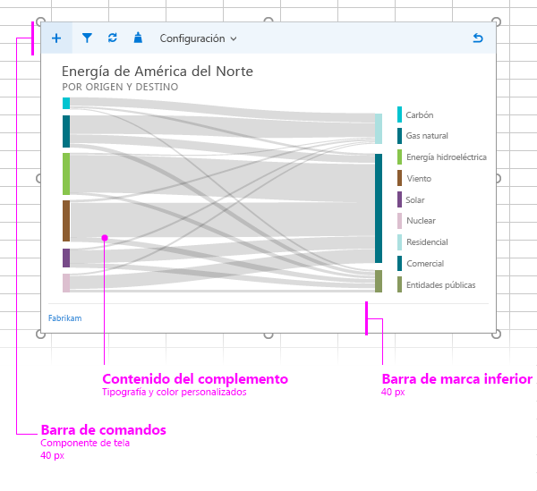

#Diseños para complementos de contenido

Cree un aspecto coherente para los complementos de contenido usando el diseño recomendado. El diseño recomendado para un complemento de contenido incluye los siguientes elementos: 

- Barra de comandos (opcional): incluye iconos o navegación para los usuarios y puede superponerse al contenido del complemento. La altura máxima es de 80 píxeles.
- Contenido de complemento
- Elemento de personalización de marca (opcional)

También puede agregar una [interfaz de usuario personalizada basada en HTML](ui-elements.md#custom-HTML-based-UI) al complemento de contenido.

Para consultar un ejemplo donde se muestra cómo usar Office UI Fabric en complementos de Office, vea [Ejemplo de interfaz de usuario del tejido de complementos de Office](https://github.com/OfficeDev/Office-Add-in-Fabric-UI-Sample).

<!-- Add sample template for content add-in and individual building blocks - Command Bar, Input, layout components. -->
