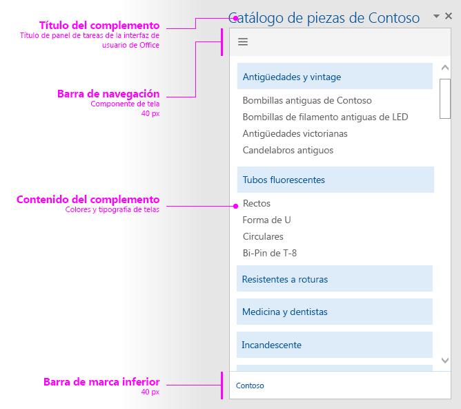

#Diseño para contenedores de panel de tareas

Cree una apariencia coherente para los complementos del panel de tareas con el diseño recomendado. El diseño recomendado para un panel de tareas tiene los elementos siguientes: 

- Elemento de navegación (opcional): incluya una barra de navegación o un área dinámica en una barra bajo el elemento que identifica la marca, si lo usa, con una altura máxima de 80 píxeles.
- Contenido de complemento
- Elemento de personalización de marca (opcional)

También puede agregar una [interfaz de usuario personalizada basada en HTML](ui-elements.md#custom-HTML-based-UI) al panel de tareas.

Para consultar un ejemplo donde se muestra cómo usar Office UI Fabric en complementos de Office, vea [Ejemplo de interfaz de usuario del tejido de complementos de Office](https://github.com/OfficeDev/Office-Add-in-Fabric-UI-Sample).

<!-- Add sample template for content add-in and individual building blocks - Branding, Navigation bar or pivot, input, layout components -->
