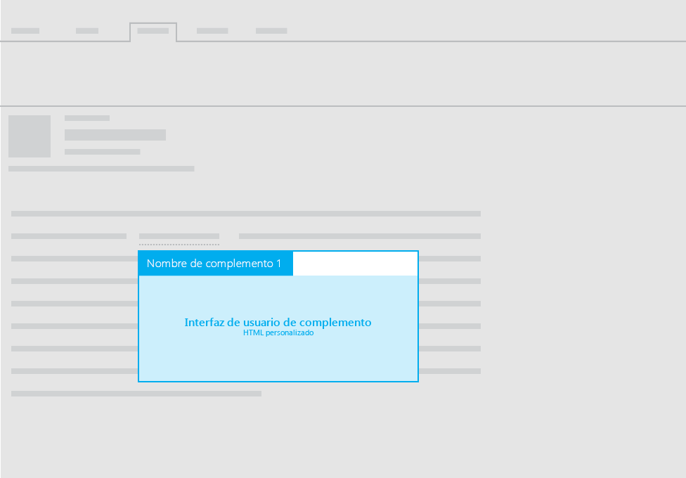

#Diseños para complementos de correo

Puede usar cualquiera de los siguientes diseños para complementos de correo:

- Panel de tareas
- Contextual
- Funciones con notificaciones de la barra de información

Vea las directrices sobre el texto de la interfaz de usuario en los complementos en [Tono de Office](https://msdn.microsoft.com/en-us/library/office/mt484351.aspx).

##Panel de tareas
 Para obtener recomendaciones sobre los diseños del panel de tareas de complementos de correo, vea [Diseño para complementos de panel de tareas](layout-for-task-pane-add-ins.md).

##Complementos contextuales

La imagen siguiente muestra el diseño recomendado para un [complemento de correo contextual](https://msdn.microsoft.com/EN-US/library/office/dn893542.aspx).

##Funciones con notificaciones de la barra de información

Además de usar un panel de tareas o un panel contextual para mostrar la interfaz de usuario HTML personalizada en el complemento de correo, puede ejecutar las funciones desde los comandos. Cuando necesite mostrar el texto de interfaz de usuario como resultado de una función, puede usar las notificaciones de la barra de información. Por ejemplo, puede que necesite usar una notificación de la barra de información para mostrar mensajes de error o de operación correcta. 

Para obtener más información, consulte [comandos de complemento para el correo](https://msdn.microsoft.com/EN-US/library/office/mt267546.aspx). 

