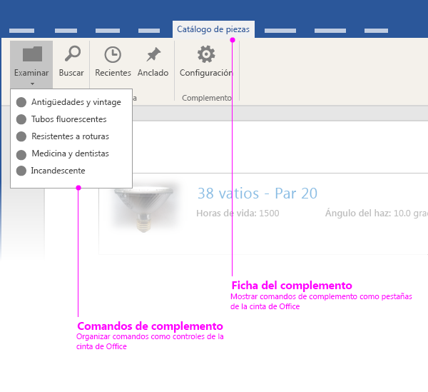
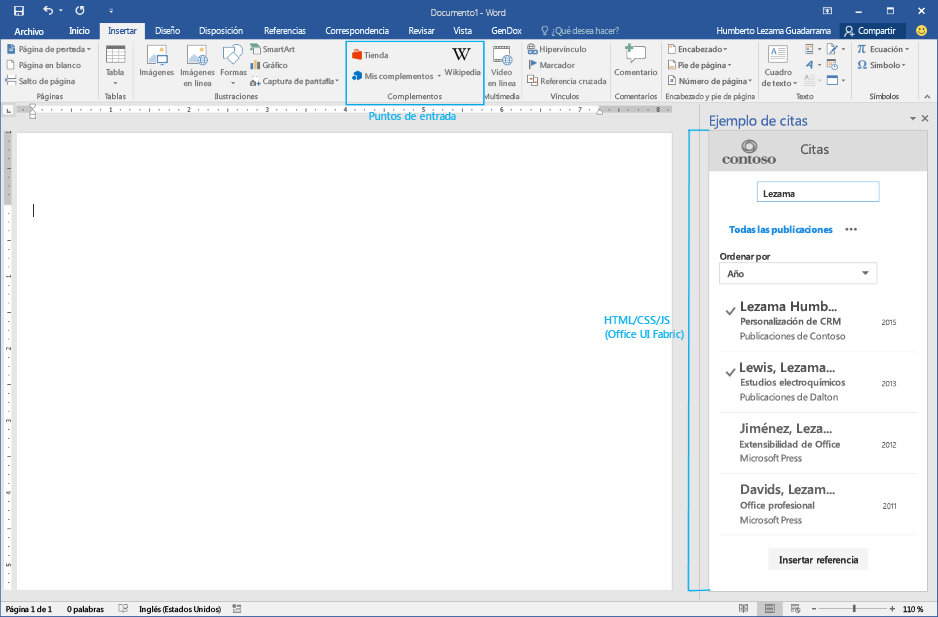

# Elementos de la interfaz de usuario del complemento de Office

Puede usar dos tipos de elementos de interfaz de usuario en Complementos de Office: 

- Comandos de complemento 
- Interfaces personalizadas basadas en HTML

## Comandos de complemento
Los comandos se definen en el [manifiesto XML del complemento](../../outlook/manifests/define-add-in-commands.md) y se representan como extensiones UX nativas para la interfaz de usuario de Office. Por ejemplo, puede usar comandos de complemento para agregar botones a la cinta de opciones de Office. 

Actualmente, los comandos de complemento solo son compatibles con complementos de correo. Para más información, vea [Comandos de complemento para correo](../../outlook/add-in-commands-for-outlook.md). 

Excel, PowerPoint y Word tienen puntos de entrada predefinidos para complementos del panel de tareas y de contenido en la pestaña Insertar de la cinta de Office. Pronto estará disponible la funcionalidad de comando personalizado para complementos de contenido y del panel de tareas. 

## Interfaces de usuario personalizadas basadas en HTML
Los complementos pueden insertar una interfaz de usuario personalizada basada en HTML en los clientes de Office. Los contenedores que están disponibles para mostrar la interfaz de usuario varían según el tipo de complemento. Por ejemplo, los complementos del panel de tareas muestran la interfaz de usuario personalizada basada en HTML en el panel derecho del documento, mientras que los complementos de contenido muestran la interfaz de usuario personalizada directamente en los documentos de Office.

Independientemente del tipo de complemento que cree, puede usar bloques de creación comunes para crear la interfaz de usuario personalizada basada en HTML. Se recomienda usar el [Tejido de la interfaz de usuario de Office](https://github.com/OfficeDev/Office-UI-Fabric) para estos elementos de interfaz de usuario, de modo que el complemento se integre en el aspecto de Office. También puede usar sus propios elementos de interfaz de usuario para expresar su propia marca.

El Tejido de la interfaz de usuario de Office contiene los siguientes elementos de interfaz de usuario:

- Tipografía
- Color
- Iconos
- Animaciones
- Componentes de entrada
- diseños
- Elementos de navegación

Puede descargar el [Tejido de la interfaz de usuario de Office desde Github](https://github.com/OfficeDev/Office-UI-Fabric).

Para obtener un ejemplo que muestra cómo usar el tejido de la interfaz de usuario de Office en complementos, consulte el [Ejemplo de la interfaz de usuario del Tejido de complementos de Office](https://github.com/OfficeDev/Office-Add-in-Fabric-UI-Sample).

**Nota:** Si decide usar su propio conjunto de fuentes e iconos, asegúrese de que no entran en conflicto con los de Office. Por ejemplo, no use iconos que sean iguales o similares a los de Office, sino iconos que representen algo diferente en el complemento. 

### Crear una paleta de colores personalizada
Si decide usar su propia paleta de colores, tenga en cuenta lo siguiente: 
 
- Use el color para contribuir a transmitir el valor de la marca a los usuarios y agregar emoción y placer a la experiencia de usuario.
- Use el color de forma significativa y coherente en su complemento. Por ejemplo, elija un color como color destacado para aplicar al complemento un tema visual coherente.
- Evite usar el mismo color para los elementos interactivos y no interactivos. Si usa color para indicar elementos con los que los usuarios pueden interactuar, como navegación, vínculos y botones, no use el mismo color para los elementos estáticos.
- Si usa color para el texto o si usa texto blanco sobre un fondo de color, asegúrese de que los colores tienen suficiente contraste entre sí para cumplir las directrices de accesibilidad (relación de contraste de 4.5:1).
- Tenga en cuenta el daltonismo: use algo más que colores para indicar la interactividad.

### Creación de temas 
Tanto si decide adoptar la combinación de colores de Office como usar la suya propia, le animamos a usar las API de creación de temas. Los complementos que forman parte de la experiencia de creación de temas de Office parecerán mucho más integrados en Office.

- Para los complementos de correo y del panel de tareas, use la propiedad [Context.officeTheme](../../../reference/shared/office.context.officetheme.md) para que coincida con el tema de las aplicaciones de Office. Actualmente, esta API solo está disponible en Office 2016.  
- Para los complementos de contenido de PowerPoint, vea [Usar temas de Office en los complementos de PowerPoint](../../powerpoint/use-document-themes-in-your-powerpoint-add-ins.md).

<!-- Link to theming API docs and Humberto's seed sample. Add screenshot of themed add-in. -->

