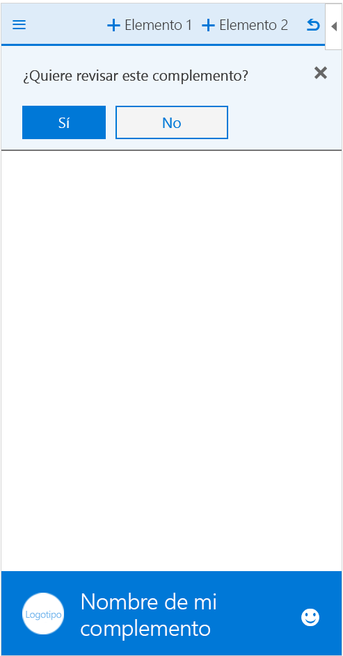

# Plantillas de modelos de diseño de la experiencia del usuario para complementos de Office 

El [proyecto de modelos de diseño de la experiencia del usuario para complementos de Office](https://github.com/OfficeDev/Office-Add-in-UX-Design-Patterns-Code "#proyecto-de-modelos-de-diseño-de-la-experiencia-del-usuario-para-complementos-de-Office") incluye archivos HTML, JavaScript y CSS que puede utilizar para crear la experiencia de usuario del complemento.   

Use el proyecto de modelos de diseño de la experiencia del usuario para:

* Aplicar soluciones a escenarios de cliente comunes.
* Aplicar los procedimientos recomendados de diseño.
* Incorporar componentes y estilos de [Office UI Fabric](https://dev.office.com/fabric#/get-started).
* Crear complementos que se integran visualmente con la interfaz de usuario predeterminada de Office.  

## Usar los modelos de diseño de la experiencia del usuario

Puede usar las [especificaciones de diseñadores de la experiencia del usuario](https://github.com/OfficeDev/Office-Add-in-Design-Patterns/blob/master/Patterns/Source%20Files) como guía a la hora de crear su propio diseño de la experiencia del usuario o puede agregar el [código fuente](https://github.com/OfficeDev/Office-Add-in-UX-Design-Patterns-Code/tree/master/templates) directamente al proyecto.

Para usar las especificaciones para construir un boceto de la interfaz de usuario de su propio complemento:

1. Descargue los [modelos de diseño de la experiencia del usuario](https://github.com/OfficeDev/Office-Add-in-UX-Design-Patterns).
2. Use las plantillas de [Word](https://github.com/OfficeDev/Office-Add-in-UX-Design-Patterns/blob/master/Helpful%20Templates/AddIn_Template_Word_Desktop_reference.pdf), [Excel](https://github.com/OfficeDev/Office-Add-in-UX-Design-Patterns/blob/master/Helpful%20Templates/AddIn_Template_Excel_Desktop_reference.pdf) o [PowerPoint](https://github.com/OfficeDev/Office-Add-in-UX-Design-Patterns/blob/master/Helpful%20Templates/AddIn_Template_PowerPoint_Desktop_reference.pdf) para hacer un boceto de sus puntos de extensión para equipo de escritorio o tableta.
3. Copie y modifique los [modelos de diseño de la experiencia del usuario](https://github.com/OfficeDev/Office-Add-in-UX-Design-Patterns/tree/master/Patterns) según sus necesidades específicas.
4. Consulte plantillas para explorar una [hoja maestra de iconos de Office UI Fabric](https://github.com/OfficeDev/Office-Add-in-UX-Design-Patterns/blob/master/Helpful%20Templates/OfficeUIFabric_icon_mastersheet.pdf), ver puntos de extensión para Word, Excel y PowerPoint (por ejemplo, [Excel iPad](https://github.com/OfficeDev/Office-Add-in-UX-Design-Patterns/blob/master/Helpful%20Templates/AddIn_Template_Excel_iPad_reference.pdf) y [Excel Windows Desktop](https://github.com/OfficeDev/Office-Add-in-UX-Design-Patterns/blob/master/Helpful%20Templates/AddIn_Template_Excel_Desktop_reference.pdf)), o [finalizar iconos para los comandos del complemento](https://github.com/OfficeDev/Office-Add-in-UX-Design-Patterns/blob/master/Helpful%20Templates/Icon_production.pdf).

Para agregar el código fuente:

1. Clone el [repositorio del proyecto de modelos de diseño de la experiencia del usuario para complementos de Office](https://github.com/OfficeDev/Office-Add-in-UX-Design-Patterns-Code "proyecto-de modelos-de diseño-de-la-experiencia-del-usuario-para-complementos-de-Office"). 
2. Copie la [carpeta de recursos](https://github.com/OfficeDev/Office-Add-in-UX-Design-Pattern-Code/tree/master/assets) y la carpeta de código del modelo individual que elija en su proyecto de complemento.  
3. Incorpore el modelo individual al complemento. Por ejemplo:
    - Edite la ubicación de origen o la URL del comando en el manifiesto.
    - Use el modelo de diseño de la experiencia del usuario como modelo para otras páginas.
    - Cree vínculos al modelo de diseño de la experiencia del usuario o desde este.

## Tipos de modelos de diseño de la experiencia del usuario
### Páginas genéricas

Las plantillas de página genérica se pueden aplicar a cualquier página del complemento y no tienen un propósito especial. Un ejemplo de página con propósito especial sería uno de los modelos de primera ejecución. En la lista siguiente se describen las páginas genéricas disponibles:

* **Página de aterrizaje**: un complemento de página estándar; por ejemplo, la página en la que se encuentra el usuario después de una experiencia de primera ejecución o de un proceso de inicio de sesión. 
    * [Especificación de la página de aterrizaje](https://github.com/OfficeDev/Office-Add-in-Design-Patterns/blob/master/Helpful%20Templates/AddIn_Template_Standard_Layout.pdf "PDF")
    * [Código de la página de aterrizaje](https://github.com/OfficeDev/Office-Add-in-UX-Design-Patterns-Code/tree/master/templates/generic/landing-page)
* **Imagen de marca en la barra de marca**: página de aterrizaje con una imagen en el pie de página que representa la marca. 
    * [Especificación de la barra de marca](https://github.com/OfficeDev/Office-Add-in-UX-Design-Patterns/blob/master/Patterns/Brand_Bar.md)
    * [Código de la barra de marca](https://github.com/OfficeDev/Office-Add-in-UX-Design-Patterns-Code/tree/master/templates/generic/brand-bar)

<table>
 <tr><th>Aterrizaje</th><th>Barra de marca</th></tr>
 <tr><td></td>
<td></td></tr>
 </table>
 
### Experiencia de primera ejecución

Una experiencia de primera ejecución es la experiencia que tiene un usuario al abrir el complemento por primera vez. Están disponibles las siguientes plantillas de patrón de diseño de primera ejecución: 

* **Primeros pasos**: proporciona a los usuarios una lista ordenada de pasos para empezar a usar su complemento. 
    * [Especificación de primeros pasos](https://github.com/OfficeDev/Office-Add-in-Design-Patterns/blob/master/Patterns/FirstRun_StepsToStart.md)
    * [Código de primeros pasos](https://github.com/OfficeDev/Office-Add-in-UX-Design-Patterns-Code/tree/master/templates/first-run/instruction-step)
* **Valor**: comunica la propuesta de valor del complemento.
    * [Especificación de valor](https://github.com/OfficeDev/Office-Add-in-Design-Patterns/blob/master/Patterns/FirstRun_ValuePlacemat.md)
    * [Código de valor](https://github.com/OfficeDev/Office-Add-in-UX-Design-Patterns-Code/tree/master/templates/first-run/value-placemat)
* **Vídeo**: muestra a los usuarios un vídeo antes de que empiecen a usar el complemento.
    * [Especificación de vídeo](https://github.com/OfficeDev/Office-Add-in-Design-Patterns/blob/master/Patterns/FirstRun_VideoPlacemat.md)
    * [Código de vídeo](https://github.com/OfficeDev/Office-Add-in-UX-Design-Patterns-Code/tree/master/templates/first-run/video-placemat)
* **Tutorial**: muestra a los usuarios una serie de características o información antes de que empiecen a usar el complemento.
    * [Especificación del tutorial](https://github.com/OfficeDev/Office-Add-in-Design-Patterns/blob/master/Patterns/FirstRun_PagingPanel.md)
    * [Código del tutorial](https://github.com/OfficeDev/Office-Add-in-UX-Design-Patterns-Code/tree/master/templates/first-run/walkthrough)

La [Tienda Office](https://msdn.microsoft.com/en-us/library/office/jj220033.aspx) tiene un sistema que administra las versiones de prueba de un complemento, pero si quiere controlar la interfaz de usuario de la experiencia de prueba del complemento, use los siguientes modelos:

* **Prueba**: muestra a los usuarios cómo empezar a usar una versión de prueba del complemento.
    * [Especificación de prueba](https://github.com/OfficeDev/Office-Add-in-Design-Patterns/blob/master/Patterns/FirstRun_TrialVersion.md)
    * [Código de prueba](https://github.com/OfficeDev/Office-Add-in-UX-Design-Patterns-Code/tree/master/templates/first-run/trial-placemat)
* **Característica de prueba**: informa a los usuarios de que la característica que intentan usar no está disponible en la versión de prueba del complemento. O bien, si el complemento es gratuito, pero incluye una característica que requiere una suscripción, considere la opción de usar este modelo. También puede usar este modelo para proporcionar una experiencia de versión anterior una vez que ha finalizado la versión de prueba.
    * [Especificación de la característica de prueba](https://github.com/OfficeDev/Office-Add-in-UX-Design-Patterns/blob/master/Patterns/FirstRun_TrialFeature.md)
    * [Código de la característica de prueba](https://github.com/OfficeDev/Office-Add-in-UX-Design-Patterns-Code/tree/master/templates/first-run/trial-placemat-feature)

> **Importante:** Si decide administrar su propia versión de prueba y no usar la Tienda Office para administrar la prueba, asegúrese de incluir la etiqueta **Puede requerirse una compra adicional** en las notas de prueba en el panel del vendedor.

Determine si es importante para su escenario mostrar una o varias veces la experiencia de primera ejecución a los usuarios. Por ejemplo, si los usuarios usan el complemento esporádicamente, podrían olvidar cómo usarlo, y puede serles útil ver la experiencia de primera ejecución más de una vez. 

 <table>
 <tr><th>Primeros pasos</th><th>Valor</th><th>Vídeo</th></tr>
 <tr>
<td></td>
<td></td>
<td></td></tr>
 </table>

 <table>
 <tr><th>Primera página de tutorial</th><th>Prueba</th><th>Característica de prueba</th></tr>
 <tr>
<td></td>
<td></td>
<td></td></tr>
 </table> 

### Navegación

Los usuarios necesitan desplazarse entre las distintas páginas de su complemento. Las siguientes plantillas de navegación muestran distintas opciones que puede usar para organizar los comandos y páginas del complemento.

* **Botones Atrás y Página siguiente**: muestra un panel de tareas con los botones Atrás y Página siguiente. Use este modelo para hacer que los usuarios sigan una serie ordenada de pasos.
    * [Especificación de botones Atrás y Página siguiente](https://github.com/OfficeDev/Office-Add-in-UX-Design-Patterns/blob/master/Patterns/Back_Button.md)
    * [Código de los botones Atrás y Página siguiente](https://github.com/OfficeDev/Office-Add-in-UX-Design-Patterns-Code/tree/master/templates/navigation/back-button) 
* **Navegación**: muestra un menú, conocido comúnmente como menú hamburguesa, con elementos de menú de página en un panel de tareas. 
    * [Especificación de navegación](https://github.com/OfficeDev/Office-Add-in-UX-Design-Patterns/blob/master/Patterns/Navigation.md)
    * [Código de navegación](https://github.com/OfficeDev/Office-Add-in-UX-Design-Patterns-Code/tree/master/templates/navigation/navigation) 
* **Navegación con comandos**: muestra el menú hamburguesa con botones de comando (o acción) en un panel de tareas. Use este modelo cuando quiera proporcionar opciones de navegación y comandos juntas.  
    * [Especificación de navegación con comandos](https://github.com/OfficeDev/Office-Add-in-UX-Design-Patterns/blob/master/Patterns/Navigation_%26_Commands.md)
    * [Código de navegación con comandos](https://github.com/OfficeDev/Office-Add-in-UX-Design-Patterns-Code/tree/master/templates/navigation/navigation-commands)
* **Pivot**: muestra una navegación mediante pivot dentro de un panel de tareas. Use la navegación mediante pivot para permitir que los usuarios naveguen entre contenido diferente.
    * [Especificación de pivot](https://github.com/OfficeDev/Office-Add-in-UX-Design-Patterns/blob/master/Patterns/Pivot.md)
    * [Código de pivot](https://github.com/OfficeDev/Office-Add-in-UX-Design-Patterns-Code/tree/master/templates/navigation/pivot)
* **Barra de pestañas**: muestra la navegación mediante botones con iconos y texto apilados verticalmente. Use la barra de pestañas para proporcionar navegación mediante pestañas con títulos cortos y descriptivos.
    * [Especificación de la barra de pestañas](https://github.com/OfficeDev/Office-Add-in-UX-Design-Patterns/blob/master/Patterns/Tab_Bar.md)
    * [Código de la barra de pestañas](https://github.com/OfficeDev/Office-Add-in-UX-Design-Patterns-Code/tree/master/templates/navigation/tab-bar) 

<table>
<tr><th>Botón Atrás</th><th>Navegación</th><th>Navegación con comandos</th></tr>
<tr>
    <td>
        
    </td>
    <td>
        
    </td>
    <td>
        
    </td>
</tr>
 </table>

<table>
<tr><th>Pivot</th><th>Barra de pestañas</th></tr>
<tr><td></td>
<td></td>
</tr>
 </table>

### Notificaciones

El complemento puede notificar eventos, como errores, o progreso a los usuarios de diversas formas. Están disponibles las siguientes plantillas de notificación: 

* **Cuadro de diálogo insertado**: muestra un cuadro de diálogo dentro del panel de tareas con información y, de manera opcional, una experiencia interactiva con botones u otros controles. Se puede usar para mostrar una notificación al usuario o para confirmar una acción. Use el modelo de cuadro de diálogo insertado cuando quiera mantener la experiencia del usuario en el panel de tareas.
    * [Especificación del cuadro de diálogo insertado](https://github.com/OfficeDev/Office-Add-in-Design-Patterns/blob/master/Patterns/Embedded_Dialog.md)
    * [Código del cuadro de diálogo insertado](https://github.com/OfficeDev/Office-Add-in-UX-Design-Patterns-Code/tree/master/templates/notifications/embedded-dialog)
* **Mensaje en línea**: indica un error, una operación correcta o información, y puede aparecer en una ubicación especificada del panel de tareas. Por ejemplo, si un usuario escribe en un cuadro de texto una dirección de correo electrónico con un formato incorrecto, se muestra un mensaje de error justo debajo del cuadro de texto. 
    * [Especificación del mensaje en línea](https://github.com/OfficeDev/Office-Add-in-Design-Patterns/blob/master/Patterns/Notification_Inline_Message.md)
    * [Código del mensaje en línea](https://github.com/OfficeDev/Office-Add-in-UX-Design-Patterns-Code/tree/master/templates/notifications/inline-message)
* **Mensaje emergente**: proporciona información y, de manera opcional, una sencilla llamada a la acción en un mensaje emergente que se puede contraer a una única línea, expandir a varias líneas o descartar. Use los mensajes emergentes para informar sobre una actualización de servicio o para mostrar una sugerencia útil cuando se inicie el complemento. 
    * [Especificación del mensaje emergente](https://github.com/OfficeDev/Office-Add-in-UX-Design-Patterns/blob/master/Patterns/Notification_MessageBanner.md)
    * [Código del mensaje emergente](https://github.com/OfficeDev/Office-Add-in-UX-Design-Patterns-Code/tree/master/templates/notifications/message-banner)
* **Barra de progreso**: indica el progreso de un proceso sincrónico de ejecución prolongada, como una tarea de configuración que es necesario completar antes de que el usuario pueda realizar otra acción. Es una página intersticial independiente que también refuerza la marca del complemento. Use una barra de progreso cuando el proceso pueda enviar medidas periódicas del progreso para informar al complemento.
    * [Especificación de la barra de progreso](https://github.com/OfficeDev/Office-Add-in-UX-Design-Patterns/blob/master/Patterns/Notification_Progress.md)
    * [Código de la barra de progreso](https://github.com/OfficeDev/Office-Add-in-UX-Design-Patterns-Code/tree/master/templates/notifications/progress-bar)
* **Indicador giratorio**: indica que se está realizando un proceso sincrónico de ejecución prolongada, pero no proporciona ninguna indicación sobre su avance. Es una página intersticial independiente que también refuerza la marca del complemento. Use un indicador giratorio cuando el complemento no pueda determinar de forma fiable cuánto ha avanzado el proceso. 
    * [Especificación del indicador giratorio](https://github.com/OfficeDev/Office-Add-in-UX-Design-Patterns/blob/master/Patterns/Notification_Progress.md)
    * [Código del indicador giratorio](https://github.com/OfficeDev/Office-Add-in-UX-Design-Patterns-Code/tree/master/templates/notifications/spinner)
* **Notificación del sistema**: proporciona un mensaje breve que desaparece después de unos segundos. Como es posible que el usuario no vea el mensaje, use la notificación del sistema solo para información que no se considere esencial. Es una opción adecuada para notificar a los usuarios de un evento en un sistema remoto, como la recepción de un correo electrónico.
    * [Especificación de notificación del sistema](https://github.com/OfficeDev/Office-Add-in-UX-Design-Patterns/blob/master/Patterns/Notification_Toast.md)
    * [Código de la notificación del sistema](https://github.com/OfficeDev/Office-Add-in-UX-Design-Patterns-Code/tree/master/templates/notifications/toast)

 <table>
 <tr><th>Cuadro de diálogo insertado</th><th>Mensaje en línea</th><th>Mensaje emergente</th></tr>
 <tr><td></td>
<td></td>
<td></td></tr>
 </table>

 <table>
 <tr><th>Barra de progreso</th><th>Indicador giratorio</th><th>Notificación del sistema</th></tr>
 <tr><td></td>
<td></td>
<td></td></tr>
 </table>
 

### Componentes generales

Los siguientes componentes son generales y los puede usar en el complemento en una variedad de escenarios.  

#### Cuadros de diálogo de cliente

Los cuadros de diálogo de cliente ofrecen a los usuarios otra forma de trabajar con el complemento fuera de un panel de tareas. Están disponibles las siguientes plantillas de cuadro de diálogo:

* **Cuadro de diálogo de Typeramp**: muestra un cuadro de diálogo con contenido textual. Use cuadro de el diálogo de Typeramp para mostrar información constructiva al usuario. 
    * [Especificación del cuadro de diálogo de Typeramp](https://github.com/OfficeDev/Office-Add-in-UX-Design-Patterns/blob/master/Patterns/Client_Dialog.md)
    * [Código del cuadro de diálogo de Typeramp](https://github.com/OfficeDev/Office-Add-in-UX-Design-Patterns-Code/tree/master/templates/dialog/typeramp)
* **Cuadro de diálogo de alerta**: muestra al usuario un cuadro de alerta con información importante, como errores o notificaciones.  
    * [Especificación del cuadro de diálogo de alerta](https://github.com/OfficeDev/Office-Add-in-UX-Design-Patterns/blob/master/Patterns/Client_Dialog.md)
    * [Código del cuadro de diálogo de alerta](https://github.com/OfficeDev/Office-Add-in-UX-Design-Patterns-Code/tree/master/templates/dialog/alert)
* **Cuadro de diálogo de navegación**: muestra un cuadro de diálogo con la navegación. Use el cuadro de diálogo de navegación para permitir que los usuarios naveguen entre contenido diferente. 
    * [Especificación del cuadro de diálogo de navegación](https://github.com/OfficeDev/Office-Add-in-UX-Design-Patterns/blob/master/Patterns/Client_Dialog.md)
    * [Código del cuadro de diálogo de navegación](https://github.com/OfficeDev/Office-Add-in-UX-Design-Patterns-Code/tree/master/templates/dialog/navigation)

<table>
 <tr><th>Cuadro de diálogo de Typeramp</th><th>Diálogo de alerta</th></tr>
<tr>
<td></td>
<td></td>
</tr></tr>
 </table>
 
 <table>
 <tr><th>Diálogo de navegación</th></tr>
<tr><td></td></tr>
</tr>
 </table>

#### Comentarios y calificaciones

Para mejorar la visibilidad y la adopción del complemento, resulta útil proporcionar a los usuarios la capacidad de calificar y revisar el complemento en la Tienda Office. Este modelo muestra dos métodos para presentar comentarios y calificaciones desde dentro del complemento:

- Comentarios iniciados por el usuario: un usuario decide enviar comentarios usando el menú de navegación (por ejemplo, mediante el vínculo **Enviar comentarios**) o un icono del pie de página.
- Comentario iniciado por el sistema: cuando el complemento se ejecuta tres veces, se le pide al usuario que proporcione comentarios por medio de un mensaje emergente.

Cualquiera de estos métodos abre un cuadro de diálogo que contiene la página del complemento en la Tienda Office.

* [Especificación de comentarios y calificaciones](https://github.com/OfficeDev/Office-Add-in-UX-Design-Patterns/blob/master/Patterns/Notification_Feedback.md)
* [Código de comentarios y calificaciones](https://github.com/OfficeDev/Office-Add-in-UX-Design-Patterns-Code/tree/master/templates/feedback/office-store)

>**Importante:** Actualmente, este modelo apunta a la página principal de la Tienda Office. Asegúrese de cambiar esta dirección URL por la URL de la página del complemento en la Tienda Office.

 <table>
 <tr><th>Comentarios y calificaciones</th></tr>
<tr><td></td></tr>
</tr>
 </table>

#### Configuración y privacidad

El complemento puede necesitar una página de configuración que permita a los usuarios configurar opciones que controlan el comportamiento del complemento. Además, puede que quiera proporcionar a los usuarios las directivas de privacidad que suscribe el complemento. 

* **Configuración**: muestra un panel de tareas con los componentes de configuración que controlan el comportamiento del complemento. Una página de configuración ofrece al usuario opciones que puede elegir.
    * [Especificación de configuración](https://github.com/OfficeDev/Office-Add-in-UX-Design-Patterns/blob/master/Patterns/Settings.md)
    * [Código de configuración](https://github.com/OfficeDev/Office-Add-in-UX-Design-Patterns-Code/tree/master/templates/settings)
* **Directiva de privacidad**: muestra un panel de tareas con información importante sobre las directivas de privacidad. 
    * [Especificación de la directiva de privacidad](https://github.com/OfficeDev/Office-Add-in-UX-Design-Patterns/blob/master/Patterns/Settings.md)
    * [Código de la directiva de privacidad](https://github.com/OfficeDev/Office-Add-in-UX-Design-Patterns-Code/tree/master/templates/settings)

<table>
 <tr><th>Configuración</th><th>Directiva de privacidad</th></tr>
<tr>
<td></td>
<td></td>
</tr></tr>
 </table>

## Recursos adicionales

* [Procedimientos recomendados para desarrollar complementos de Office](https://dev.office.com/docs/add-ins/overview/add-in-development-best-practices)
* [Office UI Fabric](http://dev.office.com/fabric/)
