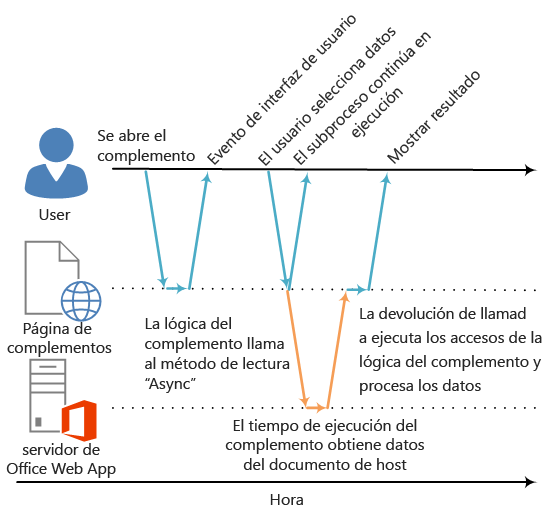

# <a name="asynchronous-programming-in-office-add-ins"></a>Programación asincrónica en complementos para Office

¿Por qué la API de Complementos de Office usa programación asincrónica? Debido a que JavaScript es un lenguaje de procesamiento único, si un script invoca un proceso sincrónico de larga duración, toda la ejecución posterior de dicho script se bloqueará hasta que el proceso haya finalizado. Puesto que determinadas operaciones en los clientes web de Office (aunque también en los clientes enriquecidos) podrían bloquear la ejecución si se realizan de forma sincrónica, la mayor parte de los métodos en la API de JavaScript para Office se han diseñado para ejecutarse de forma asincrónica. Esto garantiza que los Complementos de Office respondan y trabajen de forma eficaz. Asimismo, al trabajar con estos métodos asincrónicos es frecuente que sea necesario escribir funciones de devolución de llamada.

Los nombres de todos los métodos asincrónicos en la API terminan con "Async", como los métodos [Document.getSelectedDataAsync](../../reference/shared/document.getselecteddataasync.md), [Binding.getDataAsync](../../reference/shared/binding.getdataasync.md) o [Item.loadCustomPropertiesAsync](../../reference/outlook/Office.context.mailbox.item.md). Cuando un método se llama "Async", se ejecuta inmediatamente y cualquier ejecución posterior del script puede continuar. La función de devolución de llamada opcional que se pasa a un método "Async" se ejecuta en cuanto están listos los datos o la operación solicitada. Esto suele producirse de inmediato, pero puede haber un ligero retraso antes de que se devuelvan datos.

En el siguiente diagrama se muestra el flujo de ejecución de una llamada a un método "Async", que lee los datos que el usuario ha seleccionado en un documento abierto en las versiones basadas en servidor de Word Online o Excel Online. En el momento en que se realiza la llamada "Async", el subproceso de ejecución de JavaScript es libre de realizar cualquier otro procesamiento del lado del cliente (aunque no se muestra ninguno en el diagrama). Cuando se devuelve el método "Async", la devolución de llamada reanuda la ejecución en el subproceso y el complemento puede acceder a los datos, realizar alguna operación con ellos y mostrar el resultado. Se aplica el mismo patrón de ejecución asincrónica al trabajar con las aplicaciones host de clientes enriquecidos de Office, como Word 2013 o Excel 2013.

**Figura 1: Flujo de ejecución de programación asincrónica**




La compatibilidad con este diseño asincrónico, tanto en clientes enriquecidos como web, es parte del objetivo de diseño de "escribe una vez, ejecuta en cualquier plataforma" del modelo de desarrollo de los Complementos de Office. Por ejemplo, puede crear un complemento de panel de tareas y de contenido con una única base de código que se ejecute tanto en Excel 2013 como en Excel Online.

## <a name="writing-the-callback-function-for-an-"async"-method"></a>Escritura de la función de devolución de llamada para un método "Async"


La función de devolución de llamada que se pasa como argumento _callback_ de un método "Async" tiene que declarar un solo parámetro que el tiempo de ejecución del complemento usará para proporcionar acceso a un objeto [AsyncResult](../../reference/shared/asyncresult.md) cuando se ejecuta la función de devolución de llamada. Puede escribir:


- Una función anónima que se debe escribir y transferir directamente alineada con la llamada al método "Async", como el parámetro  _callback_ del método "Async".
    
- Una función con nombre, transfiriendo el nombre de dicha función como el parámetro  _callback_ de un método "Async".
    
Una función anónima es útil si solo va a usar su código una vez: puesto que no tiene nombre, no se puede hacer referencia a ella en otra parte del código. Una función con nombre es útil si desea volver a usar la función de devolución de llamada para más de un método "Async".


### <a name="writing-an-anonymous-callback-function"></a>Escritura de una función de devolución de llamada anónima

La siguiente función de devolución de llamada anónima declara un parámetro único denominado `result` que recupera los datos de la propiedad [AsyncResult.value](../../reference/shared/asyncresult.status.md) cuando se devuelve la devolución de llamada.


```js
function (result) {
        write('Selected data: ' + result.value);
}
```

En el siguiente ejemplo, se muestra cómo transferir esta función de devolución de llamada anónima alineada en el contexto de una llamada de método "Async" completa al método  **Document.getSelectedDataAsync**.


- En el primer argumento  _coercionType_,  `Office.CoercionType.Text`, se especifica la devolución de los datos seleccionados como una cadena de texto.
    
- El segundo argumento  _callback_ es la función anónima que se ha transferido alineada al método. Cuando se ejecuta la función, usa el parámetro _result_ para tener acceso a la propiedad **value** del objeto **AsyncResult** para mostrar los datos que ha seleccionado el usuario en el documento.
    


```js
Office.context.document.getSelectedDataAsync(Office.CoercionType.Text, 
    function (result) {
        write('Selected data: ' + result.value);
    }
});

// Function that writes to a div with id='message' on the page.
function write(message){
    document.getElementById('message').innerText += message; 
}
```

También puede usar el parámetro de la función de devolución de llamada para acceder a otras propiedades del objeto **AsyncResult**. Use la propiedad [AsyncResult.status](../../reference/shared/asyncresult.error.md) para determinar si la llamada se realizó correctamente o produjo errores. Si la llamada produce errores, puede usar la propiedad [AsyncResult.error](../../reference/shared/asyncresult.context.md) para tener acceso a un objeto [Error](../../reference/shared/error.md) y obtener información sobre el error.

Para más información sobre el uso del método  **getSelectedDataAsync**, vea [Leer y escribir datos en la selección activa de un documento u hoja de cálculo](../../docs/develop/read-and-write-data-to-the-active-selection-in-a-document-or-spreadsheet.md). 


### <a name="writing-a-named-callback-function"></a>Escritura de una función de devolución de llamadas con nombre

Como alternativa, puede escribir una función con nombre y transferir su nombre al parámetro  _callback_ de un método "Async". Por ejemplo, el ejemplo anterior se puede reescribir para transferir una función denominada `writeDataCallback` como el parámetro _callback_, tal y como se indica a continuación.


```js
Office.context.document.getSelectedDataAsync(Office.CoercionType.Text, 
    writeDataCallback);

// Callback to write the selected data to the add-in UI.
function writeDataCallback(result) {
    write('Selected data: ' + result.value);
}

// Function that writes to a div with id='message' on the page.
function write(message){
    document.getElementById('message').innerText += message; 
}
```


## <a name="differences-in-what's-returned-to-the-asyncresult.value-property"></a>Diferencias en lo que se devuelve a la propiedad AsyncResult.value


Las propiedades  **asyncContext**,  **status** y **error** del objeto **AsyncResult** devuelven el mismo tipo de información a la función de devolución de llamada transferida a todos los métodos "Async". Sin embargo, lo que se devuelve a la propiedad **AsyncResult.value** varía según la funcionalidad del método "Async".

Por ejemplo, los métodos  **addHandlerAsync** (de los objetos [Binding](../../reference/shared/binding.md), [CustomXmlPart](../../reference/shared/customxmlpart.customxmlpart.md), [Document](../../reference/shared/document.md), [RoamingSettings](../../reference/outlook/RoamingSettings.md) y [Settings](../../reference/shared/settings.md)) se usan para agregar funciones de controlador de eventos a los elementos a los que representan estos objetos. Puede obtener acceso a la propiedad  **AsyncResult.value** desde la función de devolución de llamada que pasamos a cualquiera de los métodos **addHandlerAsync**. Sin embargo, como no se obtiene acceso a ningún dato u objeto al agregar un controlador de eventos, la propiedad  **value** siempre devuelve **undefined** cuando se intenta obtener acceso a ella.

Por otra parte, si llama al método **Document.getSelectedDataAsync**, este devolverá los datos que seleccionó el usuario en el documento a la propiedad **AsyncResult.value** de la devolución de llamada. O bien, si llama al método [Bindings.getAllAsync](../../reference/shared/bindings.getallasync.md), este devolverá una matriz de todos los objetos **Binding** del documento. Además, si llama al método [Bindings.getByIdAsync](../../reference/shared/bindings.getbyidasync.md), este devolverá un único objeto **Binding**.

Para obtener una descripción de lo que se devuelve a la propiedad **AsyncResult.value** para un método "Async", vea la sección "Valor de devolución de llamada" del tema de referencia del método. Para obtener un resumen de todos los objetos que proporcionan métodos "Async", vea la tabla de la parte inferior del tema sobre el objeto [AsyncResult](../../reference/shared/asyncresult.md).


## <a name="asynchronous-programming-patterns"></a>Patrones de programación asincrónica


La API de JavaScript para Office es compatible con dos tipos de patrones de programación asincrónica:


- Uso de funciones anidadas de devolución de llamada
    
- Uso del patrón de promesas
    
La programación asincrónica con funciones de devolución de llamada requiere con frecuencia que se anide el resultado devuelto de una devolución de llamada en dos o más devoluciones de llamada. Si debe hacerlo, puede usar las funciones anidadas de devolución de llamada de todos los métodos "Async" de la API.

El uso de devoluciones de llamada anidadas es un patrón de programación conocido por la mayoría de los desarrolladores de JavaScript, pero el código con devoluciones de llamada excesivamente anidadas puede resultar difícil de leer y comprender. Como alternativa a las devoluciones de llamada anidadas, la API de JavaScript para Office también es compatible con una implementación del patrón de promesas. Pero, en la versión actual de la API de JavaScript para Office, el patrón de promesas solo funciona con código para [enlaces en hojas de cálculo de Excel y documentos de Word](../../docs/develop/bind-to-regions-in-a-document-or-spreadsheet.md).

<a name="AsyncProgramming_NestedCallbacks" />
### <a name="asynchronous-programming-using-nested-callback-functions"></a>Programación asincrónica con funciones anidadas de devolución de llamada


A menudo, hay que llevar a cabo dos operaciones asincrónicas o más para finalizar una tarea. Para hacerlo, puede anidar una llamada "Async" dentro de otra. 

En el siguiente código de ejemplo se han anidado dos llamadas asincrónicas. 


- Primero se llama al método [Bindings.getByIdAsync](../../reference/shared/bindings.getbyidasync.md) para tener acceso a un enlace en el documento denominado "MyBinding". El objeto **AsyncResult** devuelto al parámetro `result` de esa devolución de llamada proporciona acceso al objeto de enlace especificado desde la propiedad **AsyncResult.value**.
    
- Después, se usa el objeto de enlace al que se obtuvo acceso desde el primer parámetro `result` para llamar al método [Binding.getDataAsync](../../reference/shared/binding.getdataasync.md).
    
- Por último, el parámetro  `result2` de la devolución de llamada que se transfirió al método **Binding.getDataAsync** se usa para mostrar los datos del enlace.
    


```js
function readData() {
    Office.context.document.bindings.getByIdAsync("MyBinding", function (result) {
        result.value.getDataAsync({ coercionType: 'text' }, function (result2) {
            write(result2.value);
        });
    });
}

// Function that writes to a div with id='message' on the page.
function write(message){
    document.getElementById('message').innerText += message; 
}
```

Este patrón de funciones anidadas de devolución de llamada se puede usar para todos los métodos asincrónicos de la API de JavaScript para Office.

Las secciones siguientes muestran cómo usar las funciones (anónimas o con nombre) para realizar devoluciones de llamadas anidadas en métodos asincrónicos.


#### <a name="using-anonymous-functions-for-nested-callbacks"></a>Uso de funciones anónimas para realizar devoluciones de llamadas anidadas

En el ejemplo siguiente, se declaran alineadas dos funciones anónimas y se transfieren a los métodos  **getByIdAsync** y **getDataAsync** como devoluciones de llamada anidadas. Como las funciones son sencillas y están alineadas, el propósito de la implementación es claro inmediatamente.


```js
Office.context.document.bindings.getByIdAsync('myBinding', function (bindingResult) {
    bindingResult.value.getDataAsync(function (getResult) {
        if (getResult.status == Office.AsyncResultStatus.Failed) {
            write('Action failed. Error: ' + asyncResult.error.message);
        } else {
            write('Data has been read successfully.');
        }
    });
});

// Function that writes to a div with id='message' on the page.
function write(message){
    document.getElementById('message').innerText += message; 
}
```


#### <a name="using-named-functions-for-nested-callbacks"></a>Uso de funciones con nombre para realizar devoluciones de llamadas anidadas

En implementaciones complejas, puede resultarle útil usar funciones con nombre para facilitar la lectura, el mantenimiento y la reutilización del código. En el ejemplo siguiente, se han cambiado los nombres de las dos funciones anónimas del ejemplo anterior y ahora se llaman  `deleteAllData` y `showResult`. Esas funciones con nombre se pasan luego a los métodos  **getByIdAsync** y **deleteAllDataValuesAsync** como llamadas de devolución por nombre.


```js
Office.context.document.bindings.getByIdAsync('myBinding', deleteAllData);

function deleteAllData(asyncResult) {
    asyncResult.value.deleteAllDataValuesAsync(showResult);
}

function showResult(asyncResult) {
    if (asyncResult.status == Office.AsyncResultStatus.Failed) {
        write('Action failed. Error: ' + asyncResult.error.message);
    } else {
        write('Data has been deleted successfully.');
    }
}

// Function that writes to a div with id='message' on the page.
function write(message){
    document.getElementById('message').innerText += message; 
}
```


### <a name="asynchronous-programming-using-the-promises-pattern-to-access-data-in-bindings"></a>Programación asincrónica con el patrón de promesas para tener acceso a los datos de los enlaces


En lugar de transferir una función de devolución de llamada y esperar a que se devuelva la función antes de que continúe la ejecución, el patrón de programación de promesas devuelve inmediatamente unobjeto de promesa que representa el resultado deseado. No obstante, a diferencia de la programación verdaderamente sincrónica, en realidad el cumplimiento del resultado prometido se aplaza hasta que el entorno en tiempo de ejecución de los Complementos de Office pueda completar la solicitud. Se facilita un controlador _onError_ para dar cobertura en situaciones en las que no se puede realizar la solicitud.

La API de JavaScript para Office proporciona el método [Office.select](../../reference/shared/office.select.md) para que el patrón de promesas sea compatible con los objetos de enlace existentes. El objeto de promesa devuelto al método **Office.select** solo es compatible con los cuatro métodos a los que se puede obtener acceso directamente desde el objeto [Binding](../../reference/shared/binding.md): [getDataAsync](../../reference/shared/binding.getdataasync.md), [setDataAsync](../../reference/shared/binding.setdataasync.md), [addHandlerAsync](../../reference/shared/asyncresult.value.md) y [removeHandlerAsync](../../reference/shared/binding.removehandlerasync.md).

El patrón de promesas para usar los enlaces tiene el siguiente formato:

 **Office.select(**_selectorExpression_,  _onError_**).**_BindingObjectAsyncMethod_

El parámetro  _selectorExpression_ tiene el formato `"bindings#bindingId"`, donde  _bindingId_ es el nombre ( **id**) de un enlace que ha creado previamente en el documento o la hoja de cálculo (con uno de los métodos "addFrom" de la colección  **Bindings**:  **addFromNamedItemAsync**,  **addFromPromptAsync** o **addFromSelectionAsync**). Por ejemplo, la expresión del selector  `bindings#cities` especifica que desea tener acceso al enlace con un **id** de "ciudades".

El parámetro  _onError_ es una función de tratamiento de errores que toma un solo parámetro del tipo **AsyncResult**, que se puede usar para tener acceso a un objeto  **Error**, si el método  **select** da error al tener acceso al enlace especificado. En el siguiente ejemplo, se muestra una función de tratamiento de errores básica que se puede transferir al parámetro _onError_.


```js
function onError(result){
    var err = result.error;
    write(err.name + ": " + err.message);
}
// Function that writes to a div with id='message' on the page.
function write(message){
    document.getElementById('message').innerText += message; 
}
```

Reemplace el marcador de posición _BindingObjectAsyncMethod_ por una llamada a cualquiera de los cuatro métodos del objeto **Binding** compatibles con el objeto de promesa: **getDataAsync**, **setDataAsync**, **addHandlerAsync** o **removeHandlerAsync**. Las llamadas a estos métodos no son compatibles con promesas adicionales. Es necesario llamarlos con el [patrón de función de devolución de llamada anidada](../../docs/develop/asynchronous-programming-in-office-add-ins.md#AsyncProgramming_NestedCallbacks).

Una vez que se ha cumplido una promesa de un objeto  **Binding**, se puede volver a usar en la llamada de método encadenado como si fuera un enlace (el tiempo de ejecución de la aplicación no tratará de volver a cumplir la promesa de manera asincrónica). Si no se puede cumplir la promesa del objeto  **Binding**, el tiempo de ejecución del complemento volverá a tratar de tener acceso al objeto de enlace la próxima vez que se invoque uno de sus métodos asincrónicos.

En el ejemplo de código siguiente se usa el método **select** para recuperar un enlace con el **id.** " `cities`" de la colección de **Bindings** y, después, se realiza una llamada al método [addHandlerAsync](../../reference/shared/asyncresult.value.md) para agregar un controlador de eventos para el evento [dataChanged](../../reference/shared/binding.bindingdatachangedevent.md) del enlace.


```js
function addBindingDataChangedEventHandler() {
    Office.select("bindings#cities", function onError(){/* error handling code */}).addHandlerAsync(Office.EventType.BindingDataChanged,
    function (eventArgs) {
        doSomethingWithBinding(eventArgs.binding);
    });
}

```


 >**Importante**  La promesa del objeto  **Binding** que ha devuelto el método **Office.select** proporciona acceso únicamente a los cuatro métodos del objeto **Binding**. Si necesita acceder a cualquiera de los demás miembros del objeto  **Binding**, debe usar la propiedad  **Document.bindings** en su lugar y los métodos **Bindings.getByIdAsync** o **Bindings.getAllAsync** para recuperar el objeto **Binding**. Por ejemplo, si necesita acceder a cualquiera de las propiedades del objeto  **Binding** (las propiedades **document**,  **id** o **type**) o de los objetos [MatrixBinding](../../reference/shared/binding.matrixbinding.md) o [TableBinding](../../reference/shared/binding.tablebinding.md), debe usar los métodos  **getByIdAsync** o **getAllAsync** para recuperar un objeto **Binding**.


## <a name="passing-optional-parameters-to-asynchronous-methods"></a>Transferencia de parámetros opcionales a métodos asincrónicos


La sintaxis común de todos los métodos "Async" sigue el patrón siguiente:

 _AsyncMethod_ `(`_RequiredParameters_`, [`_OptionalParameters_`],`_CallbackFunction_`);`

Todos los métodos asincrónicos son compatibles con los parámetros opcionales, que se pasan como un objeto Notación de objetos JavaScript (JSON) que contiene, por lo menos, un parámetro opcional. El objeto JSON que contiene los parámetros opcionales es una colección desordenada de pares clave-valor, en los cuales el carácter ":" separa la clave del valor. Cada par del objeto está separado por una coma y el conjunto entero de pares está delimitado por dos corchetes. La clave es el nombre del parámetro y el valor es el valor a pasar para ese parámetro.

Puede crear el objeto JSON que contiene parámetros opcionales de forma alineada o bien creando un objeto  `options` opciones y pasarlo como el parámetro _options_.


### <a name="passing-optional-parameters-inline"></a>Transferencia de parámetros opcionales de forma alineada

Por ejemplo, la sintaxis para llamar al método [Document.setSelectedDataAsync](../../reference/shared/document.getselecteddataasync.md) con parámetros opcionales de forma alineada tiene el aspecto siguiente:

```js
 Office.context.document.setSelectedDataAsync(data, {coercionType: 'coercionType', asyncContext:' asyncContext},callback);

```

En esta representación de la sintaxis de llamada, los dos parámetros opcionales – _coercionType_ y _asyncContext_– son definidos como un objeto JSON alineado delimitado por corchetes.

En el ejemplo siguiente se muestra cómo llamar al método  **Document.setSelectedDataAsync** especificando parámetros opcionales de forma alineada.


```js
Office.context.document.setSelectedDataAsync(
    "<html><body>hello world</body></html>",
    {coercionType: "html", asyncContext: 42},
    function(asyncResult) {
        write(asyncResult.status + " " + asyncResult.asyncContext);
    }
)

// Function that writes to a div with id='message' on the page.
function write(message){
    document.getElementById('message').innerText += message; 
}
```


> **Nota:**  Puede especificar parámetros opcionales en el objeto JSON en cualquier orden siempre que los nombres se especifiquen correctamente.


### <a name="passing-optional-parameters-in-an-options-object"></a>Transferencia de parámetros opcionales a un objeto de opciones

También puede crear un objeto llamado  `options` que especifique los parámetros opcionales independientemente de la llamada del método, y luego pasar el objeto `options` como el argumento de _options_.

En el siguiente ejemplo se muestra una forma de crear el objeto  `options`, donde  `parameter1`,  `value1`, etc., son marcadores de posición de los nombres y valores de parámetro reales.


```js
var options = {
    parameter1: value1,
    parameter2: value2,
    ...
    parameterN: valueN
};

```

Es similar al ejemplo siguiente cuando se usa para especificar los parámetros [ValueFormat](../../reference/shared/valueformat-enumeration.md) y [FilterType](../../reference/shared/filtertype-enumeration.md).


```js
var options = {
    valueFormat: "unformatted",
    filterType: "all"
};
```

Aquí tiene otra manera de crear el objeto  `options`.


```js
var options = {};
options[parameter1] = value1;
options[parameter2] = value2;
...
options[parameterN] = valueN;
```

Que se ve como el siguiente ejemplo cuando se usa para especificar los parámetros  **ValueFormat** y **FilterType**.


```js
var options = {};
options["ValueFormat"] = "unformatted";
options["FilterType"] = "all";
```


 >**Nota**  Al utilizar cualquiera de los dos métodos de creación del objeto  `options`, puede especificar parámetros opcionales en cualquier orden siempre que los nombres se especifiquen correctamente

En el siguiente ejemplo se muestra cómo llamar al método  **Document.setSelectedDataAsync** especificando parámetros opcionales en un objeto `options`.


```js
var options = {
   coercionType: "html",
   asyncContext: 42
};

document.setSelectedDataAsync(
    "<html><body>hello world</body></html>",
    options,
    function(asyncResult) {
        write(asyncResult.status + " " + asyncResult.asyncContext);
    }
)

// Function that writes to a div with id='message' on the page.
function write(message){
    document.getElementById('message').innerText += message; 
}
```


En los dos ejemplos de parámetros opcionales, el parámetro _callback_ se especifica como el último parámetro (después de los parámetros opcionales insertados o después del objeto del argumento _options_). Como alternativa, puede especificar el parámetro _callback_, bien dentro del objeto JSON insertado o dentro del objeto `options`. Pero el parámetro _callback_ solo se puede pasar a una ubicación: al objeto _options_ (insertado o creado externamente) o como el último parámetro, pero no a ambas.


## <a name="additional-resources"></a>Recursos adicionales


- [Información sobre la API de JavaScript para Office](../../docs/develop/understanding-the-javascript-api-for-office.md)
    
- [API de JavaScript para Office](../../reference/javascript-api-for-office.md)
     
