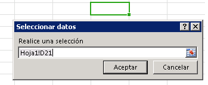

# Enlazar a regiones de un documento u hoja de cálculo

El acceso a datos basado en enlaces permite a los complementos de panel de tareas y de contenido tener acceso de forma coherente a una determinada región de un documento o una hoja de cálculo a través de un identificador. Primero, el complemento necesita establecer el enlace con una llamada a uno de los métodos que asocian una parte del documento con un identificador único: [addFromPromptAsync], [addFromSelectionAsync] o [addFromNamedItemAsync]. Después de establecer el enlace, el complemento puede usar el identificador para tener acceso a los datos de la región asociada del documento o la hoja de cálculo. Crear enlaces proporciona las ventajas siguientes al complemento:


- Permite el acceso a estructuras de datos comunes de aplicaciones de Office compatibles como, por ejemplo, tablas, rangos o texto (secuencia de caracteres contiguos).
    
- Permite las operaciones de lectura/escritura sin que el usuario tenga que hacer ninguna selección.
    
- Establece una relación entre el complemento y los datos del documento. Los enlaces se conservan en el documento y es posible tener acceso a estos más adelante.
    
Al establecer un enlace, también puede subscribirse a eventos de cambio de datos y de selección designados en esa región en concreto del documento u hoja de cálculo. Es decir, que al complemento solo se le notifican los cambios que ocurren dentro de la región delimitada, y no los cambios generales que se den en todo el documento u hoja de cálculo.

El objeto [Bindings] expone un método [getAllAsync] que da acceso al conjunto de todos los enlaces establecidos en el documento u hoja de cálculo. Se puede acceder a un enlace individual por su identificador mediante los métodos Bindings.[getByIdAsync] u [Office.select]. Puede establecer enlaces nuevos, así como quitar los existentes, mediante uno de los métodos siguientes del objeto [Bindings]: [addFromSelectionAsync], [addFromPromptAsync], [addFromNamedItemAsync] o [releaseByIdAsync].


## Tipos de enlaces

Existen [tres tipos de enlaces][Office.BindingType] distintos que puede especificar con el parámetro _bindingType_ al crear un enlace con los métodos [addFromSelectionAsync], [addFromPromptAsync] o [addFromNamedItemAsync]:

1. **[Enlace de texto][TextBinding]**: enlaza con una región del documento que se puede representar como texto.

    En Word, la mayoría de las selecciones contiguas son válidas, mientras que en Excel solo se puede seleccionar una celda como destino del enlace de texto. En Excel, solo se admite el texto sin formato. En Word pueden usarse tres formatos: texto sin formato, HTML y Open XML para Office.

2. **[Enlace de matriz][MatrixBinding]**: enlaza con una región fija de un documento que contiene datos tabulares sin encabezados. Los datos en un enlace de matriz se escriben o se leen como una **Matriz** bidireccional, que en JavaScript se implementa como una matriz de matrices. Por ejemplo, dos filas de valores de **cadena** en dos columnas pueden escribirse o leerse como ` [['a', 'b'], ['c', 'd']]` y una sola columna de tres filas puede escribirse o leerse como `[['a'], ['b'], ['c']]`.

    En Excel, se puede usar cualquier selección contigua de celdas para establecer un enlace de matriz.  En Word, solo las tablas admiten enlaces de matriz.

3. **[Enlace de tablas][TableBinding]**: enlaza con una región de un documento que contiene una tabla con encabezados. Los datos de un enlace de tablas se escriben o leen como un objeto [TableData](../../reference/shared/tabledata.md). El objeto `TableData` expone los datos a través de las propiedades `headers` y `rows`.

    Se puede usar como base cualquier tabla de Excel o de Word para establecer un enlace de tabla. Una vez se haya establecido un enlace de tabla, cada fila o columna nueva que se agregue a la tabla se incluirá automáticamente al enlace.

Después de crear un enlace mediante uno de los tres métodos de "addFrom" del objeto `Bindings`, puede trabajar con los datos y propiedades del enlace mediante los métodos del objeto correspondiente: [MatrixBinding], [TableBinding] o [TextBinding]. Estos tres objetos heredan los métodos [getDataAsync] y [setDataAsync] del objeto `Binding` que le permiten interactuar con los datos enlazados.

> **¿Cuándo debería usar matrices en lugar de enlaces de tabla?** Cuando los datos tabulares con los que trabaja contienen una fila de total, debe usar un enlace de matriz si el script del complemento necesita acceder a los valores de la fila de total o detectar que la selección del usuario está en la fila de total. Si establece un enlace de tabla para datos tabulares que contengan una fila de total, la propiedad [TableBinding.rowCount] y las propiedades `rowCount` y `startRow` del objeto [BindingSelectionChangedEventArgs] en controladores de eventos no reflejarán la fila de total en sus valores. Para evitar esta limitación, debe establecer un enlace de matriz para trabajar con la fila de total.


### Adición de un enlace a la selección actual del usuario

En el ejemplo siguiente se muestra cómo agregar un enlace de texto con el nombre `myBinding` a la selección actual de un documento con el método [addFromSelectionAsync].


```js
Office.context.document.bindings.addFromSelectionAsync(Office.BindingType.Text, { id: 'myBinding' }, function (asyncResult) {
    if (asyncResult.status == Office.AsyncResultStatus.Failed) {
        write('Action failed. Error: ' + asyncResult.error.message);
    } else {
        write('Added new binding with type: ' + asyncResult.value.type + ' and id: ' + asyncResult.value.id);
    }
});

// Function that writes to a div with id='message' on the page.
function write(message){
    document.getElementById('message').innerText += message; 
}
```

En este ejemplo, el tipo de enlace especificado es texto, por lo que se creará un elemento [TextBinding] para la selección. Los diferentes tipos de enlace muestran datos y operaciones diferentes. [Office.BindingType] es una enumeración de los valores de los tipos de enlace disponibles.

El segundo parámetro opcional es un objeto que indica el identificador del enlace que se va a crear. Si no se especifica ningún identificador, se generará uno automáticamente.

La función anónima que se pasa a la función como el parámetro de _devolución de llamada_ final se ejecuta cuando se completa la creación del enlace. Se llama a la función con un solo parámetro, `asyncResult`, que proporciona acceso a un objeto [AsyncResult] que proporciona el estado de la llamada. La propiedad `AsyncResult.value` contiene una referencia a un objeto [Binding] del tipo especificado para el enlace recién creado. Puede usar este objeto [Binding] para obtener y establecer datos.

### Adición de un enlace desde un aviso

En el ejemplo siguiente se muestra cómo agregar un enlace de texto denominado `myBinding` mediante el uso del método [addFromPromptAsync]. Este método permite al usuario especificar el rango para el enlace usando el aviso de selección de rango integrado de la aplicación.


```js
function bindFromPrompt() {
    Office.context.document.bindings.addFromPromptAsync(Office.BindingType.Text, { id: 'myBinding' }, function (asyncResult) {
        if (asyncResult.status == Office.AsyncResultStatus.Failed) {
            write('Action failed. Error: ' + asyncResult.error.message);
        } else {
            write('Added new binding with type: ' + asyncResult.value.type + ' and id: ' + asyncResult.value.id);
        }
    });
}

// Function that writes to a div with id='message' on the page.
function write(message){
    document.getElementById('message').innerText += message; 
}
```

En este ejemplo, el tipo de enlace especificado es texto. Esto significa que se creará un elemento [TextBinding] para la selección que el usuario especifique en la petición.

El segundo parámetro es un objeto que contiene el identificador del enlace que se va a crear. Si no se especifica ningún identificador, se generará uno automáticamente.

La función anónima que se pasa a la función como el tercer parámetro _callback_ se ejecuta cuando se completa la creación del enlace. Cuando se ejecuta la función de devolución de llamada, el objeto [AsyncResult] contiene el estado de la llamada y el nuevo enlace creado.

La Figura 1 muestra la petición de selección de rango integrada en Excel.


**Figura 1. IU de selección de datos en Excel.**




### Adición de un enlace a un elemento con nombre


En el ejemplo siguiente se muestra cómo agregar un enlace al elemento con nombre `myRange` existente como un enlace de "matriz" con el método [addFromNamedItemAsync] y se asigna el `id` del enlace como "myMatrix".


```js
function bindNamedItem() {
    Office.context.document.bindings.addFromNamedItemAsync("myRange", "matrix", {id:'myMatrix'}, function (result) {
        if (result.status == 'succeeded'){
            write('Added new binding with type: ' + result.value.type + ' and id: ' + result.value.id);
            }
        else
            write('Error: ' + result.error.message);
    });
}

// Function that writes to a div with id='message' on the page.
function write(message){
    document.getElementById('message').innerText += message; 
}

```

 **Para Excel**, el parámetro `itemName` del método [addFromNamedItemAsync] puede hacer referencia a un rango con nombre existente, a un rango especificado con el estilo de referencia `A1` `("A1:A3")` o a una tabla. De forma predeterminada, agregar una tabla en Excel asigna el nombre "Tabla1" a la primera tabla que se agrega, "Tabla2" a la segunda, y así sucesivamente. Para asignar un nombre significativo a una tabla en la interfaz de usuario de Excel, use la propiedad **Nombre de tabla** en la pestaña **Herramientas de tabla | Diseño** de la cinta de opciones.


 >**Nota** En Excel, cuando se especifica una tabla como elemento con nombre, debe asignarle un nombre completo e incluir el nombre de la hoja de cálculo en el nombre de la tabla según este formato: `"Sheet1!Table1"`

En el ejemplo siguiente se crea un enlace en Excel a las tres primeras celdas de la columna A (`"A1:A3"`), se asigna el id `"MyCities"` y, luego, se escriben tres nombres de ciudades en ese enlace.


```js
 function bindingFromA1Range() {
    Office.context.document.bindings.addFromNamedItemAsync("A1:A3", "matrix", {id: "MyCities" },
        function (asyncResult) {
            if (asyncResult.status == "failed") {
                write('Error: ' + asyncResult.error.message);
            }
            else {
                // Write data to the new binding.
                Office.select("bindings#MyCities").setDataAsync([['Berlin'], ['Munich'], ['Duisburg']], { coercionType: "matrix" },
                    function (asyncResult) {
                        if (asyncResult.status == "failed") {
                            write('Error: ' + asyncResult.error.message);
                        }
                    });
            }
        });
}
// Function that writes to a div with id='message' on the page.
function write(message){
    document.getElementById('message').innerText += message; 
}
```

 **Para Word**, el parámetro `itemName` del método [addFromNamedItemAsync] hace referencia a la propiedad `Title` de un control de contenido `Rich Text`. (No puede enlazar a controles de contenido que no sean el control de contenido `Rich Text`).

De forma predeterminada, un control de contenido no tiene ningún `Title*`valor asignado. Para asignar un nombre significativo en la interfaz de usuario de Word, después de insertar un control de contenido **Texto enriquecido** desde el grupo **Controles** de la pestaña **Desarrollador** de la cinta, use el comando **Propiedades** del grupo **Controles** para mostrar el cuadro de diálogo **Propiedades del control de contenido**. Después, establezca la propiedad **Title** del control de contenido con el nombre al que quiera hacer referencia desde su código.

En el ejemplo siguiente se crea un enlace de texto en Word a un control de contenido de texto enriquecido llamado  `"FirstName"`, se asigna el  **id**`"firstName"` y, a continuación, se muestra esa información.


```js
function bindContentControl() {
    Office.context.document.bindings.addFromNamedItemAsync('FirstName', 
        Office.BindingType.Text, {id:'firstName'},
        function (result) {
            if (result.status === Office.AsyncResultStatus.Succeeded) {
                write('Control bound. Binding.id: '
                    + result.value.id + ' Binding.type: ' + result.value.type);
            } else {
                write('Error:', result.error.message);
            }
    });
}
// Function that writes to a div with id='message' on the page.
function write(message){
    document.getElementById('message').innerText += message; 
}
```


### Obtención de todos los enlaces


En el ejemplo siguiente se muestra cómo obtener todos los enlaces de un documento con el método Bindings.[getAllAsync].


```js
Office.context.document.bindings.getAllAsync(function (asyncResult) {
    var bindingString = '';
    for (var i in asyncResult.value) {
        bindingString += asyncResult.value[i].id + '\n';
    }
    write('Existing bindings: ' + bindingString);
});

// Function that writes to a div with id='message' on the page.
function write(message){
    document.getElementById('message').innerText += message; 
}
```

La función anónima que se pasa a la función como el parámetro `callback` se ejecuta cuando se completa la operación. Se llama a la función con un solo parámetro, `asyncResult`, que contiene una matriz de los enlaces en el documento. La matriz se itera para construir una cadena que contenga los identificadores de los enlaces. Después, se muestra la cadena en un cuadro de mensaje.


### Obtención de un enlace por el identificador con el método getByIdAsync del objeto Bindings


En el ejemplo siguiente se muestra cómo usar el método [getByIdAsync] para obtener un enlace de un documento al especificar su identificador. En este ejemplo se supone que se ha agregado al documento un enlace denominado `'myBinding'` mediante uno de los métodos descritos anteriormente en este tema.


```js
Office.context.document.bindings.getByIdAsync('myBinding', function (asyncResult) {
    if (asyncResult.status == Office.AsyncResultStatus.Failed) {
        write('Action failed. Error: ' + asyncResult.error.message);
    } 
    else {
        write('Retrieved binding with type: ' + asyncResult.value.type + ' and id: ' + asyncResult.value.id);
    }
});

// Function that writes to a div with id='message' on the page.
function write(message){
    document.getElementById('message').innerText += message; 
}
```

En el ejemplo, el primer parámetro `id` es el identificador del enlace que se quiere recuperar.

La función anónima transferida a la función como el segundo parámetro  _callback_ se inicia una vez acabada la acción. Se llama a la función con un único parámetro, _asyncResult_, que contiene el estado de la llamada y el enlace con el identificador "myBinding".


### Obtención de enlace por el identificador con el método de selección del objeto Office


En el ejemplo siguiente se muestra cómo usar el método [Office.select] para obtener un objeto [Binding] de un documento al especificar su identificador en una cadena de selector. Después, llama al método Binding.[getDataAsync] para obtener datos del enlace especificado. En este ejemplo se supone que se ha agregado al documento un enlace denominado `'myBinding'` mediante uno de los métodos descritos anteriormente en este tema.


```js
Office.select("bindings#myBinding", function onError(){}).getDataAsync(function (asyncResult) {
    if (asyncResult.status == Office.AsyncResultStatus.Failed) {
        write('Action failed. Error: ' + asyncResult.error.message);
    } else {
        write(asyncResult.value);
    }
});

// Function that writes to a div with id='message' on the page.
function write(message){
    document.getElementById('message').innerText += message; 
}
```


 > **Nota:**  Si la promesa del método `select` devuelve correctamente un objeto [Binding], dicho objeto solo expone los siguientes cuatro métodos del objeto: [getDataAsync], [setDataAsync], [addHandlerAsync] y [removeHandlerAsync]. Si la promesa no puede devolver un objeto Binding, se puede usar la devolución de llamada `onError` para obtener acceso a un objeto [asyncResult.error] y obtener más información. Si necesita llamar a un miembro del objeto Binding que no sea ninguno de los cuatro métodos expuestos por la promesa del objeto Binding devuelta por el método `select`, use en su lugar el método [getByIdAsync] con la propiedad [Document.bindings] y el método [Bindings.getByIdAsync] para recuperar el objeto Binding**.

### Liberación de un enlace por el identificador


En el ejemplo siguiente se muestra cómo usar el método [releaseByIdAsync] para liberar un enlace de un documento especificando su identificador.

```js
Office.context.document.bindings.releaseByIdAsync('myBinding', function (asyncResult) {
    write('Released myBinding!');
});

// Function that writes to a div with id='message' on the page.
function write(message){
    document.getElementById('message').innerText += message; 
}
```

En el ejemplo, el primer parámetro `id` es el identificador del enlace que se quiere publicar.

La función anónima que se pasa a la función como segundo parámetro es una devolución de llamada que se inicia cuando se ha completado la operación. Se llama a la función con un único parámetro,  [asyncResult], que contiene el estado de la llamada.


### Lectura de datos de un enlace


En el ejemplo siguiente se muestra cómo usar el método [getDataAsync] para obtener datos de un enlace existente.


```js
myBinding.getDataAsync(function (asyncResult) {
    if (asyncResult.status == Office.AsyncResultStatus.Failed) {
        write('Action failed. Error: ' + asyncResult.error.message);
    } else {
        write(asyncResult.value);
    }
});

// Function that writes to a div with id='message' on the page.
function write(message){
    document.getElementById('message').innerText += message; 
}
```

 `myBinding` es una variable que contiene un enlace de texto existente en el documento. Como alternativa, puede usar el método [Office.select] para tener acceso al enlace por su identificador e iniciar la llamada al método [getDataAsync] de esta manera: 

```js 
Office.select("bindings#myBindingID").getDataAsync
```


La función anónima que se pasa a la función es una devolución de llamada que se ejecuta cuando se completa la operación. La propiedad [AsyncResult].value contiene los datos de `myBinding`. El tipo del valor depende del tipo de enlace. El enlace de este ejemplo es un enlace de texto. Por lo tanto, el valor contendrá una cadena. Para obtener ejemplos adicionales de trabajar con enlaces de matriz y tabla, consulte el tema del método [getDataAsync].


### Escritura de los datos en un enlace

En el ejemplo siguiente se muestra cómo usar el método [setDataAsync] para establecer datos en un enlace existente.

```js
myBinding.setDataAsync('Hello World!', function (asyncResult) { });
```

 `myBinding` es una variable que contiene un enlace de texto existente en el documento.

En el ejemplo, el primer parámetro es el valor para establecer en `myBinding`. Como se trata de un enlace de texto, el valor es una `string`. Los tipos de enlace diferentes aceptan tipos de datos diferentes.

La función anónima que se pasa a la función es una devolución de llamada que se ejecuta cuando se completa la operación. Se llama a la función con un solo parámetro, `asyncResult`, que contiene el estado del resultado.

 > **Nota:** A partir de Excel 2013 SP1 y la compilación correspondiente de Excel Online, ahora puede [establecer el formato al escribir y actualizar datos en tablas enlazadas](../../docs/excel/format-tables-in-add-ins-for-excel.md).


### Detección de cambios en los datos o en la selección de un enlace


En el ejemplo siguiente se muestra cómo conectar un controlador de eventos al evento [DataChanged](../../reference/shared/binding.bindingdatachangedevent.md) de un enlace con el id. "MyBinding".


```js
function addHandler() {
Office.select("bindings#MyBinding").addHandlerAsync(
    Office.EventType.BindingDataChanged, dataChanged);
}
function dataChanged(eventArgs) {
    write('Bound data changed in binding: ' + eventArgs.binding.id);
}
// Function that writes to a div with id='message' on the page.
function write(message){
    document.getElementById('message').innerText += message; 
}
```

 `myBinding` es una variable que contiene un enlace de texto existente en el documento.

El primer parámetro `eventType` del método [addHandlerAsync] especifica el nombre del evento al que suscribirse. [Office.EventType] es una enumeración de los valores de tipos de eventos disponibles. “Office.EventType.BindingDataChanged evalúa la cadena ‘bindingDataChanged’”.

La función  `dataChanged` que se pasa a la función como el segundo parámetro _handler_ es un controlador de eventos que se ejecuta cuando cambian los datos del enlace. La función se llama con un solo parámetro, _eventArgs_, que contiene una referencia al enlace. Este enlace puede usarse para recuperar los datos actualizados.

De forma similar, puede detectar cuándo cambia la selección un usuario en un enlace al adjuntar un controlador de eventos para el evento [SelectionChanged] de un enlace. Para ello, especifique el parámetro `eventType` del método [addHandlerAsync] como `Office.EventType.BindingSelectionChanged` o `"bindingSelectionChanged"`.

Puede agregar varios controladores de eventos a un evento determinado al llamar de nuevo al método [addHandlerAsync] y pasar una función de controlador de eventos adicional para el parámetro `handler`. Esto funcionará correctamente siempre que el nombre de cada función del controlador de eventos sea único.


### Eliminación de un controlador de eventos


Para quitar un controlador de eventos de un evento, llame al método [removeHandlerAsync] pasando el tipo de evento como el primer parámetro _eventType_ y el nombre de la función del controlador de eventos que quiere quitar como segundo parámetro _handler_. Por ejemplo, la función siguiente quitará la función del controlador de eventos `dataChanged` que se ha agregado en el ejemplo de la sección anterior.


```
function removeEventHandlerFromBinding() {
    Office.select("bindings#MyBinding").removeHandlerAsync(
        Office.EventType.BindingDataChanged, {handler:dataChanged});
}
```


 >**Importante:**  Si el parámetro opcional _handler_ se omite cuando se llama al método [removeHandlerAsync], se quitarán todos los controladores de eventos del `eventType` especificado.


## Recursos adicionales

- [Información sobre la API de JavaScript para Office](../../docs/develop/understanding-the-javascript-api-for-office.md)
    
- [Programación asíncrona en los complementos de Office](../../docs/develop/asynchronous-programming-in-office-add-ins.md)
    
- [Leer y escribir datos en la selección activa de un documento o una hoja de cálculo](../../docs/develop/read-and-write-data-to-the-active-selection-in-a-document-or-spreadsheet.md)
    
[Binding]:               ../../reference/shared/binding.md
[MatrixBinding]:         ../../reference/shared/binding.matrixbinding.md
[TableBinding]:          ../../reference/shared/binding.tablebinding.md
[TextBinding]:           ../../reference/shared/binding.textbinding.md
[getDataAsync]:          ../../reference/shared/binding.getdataasync.md
[setDataAsync]:          ../../reference/shared/binding.setdataasync.md
[SelectionChanged]:      ../../reference/shared/binding.bindingselectionchangedevent.md
[addHandlerAsync]:       ../../reference/shared/binding.addhandlerasync.md
[removeHandlerAsync]:    ../../reference/shared/binding.removehandlerasync.md

[Bindings]:              ../../reference/shared/bindings.bindings.md
[getByIdAsync]:          ../../reference/shared/bindings.getbyidasync.md 
[getAllAsync]:           ../../reference/shared/bindings.getallasync.md
[addFromNamedItemAsync]: ../../reference/shared/bindings.addfromnameditemasync.md
[addFromSelectionAsync]: ../../reference/shared/bindings.addfromselectionasync.md
[addFromPromptAsync]:    ../../reference/shared/bindings.addfrompromptasync.md
[releaseByIdAsync]:      ../../reference/shared/bindings.releasebyidasync.md

[AsyncResult]:          ../../reference/shared/asyncresult.md
[Office.BindingType]:   ../../reference/shared/bindingtype-enumeration.md
[Office.select]:        ../../reference/shared/office.select.md 
[Office.EventType]:     ../../reference/shared/eventtype-enumeration.md 
[Document.bindings]:    ../../reference/shared/document.bindings.md


[TableBinding.rowCount]: ../../reference/shared/binding.tablebinding.rowcount.1md
[BindingSelectionChangedEventArgs]: ../../reference/shared/binding.bindingselectionchangedeventargs.md
