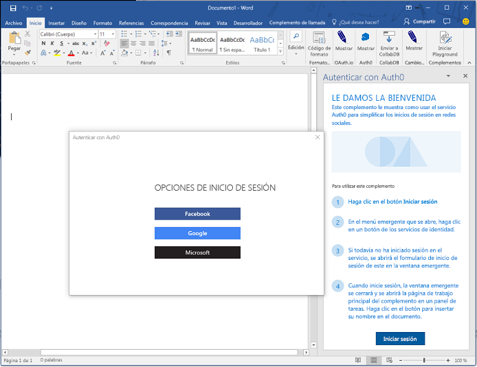
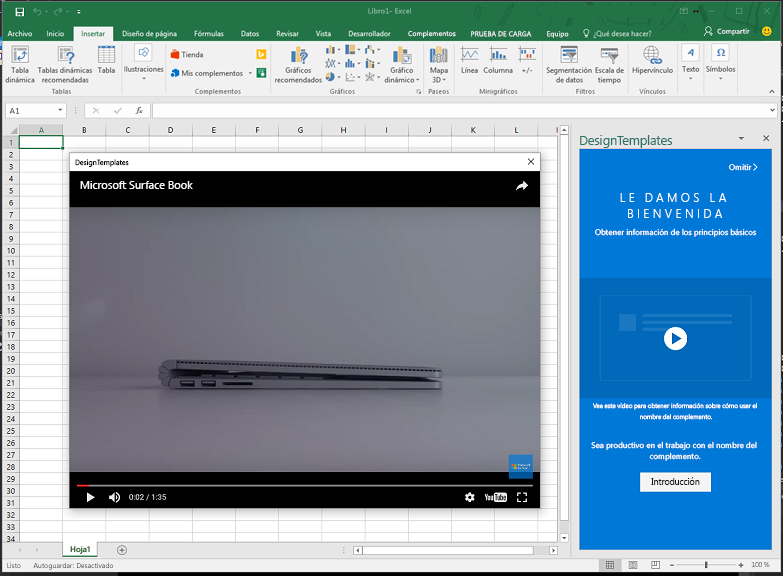

# <a name="use-the-dialog-api-in-your-office-add-ins"></a>Utilice la API de cuadros de diálogo en sus complementos de Office 

Puede utilizar la [API de cuadros de diálogo](../../reference/shared/officeui.md) para abrir cuadros de diálogo en el complemento de Office. En este artículo se proporciona ayuda para utilizar la API de cuadros de diálogo en su complemento de Office.

> **Nota:** Para obtener información sobre dónde se admite actualmente la API de cuadros de diálogo, consulte los [Conjuntos de requisitos de la API de cuadros de diálogo](../../reference/requirement-sets/dialog-api-requirement-sets.md). La API de cuadros de diálogo actualmente es compatible con Word, Excel, PowerPoint y Outlook.

Es posible que desee abrir un cuadro de diálogo desde un panel de tareas, un complemento de contenido o un [comando de complementos](https://dev.office.com/docs/add-ins/design/add-in-commands) para: 

- Mostrar páginas de inicio de sesión que no se pueden abrir directamente en un panel de tareas.
- Proporcionar más espacio en pantalla, o incluso una pantalla completa, para algunas tareas en su complemento.
- Hospedar un vídeo que sería demasiado pequeño si se limitara a un panel de tareas.

>**Nota:** Debido a que una interfaz de usuario superpuesta puede molestar a los usuarios, evite abrir un diálogo desde un panel de tareas, a menos que el escenario lo requiera. Si se plantea cómo usar el área de superficie de un panel de tareas, tenga en cuenta que los paneles de tareas pueden organizarse por pestañas. Para ver un ejemplo, consulte el ejemplo de complemento [JavaScriptSalesTracker](https://github.com/OfficeDev/Excel-Add-in-JavaScript-SalesTracker).

La siguiente imagen muestra un ejemplo de un cuadro de diálogo. 



Tenga en cuenta que el cuadro de diálogo siempre se abre en el centro de la pantalla. El usuario puede moverlo y cambiar su tamaño. La ventana es *nonmodal*: un usuario puede continuar interactuando con el documento en la aplicación host de Office y con la página host en el panel de tareas, si es que existe.

## <a name="dialog-api-scenarios"></a>Escenarios de la API de cuadros de diálogo

Las API de JavaScript para Office admiten los siguientes escenarios con un objeto [Dialog](../../reference/shared/officeui.dialog.md) y dos funciones en el [espacio de nombres Office.context.ui](../../reference/shared/officeui.md). 

### <a name="opening-a-dialog-box"></a>Abrir un cuadro de diálogo

Para abrir un cuadro de diálogo, el código en el panel de tareas llama al método [displayDialogAsync](../../reference/shared/officeui.displaydialogasync.md) y le pasa la URL del recurso que debe abrir. Suele ser una página, pero puede ser un método de controlador en una aplicación MVC, una ruta, un método de servicio web o cualquier otro tipo de recurso. En este artículo, "página" y "página web" hacen referencia al recurso del cuadro de diálogo. A continuación puede ver un ejemplo simple:

```js
Office.context.ui.displayDialogAsync('https://myAddinDomain/myDialog.html'); 
```

> **Notas**:

> - La URL utiliza el protocolo HTTP**S**. Esto es obligatorio para todas las páginas cargadas en un cuadro de diálogo, no solo para la primera página.
> - El dominio es el mismo que el dominio de la página host, que puede ser la página en un panel de tareas o el [archivo de función](https://dev.office.com/reference/add-ins/manifest/functionfile) de un comando de complementos. Obligatorio: la página, el método de controlador y cualquier otro recurso que se pase al método `displayDialogAsync` deben estar en el mismo dominio que la página host. 

Después de cargar la primera página u otro recurso, los usuarios podrán acceder a cualquier sitio web u otro recurso que use HTTPS. También puede diseñar la primera página para redirigirla inmediatamente a otro sitio. 

De manera predeterminada, el cuadro de diálogo ocupará el 80 % de alto y ancho de la pantalla del dispositivo, pero puede establecer porcentajes diferentes pasando un objeto de configuración al método, como se muestra en el ejemplo siguiente.

```js
Office.context.ui.displayDialogAsync('https://myDomain/myDialog.html', {height: 30, width: 20}); 
```

Para obtener un complemento de ejemplo que haga esto, vea el [ejemplo de la API de cuadros de diálogo del complemento de Office](https://github.com/OfficeDev/Office-Add-in-Dialog-API-Simple-Example).

Establezca ambos valores al 100 % para obtener lo que es una experiencia de pantalla completa. (El valor máximo efectivo es 99,5 % y la ventana sigue siendo movible y redimensionable).

>**Nota:** Solo se puede abrir un cuadro de diálogo desde una ventana host. Al intentar abrir otro cuadro de diálogo se genera un error. (Consulte [Errores de displayDialogAsync](#errors-from-displaydialogAsync) para obtener más información). Por ejemplo, si un usuario abre un cuadro de diálogo desde un panel de tareas, no podrá abrir un segundo cuadro de diálogo desde una página diferente en el panel de tareas. Sin embargo, cuando se abre un cuadro de diálogo desde un [comando de complementos](https://dev.office.com/docs/add-ins/design/add-in-commands), el comando abre un nuevo archivo HTML (aunque no se vea) cada vez que se selecciona. Esto crea una nueva ventana host (que no se ve), por lo que cada ventana puede iniciar su propio cuadro de diálogo. 

### <a name="take-advantage-of-a-performance-option-in-office-online"></a>Aprovechar las ventajas de una opción de rendimiento en Office Online

La propiedad `displayInIframe` es una propiedad adicional en el objeto de configuración que se puede pasar a `displayDialogAsync`. Cuando esta propiedad se establece en `true` y el complemento se ejecuta en un documento abierto en Office Online, el cuadro de diálogo se abrirá como un objeto iframe flotante en lugar de como una ventana independiente, lo que permitirá que lo haga más rápido. A continuación puede ver un ejemplo.

```js
Office.context.ui.displayDialogAsync('https://myDomain/myDialog.html', {height: 30, width: 20, displayInIframe; true}); 
```

El valor predeterminado es `false`, que equivale a omitir la propiedad por completo.

Si no se está ejecutando el complemento en Office Online, `displayInIframe` se omite, aunque su presencia no tienen ningún efecto negativo.

> **Nota:** Debería ***no*** usar `displayInIframe: true` si el cuadro de diálogo redirigirá a una página que no se puede abrir en un iframe. Por ejemplo, las páginas de inicio de muchos servicios web conocidos, como los servicios de cuentas de Google y Microsoft, no se pueden abrir en un iframe. 

### <a name="sending-information-from-the-dialog-box-to-the-host-page"></a>Enviar información desde el cuadro de diálogo a la página host

El cuadro de diálogo no puede comunicarse con la página host en el panel de tareas, a menos que:

- La página actual en el cuadro de diálogo esté en el mismo dominio que la página host.
- La biblioteca JavaScript de Office se haya cargado en la página. (Igual que con cualquier página que utilice la biblioteca JavaScript de Office, la secuencia de comandos de la página debe asignar un método a la propiedad `Office.initialize`, aunque puede ser un método vacío. Para obtener más información, consulte [Inicializar el complemento](http://dev.office.com/docs/add-ins/develop/understanding-the-javascript-api-for-office#initializing-your-add-in)). 

El código de la página de diálogo utiliza la función `messageParent` para enviar un valor booleano o un mensaje de cadena a la página host. La cadena puede ser una palabra, una oración, un blob XML, un JSON convertido en cadenas o cualquier otra cosa que se pueda serializar en una cadena. A continuación puede ver un ejemplo.

```js
if (loginSuccess) {
    Office.context.ui.messageParent(true); 
}
```

>**Notas**: 

> - La función `messageParent` es una de *solo* dos API de Office que se puede llamar en el cuadro de diálogo. (La otra es `Office.context.requirements.isSetSupported`. Para obtener información al respecto, consulte [Specify Office hosts and API requirements](https://github.com/OfficeDev/office-js-docs/blob/master/docs/overview/specify-office-hosts-and-api-requirements.md) [Especificar hosts de Office y requisitos de la API]).
> - La función `messageParent` solo se puede llamar en una página con el mismo dominio (incluido el protocolo y el puerto) que la página host.

En el siguiente ejemplo, `googleProfile` es una versión convertida en cadenas del perfil de Google del usuario.

```js
if (loginSuccess) {
    Office.context.ui.messageParent(googleProfile); 
}
```

La página host se debe configurar para recibir el mensaje. Para ello, agregue un parámetro de devolución de llamada a la llamada original de `displayDialogAsync`. La devolución de llamada asigna un controlador al evento `DialogMessageReceived`. A continuación puede ver un ejemplo. Tenga en cuenta lo siguiente acerca de este código:

- Office pasa un objeto [AsyncResult](https://dev.office.com/reference/add-ins/shared/asyncresult) a la devolución de llamada. Representa el resultado del intento de abrir el cuadro de diálogo. No representa el resultado de ningún evento en el cuadro de diálogo. Para obtener más información sobre esta distinción, consulte la sección [Tratamiento de errores y eventos](#handling-errors-and-events). 
- La propiedad `value` de `asyncResult` se establece en un objeto [Dialog](https://dev.office.com/reference/add-ins/shared/officeui.dialog), que existe en la página host, no en el contexto de ejecución del cuadro de diálogo.
- `processMessage` es la función que controla el evento. Puede ponerle el nombre que desee. 
- La variable `dialog` se declara en un ámbito más amplio que la devolución de llamada porque también se le hace referencia en `processMessage`.

```js
var dialog;
Office.context.ui.displayDialogAsync('https://myDomain/myDialog.html', {height: 30, width: 20},
    function (asyncResult) {
        dialog = asyncResult.value;
        dialog.addEventHandler(Office.EventType.DialogMessageReceived, processMessage);
    }
); 
```

A continuación se muestra un ejemplo sencillo de un controlador para el evento `DialogMessageReceived`. Tenga en cuenta lo siguiente acerca de este código:

- Office pasa el objeto `arg` al controlador. Su propiedad `message` es el valor booleano o la cadena enviada por la llamada de `messageParent` en el diálogo. En este ejemplo, hay una representación convertida en cadena del perfil de un usuario de un servicio como Microsoft Account o Google, por lo que se deserializa de nuevo en un objeto con `JSON.parse`.
- No se muestra la implementación `showUserName`. Puede mostrar un mensaje de bienvenida personalizado en el panel de tareas.

```js
function processMessage(arg) {
    var messageFromDialog = JSON.parse(arg.message);
    showUserName(messageFromDialog.name);
}
```

Cuando se completa la interacción del usuario con el cuadro de diálogo, el controlador de mensajes debe cerrar el cuadro de diálogo, como se muestra en este ejemplo. Tenga en cuenta lo siguiente acerca de este código:

- El objeto `dialog` debe ser el mismo que el devuelto por la llamada de `displayDialogAsync`. 
- La llamada de `dialog.close` indica a Office que cierre inmediatamente el cuadro de diálogo.

```js
function processMessage(arg) {
    dialog.close();
    // message processing code goes here;
}
```

Para obtener un complemento de ejemplo que utilice estas técnicas, vea el [ejemplo de la API de cuadros de diálogo del complemento de Office](https://github.com/OfficeDev/Office-Add-in-Dialog-API-Simple-Example).

Si el complemento tiene que abrir una página diferente del panel de tareas después de recibir el mensaje, puede utilizar el método `window.location.replace` (o `window.location.href`) como la última línea del controlador. A continuación puede ver un ejemplo.

```js
function processMessage(arg) {
    // message processing code goes here;
    window.location.replace("/newPage.html");
    // Alternatively ...
    // window.location.href = "/newPage.html";
}
```

Para ver un complemento que haga esto, vea el ejemplo de [Insertar gráficos de Excel con Microsoft Graph en un complemento de PowerPoint](https://github.com/OfficeDev/PowerPoint-Add-in-Microsoft-Graph-ASPNET-InsertChart). 

#### <a name="conditional-messaging"></a>Mensajería condicional

Debido a que puede enviar varias llamadas `messageParent` desde el cuadro de diálogo, pero solo tiene un controlador en la página host para el evento `DialogMessageReceived`, el controlador debe utilizar la lógica condicional para distinguir diferentes mensajes. Por ejemplo, si el cuadro de diálogo le pide a un usuario que inicie sesión en un proveedor de identidades como Microsoft Account o Google, le envía el perfil del usuario como mensaje. Si falla la autenticación, el cuadro de diálogo enviará la información del error a la página host, como en el ejemplo siguiente. Tenga en cuenta lo siguiente acerca de este código:

- La variable `loginSuccess` se inicializará al leer la respuesta HTTP del proveedor de identidades.
- No se muestra la implementación de las funciones `getProfile` y `getError`. Cada uno obtiene datos de un parámetro de consulta o del cuerpo de la respuesta HTTP.
- Se envían objetos anónimos de diferentes tipos dependiendo de si el inicio de sesión ha sido correcto o no. Ambos tienen una propiedad `messageType`, pero uno tiene una propiedad `profile` y el otro tiene una propiedad `error`.

```js
if (loginSuccess) {
    var userProfile = getProfile();
    var messageObject = {messageType: "signinSuccess", profile: userProfile};            
    var jsonMessage = JSON.stringify(messageObject);
    Office.context.ui.messageParent(jsonMessage); 
} else {
    var errorDetails = getError();
    var messageObject = {messageType: "signinFailure", error: errorDetails};            
    var jsonMessage = JSON.stringify(messageObject);
    Office.context.ui.messageParent(jsonMessage); 
}
```

Para obtener ejemplos que usan mensajería condicional, consulte 

- [Complemento de Office que usa el servicio de Auth0 para simplificar el inicio de sesión social](https://github.com/OfficeDev/Office-Add-in-Auth0)
- [Complemento de Office que usa el servicio OAuth.io para simplificar el acceso a servicios en línea populares](https://github.com/OfficeDev/Office-Add-in-OAuth.io)

El código del controlador en la página host utiliza el valor de la propiedad `messageType` para crear una rama como en el ejemplo siguiente. Tenga en cuenta que la función `showUserName` es la misma que en el ejemplo anterior y que la función `showNotification` muestra el error en la interfaz de usuario de la página host. 

```js
function processMessage(arg) {
    var messageFromDialog = JSON.parse(arg.message);
    if (messageFromDialog.messageType === "signinSuccess") {
        dialog.close();
        showUserName(messageFromDialog.profile.name);
        window.location.replace("/newPage.html");
    } else {
        dialog.close();
        showNotification("Unable to authenticate user: " + messageFromDialog.error);
    }
}
```

### <a name="closing-the-dialog-box"></a>Cerrar el cuadro de diálogo

Puede implementar un botón en el cuadro de diálogo para cerrarlo. Para ello, el controlador de eventos de clic del botón debe utilizar `messageParent` para indicar a la página host que se ha hecho clic en el botón. A continuación puede ver un ejemplo.

```js
function closeButtonClick() {
    var messageObject = {messageType: "dialogClosed"};            
    var jsonMessage = JSON.stringify(messageObject);
    Office.context.ui.messageParent(jsonMessage); 
}
``` 

El controlador de la página host para `DialogMessageReceived` llamaría a `dialog.close`, como en este ejemplo. (Consulte ejemplos anteriores en este artículo que muestran cómo se inicializa el objeto de diálogo).


```js
function processMessage(arg) {
    var messageFromDialog = JSON.parse(arg.message);
    if (messageFromDialog.messageType === "dialogClosed") {
       dialog.close();
    }
}
```

Para ver un ejemplo que utiliza esta técnica, vea el [modelo de diseño de navegación del diálogo](https://github.com/OfficeDev/Office-Add-in-UX-Design-Patterns-Code/tree/master/templates/dialog/navigation) en el repositorio de los [modelos de diseño UX para complementos de Office](https://github.com/OfficeDev/Office-Add-in-UX-Design-Patterns-Code).

Incluso si no tiene su propia interfaz de usuario de cierre de diálogo, el usuario final puede cerrar el cuadro de diálogo si elige la **X** en la esquina superior derecha. Esta acción activa el evento `DialogEventReceived`. Si el panel host necesita saber cuándo sucede esto, debe declarar un controlador para este evento. Consulte la sección de [Errores y eventos en la ventana de diálogo](#errors-and-events-in-the-dialog-window) para más información.

## <a name="handling-errors-and-events"></a>Tratamiento de errores y eventos 

Su código debe controlar dos categorías de eventos:

- Errores devueltos por la llamada de `displayDialogAsync` porque no se puede crear el cuadro de diálogo. 
- Errores y otros eventos, en la ventana de diálogo.

### <a name="errors-from-displaydialogasync"></a>Errores de displayDialogAsync

Además de los errores del sistema y de la plataforma en general, hay tres errores específicos al llamar a `displayDialogAsync`.

|Número de código|Significado|
|:-----|:-----|
|12004|El dominio de la dirección URL pasada a `displayDialogAsync` no es de confianza. El dominio debe estar en el mismo dominio que la página host (incluido el número de puerto y el protocolo).|
|12005|La dirección URL pasada a `displayDialogAsync` utiliza el protocolo HTTP. Se necesita HTTPS. (En algunas versiones de Office, el mensaje de error devuelto con 12005 es el mismo devuelto para 12004).|
|12007|Ya hay un cuadro de diálogo abierto en la ventana host. Una ventana host, como un panel de tareas, solo puede tener abierto un cuadro de diálogo al mismo tiempo.|

Cuando se llama a `displayDialogAsync`, siempre pasa un objeto [AsyncResult](https://dev.office.com/reference/add-ins/shared/asyncresult) a su función de devolución de llamada. Cuando la llamada se efectúa correctamente, es decir, cuando se abre la ventana de diálogo, la propiedad `value` del objeto `AsyncResult` es un objeto [Dialog](https://dev.office.com/reference/add-ins/shared/officeui.dialog). Hay un ejemplo de esto en la sección [Enviar información desde el diálogo a la página host](#sending-information-from-the-dialog-to-the-host-page). Cuando falla la llamada a `displayDialogAsync`, la ventana no se crea, la propiedad `status` del objeto `AsyncResult` se define en "error" y se rellena la propiedad `error` del objeto. Siempre debe tener una devolución de llamada que compruebe el `status` y que responda cuando se trata de un error. El siguiente es un ejemplo que simplemente informa del mensaje de error, sin importar su número de código. 

```js
var dialog;
Office.context.ui.displayDialogAsync('https://myDomain/myDialog.html', 
function (asyncResult) {
    if (asyncResult.status === "failed") { 
        showNotification(asynceResult.error.code = ": " + asyncResult.error.message); 
    } else {
        dialog = asyncResult.value;
        dialog.addEventHandler(Office.EventType.DialogMessageReceived, processMessage);
    }
}); 
```

### <a name="errors-and-events-in-the-dialog-window"></a>Errores y eventos en la ventana de diálogo

Tres errores y eventos, conocidos por sus números de código, en el cuadro de diálogo activarán un evento `DialogEventReceived` en la página host. 

|Número de código|Significado|
|:-----|:-----|
|12002|Uno de los siguientes:<br> - No existe ninguna página en la dirección URL pasada a `displayDialogAsync`.<br> - La página pasada a `displayDialogAsync` se ha cargado, pero el cuadro de diálogo se ha dirigido a una página que no se puede encontrar o cargar, o que se ha dirigido a una dirección URL con sintaxis no válida.|
|12003|El cuadro de diálogo se ha dirigido a una dirección URL con el protocolo HTTP. Se necesita HTTPS.|
|12006|Se ha cerrado el cuadro de diálogo, normalmente porque el usuario elige el botón **X**.|

Su código puede asignar un controlador para el evento `DialogEventReceived` en la llamada a `displayDialogAsync`. A continuación puede ver un ejemplo simple:

```js
var dialog;
Office.context.ui.displayDialogAsync('https://myDomain/myDialog.html', 
    function (result) {
        dialog = result.value;
        dialog.addEventHandler(Office.EventType.DialogEventReceived, processDialogEvent);
    }
); 
```

A continuación puede ver un ejemplo de un controlador para el evento `DialogEventReceived` que crea mensajes de error personalizados para cada código de error. 

```js
function processDialogEvent(arg) {
    switch (arg.error) {
        case 12002:
            showNotification("The dialog box has been directed to a page that it cannot find or load, or the URL syntax is invalid.");
            break;
        case 12003:
            showNotification("The dialog box has been directed to a URL with the HTTP protocol. HTTPS is required.");            break;
        case 12006:
            showNotification("Dialog closed.");
            break;
        default:
            showNotification("Unknown error in dialog box.");
            break;
    }
}
```

Para obtener un complemento que controle los errores de esta manera, vea el [ejemplo de la API de cuadros de diálogo del complemento de Office](https://github.com/OfficeDev/Office-Add-in-Dialog-API-Simple-Example).

 
## <a name="passing-information-to-the-dialog-box"></a>Pasar información al cuadro de diálogo

A veces la página host necesita pasar información al cuadro de diálogo. Hay dos formas principales de hacerlo:

- Agregar parámetros de consulta a la dirección URL pasada a `displayDialogAsync`. 
- Almacenar la información en un lugar que sea accesible para la ventana host y para el cuadro de diálogo. Las dos ventanas no comparten un almacenamiento de sesión común, pero *si tienen el mismo dominio* (incluyendo el número de puerto, si lo hay), comparten un [almacenamiento local](http://www.w3schools.com/html/html5_webstorage.asp) común.

### <a name="using-local-storage"></a>Utilizar el almacenamiento local

Para utilizar el almacenamiento local, el código llama al método `setItem` del objeto `window.localStorage` en la página host antes de la llamada `displayDialogAsync`, como en el ejemplo siguiente.

```js
localStorage.setItem("clientID", "15963ac5-314f-4d9b-b5a1-ccb2f1aea248");
```

El código en la ventana de diálogo lee el elemento cuando es necesario, como en el ejemplo siguiente.

```js
var clientID = localStorage.getItem("clientID");
// You can also use property syntax:
// var clientID = localStorage.clientID;
```

Para obtener ejemplos de complementos que usan el almacenamiento local de este modo, consulte 

- [Complemento de Office que usa el servicio de Auth0 para simplificar el inicio de sesión social](https://github.com/OfficeDev/Office-Add-in-Auth0)
- [Complemento de Office que usa el servicio OAuth.io para simplificar el acceso a servicios en línea populares](https://github.com/OfficeDev/Office-Add-in-OAuth.io)

### <a name="using-query-parameters"></a>Uso de los parámetros de consulta

El siguiente ejemplo muestra cómo pasar datos con un parámetro de consulta.

```js
Office.context.ui.displayDialogAsync('https://myAddinDomain/myDialog.html?clientID=15963ac5-314f-4d9b-b5a1-ccb2f1aea248'); 
```

Para ver un ejemplo que utiliza esta técnica, consulte [Insertar gráficos de Excel con Microsoft Graph en un complemento de PowerPoint](https://github.com/OfficeDev/PowerPoint-Add-in-Microsoft-Graph-ASPNET-InsertChart).

El código de la ventana de diálogo puede analizar la URL y leer el valor del parámetro.

 Office agrega automáticamente un parámetro de consulta llamado `_host_info` a la URL que se pasa a `displayDialogAsync`. (Se anexa después de los parámetros de consulta personalizados, si los hay. No se anexa a ninguna URL subsiguiente a la que se dirija el cuadro de diálogo). Microsoft puede cambiar el contenido de este valor o eliminarlo por completo, en el futuro, por lo que su código no debe leerlo. El mismo valor se agregará al almacenamiento de sesión del cuadro de diálogo. De nuevo, *su código no debe leer ni escribir en este valor*.

## <a name="using-the-dialog-apis-to-show-a-video"></a>Uso de las API de diálogo para mostrar un vídeo

Para mostrar un vídeo en un cuadro de diálogo:

1.  Cree una página cuyo único contenido sea un iframe. El atributo `src` del iframe apunta a un vídeo en línea. El protocolo de la URL del vídeo debe ser HTTP**S**. En este artículo llamaremos a esta página "video.dialogbox.html". A continuación verá un ejemplo de la revisión:

        <iframe class="ms-firstrun-video__player"  width="640" height="360" 
            src="https://www.youtube.com/embed/XVfOe5mFbAE?rel=0&autoplay=1" 
            frameborder="0" allowfullscreen>
        </iframe>

2.  La página de video.dialogbox.html debe estar en el mismo dominio que la página host.
3.  Use una llamada de `displayDialogAsync` en la página host para abrir video.dialogbox.html.
4.  Si el complemento necesita saber cuándo el usuario cierra el cuadro de diálogo, registre un controlador para el evento `DialogEventReceived` y gestione el evento 12006. Para más información, consulte la sección de [Errores y eventos en la ventana de diálogo](#errors-and-events-in-the-dialog-window).

Para ver un ejemplo que muestre un vídeo en un cuadro de diálogo, vea el [modelo de diseño de placemat de vídeo](https://github.com/OfficeDev/Office-Add-in-UX-Design-Patterns-Code/tree/master/templates/first-run/video-placemat) en el repositorio de los [ Modelos de diseño de la experiencia de usuario para complementos de Office](https://github.com/OfficeDev/Office-Add-in-UX-Design-Patterns-Code).



## <a name="using-the-dialog-apis-in-an-authentication-flow"></a>Usar las API de cuadros de diálogo en un flujo de autenticación

Un escenario principal para las API de diálogo consiste en habilitar la autenticación con un proveedor de recursos o identidad que no permite que su página de inicio de sesión se abra en un iframe, como Microsoft Account, Office 365, Google y Facebook. 

>**Nota:** Al usar las API de cuadro de diálogo para este escenario, *no* use la opción `displayInIframe: true` en la llamada a `displayDialogAsync`. Para obtener más información sobre esta opción, consulte la información proporcionada anteriormente en este artículo. 

El siguiente es un flujo de autenticación simple y típico: 

1. La primera página que se abre en el cuadro de diálogo es una página local (u otro recurso) alojada en el dominio del complemento, es decir, en el dominio de la ventana host. Esta página puede tener una interfaz de usuario simple que diga "Espere, le estamos redirigiendo a la página donde puede iniciar sesión en *NOMBRE DEL PROVEEDOR*". El código de esta página construye la URL de la página de inicio de sesión del proveedor de identidad mediante la información que se pasa al cuadro de diálogo, tal como se describe en [Pasar información al cuadro de diálogo](#passing-information-to-the-dialog-box). 
2. A continuación, la ventana de diálogo redirige a la página de inicio de sesión. La URL incluye un parámetro de consulta que indica al proveedor de identidades que debe redirigir la ventana de diálogo después de que el usuario haya iniciado sesión en una página específica. En este artículo, llamaremos a esta página "redirectPage.html". (*Debe ser una página en el mismo dominio que la ventana host *, porque la única manera de que la ventana de diálogo pase los resultados del intento de inicio de sesión es con una llamada de `messageParent`, que solo se puede llamar desde una página con el mismo dominio que la ventana host). 
2. El servicio del proveedor de identidad procesa la solicitud GET entrante desde la ventana de diálogo. Si el usuario ya ha iniciado sesión, inmediatamente redirige la ventana a redirectPage.html e incluye datos del usuario como un parámetro de consulta. Si el usuario aún no ha iniciado sesión, la página de inicio de sesión del proveedor aparece en la ventana y el usuario puede iniciar sesión. Para la mayoría de proveedores, si el usuario no puede iniciar sesión correctamente, el proveedor muestra una página de error en la ventana de diálogo y no redirige a redirectPage.html. El usuario debe cerrar la ventana seleccionando **X** en la esquina. Si el usuario inicia sesión correctamente, la ventana de diálogo se redirige a redirectPage.html y los datos de usuario se incluyen como un parámetro de consulta.
3. Cuando se abre la página redirectPage.html, llama a `messageParent` para informar del acceso correcto o incorrecto a la página host y, de forma opcional, también informa de los datos del usuario o de error. 
4. El evento `DialogMessageReceived` se inicia en la página host y su controlador cierra la ventana de diálogo y, de forma opcional, realiza otro procesamiento del mensaje. 

Para ejemplos de complementos que usan esta trama, consulte:

- [Insertar gráficos de Excel con Microsoft Graph en un complemento de PowerPoint](https://github.com/OfficeDev/PowerPoint-Add-in-Microsoft-Graph-ASPNET-InsertChart): El recurso que se abre inicialmente en la ventana de diálogo es un método de controlador que no tienen visualización propia. Redirige a la página de inicio de sesión de Office 365.
- [Autenticación de cliente de Office 365 de complementos de Office para AngularJS](https://github.com/OfficeDev/Word-Add-in-AngularJS-Client-OAuth): El recurso que se abre inicialmente en la ventana de dialogo es una página. 

#### <a name="supporting-multiple-identity-providers"></a>Compatibilidad con múltiples proveedores de identidades

Si su complemento le permite al usuario elegir proveedores, como Microsoft Account, Google o Facebook, necesita una primera página local (consulte la sección anterior) que proporcione una interfaz de usuario para que el usuario pueda seleccionar un proveedor. La selección activa la construcción de la URL de inicio de sesión y la redirige. 

Para ver un ejemplo que utiliza esta trama, consulte el [Complemento de Office que usa el servicio de Auth0 para simplificar el inicio de sesión social](https://github.com/OfficeDev/Office-Add-in-Auth0).

#### <a name="authorization-of-the-add-in-to-an-external-resource"></a>Autorización del complemento a un recurso externo

En la web moderna, las aplicaciones web son entidades de seguridad, al igual que los usuarios. La aplicación tiene su propia identidad y permisos para recursos en línea como Office 365, Google Plus, Facebook o LinkedIn. La aplicación se registra con el proveedor de recursos antes de implementarla. El registro incluye: 

- Una lista de los permisos que la aplicación necesita para los recursos de un usuario.
- Una URL a la que el servicio de recursos debe devolver un token de acceso cuando la aplicación accede al servicio.  

Cuando un usuario invoca una función en la aplicación que accede a los datos del usuario en el servicio de recursos, se le pide que inicie sesión en el servicio y que conceda a la aplicación los permisos necesarios para los recursos del usuario. El servicio entonces redirige la ventana de inicio de sesión a la URL previamente registrada y pasa el token de acceso. La aplicación utiliza el token de acceso para acceder a los recursos del usuario. 

Puede usar las API de diálogo para gestionar este proceso utilizando un flujo similar al descrito para que los usuarios inicien sesión o utilizando la variación descrita en [Direccionamiento de una red lenta](#addressing-a-slow-network). Las únicas diferencias son:

- Si el usuario no ha concedido previamente a la aplicación los permisos que necesita, se le pedirá que lo haga en el cuadro de diálogo después de iniciar sesión. 
- La ventana de diálogo envía el token de acceso a la ventana host utilizando `messageParent` para enviar el token de acceso convertido en cadena o almacenando el token de acceso en un sitio donde la ventana host pueda recuperarlo. El token tiene un límite de tiempo, pero mientras dure, la ventana host puede usarlo para acceder directamente a los recursos del usuario sin necesidad de ninguna otra confirmación.

Los siguientes ejemplos utilizan las API de cuadros de diálogo para este propósito:

- [Insertar gráficos de Excel con Microsoft Graph en un complemento de PowerPoint](https://github.com/OfficeDev/PowerPoint-Add-in-Microsoft-Graph-ASPNET-InsertChart): Almacena el token de acceso en una base de datos.
- [Complemento de Office que usa el servicio OAuth.io para simplificar el acceso a servicios en línea populares](https://github.com/OfficeDev/Office-Add-in-OAuth.io)

#### <a name="more-information-about-authentication-and-authorization-in-add-ins"></a>Más información sobre la autenticación y autorización en los complementos

- [Autorizar servicios externos en el complemento de Office](https://dev.office.com/docs/add-ins/develop/auth-external-add-ins)
- [Biblioteca auxiliar de la API de JavaScript para Office](https://github.com/OfficeDev/office-js-helpers) 


## <a name="using-the-office-dialog-api-with-single-page-applications-and-client-side-routing"></a>Utilizar la API de diálogo de Office con aplicaciones de una sola página y enrutamiento del lado cliente

Si su complemento utiliza el enrutamiento del lado cliente, como suelen hacer las aplicaciones de una sola página, tiene la opción de pasar la URL de una ruta al método [displayDialogAsync](http://dev.office.com/reference/add-ins/shared/officeui.displaydialogasync), en lugar de la URL de una página HTML completa y separada. 

> **Importante:** El cuadro de diálogo está en una nueva ventana con su propio contexto de ejecución. Si pasa una ruta, la página base y su código de inicialización y arranque ejecutan otra vez este nuevo contexto y las variables se establecen en sus valores iniciales en la ventana de diálogo. Por lo que esta técnica inicia una segunda instancia de la aplicación en la ventana de diálogo. El código que cambia las variables en la ventana de diálogo no cambia la versión del panel de tareas de estas variables. De igual forma, la ventana de diálogo tiene su propio almacenamiento de sesión, que no es accesible desde el código en el panel de tareas. 

