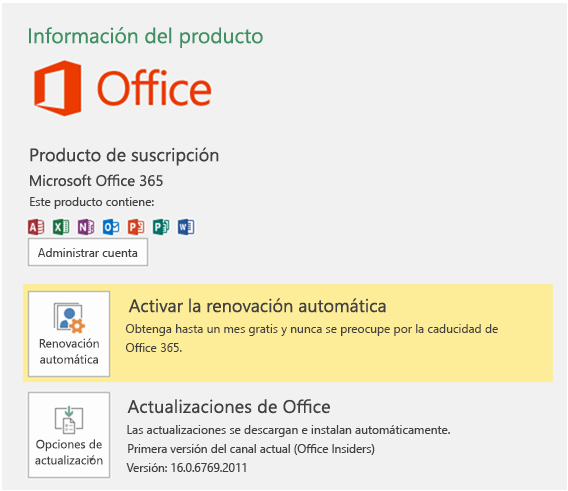

# Instalar la versión más reciente de Office 2016

Las nuevas características para desarrolladores, incluso algunas que aún están en versión preliminar, se entregan primero a los suscriptores que optan por recibir las versiones más recientes de Office. Para suscribirse a las versiones más recientes de Office 2016: 

- Si está suscrito a Office 365 Hogar, Personal o Universitarios, vea [Participe en Office Insider](https://products.office.com/en-us/office-insider).
- Si es un cliente de Office 365 para empresas, consulte [Instalar la compilación First Release para clientes de Office 365 para empresas](https://support.office.com/en-us/article/Install-the-First-Release-build-for-Office-365-for-business-customers-4dd8ba40-73c0-4468-b778-c7b744d03ead?ui=en-US&rs=en-US&ad=US).
- Si está ejecutando Office 2016 en un Mac:
    - ejecute un programa de Office 2016 para Mac.
    - Seleccione **Buscar actualizaciones** en el menú Ayuda.
    - En el cuadro Microsoft AutoUpdate, active la casilla para unirse al programa de especialista en Office. 

Para obtener la versión más reciente: 

1. Descargue la [Herramienta de implementación de Office 2016](https://www.microsoft.com/en-us/download/details.aspx?id=49117). 
2. Ejecute la herramienta. Esto extrae los siguientes dos archivos: Setup.exe y configuration.xml.
3. Reemplace el archivo configuration.xml con el [Archivo de configuración de First Release](https://raw.githubusercontent.com/OfficeDev/Office-Add-in-Commands-Samples/master/Tools/FirstReleaseConfig/configuration.xml).
4. Ejecute el comando siguiente como administrador: `setup.exe /configure configuration.xml` 

>**Nota:** Es posible que el comando tarde bastante tiempo en ejecutarse sin que se muestre ninguna indicación de progreso.

Cuando se complete el proceso de instalación, tendrá instalada las aplicaciones más recientes de Office 2016. Para comprobar que tiene instalada la versión más reciente, vaya a **Archivo**  >  **Cuenta** desde cualquier aplicación de Office. En Actualizaciones de Office, verá la etiqueta (Office Insiders) encima del número de versión.

