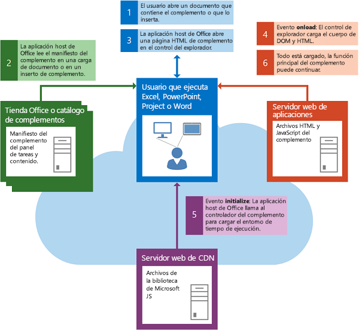

# <a name="loading-the-dom-and-runtime-environment"></a>Cargar el DOM y el entorno de tiempo de ejecución


Un complemento debe asegurarse de que el DOM y el entorno en tiempo de ejecución de las Complementos de Office están cargados antes de ejecutar su propia lógica personalizada. 

## <a name="startup-of-a-content-or-task-pane-add-in"></a>Inicio de un complemento de panel de tareas o de contenido

En la ilustración siguiente se muestra el flujo de eventos relacionados con el inicio de un complemento de panel de tareas o de contenido en Excel, PowerPoint, Project, Word o Access.



Los eventos siguientes se producen cuando se inicia un complemento de panel de tareas o de contenido: 


1. El usuario abre un documento que ya contiene un complemento o inserta un complemento en el documento.
    
2. La aplicación host de Office lee el manifiesto XML del complemento en la tienda de Office, en el catálogo de complementos en SharePoint o en el catálogo de la carpeta compartida donde se origina.
    
3. La aplicación host de Office abre la página HTML del complemento en un control del explorador.
    
    Los próximos dos pasos (pasos 4 y 5) se llevan a cabo de manera asincrónica y simultánea. Por este motivo, el código del complemento debe asegurarse de que tanto el DOM como el entorno del tiempo de ejecución del complemento hayan terminado de cargarse antes de continuar.
    
4. El control del explorador carga el DOM y el cuerpo HTML, y llama al controlador de eventos para el evento  **window.onload**.
    
5. La aplicación host de Office carga el entorno de tiempo de ejecución, que descarga y almacena en la memoria caché la API de JavaScript para los archivos de la biblioteca de JavaScript del servidor de la red de entrega de contenido (CDN) y, después, llama al controlador de eventos del complemento para el evento de [inicialización](../../reference/shared/office.initialize.md) del objeto de [Office](../../reference/shared/office.md).
    
6. Cuando finaliza la carga del DOM y el cuerpo HTML, y el complemento termina de inicializarse, la función principal del complemento puede continuar.
    

## <a name="startup-of-an-outlook-add-in"></a>Inicio de un complemento de Outlook


En la ilustración siguiente se muestra el flujo de eventos relacionados con el inicio de un complemento de Outlook que se ejecuta en el escritorio, en una tableta o en un smartphone.


Los eventos siguientes se producen cuando se inicia un complemento de Outlook: 


1. Cuando se inicia, Outlook lee los manifiestos XML de los complementos de Outlook que se instalaron para la cuenta de correo del usuario.
    
2. El usuario selecciona un elemento en Outlook.
    
3. Si el elemento seleccionado cumple las condiciones de activación de un complemento de Outlook, Outlook activa el complemento y muestra el botón en la interfaz de usuario.
    
4. Si el usuario hace clic en el botón para iniciar el complemento de Outlook, Outlook abre la página HTML en un control del explorador. Los próximos dos pasos (pasos 5 y 6) se llevan a cabo simultáneamente.
    
5. El control del explorador carga el DOM y el cuerpo HTML, y llama al controlador del evento  **onload**.
    
6. Outlook llama al controlador de eventos para el evento [initialize](../../reference/shared/office.initialize.md) del objeto [Office](../../reference/shared/office.md) del complemento.
    
7. Cuando el DOM y el cuerpo HTML terminan de cargarse y el complemento termina de inicializarse, la función principal del complemento puede continuar.
    

## <a name="checking-the-load-status"></a>Comprobación del estado de carga


Una manera de comprobar que tanto el DOM como el entorno de tiempo de ejecución de los terminaron de cargarse es usar la función jQuery [.ready()](http://api.jquery.com/ready/):  `$(document).ready()`. Por ejemplo, la siguiente función del controlador de eventos  **initialize** comprueba que el DOM se cargue antes de que se ejecute el código específico para inicializar el complemento. Luego el controlador de eventos **initialize** usa la propiedad [mailbox.item](../../reference/outlook/Office.context.mailbox.item.md) para obtener el elemento que está seleccionado en Outlook y llama a la función principal del complemento, `initDialer`.


```js
Office.initialize = function () {
    // Checks for the DOM to load.
    $(document).ready(function () {
        // After the DOM is loaded, add-in-specific code can run.
        var mailbox = Office.context.mailbox;
        _Item = mailbox.item;
        initDialer();
    });
}
```

Esta misma técnica se puede usar en el controlador  **initialize** de cualquier Complemento de Office.

El complemento de Outlook de ejemplo de marcador de teléfono muestra un enfoque ligeramente distinto que usa solo JavaScript para comprobar que se cumplen estas mismas condiciones. 

 **Importante:** Incluso si el complemento no tiene tareas de inicialización que realizar, es necesario incluir al menos una función de controlador de eventos **Office.initialize** mínima, como se muestra en el ejemplo siguiente.


```js
Office.initialize = function () {
};
```

Si no incluye un controlador de eventos  **Office.initialize**, el complemento puede generar un error cuando se inicia. Además, si un usuario intenta usar su complemento con un cliente web de Office Online, como Excel Online, PowerPoint Online o Outlook Web App, no se podrá ejecutar.

Si su complemento incluye más de una página, cada vez que carga una nueva página, esta debe incluir o llamar a un controlador de eventos  **Office.initialize**.


## <a name="additional-resources"></a>Recursos adicionales


- [Información sobre la API de JavaScript para Office](../../docs/develop/understanding-the-javascript-api-for-office.md)
    
