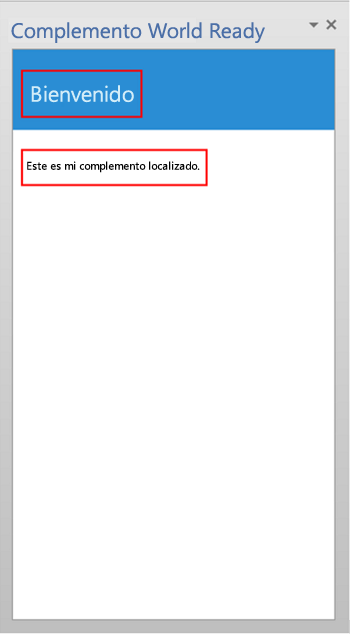
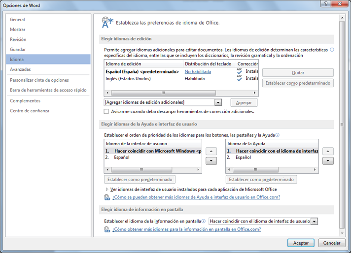

# Localización de complementos para Office

Puede implementar cualquier esquema de localización que le resulte adecuado para su Complemento de Office. La API de JavaScript y el esquema de manifiesto de la plataforma Complementos de Office ofrecen algunas opciones. Puede usar la API de JavaScript para Office para determinar la configuración regional y mostrar cadenas en función de la configuración regional de la aplicación host, o interpretar o mostrar datos en función de la configuración regional de los datos. También puede usar el manifiesto para especificar información descriptiva y la ubicación del archivo de la aplicación específica de la configuración regional. Asimismo, puede usar la secuencia de comandos de Microsoft Ajax para la localización y la globalización.

## Uso de la API de JavaScript para determinar cadenas específicas de configuración regional

La API de JavaScript para Office ofrece dos propiedades que permiten la visualización y la interpretación de valores según la configuración regional de la aplicación host y de los datos, respectivamente:


- [Context.displayLanguage][displayLanguage] especifica la configuración regional (o el idioma) de la interfaz de usuario de la aplicación host. En el ejemplo siguiente se comprueba si la aplicación host usa la configuración regional en-US o fr-Fr y muestra un saludo específico de la configuración regional.

    
```js
      function sayHelloWithDisplayLanguage() {
        var myLanguage = Office.context.displayLanguage;
        switch (myLanguage) {
            case 'en-US':
                write('Hello!');
                break;
            case 'fr-FR':
                write('Bonjour!');
                break;
        }
    }
    // Function that writes to a div with id='message' on the page.
        function write(message){
        document.getElementById('message').innerText += message; 
     }

```

- [Context.contentLanguage][contentLanguage] especifica la configuración regional (o idioma) de los datos. Al ampliar el último ejemplo de código, en lugar de comprobar la propiedad [displayLanguage], asigne `myLanguage` a la propiedad [contentLanguage] y use el resto del mismo código para mostrar un saludo según la configuración regional de los datos:
    
```js
      var myLanguage = Office.context.contentLanguage;
```


## Localización del control desde el manifiesto


Cada complemento de Office especifica un elemento [DefaultLocale] y una configuración regional en su manifiesto. De forma predeterminada, el complemento de Office de la plataforma y las aplicaciones host de Office aplican los valores de los elementos[Description], [DisplayName], [IconUrl], [HighResolutionIconUrl] y [SourceLocation] a todas las configuraciones regionales. Puede admitir de forma opcional valores específicos en determinadas configuraciones regionales, especificando un elemento secundario [Override] para cada configuración regional adicional, para cualquiera de estos cinco elementos. El valor para el elemento [DefaultLocale] y para el atributo `Locale` del elemento [Override] se ha especificado de acuerdo con [RFC 3066], "Etiquetas para la identificación de idiomas". La tabla 1 describe el soporte de localización para estos elementos.

**Tabla 1. Soporte de localización**


|**Elemento**|**Soporte de localización**|
|:-----|:-----|
|[Descripción]   |Los usuarios de las configuraciones regionales que especifique pueden ver una descripción localizada del complemento en la Tienda Office (o en un catálogo privado).<br/>Para los complementos de Outlook, los usuarios pueden ver la descripción en el Centro de administración de Exchange (EAC) después de la instalación.|
|[DisplayName]   |Los usuarios de las configuraciones regionales que especifique pueden ver una descripción localizada del complemento en la Tienda Office (o en un catálogo privado).<br/>Para los complementos de Outlook, los usuarios pueden ver el nombre para mostrar como una etiqueta del botón de aplicación de Outlook y en el EAC después de la instalación.<br/>En el caso de los complementos de contenido y de panel de tareas, los usuarios podrán ver el icono en la cinta de opciones tras instalar el complemento.|
|[IconUrl]        |Puede usar la misma técnica de reemplazo para especificar una imagen concreta para una referencia cultural específica. Si usa y localiza el icono, los usuarios de cada configuración regional que especifique podrán ver una imagen de icono localizada del complemento.<br/>En el caso de los complemento de Outlook, los usuarios podrán ver el icono en el EAC después de instalar el complemento.<br/>Para los complemento de contenido y de panel de tareas, los usuarios pueden ver el nombre para mostrar en la cinta de opciones después de instalar la aplicación.|
|[HighResolutionIconUrl] <br/><br/>**Importante** Este elemento solo está disponible al usar el manifiesto del complemento versión 1.1.|La imagen de icono de alta resolución es opcional, pero, si se especifica, tiene que aparecer después del elemento [IconUrl]. Si especifica [HighResolutionIconUrl] y el complemento está instalado en un dispositivo compatible con una resolución con valores altos de ppp, se usará el valor [HighResolutionIconUrl] en lugar de [IconUrl].<br/>El icono de la imagen es opcional. Puede usar la misma técnica de omisión para especificar una imagen determinada para una referencia cultural específica. Si usa y localiza un icono, los usuarios de las configuraciones regionales que especifique pueden ver una imagen de icono localizada para el complemento.<br/>En el caso de los complemento de Outlook, los usuarios podrán ver el icono en el EAC después de instalar el complemento.<br/>Para los complemento de contenido y de panel de tareas, los usuarios pueden ver el nombre para mostrar en la cinta de opciones después de instalar la aplicación.|
|[SourceLocation]   |Los usuarios de las configuraciones regionales que especifique pueden ver una página web que usted diseñe específicamente para el complemento para la configuración regional en cuestión. |

 > 
  **Nota:** Solo se puede localizar la descripción y el nombre para mostrar de las configuraciones locales compatibles con Office. Consulte [Identificadores de idioma y valores de identificador OptionState en Office 2013](http://technet.microsoft.com/en-us/library/cc179219.aspx) para obtener una lista de idiomas y configuraciones regionales para la versión actual de Office.


### Ejemplos

Por ejemplo, una Complemento de Office puede especificar la  [DefaultLocale] como `en-us`. Para el elemento  [DisplayName], el complemento puede especificar un elemento secundario  [Override] para la configuración regional `fr-fr`, como se muestra más abajo. 


```xml
<DefaultLocale>en-us</DefaultLocale>
...
<DisplayName DefaultValue="Video player">
    <Override Locale="fr-fr" Value="Lecteur vidéo" />
</DisplayName>
```

Esto quiere decir que el complemento supone que la configuración regional es `en-us` de forma predeterminada. Los usuarios verán el nombre para mostrar en inglés ("Video player") para todas las configuraciones regionales, excepto si la configuración regional del equipo cliente es `fr-fr`, en cuyo caso los usuarios verán el nombre para mostrar en francés ("Lecteur vidéo").

> **Nota:** Solo puede especificar un único reemplazo por idioma, incluidos los de la configuración regional predeterminada. Por ejemplo, si la configuración regional predeterminada es `en-us` no puede especificar un reemplazo para `en-us` también. 

En el siguiente ejemplo se aplica un reemplazo de configuración regional para el elemento  [Description]. Primero se especifica una configuración regional  `en-us` y una descripción en inglés, y se especifica, a continuación, una instrucción [Override] con una descripción en francés para la configuración regional `fr-fr`:

```xml
<DefaultLocale>en-us</DefaultLocale>
...
<Description DefaultValue=
   "Watch YouTube videos referenced in the emails you receive 
   without leaving your email client.">
   <Override Locale="fr-fr" Value=
   "Visualisez les vidéos YouTube référencées dans vos courriers 
   électronique directement depuis Outlook et Outlook Web App."/>
</Description>
```

Esto quiere decir que el complemento supone la configuración regional `en-us` de forma predeterminada. Los usuarios verían la descripción en inglés del atributo `DefaultValue` para todas las configuraciones regionales, a menos que la configuración regional del equipo cliente sea `fr-fr`, en cuyo caso verían la descripción en francés.

En el siguiente ejemplo el complemento especifica una imagen más adecuada a la configuración regional y la referencia cultural  `fr-fr`. Los usuarios ven la imagen DefaultLogo.png de manera predeterminada, salvo cuando la configuración regional del equipo cliente sea  `fr-fr`. En ese caso, los usuarios verían la imagen FrenchLogo.png. 


```xml
<!-- Replace "domain" with a real web server name and path. -->
<IconUrl DefaultValue="https://<domain>/DefaultLogo.png"/>
    <Override Locale="fr-fr" Value="https://<domain>/FrenchLogo.png"/>
```

Para el elemento  [SourceLocation], el uso de configuraciones adicionales implica proporcionar un archivo HTML diferente de origen para cada una de las configuraciones especificadas. Los usuarios de las configuraciones regionales que se especifiquen pueden ver una página web personalizada diseñada para ellos.

Para los complementos de Outlook, el elemento  [SourceLocation] también permite alinear el factor de forma. Esto permite proporcionar un archivo HTML de origen localizado diferente para el factor de forma correspondiente. Puede especificar uno o más elementos secundarios [Override] en cada elemento de configuración aplicable ([DesktopSettings], [TabletSettings] o [PhoneSettings]). En el ejemplo siguiente se muestran elementos de configuración para los factores de forma de escritorio, de tableta o smartphone, cada uno con un archivo HTML para la configuración regional predeterminada y otro para la configuración regional en francés.


```xml
<DesktopSettings>
   <SourceLocation DefaultValue="https://contoso.com/Desktop.html">
      <Override Locale="fr-fr" Value="https://contoso.com/fr/Desktop.html" />
   </SourceLocation>
   <RequestedHeight>250</RequestedHeight>
</DesktopSettings>
<TabletSettings>
   <SourceLocation DefaultValue="https://contoso.com/Tablet.html">
      <Override Locale="fr-fr" Value="https://contoso.com/fr/Tablet.html" />
   </SourceLocation>
   <RequestedHeight>200</RequestedHeight>
</TabletSettings>
<PhoneSettings>
   <SourceLocation DefaultValue="https://contoso.com/Mobile.html">
      <Override Locale="fr-fr" Value="https://contoso.com/fr/Mobile.html" />
   </SourceLocation>

</PhoneSettings>

```


## Ajuste de formato de fecha y hora con la configuración regional del cliente


Puede obtener la configuración regional de la interfaz de usuario de la aplicación host mediante la propiedad [displayLanguage]. Después, puede mostrar valores de fecha y hora en un formato coherente con la configuración regional actual de la aplicación host. Una forma de hacerlo es preparar un archivo de recursos que especifica el formato de presentación de fecha y hora que quiere usar para cada configuración regional que el complemento de Office admite. En tiempo de ejecución, el complemento puede usar el archivo de recursos y hacer coincidir el formato de fecha y hora apropiado con la configuración regional procedente de la propiedad [displayLanguage].

Puede obtener la configuración regional de la fecha de la aplicación host mediante la propiedad [contentLanguage]. Basándose en este valor, puede entonces interpretar correctamente o mostrar cadenas de fecha y hora. Por ejemplo, la configuración regional `jp-JP` expresa los valores de fecha y hora como `yyyy/MM/dd` y la configuración regional `fr-FR`, `dd/MM/yyyy`.


## Uso de Ajax para localización y globalización


Si usa Visual Studio para crear Complementos de Office, .NET Framework y Ajax ofrecen varias formas de localizar y globalizar los archivos de secuencias de comando cliente.

De este modo, puede globalizar y usar las extensiones de tipo JavaScript [Date](http://msdn.microsoft.com/library/caf98d32-2de2-4704-8198-692350343681.aspx) y [Number](http://msdn.microsoft.com/library/c216d3a1-12ae-47d1-bca1-c3666d04572f.aspx), así como el objeto de JavaScript [Date](http://msdn.microsoft.com/library/ce2202bb-7ec9-4f5a-bf48-3a04feff283e.aspx) en el código JavaScript de una Complemento de Office para mostrar valores en función de la configuración regional del explorador actual. Para más información, vea [Walkthrough: Globalizing a Date by Using Client Script](http://msdn.microsoft.com/library/69b34e6d-d590-4d03-a763-b7ae54b47d74.aspx).

Puede incluir cadenas de recursos localizadas directamente en los archivos independientes de JavaScript para proporcionar archivos de script cliente para distintas configuraciones regionales, que están en el navegador o son proporcionados por el usuario. Cree un archivo de script separado por cada configuración regional admitida. En cada archivo de script, incluya un objeto en formato JSON que contenga las cadenas de recursos para esa configuración regional. Los valores localizados se aplican cuando el script se ejecuta en el navegador. 


## Ejemplo: Cree un complemento de Office localizado


Esta sección ofrece ejemplos que le muestran cómo localizar una descripción, nombre para mostrar e IU de Complemento de Office.

Para ejecutar el código de muestra proporcionado, configure Microsoft Office 2013 en su equipo para usar idiomas adicionales. Así podrá probar su complemento cambiando el idioma usado para mostrar menús y comandos, para editar y revisar, o ambas cosas.

Además, deberá crear un proyecto con complementos de Office Visual Studio 2015.


 > **Nota:** Para descargar Visual Studio 2015, visite la [página de Office Developer Tools](https://www.visualstudio.com/features/office-tools-vs). En esta página también encontrará un vínculo a Office Developer Tools.

### Configurar Office 2013 para usar idiomas adicionales para mostrar o editar

Puede usar un paquete de idiomas Office 2013 para instalar un idioma adicional. Para obtener más información sobre Paquetes de idiomas y dónde obtenerlos, consulte las [opciones de idiomas de Office 2013](http://office.microsoft.com/en-us/language-packs/).


 > **Nota:** Si está suscrito a MSDN, puede que ya tenga disponible paquetes de idioma de Office 2013. Para determinar si su suscripción permite descargar paquetes de idioma de Office 2013, visite la [página principal de Suscripciones a MSDN](https://msdn.microsoft.com/subscriptions/manage/), escriba Paquete de idiomas de Office 2013 en **Descargas de software**, elija **Buscar** y, después, seleccione **Productos disponibles para mi suscripción**. En **Idioma**, seleccione la casilla del paquete de idioma que quiere descargar y, después, elija **Ir**. 

Después de instalar el paquete de idiomas, puede configurar Office 2013 para usar el idioma instalado en la IU, para editar el documento o para ambas cosas. El ejemplo en este artículo usa una instalación de Office 2013 que tiene aplicado el paquete de idioma español.


### Crear un proyecto de complemento de Office


1. En Visual Studio, elija **Archivo**  >  **Nuevo proyecto**.
    
2. En el cuadro de diálogo  **Nuevo proyecto**, debajo de  **Plantillas**, expanda  **Visual Basic** o **Visual C#**, expanda  **Office/SharePoint** y luego elija **Complementos de Office**.
    
3. Elija  **Complemento de Office** y luego asigne un nombre al complemento, por ejemploWorldReadyApp. Elija  **Aceptar**.
    
4. En el cuadro de diálogo  **Crear complemento de Office**, seleccione  **Panel de tareas** y elija **Siguiente**. En la página siguiente, desactive las casillas de todas las aplicaciones host excepto Word. Elija  **Finalizar** para crear el proyecto.
    

### Localizar el texto usado en su complemento


El texto que desea localizar en otro idioma aparece en dos áreas:


-  **Nombre para mostrar y descripción del complemento**. Esto se controla mediante entradas en el archivo de manifiesto del complemento.
    
-  **IU del complemento**. Puede localizar la cadena que aparece en su IU del complemento usando el código JavaScript, por ejemplo, usando un archivo de recurso separado que contenga las cadenas localizadas.
    
Para localizar el nombre para mostrar y la descripción del complemento:


1. En el  **Explorador de soluciones**, expanda  **WorldReadyApp**,  **WorldReadyAppManifest** y luego cierre **WorldReadyApp.xml**.
    
2. En WorldReadyAppManifest.xml, reemplace los elementos  [DisplayName] y [Description] con el siguiente bloque de código:
    
     > **Nota:** Puede reemplazar las cadenas localizadas en el idioma español usadas en este ejemplo por los elementos [DisplayName] y [Description] con las cadenas localizadas de cualquier otro idioma.

```xml
      <DisplayName DefaultValue="World Ready add-in">
        <Override Locale="es-es" Value="Aplicación de uso internacional"/>
      </DisplayName>
      <Description DefaultValue="An add-in for testing localization">
        <Override Locale="es-es" Value="Una aplicación para la prueba de la localización"/>
      </Description>
```

3. Cuando cambia el idioma para mostrar para Office 2013 de inglés a español, por ejemplo, y luego ejecuta el complemento, el complemento muestra el nombre y la descripción para mostrar con texto localizado. 
    
Para diseñar la IU del complemento:


1. En Visual Studio, en el  **Explorador de soluciones**, elija  **Home.html**.
    
2. Reemplace el archivo HTML en Home.html con el siguiente HTML.
    
```html
    <!DOCTYPE html>
    <html>
    <head>
        <meta charset="UTF-8" />
        <meta http-equiv="X-UA-Compatible" content="IE=Edge" />
        <title></title>
        <script src="../../Scripts/jquery-1.8.2.js" type="text/javascript"></script>
    
        <link href="../../Content/Office.css" rel="stylesheet" type="text/css" />
        <script src="https://appsforoffice.microsoft.com/lib/1/hosted/office.js" type="text/javascript"></script>
    
        <!-- To enable offline debugging using a local reference to Office.js, use:                        -->
        <!-- <script src="../../Scripts/Office/MicrosoftAjax.js" type="text/javascript"></script>          -->
        <!--    <script src="../../Scripts/Office/1.0/office.js" type="text/javascript"></script>          -->
    
        <link href="../App.css" rel="stylesheet" type="text/css" />
        <script src="../App.js" type="text/javascript"></script>
    
        <link href="Home.css" rel="stylesheet" type="text/css" />
        <script src="Home.js" type="text/javascript"></script> <body>
        <!-- Page content -->
        <div id="content-header">
            <div class="padding">
                <h1 id="greeting"></h1>
            </div>
        </div>
        <div id="content-main">
            <div class="padding">
                <div>
                    <p id="about"></p>
                </div>            
            </div>
        </div>
    </head>
    </html>
```

3. En Visual Studio, seleccione  **Archivo**,  **Guardar App\Home\Home.html**.
    
En la ilustración 3 se muestra el elemento del encabezado (h1) y el elemento del párrafo (p) donde se verá el texto localizado cuando se ejecute el complemento de ejemplo.

**Figura 3. IU del complemento**




#### Agregue el archivo de recurso que contiene las cadenas localizadas


El archivo de recursos de JavaScript contiene las cadenas usadas para la interfaz de usuario del complemento. La interfaz de usuario del complemento de ejemplo tiene un elemento h1 que muestra un saludo y un elemento p que presenta el complemento al usuario. 

Para habilitar cadenas localizadas para el encabezado y el párrafo, debe colocar las cadenas en un archivo de recurso separado. El archivo de recurso crea un objeto JavaScript que contiene un objeto Notación de objetos de JavaScript (JSON) separado para cada conjunto de cadenas localizadas. El archivo de recursos también proporciona un método para recuperar el objeto JSON adecuado para una configuración regional determinada. 

Para agregar un archivo de recurso a un proyecto de complemento:


1. En el  **Explorador de soluciones**, en Visual Studio, elija la carpeta  **Complemento** en el proyecto web para el complemento de muestra y seleccione **Agregar**  >  **Archivo JavaScript**.
    
2. En el cuadro de diálogo  **Especificar nombre para elemento**, escriba UIStrings.js.
    
3. Agregue el siguiente código al archivo UIStrings.js.

```js
      /* Store the locale-specific strings */
    
    var UIStrings = (function ()
    {
        "use strict";
    
        var UIStrings = {};
    
        // JSON object for English strings
        UIStrings.EN =
        {        
            "Greeting": "Welcome",
            "Introduction": "This is my localized add-in."        
        };
    
    
        // JSON object for Spanish strings
        UIStrings.ES =
        {        
            "Greeting": "Bienvenido",
            "Introduction": "Esta es mi aplicación localizada."
        };
    
        UIStrings.getLocaleStrings = function (locale)
        {
            var text;
            
            // Get the resource strings that match the language.
            switch (locale)
            {
                case 'en-US':
                    text = UIStrings.EN;
                    break;
                case 'es-ES':
                    text = UIStrings.ES;
                    break;
                default:
                    text = UIStrings.EN;
                    break;
            }
    
            return text;
        };
    
        return UIStrings;
    })();
```

El archivo de recurso UIStrings.js crea un objeto,  **UIStrings**, que contiene cadenas localizadas para la IU de su complemento. 

#### Localizar texto usado en l IU del complemento


Para usar el archivo de recurso en su complemento, deberá agregar una etiqueta de script para él en Home.html. Cuando se carga Home.html, UIStrings.js se ejecuta y el objeto  **UIStrings** que usa para obtener las cadenas queda disponible para su código. Agregue el siguiente código HTML en la etiqueta head de Home.html para que **UIStrings** esté instalado para su código.


```html
<!-- Resource file for localized strings:                                                          -->
<script src="../UIStrings.js" type="text/javascript"></script>
```

Ahora puede usar el objeto  **UIStrings** para establecer las cadenas para la IU de su complemento.

Si desea cambiar la localización de su complemento según el idioma usado para las muestras en el menú y los comandos de la aplicación host, use la propiedad  **Office.context.displayLanguage** para obtener la configuración regional para ese idioma. Por ejemplo, si el idioma de la aplicación host usa español para las muestras en menús y comandos, la propiedad **Office.context.displayLanguage** devolverá el código de idioma es-ES.

Si desea cambiar la localización de su complemento según el idioma que se emplea para editar contenido del documento, utilice la propiedad  **Office.context.contentLanguage** para obtener la configuración regional para ese idioma. Por ejemplo, si el idioma de la aplicación host es español para editar contenido del documento, la propiedad **Office.context.contentLanguage** devolverá el código de idioma es-ES.

Cuando sabe el idioma que usa la aplicación host, puede usar  **UIStrings** para obtener un conjunto de cadenas localizadas que coincida con el idioma de la aplicación host.

Sustituya el código del archivo Home.js con el siguiente código. El código muestra cómo puede cambiar las cadenas usadas en los elementos de la IU en Home.html según el idioma de muestra o de edición de la aplicación host.


 > **Nota:** Para cambiar la localización del complemento según el idioma usado para editar, quite la marca de comentario de la línea de código `var myLanguage = Office.context.contentLanguage;` y marque como comentario la línea del código `var myLanguage = Office.context.displayLanguage;`


```js
/// <reference path="../App.js" />
/// <reference path="../UIStrings.js" />


(function () {
    "use strict";

    // The initialize function must be run each time a new page is loaded.
    Office.initialize = function (reason)
    {
       
        $(document).ready(function () {
            app.initialize();

            // Get the language setting for editing document content.
            // To test this, uncomment the following line and then comment out the
            // line that uses Office.context.displayLanguage.
            // var myLanguage = Office.context.contentLanguage;

            // Get the language setting for UI display in the host application.
            var myLanguage = Office.context.displayLanguage;            
            var UIText;

            // Get the resource strings that match the language.
            // Use the UIStrings object from the UIStrings.js file
            // to get the JSON object with the correct localized strings.
            UIText = UIStrings.getLocaleStrings(myLanguage);            

            // Set localized text for UI elements.
            $("#greeting").text(UIText.Greeting);
            $("#about").text(UIText.Instruction);
        });
    };    
})();
```


### Pruebe su complemento localizado


Para probar su complemento localizado, cambie el idioma usado para la muestra o edición en una aplicación host y luego ejecute el complemento. 

Para cambiar el idioma usado para mostrar o editar su complemento:


1. En Word 2013, seleccione  **Archivo**,  **Opciones**,  **Idioma**. La Figura 4 muestra el cuadro de diálogo  **Opciones de Word** abierto en la pestaña de idioma.
    
    **Figura 4. Opciones de idioma en el cuadro de diálogo de opciones de Word 2013**

    

2. Debajo de  **Elegir idioma de Ayuda y Pantalla**, elija el idioma que desea para mostrar, por ejemplo, español, y luego seleccione la flecha hacia arriba para mover el idioma español al primer lugar de la lista. De lo contrario, para cambiar el idioma usado para editar, debajo de  **Elegir idiomas para editar**, elija los idiomas que desea usar para editar, por ejemplo, español, y luego seleccione  **Establecer como predeterminado**.
    
3. Elija  **Aceptar** para confirmar su selección y luego cierre Word.
    
Ejecute el complemento de muestra. El complemento de panel de tareas se carga en Word 2013 y las cadenas en la IU del complemento cambian para coincidir con el idioma usado por la aplicación host, según se muestra en la figura 5.


**Figura 5. IU del complemento con texto localizado**


## Recursos adicionales

- [Directrices de diseño para complementos de Office](../../docs/design/add-in-design.md)
    
- [Identificadores de idioma y valores de identificador OptionState en Office 2013](http://technet.microsoft.com/en-us/library/cc179219%28Office.15%29.aspx)

[DefaultLocale]:         ../../reference/manifest/defaultlocale.md
[Descripción]:           ../../reference/manifest/description.md
[DisplayName]:           ../../reference/manifest/displayname.md
[IconUrl]:               ../../reference/manifest/iconurl.md
[HighResolutionIconUrl]: ../../reference/manifest/highresolutioniconurl.md
[SourceLocation]:        ../../reference/manifest/sourcelocation.md
[Override]:              ../../reference/manifest/override.md
[DesktopSettings]:       ../../reference/manifest/desktopsettings.md
[TabletSettings]:        ../../reference/manifest/tabletsettings.md
[PhoneSettings]:         ../../reference/manifest/phonesettings.md
[displayLanguage]:  ../../reference/shared/office.context.displaylanguage.md 
[contentLanguage]:  ../../reference/shared/office.context.contentlanguage.md 
[RFC 3066]: http://www.ietf.org/rfc/rfc3066.txt