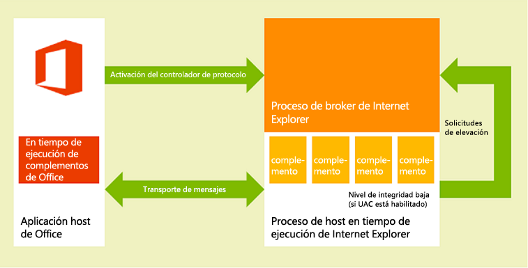
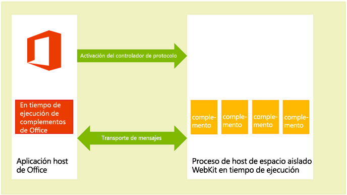
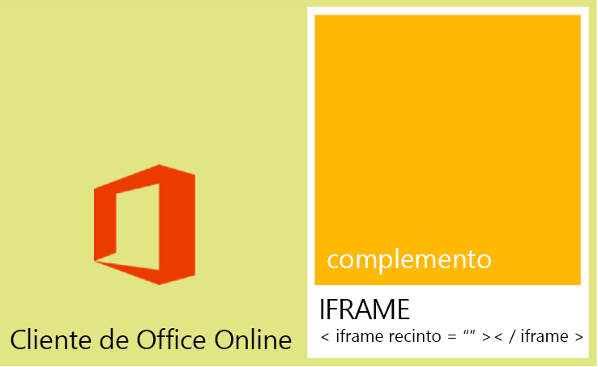

# <a name="privacy-and-security-for-office-add-ins"></a>Privacidad y seguridad de complementos para Office


## <a name="understanding-the-add-in-runtime"></a>Información sobre el tiempo de ejecución del complemento

Las Complementos de Office están protegidas por un entorno de tiempo de ejecución de complemento, un modelo de permisos de varios niveles y reguladores de rendimiento. Este marco protege la experiencia del usuario de las siguientes maneras: 


- Se administra el acceso al marco de interfaz de usuario de la aplicación host.
    
- Solo se permite un acceso indirecto al subproceso de interfaz de usuario de la aplicación host.
    
- No se permiten las interacciones modales (por ejemplo, no se permiten las llamadas a las funciones **alert**, **confirm** y **prompt** de JavaScript porque son modales).
    
Además, el marco de tiempo de ejecución proporciona las siguientes ventajas para garantizar que un complemento de Office no pueda dañar el entorno del usuario:


- Aísla el proceso en el que se ejecuta el complemento.
    
- No necesita reemplazar el archivo .dll o .exe ni los componentes ActiveX.
    
- Facilita la instalación y desinstalación de los complementos.
    
Además, se puede controlar la memoria, la CPU y los recursos de red que usan los complementos de Office para garantizar un buen rendimiento y confiabilidad. 

En las secciones siguientes se describe brevemente cómo la arquitectura de tiempo de ejecución permite ejecutar complementos en clientes de Office en dispositivos basados en Windows, en dispositivos Mac OS X y en clientes de Office Online en la web.


### <a name="clients-for-windows-and-os-x-devices"></a>Clientes para dispositivos Windows y OS X

En los clientes de escritorio y tableta compatibles, como Excel, Outlook y Outlook para Mac, los complementos de Office son compatibles si se integra un componente dentro de proceso, el tiempo de ejecución de los complementos de Office, que administra el ciclo de vida del complemento y permite la interoperabilidad entre el complemento y la aplicación cliente. La página web del complemento se hospeda fuera del proceso. Como se muestra en la ilustración 1, en un dispositivo de escritorio o tableta con Windows, la página web del complemento se hospeda dentro de un control de Internet Explorer que, a su vez, se hospeda dentro de un proceso de tiempo de ejecución de complemento que proporciona aislamiento de rendimiento y seguridad. 


**Figura 1: Entorno de tiempo de ejecución de complementos de Office en clientes de tableta y escritorio basados en Windows**



Como se muestra en la figura 2, en un escritorio OS X Mac, la página web de complemento se hospeda dentro de un proceso de host en tiempo de ejecución de WebKit de espacio aislado que ayuda a proporcionar un nivel de protección de rendimiento y seguridad similar. 


**Figura 2: Entorno de tiempo de ejecución de complementos de Office en clientes con Mac OS X**



El tiempo de ejecución de complementos de Office administra la comunicación entre procesos, la conversión de eventos y llamadas API de JavaScript en nativos, así como la compatibilidad remota de interfaz de usuario para permitir que el complemento se represente dentro del documento, en un panel de tareas, o de forma adyacente a un mensaje de correo electrónico, una convocatoria de reunión o una cita.


### <a name="web-clients"></a>Clientes web

En los clientes web admitidos, como Excel Online y Outlook Web App, los complementos de Office se hospedan en un **iframe** que se ejecuta con el atributo **sandbox** de HTML5. No se permiten los componentes ActiveX ni la navegación de la página principal del cliente web. En los clientes web, la compatibilidad con los complementos de Office se habilita con la integración de la API de JavaScript para Office. De un modo similar a las aplicaciones cliente de escritorio, la API de JavaScript administra el ciclo de vida y la interoperabilidad entre el complemento y el cliente web. Esta interoperabilidad se implementa con una infraestructura de comunicación de publicación de mensajes especial entre marcos. La misma biblioteca de JavaScript (Office.js) que se usa para clientes de escritorio puede interactuar con el cliente web. En la ilustración 3 se muestra la infraestructura que admite los complementos de Office en Office Online (que se ejecuta en el explorador) y los componentes relevantes (el cliente web, el **iframe**, el tiempo de ejecución de los complementos de Office y la API de JavaScript para Office) necesarios para admitirlas.


**Figura 3: Infraestructura compatible con complementos de Office en los clientes web de Office**




## <a name="add-in-integrity-in-the-office-store"></a>Integridad de complementos en la Tienda Office

Si quiere que sus complementos de Office estén disponibles para el público, publíquelos en la Tienda Office. La Tienda Office aplica las medidas siguientes para mantener la integridad de los complementos:


- Necesita que el servidor host de un complemento de Office siempre use SSL (capa de sockets seguros) para comunicarse.
    
- Pide que el desarrollador proporcione pruebas de identidad, un acuerdo contractual y una directiva de privacidad válida para enviar complementos.
    
- Asegúrese de que el origen de los complementos sea accesible en modo de solo lectura.
    
- Admite un sistema de revisión del usuario para que los complementos disponibles promuevan una comunidad autocontrolada.
    

## <a name="addressing-end-users-privacy-concerns"></a>Solucionar las dudas sobre privacidad de los usuarios finales

Esta sección responde a las dudas sobre privacidad de los usuarios relacionadas con el uso de complementos de Office. En primer lugar, se describe la protección que ofrece la plataforma de complementos de Office desde el punto de vista del cliente (usuario final). Después, proporciona al desarrollador instrucciones sobre cómo cumplir las expectativas de los usuarios y cómo administrar de forma segura la información de identificación personal (DCP) de estos. 


### <a name="end-users-perspective"></a>Perspectiva del usuario final

Los complementos de Office se diseñan con tecnologías web que se ejecutan en un control del explorador o **iframe**. Por este motivo, el uso de los complementos resulta muy similar a la exploración de sitios web en Internet o en una intranet. Los complementos pueden ser externos a una organización (si se adquieren en la Tienda Office) o internos (si adquiere el complemento en un catálogo de complementos de Exchange Server o SharePoint, o en un recurso compartido de archivos de una organización). Los complementos tienen acceso limitado a la red y la mayoría de ellos puede escribir o leer en el elemento de correo o documento activo. La plataforma del complemento aplicará ciertas restricciones antes de que un usuario o un administrador instale o inicie un complemento. Pero, al igual que ocurre con cualquier modelo de extensibilidad, los usuarios tienen que tomar precauciones antes de iniciar un complemento desconocido.

La plataforma del complemento responde a las dudas sobre privacidad de los usuarios finales de las siguientes maneras:


- Los datos que se comunican a un servidor web que hospeda un complemento de panel de tareas, Outlook o contenido, al igual que las comunicaciones entre el complemento y cualquier servicio web que este use, deben cifrarse mediante el protocolo de capa de sockets seguros (SSL).
    
- Antes de instalar un complemento desde la Tienda Office, el usuario puede ver los requisitos y la directiva de privacidad del complemento. Además, los complementos de Outlook que interactúan con los buzones de los usuarios exponen los permisos específicos que necesitan, de modo que, antes de instalar uno de estos complementos, el usuario puede revisar las condiciones de uso, los permisos solicitados y la directiva de privacidad.
    
- Cuando los usuarios comparten un documento, también comparten los complementos que se han insertado en él o se han asociado con él. Si un usuario abre un documento que contiene un complemento que no ha usado antes, la aplicación host le solicita permiso para ejecutarlo en el documento. En un entorno organizativo, la aplicación host de Office también consulta al usuario si el documento procede de un origen externo.
    
- Los usuarios pueden habilitar o deshabilitar el acceso a la Tienda Office. Para complementos de contenido y panel de tareas, los usuarios administran el acceso a complementos y catálogos de confianza desde el **Centro de confianza** del cliente host de Office (se abre desde **Archivo** > **Opciones** > **Centro de confianza** > **Configuración del Centro de confianza** > **Catálogos de complementos de confianza**). Para complementos de Outlook, los usuarios pueden administrar complementos mediante el botón **Administrar complementos**: en Outlook para Windows, elija **Archivo** > **Administrar complementos**. En Outlook para Mac, elija el botón **Administrar complementos** en la barra de complementos. En Outlook Web App, elija el menú **Configuración** (icono de engranaje) > **Administrar complementos**. Los administradores también pueden administrar este acceso [mediante la directiva de grupo](http://technet.microsoft.com/en-us/library/jj219429.aspx#BKMK_Managing).
    
- El diseño de la plataforma de complementos proporciona seguridad y rendimiento a los usuarios finales de las siguientes maneras:
    
      - Un complemento de Office se ejecuta en un control del explorador web que está hospedado en un entorno de tiempo de ejecución del complemento independiente de la aplicación host de Office. Este diseño proporciona seguridad y aislamiento del rendimiento con respecto a la aplicación host.
    
  - La ejecución en un control del explorador web permite al complemento realizar prácticamente todas las acciones que puede realizar una página web común en un explorador y, al mismo tiempo, controla el comportamiento del complemento para que cumpla la directiva del mismo origen en lo que respecta al aislamiento de dominios y las zonas de seguridad.
    
Los complementos de Outlook proporcionan características adicionales de seguridad y rendimiento con la supervisión del uso de recursos específica de complementos de Outlook. Para más información, vea [Privacidad, permisos y seguridad para complementos de Outlook](../../docs/outlook/privacy-and-security.md).


### <a name="developer-guidelines-to-handle-pii"></a>Recomendaciones para desarrolladores sobre el tratamiento de PII

Los desarrolladores y administradores de TI encontrarán directrices generales para la protección de la información de identificación personal (DCP) en [Protección de la privacidad en el desarrollo y las pruebas de las aplicaciones de recursos humanos](http://technet.microsoft.com/en-us/library/gg447064.aspx). A continuación puede ver algunas directrices para la protección de datos de DCP específicas para desarrolladores de complementos de Office:


- Aunque el objeto [Settings](../../reference/shared/settings.md) está destinado a conservar los datos de estado y la configuración de un complemento de panel de tareas o de contenido entre sesiones, no se recomienda almacenar datos de DCP confidenciales o contraseñas en el objeto **Settings**. Aunque los datos del objeto **Settings** no resultan visibles para los usuarios finales, forman parte del formato de archivo del documento al que sí se puede acceder con facilidad. Limite el uso de datos de DCP en el complemento y almacene todos los datos de este tipo que necesite el complemento en el servidor donde este se hospeda, como recursos protegidos por el usuario.
    
- El uso de ciertas aplicaciones puede revelar datos de DCP. Asegúrese de almacenar de un modo seguro los datos de identidad, ubicación, horas de acceso y otras credenciales de los usuarios, de modo que no se encuentren disponibles para otros usuarios del complemento.
    
- Si el complemento se encuentra disponible en la Tienda Office, el requisito de la Tienda Office de HTTPS protegerá los datos de DCP que se transmitan entre el servidor web y el dispositivo o equipo cliente. Pero, si vuelve a transmitir los datos a otros servidores, asegúrese de mantener el mismo nivel de protección.
    
- Si almacena datos de DCP de los usuarios, asegúrese de comunicárselo y de ofrecer una forma para que puedan revisarlos y eliminarlos si así lo prefieren. Si envía el complemento a la Tienda Office, puede explicar brevemente cuáles son los datos que recopila y el uso que realiza de ellos en la declaración de privacidad.
    

## <a name="developers-permission-choices-and-security-practices"></a>Opciones de permisos y procedimientos de seguridad para desarrolladores

Siga estas directrices generales para disfrutar de la compatibilidad con el modelo de seguridad de complementos de Office y obtenga información detallada sobre cada tipo de complemento.


### <a name="permissions-choices"></a>Opciones de permisos

La plataforma del complemento proporciona un modelo de permisos que usa el complemento para declarar el nivel de acceso a los datos de un usuario que necesita según sus características. Cada nivel de permisos se corresponde con el subconjunto de la API de JavaScript para Office que el complemento puede usar según sus características. Por ejemplo, el permiso **WriteDocument** para los complementos de panel de tareas y de contenido permite obtener acceso al método [Document.setSelectedDataAsync](../../reference/shared/document.setselecteddataasync.md) que, a su vez, permite a un complemento escribir en el documento del usuario (aunque no permite obtener acceso a ningún método para leer datos en el documento). Este nivel de permisos resulta útil para los complementos que solo necesitan escribir en un documento (por ejemplo, un complemento donde el usuario puede consultar los datos que quiere insertar en su documento).

Se recomienda solicitar los permisos según el principio de _privilegios mínimos_. Es decir, tiene que solicitar permiso para tener acceso al subconjunto mínimo de la API que el complemento necesita para funcionar correctamente. Por ejemplo, si un complemento solo necesita leer datos en el documento de un usuario según sus características, solo tiene que solicitar el permiso **ReadDocument**. (Pero tenga en cuenta que, si no solicita los permisos suficientes, la plataforma del complemento bloqueará el uso que esta pueda realizar de algunas API y generará errores en tiempo de ejecución).

Especifique los permisos en el manifiesto del complemento, como se muestra en el ejemplo que aparece más adelante en esta sección. Los usuarios finales pueden ver el nivel de permisos solicitado de un complemento antes de decidir si quieren instalarlo o activarlo por primera vez. Además, los complementos de Outlook que solicitan el permiso **ReadWriteMailbox** necesitan privilegios de administrador explícitos para su instalación.

En el ejemplo siguiente se muestra cómo un complemento de panel de tareas especifica el permiso **ReadDocument** en su manifiesto. Para que los permisos sigan constituyendo el tema central, no se mostrarán otros elementos del manifiesto.


```XML
<?xml version="1.0" encoding="utf-8"?>
<OfficeApp xmlns="http://schemas.microsoft.com/office/appforoffice/1.0"
 xmlns:xsi="http://www.w3.org/2001/XMLSchema-instance" 
xmlns:ver="http://schemas.microsoft.com/office/appforoffice/1.0"
xsi:type="TaskPaneApp">
...<!-- To keep permissions as the focus, not displaying other elements. -->
  <Permissions>ReadDocument</Permissions>
...
</OfficeApp>

```

Para obtener más información sobre esto para complementos de panel de tareas y contenido, vea [Requesting permissions for API use in content and task pane add-ins](requesting-permissions-for-api-use-in-content-and-task-pane-add-ins.md).

Para obtener más información sobre esto para complementos de Outlook, consulte los siguientes temas:


- [Privacidad, permisos y seguridad para los complementos de Outlook](../../docs/outlook/privacy-and-security.md)
    
- [Comprender los permisos de los complementos de Outlook](../../docs/outlook/understanding-outlook-add-in-permissions.md)
    

### <a name="same-origin-policy"></a>Directiva de mismo origen

Como los complementos de Office son páginas web que se ejecutan en un control del explorador web, tienen que cumplir la directiva de mismo origen que aplica el explorador. De forma predeterminada, una página web de un dominio no puede realizar llamadas a servicios web [XmlHttpRequest](http://www.w3.org/TR/XMLHttpRequest/) a dominios distintos de aquel en que se hospeda.

Esta limitación puede superarse con JSON/P: para proporcionar un proxy al servicio web, incluya una etiqueta **script** con un atributo **src** que apunte a un script hospedado en otro dominio. Puede crear las etiquetas **script** mediante programación: cree de forma dinámica la URL a la que tiene que apuntar el atributo **src** y pase los parámetros a la URL a través de los parámetros de consulta de URI. Los proveedores de servicios web crean y hospedan código JavaScript en URL específicas y devuelven scripts diferentes, en función de los parámetros de consulta de URI. Después, estos scripts se ejecutan donde se encuentran insertados y funcionan según lo esperado.

A continuación se muestra un ejemplo de JSON/P en el ejemplo de complemento de Outlook. 


```
// Dynamically create an HTML SCRIPT element that obtains the details for the specified video.
function loadVideoDetails(videoIndex) {
    // Dynamically create a new HTML SCRIPT element in the webpage.
    var script = document.createElement("script");
    // Specify the URL to retrieve the indicated video from a feed of a current list of videos,
    // as the value of the src attribute of the SCRIPT element. 
    script.setAttribute("src", "https://gdata.youtube.com/feeds/api/videos/" + 
        videos[videoIndex].Id + "?alt=json-in-script&amp;callback=videoDetailsLoaded");
    // Insert the SCRIPT element at the end of the HEAD section.
    document.getElementsByTagName('head')[0].appendChild(script);
}

```

Exchange y SharePoint proporcionan servidores proxy del lado cliente para permitir el acceso entre dominios. En general, una directiva de mismo origen en una intranet no es tan estricta como en Internet. Para más información, vea [Directiva de mismo origen parte 1: Sin inspección](http://blogs.msdn.com/b/ieinternals/archive/2009/08/28/explaining-same-origin-policy-part-1-deny-read.aspx) y [Solución para limitaciones de directiva de mismo origen en complementos de Office](../../docs/develop/addressing-same-origin-policy-limitations.md).


### <a name="tips-to-prevent-malicious-cross-site-scripting"></a>Consejos para evitar scripting malintencionado entre sitios

Para atacar el origen de un complemento, un usuario malintencionado podría escribir script malintencionado en el documento o en los campos del complemento. Un desarrollador debería procesar correctamente las entradas de usuario para evitar la ejecución del código JavaScript de un usuario malintencionado en el dominio. A continuación se describen algunos procedimientos recomendados para administrar las entradas de usuario desde un documento o un mensaje de correo, o a través de los campos de un complemento.


- En lugar de la propiedad DOM [innerHTML](http://msdn.microsoft.com/en-us/library/ie/ms533897.aspx), use las propiedades [innerText](https://msdn.microsoft.com/library/ms533899.aspx) y [textContent](https://developer.mozilla.org/en-US/docs/DOM/Node.textContent) cuando corresponda. Siga este procedimiento para garantizar la compatibilidad entre los exploradores Internet Explorer y Firefox:
    
```
     var text = x.innerText || x.textContent
```

   Para obtener información sobre las diferencias entre **innerText** y **textContent**, vea [Node.textContent](https://developer.mozilla.org/en-US/docs/DOM/Node.textContent). Para más información sobre la compatibilidad de DOM entre exploradores comunes, vea [Compatibilidad de DOM de W3C: HTML](http://www.quirksmode.org/dom/w3c_html.html#t07).
    
- Si tiene que usar **innerHTML**, asegúrese de que en la entrada del usuario no se incluye contenido malintencionado antes de pasarla a **innerHTML**. Para obtener más información y un ejemplo de cómo usar **innerHTML** de forma segura, vea la propiedad [innerHTML](http://msdn.microsoft.com/en-us/library/ie/ms533897.aspx).
    
- Si usa jQuery, use el método [.text()](http://api.jquery.com/text/) en lugar del método [.html()](http://api.jquery.com/html/).
    
- Use el método [toStaticHTML](http://msdn.microsoft.com/en-us/library/ie/cc848922.aspx) para quitar todos los atributos y elementos HTML dinámicos de las entradas de usuario antes de pasarlas a **innerHTML**.
    
- Use las funciones [encodeURIComponent](http://msdn.microsoft.com/en-us/library/8202bce6-1342-40dc-a5ef-ac6d210a7d15.aspx) o [encodeURI](http://msdn.microsoft.com/en-us/library/17bab5a2-bcd4-46c2-8b52-b2b5a0ed98a3.aspx) para codificar texto que pretende ser una URL que contiene entradas de usuario o procede de ellas.
    
- Vea [Desarrollo de complementos seguros](http://msdn.microsoft.com/en-us/library/windows/apps/hh849625.aspx) para conocer otros procedimientos recomendados para crear soluciones web más seguras.
    

### <a name="tips-to-prevent-clickjacking"></a>Sugerencias para evitar el "secuestro de clics"

Como los complementos de Office se representan en un iframe cuando se ejecutan con un explorador con aplicaciones host de Office Online, use las sugerencias siguientes para minimizar el riesgo del [secuestro de clics](http://en.wikipedia.org/wiki/Clickjacking), una técnica que usan los hackers para engañar a los usuarios con el objetivo de que revelen información confidencial.

Primero, identifique las acciones confidenciales que puede realizar el complemento. Entre ellas se incluyen las acciones que podría llevar a cabo un usuario no autorizado con malas intenciones, como iniciar una transacción financiera o publicar datos confidenciales. Por ejemplo, el complemento puede permitir al usuario enviar un pago a un destinatario que define el usuario.

En segundo lugar, el complemento tendría que pedir confirmación al usuario antes de ejecutar acciones confidenciales. Esta confirmación tiene que detallar el efecto que tendrá la acción. También tiene que explicar al usuario cómo puede evitar la acción, si es necesario, ya sea con un botón específico marcado como "No permitir" o ignorando la confirmación.

En tercer lugar, para asegurarse de que ningún atacante potencial pueda ocultar o enmascarar la confirmación, debería mostrarla fuera del contexto del complemento (es decir, no en un cuadro de diálogo HTML).

A continuación verá algunos ejemplos de cómo puede conseguir la confirmación:


- Envíe un correo al usuario que contenga un vínculo de confirmación.
    
- Envíe un mensaje de texto al usuario que incluya un código de confirmación que este pueda escribir en el complemento.
    
- Abra un diálogo de confirmación en una ventana del explorador nueva a una página que no pueda incorporar con IFrame. Suele ser el patrón que se utiliza en las páginas de inicio de sesión. Use la [API de cuadros de diálogo](https://dev.office.com/docs/add-ins/develop/dialog-api-in-office-add-ins) para crear un cuadro de diálogo. 
    
Asegúrese también de que la dirección a través de la cual va a contactar con el usuario no procede de un posible atacante. Por ejemplo, para confirmaciones de pago, use la dirección que aparece en el archivo de la cuenta autorizada del usuario.


### <a name="other-security-practices"></a>Otros procedimientos de seguridad

Es importante que los desarrolladores también sigan los siguientes procedimientos de seguridad:


- Los desarrolladores no tienen que usar controles ActiveX en los complementos de Office, ya que estos controles no son compatibles con la naturaleza multiplataforma de la plataforma del complemento.
    
- Los complementos de panel de tareas y de contenido usan la misma configuración de SSL que usa Internet Explorer de forma predeterminada y permiten que la mayor parte del contenido se entregue únicamente a través de SSL. Los complementos de Outlook obligan a que todo el contenido se entregue a través de SSL. Los desarrolladores tienen que especificar en el elemento **SourceLocation** del manifiesto del complemento una dirección URL que use HTTPS para identificar la ubicación del archivo HTML del complemento.
    
    Para asegurarse de que los complementos no entregan contenido a través de HTTP, al probarlos, los desarrolladores deben asegurarse de seleccionar la configuración siguiente en Internet Explorer y de que no aparezcan advertencias de seguridad en los escenarios de prueba:
    
      - Asegúrese de que la configuración de seguridad, **Mostrar contenido mixto**, para la zona **Internet** está establecida en **Solicitar**. Para ello, seleccione las opciones siguientes en Internet Explorer: en la pestaña **Seguridad** del cuadro de diálogo **Opciones de Internet**, seleccione la zona **Internet**, seleccione **Nivel personalizado**, desplácese hasta **Mostrar contenido mixto** y seleccione **Pedir datos** (si no está seleccionado).
    
  - Asegúrese de que la opción **Avisar si se cambia entre los modos seguro y no seguro** esté seleccionada en la pestaña **Opciones avanzadas** del cuadro de diálogo **Opciones de Internet**.
    
- Para asegurarse de que los complementos no realizan un uso excesivo del núcleo de CPU o los recursos de memoria y no provocan una denegación de servicio en un equipo cliente, la plataforma del complemento establece límites de uso de recursos. Como parte de las pruebas, los desarrolladores deben verificar si un complemento respeta dichos límites. 
    
- Antes de publicar un complemento, los desarrolladores deben asegurarse de que cualquier información identificable personal que expongan en los archivos de su complemento está protegido.
    
- Los desarrolladores no deben insertar claves que usen para acceder a servicios o API de terceros (como Bing, Google o Facebook) directamente en las páginas HTML del complemento. En su lugar, pueden crear un servicio web personalizado o almacenar las claves con otro tipo de almacenamiento web seguro, al que puedan llamar para pasar al complemento los valores de las claves.
    
- Es necesario que los desarrolladores hagan lo siguiente cuando envíen un complemento a la Tienda Office:
    
      - Hospedar el complemento que van a enviar en un servidor web que admita SSL
    
  - Elaborar una declaración que describa una directiva de privacidad válida.
    
  - Firmar un acuerdo contractual al enviar el complemento
    
Al margen de las reglas de uso de recursos, los desarrolladores de complementos de Outlook también tienen que asegurarse de que los complementos cumplen los límites a la hora de especificar las reglas de activación y usar la API de JavaScript. Para más información, vea [Límites de activación y API de JavaScript para complementos de Outlook](http://msdn.microsoft.com/library/e0c9e3d0-517e-4333-b8bd-e169c51a07f6.aspx).


## <a name="it-administrators-control"></a>Control de administradores de TI

En un entorno corporativo, los administradores de TI tienen la máxima autoridad para habilitar o deshabilitar el acceso a la Tienda Office y a los catálogos privados. 


## <a name="additional-resources"></a>Recursos adicionales


- [Solicitar permisos para el uso de API en complementos de contenido y de panel de tareas](http://msdn.microsoft.com/library/da2efadc-4ebf-45fe-be39-397ac1eb1dbd.aspx)
    
- [Privacidad, permisos y seguridad para los complementos de Outlook](http://msdn.microsoft.com/library/44208fc4-05d4-42d8-ab20-faa89624de1c.aspx)
    
- [Comprender los permisos de los complementos de Outlook](http://msdn.microsoft.com/library/5bca69f2-b287-4e19-8f0f-78d896b2a3d3.aspx)
    
- [Límites para la activación y API de JavaScript para complementos de Outlook](http://msdn.microsoft.com/library/e0c9e3d0-517e-4333-b8bd-e169c51a07f6.aspx)
    
- [Abordar las limitaciones de la directiva de mismo origen en complementos para Office](http://msdn.microsoft.com/library/36c800ae-1dda-4ea8-a558-37c89ffb161b.aspx)
    
- [Directiva de mismo origen](http://www.w3.org/Security/wiki/Same_Origin_Policy)
    
- [Directiva de mismo origen Parte 1: Sin inspección](http://blogs.msdn.com/b/ieinternals/archive/2009/08/28/explaining-same-origin-policy-part-1-deny-read.aspx)
    
- [Directiva de mismo origen para JavaScript](https://developer.mozilla.org/En/Same_origin_policy_for_JavaScript)
    
- [Definición de JSON-P más seguro](http://json-p.org/)
    
