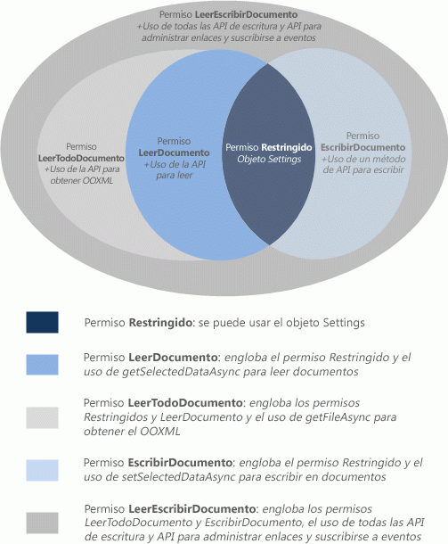

# <a name="requesting-permissions-for-api-use-in-content-and-task-pane-add-ins"></a>Solicitud de permisos para uso de la API en complementos de contenido y de panel de tareas
En este artículo se describen los distintos niveles de permisos que puede declarar en el manifiesto del complemento del panel de tareas o contenido para especificar el nivel de acceso a la API de JavaScript que necesita el complemento por sus características. 


## <a name="permissions-model"></a>Modelo de permisos


Un modelo de permisos de acceso a la API de JavaScript de cinco niveles proporciona la base de la privacidad y seguridad de los usuarios de complementos del panel de tareas o contenido. En la figura 1 se indican los cinco niveles de permisos de la API que puede declarar en el manifiesto del complemento.


**Figura 1: Modelo de permisos de cinco niveles para complementos del panel de tareas y de contenido**




Estos permisos especifican el subconjunto de la API que el entorno de tiempo de ejecución del complemento permitirá usar al complemento del panel de tareas o contenido cuando un usuario inserte y a continuación active (confíe en) su complemento. Para declarar el nivel de permisos que necesita su complemento de panel de tareas o contenido, especifique uno de los valores de texto de permiso del elemento [Permissions](http://msdn.microsoft.com/en-us/library/d4cfe645-353d-8240-8495-f76fb36602fe%28Office.15%29.aspx) del manifiesto del complemento. En el siguiente ejemplo se solicita el permiso **WriteDocument**, que únicamente permitirá métodos que pueden escribir (pero no leer) en el documento.


```XML
<Permissions>WriteDocument</Permissions>
```

El procedimiento recomendado es solicitar los permisos basándose en el principio de  _privilegio mínimo_. Es decir, debería solicitar permisos para tener acceso únicamente al subconjunto mínimo de la API que el complemento necesite para funcionar correctamente. Por ejemplo, si el complemento, por sus características, solamente necesita leer datos de un documento del usuario, no debería solicitar ningún otro permiso aparte de **ReadDocument**.

En la siguiente tabla se describe el subconjunto de la API JavaScript que permite cada nivel de permiso.


|**Permiso**|**Subconjunto de API habilitado**|
|:-----|:-----|
|**Restringido**|Los métodos del objeto [Settings](../../reference/shared/settings.md) y del método [Document.getActiveViewAsync](../../reference/shared/document.getactiveviewasync.md).Se trata del permiso mínimo que puede pedir un complemento de panel de tareas.|
|**ReadDocument**|Además de la API permitida por el permiso  **Restricted**, agrega acceso a los miembros de la API necesarios para leer el documento y administrar enlaces.Esto incluye el uso de:<br/><ul><li>El método <a href="http://msdn.microsoft.com/en-us/library/f85ad02c-64f0-4b73-87f6-7f521b3afd69(Office.15).aspx" target="_blank">Document.getSelectedDataAsync</a> para obtener los datos de texto, HTML (solamente Word) o tabulares seleccionados pero no el código de Open Office XML (OOXML) subyacente que contiene todos los datos del documento.</p></li><li><p>El método <a href="http://msdn.microsoft.com/en-us/library/78047418-89c4-4c7d-9427-4735b8559518(Office.15).aspx" target="_blank">Document.getFileAsync</a> para obtener todo el texto de un documento pero no la copia binaria OOXML subyacente del documento.</p></li><li><p>El método <a href="http://msdn.microsoft.com/en-us/library/5372ffd8-579d-4fcb-9e5b-e9a2128f3201(Office.15).aspx" target="_blank">Binding.getDataAsync</a> para leer los datos enlazados del documento.</p></li><li><p>Los métodos <a href="http://msdn.microsoft.com/en-us/library/afbadac7-60c7-47cb-9477-6e9466ded44c(Office.15).aspx" target="_blank">addFromNamedItemAsync</a>, <a href="http://msdn.microsoft.com/en-us/library/9dc03608-b08b-4700-8be1-3c86ae236799(Office.15).aspx" target="_blank">addFromPromptAsync</a> y <a href="http://msdn.microsoft.com/en-us/library/edc99214-e63e-43f2-9392-97ead42fc155(Office.15).aspx" target="_blank">addFromSelectionAsync</a> del objeto <span class="keyword">Bindings</span> para crear enlaces en el documento.</p></li><li><p>Los métodos <a href="http://msdn.microsoft.com/en-us/library/ef902b73-cc4c-4551-95de-d8a51eeba82f(Office.15).aspx" target="_blank">getAllAsync</a>, <a href="http://msdn.microsoft.com/en-us/library/2727c891-bc05-465c-9324-113fbfeb3fbb(Office.15).aspx" target="_blank">getByIdAsync</a> y <a href="http://msdn.microsoft.com/en-us/library/ad285984-8b44-435d-9b84-f0ade570c896(Office.15).aspx" target="_blank">releaseByIdAsync</a> del objeto <span class="keyword">Bindings</span> para tener acceso y eliminar los enlaces del documento.</p></li><li><p>El método <a href="http://msdn.microsoft.com/en-us/library/2533a563-95ae-4d52-b2d5-a6783e4ef5b4(Office.15).aspx" target="_blank">Document.getFilePropertiesAsync</a> para tener acceso a las propiedades de archivo del documento, como la dirección URL del documento.</p></li><li><p>El método <a href="http://msdn.microsoft.com/en-us/library/35dda81c-235e-4eab-8a77-9acb3b73a380(Office.15).aspx" target="_blank">Document.goToByIdAsync</a> para ir a los objetos con nombre del documento.</p></li><li><p>Para complementos de panel de tareas de Project, todos los métodos "get" del objeto <a href="http://msdn.microsoft.com/en-us/library/1908af4f-93b9-4859-87e3-06942014fae1(Office.15).aspx" target="_blank">ProjectDocument</a>. </p></li></ul>|
|**ReadAllDocument**|Además de la API permitida por los permisos **Restricted** y **ReadDocument**, permite el siguiente acceso adicional a los datos del documento:<br/><ul><li><p>Los métodos <span class="keyword">Document.getSelectedDataAsync</span> y <span class="keyword">Document.getFileAsync</span> tienen acceso al código OOXML subyacente del documento (que, además del texto, puede incluir formato, vínculos, gráficos incrustados, comentarios, revisiones, etc.).</p></li></ul>|
|**WriteDocument**|Además de la API permitida por el permiso **Restricted**, agrega acceso a los siguientes miembros de la API:<br/><ul><li><p>El método <a href="http://msdn.microsoft.com/en-us/library/998f38dc-83bd-4659-a759-4758c632a6ef(Office.15).aspx" target="_blank">Document.setSelectedDataAsync</a> para escribir en la selección del usuario en el documento.</p></li></ul>|
|**ReadWriteDocument**|Además de la API permitida por los permisos  **Restricted**,  **ReadDocument**,  **ReadAllDocument** y **WriteDocument**, incluye acceso a todas las demás API admitidas por los complementos de panel de tareas y contenido, incluidos los métodos para suscribirse a eventos.Debe declarar el permiso  **ReadWriteDocument** para tener acceso a estos miembros de la API adicionales:<br/><ul><li><p>El método <a href="http://msdn.microsoft.com/en-us/library/6a59bb6d-40b6-4a95-9b98-d70d4616de09(Office.15).aspx" target="_blank">Binding.setDataAsync</a> para escribir en regiones delimitadas del documento.</p></li><li><p>El método <a href="http://msdn.microsoft.com/en-us/library/1cd23454-8435-4e13-98b3-d0d29ed278a8(Office.15).aspx" target="_blank">TableBinding.addRowsAsync</a> para agregar filas a tablas enlazadas.</p></li><li><p>El método <a href="http://msdn.microsoft.com/en-us/library/8f1bfa81-3850-4ea1-ba2e-c9bcf5847a44(Office.15).aspx" target="_blank">TableBinding.addColumnsAsync</a> para agregar columnas a tablas enlazadas.</p></li><li><p>El método <a href="http://msdn.microsoft.com/en-us/library/8f5cc783-384d-4520-a218-190dfed74dd2(Office.15).aspx" target="_blank">TableBinding.deleteAllDataValuesAsync</a> para eliminar todos los datos de una tabla enlazada.</p></li><li><p>Los métodos <a href="http://msdn.microsoft.com/en-us/library/49712906-f582-4055-9ef8-6edde6e97679(Office.15).aspx" target="_blank">setFormatsAsync</a>, <a href="http://msdn.microsoft.com/en-us/library/cc56e9c0-b33c-4d9b-b676-a7e50f757c10(Office.15).aspx" target="_blank">clearFormatsAsync</a> y <a href="http://msdn.microsoft.com/en-us/library/2885fc57-4527-4ca4-a43d-9ee447ec27d3(Office.15).aspx" target="_blank">setTableOptionsAsync</a> del objeto <span class="keyword">TableBinding</span> para definir el formato y las opciones de las tablas enlazadas.</p></li><li><p>Todos los miembros de los objetos <a href="http://msdn.microsoft.com/en-us/library/dc1518de-47fa-4108-aab7-04a022724b04(Office.15).aspx" target="_blank">CustomXmlNode</a>, <a href="http://msdn.microsoft.com/en-us/library/83f0e668-8236-4f2f-a20f-b173a9e3f65f(Office.15).aspx" target="_blank">CustomXmlPart</a>, <a href="http://msdn.microsoft.com/en-us/library/ba40cd4c-29bb-4f31-875d-6f1382fd1ee8(Office.15).aspx" target="_blank">CustomXmlParts</a> y <a href="http://msdn.microsoft.com/en-us/library/18b9aa8c-83e7-4c2f-8530-6a0ac8ce5535(Office.15).aspx" target="_blank">CustomXmlPrefixMappings</a>.</p></li><li><p>Todos los métodos para suscribirse a los eventos admitidos por el contenido y los complementos del panel de tareas, específicamente los métodos <span class="keyword">addHandlerAsync</span> y <span class="keyword">removeHandlerAsync</span> de los objetos <a href="http://msdn.microsoft.com/en-us/library/42882642-d22b-47d2-a8d3-3aa8c6a4435e(Office.15).aspx" target="_blank">Binding</a>, <a href="http://msdn.microsoft.com/en-us/library/83f0e668-8236-4f2f-a20f-b173a9e3f65f(Office.15).aspx" target="_blank">CustomXmlPart</a>, <a href="http://msdn.microsoft.com/en-us/library/f8859516-cc1f-4b20-a8f3-cee37a983e70(Office.15).aspx" target="_blank">Document</a>, <a href="http://msdn.microsoft.com/en-us/library/1908af4f-93b9-4859-87e3-06942014fae1(Office.15).aspx" target="_blank">ProjectDocument</a> y <a href="http://msdn.microsoft.com/en-us/library/ad733387-a58c-4514-8fc2-53e64fad468d(Office.15).aspx" target="_blank">Settings</a>.</p></li></ul>|

## <a name="additional-resources"></a>Recursos adicionales

    
- [Privacidad y seguridad de complementos para Office](../../docs/develop/privacy-and-security.md)
    


