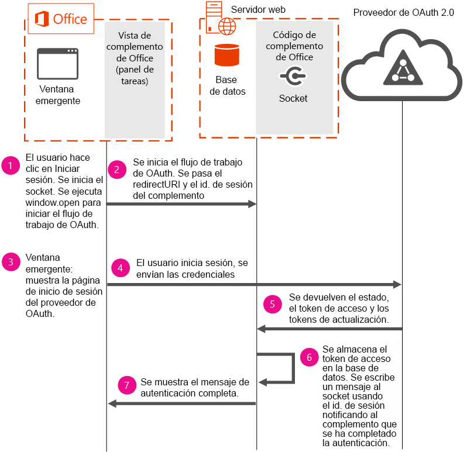

# <a name="use-the-oauth-authorization-framework-in-an-office-add-in"></a>Usar el marco de autorización OAuth en un complemento de Office

OAuth es el estándar abierto de autorización que proveedores de servicios en línea como Office 365, Facebook, Google, SalesForce, LinkedIn y otros usan para llevar a cabo la autenticación de usuarios. El marco de autorización OAuth es el protocolo de autorización predeterminado que se usa en Azure y Office 365. El marco de autorización OAuth se usa en escenarios empresariales (corporativos) y de consumidor.

Los proveedores de servicios en línea pueden proporcionar API públicas expuestas a través de REST. Los desarrolladores pueden usar estas API públicas en sus complementos de Office para leer o escribir datos para el proveedor de servicios en línea. La integración de datos de los proveedores de servicios en línea en un complemento aumenta su valor, lo que conduce a una mayor aceptación por parte de los usuarios. Al usar estas API en el complemento, los usuarios deberán autenticarse mediante el marco de autorización OAuth.

En este tema se describe cómo implementar un flujo de autenticación en el complemento para realizar la autenticación de usuario. Los segmentos de código incluidos en este tema se han extraído del ejemplo de código [Office-Add-in-NodeJS-ServerAuth](https://github.com/OfficeDev/Office-Add-in-NodeJS-ServerAuth).

 **Note** Por motivos de seguridad, los exploradores no pueden mostrar páginas de inicio de sesión en un iframe. Según la versión de Office que usen sus clientes, especialmente las versiones basadas en web, el complemento se mostrará en un iframe. Esto impone ciertas consideraciones sobre cómo administrar el flujo de autenticación. 

El siguiente diagrama muestra los componentes necesarios y el flujo de los eventos que se suceden al implementar la autenticación en el complemento.



El diagrama muestra cómo se usan los siguientes componentes necesarios:


- Office ejecuta un complemento de panel de tareas en el equipo del usuario. El complemento abre una ventana emergente para iniciar el flujo de autenticación. Los complementos no pueden iniciar flujos de autenticación directamente porque, en función de la plataforma usada, pueden ejecutarse en un IFRAME. Por motivos de seguridad, las páginas de inicio de sesión OAuth no se puede mostrar en un IFRAME. 
    
- Un servidor web hospeda el código del complemento. Este ejemplo de código usa un servidor de base de datos que se ejecuta en el servidor web para almacenar el token de acceso del usuario. Es necesario conservar el token de acceso para que, cuando la autenticación acabe de usar la ventana emergente, las páginas principales del complemento puedan usar los mismos tokens para acceder a los datos desde el servicio en línea. Es necesario guardar los tokens usando las opciones del servidor, ya que no se puede confiar en la información que se pasa desde el complemento o la ventana emergente.
    
- El proveedor de OAuth 2.0 realiza la autenticación de usuario.
    

    
 **Importante** Los tokens de acceso no se pueden devolver al panel de tareas, pero se pueden usar en el servidor. En este ejemplo de código, los tokens de acceso se almacenan en la base de datos durante 2 minutos. Después de 2 minutos, los tokens se eliminan de la base de datos y se pide a los usuarios que vuelvan a autenticarse. Antes de cambiar este período de tiempo en su propia implementación, considere los riesgos de seguridad asociados al almacenamiento de tokens de acceso durante un período de tiempo superior a 2 minutos.


## <a name="step-1---start-socket-and-open-a-pop-up-window"></a>Paso 1: Iniciar el socket y abrir una ventana emergente

Al ejecutar este ejemplo de código, se muestra un complemento de panel de tareas en Office. Cuando el usuario elige un proveedor de OAuth para iniciar sesión, el complemento primero crea un socket. En este ejemplo se usa un socket para proporcionar una experiencia del usuario adecuada en el complemento. El complemento usa el socket para comunicar al usuario si la autenticación se ha completado correctamente o no. Al usar un socket, la página principal del complemento se actualiza fácilmente con el estado de la autenticación y no necesita la interacción del usuario ni un sondeo. En el siguiente segmento de código, extraído de routes/connect.js, se muestra cómo iniciar el socket. El socket recibe un nombre con **decodedNodeCookie**, que es el id. de sesión del complemento. En este ejemplo de código se crea el socket con [socket.io](http://socket.io/).


```js
io.on('connection', function (socket) {
  console.log('Socket connection established');
  var jsonCookie =
    cookie.parse(socket
      .handshake
      .headers
      .cookie);
  var decodedNodeCookie =
    cookieParser
      .signedCookie(jsonCookie.nodecookie, '<Insert a random string>');
  console.log('Decoded cookie: ' + decodedNodeCookie);
  // The session ID becomes the room name for this session.
  socket.join(decodedNodeCookie);
  io.to(decodedNodeCookie).emit('init', 'Private socket session established');
});

```

Luego, el complemento se conecta al socket. El siguiente código se encuentra en /public/javascripts/client.js.


```js
var socket = io.connect('https://localhost:3001', { secure: true });
```

A continuación, el complemento abre una ventana emergente en el equipo del usuario con **window.open**. Al ejecutar **window.open**, asegúrese de pasar en la URL el URI de redirección y el id. de sesión del complemento. El id. de sesión del complemento se usa para identificar el socket que se usará al enviar información de estado de autenticación a la interfaz de usuario del complemento. Encontrará el siguiente segmento de código en views/index.jade.


```js
onclick="window.open('/connect/azure/#{sessionID}', 'AuthPopup', 'width=500,height=500,centerscreen=1,menubar=0,toolbar=0,location=0,personalbar=0,status=0,titlebar=0,dialog=1')")
```


## <a name="steps-2-&amp;-3---start-the-authentication-flow-and-show-the-sign-in-page"></a>Pasos 2 y 3: Iniciar el flujo de autenticación y mostrar la página de inicio de sesión

El complemento debe iniciar el flujo de autenticación. El siguiente segmento de código usa la biblioteca de OAuth de Passport. Al iniciar el flujo de autenticación, asegúrese de pasar la dirección URL de autorización del proveedor de OAuth y el identificador de sesión del complemento. El identificador de sesión del complemento se debe pasar en el parámetro de estado. Ahora la ventana emergente muestra la página de inicio de sesión del proveedor de OAuth para que los usuarios inicien sesión.


```js
router.get('/azure/:sessionID', function(req, res, next) { 
   passport.authenticate( 
     'azure',  
     { state: req.params.sessionID }, 

```


## <a name="steps-4,-5-&amp;-6---user-signs-in-and-web-server-receives-tokens"></a>Pasos 4, 5 y 6: El usuario inicia sesión y el servidor web recibe los tokens

 Después de iniciar sesión correctamente, se devuelve al complemento un token de acceso, un token de actualización y un parámetro de estado. El parámetro de estado contiene el id. de sesión, que se usó para enviar información de estado de autenticación al socket en el paso 7. En el siguiente segmento de código, extraído de app.js, almacena el token de acceso en la base de datos.


```js
  dbHelperInstance.insertDoc(userData, null, 
         function (err, body) { 
           if (!err) { 
             console.log("Inserted session entry [" + userData.sessid + "] id: " + body.id); 
           } 
           done(err, userData); 
         }); 

```


## <a name="step-7---show-authentication-information-in-the-add-in's-ui"></a>Paso 7: Mostrar información de autenticación en la interfaz de usuario del complemento

El siguiente segmento de código, extraído de connect.js, actualiza la interfaz de usuario del complemento con la información de estado de autenticación. La interfaz de usuario del complemento se actualiza con el socket que se creó en el paso 1.


```js
  
       io.to(user.sessid).emit('auth_success', providers); 
       next(); 

```


## <a name="additional-resources"></a>Recursos adicionales
<a name="bk_addresources"> </a>


- [Ejemplo de autenticación de servidor de complementos de Office para Node.js](https://github.com/OfficeDev/Office-Add-in-Nodejs-ServerAuth/blob/master/README.md)
    
