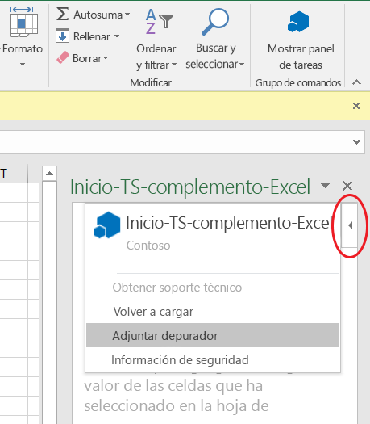
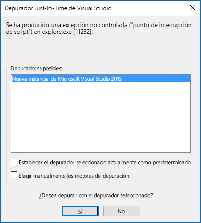

# <a name="create-an-office-add-in-using-any-editor"></a>Crear un complemento de Office con cualquier editor

Puede utilizar el generador Yeoman para el complemento de Office. El generador Yeoman proporciona la administración de scaffolding y compilación del proyecto. El archivo `manifest.xml` indica a la aplicación de Office dónde se encuentra el complemento y cómo desea que aparezca. La aplicación de Office se encarga de alojarlo dentro de Office.

 >**Nota:** En estas instrucciones se usa el símbolo del sistema de Windows, pero también puede usar otros entornos de shell. 


## <a name="prerequisites-for-yeoman-generator"></a>Requisitos previos para el generador Yeoman

Para ejecutar el generador de Yeoman Office, necesita lo siguiente:


- [Git](https://git-scm.com/downloads)  
- [npm](https://www.nodejs.org/en/download)
- [Bower](http://bower.io/)
- [Generador de Yeoman Office](https://www.npmjs.com/package/generator-office)
- [Gulp](http://gulpjs.com/)
- [TSD](http://definitelytyped.org/tsd/)
    
Solo Git y npm requieren una instalación independiente. Los demás programas pueden instalarse mediante npm.

Cuando instale Git, use los valores predeterminados pero elija las opciones siguientes: 

- Usar Git desde el símbolo del sistema de Windows
- Usar la ventana de consola predeterminada de Windows
    
Instalar npm utilizando los valores predeterminados. A continuación, abra un símbolo del sistema como administrador e instale el otro software globalmente:

```
npm install -g bower yo generator-office gulp tsd
```


## <a name="create-the-default-files-for-your-add-in"></a>Crear los archivos predeterminados para el complemento

Antes de desarrollar un complemento de Office, debe crear una carpeta para el proyecto y ejecutar el generador desde allí. El generador Yeoman se ejecuta en el directorio donde desee estructurar su proyecto. 

En el símbolo del sistema, vaya a la carpeta principal donde quiere crear el proyecto. Después use los siguientes comandos para crear una nueva carpeta denominada  _myHelloWorldaddin_ y establezca en ella el directorio actual:


```
mkdir myHelloWorldaddin
cd myHelloWorldaddin
```

Utilice el generador Yeoman para crear un complemento a su elección: Outlook, el contenido o el panel de tareas. Los pasos de este artículo sirven para crear un complemento del panel de tareas. Para ejecutar el generador, escriba la siguiente instrucción:


```
yo office
```

El generador le pedirá lo siguiente: 


- Nombre del complemento: use  _myHelloWorldaddin_ 
- Carpeta raíz del proyecto: use  _current folder_
- Tipo de complemento: use  _task pane_
- Tecnología para crear el complemento: use  _HTML, CSS &amp; JavaScript_
- La aplicación de Office compatible: puede elegir cualquier aplicación
    

**Entrada del generador Yeoman para un complemento**


Así se crean la estructura y los archivos básicos del complemento.


## <a name="hosting-your-office-add-in"></a>Alojar el complemento de Office

Los complementos de Office deben notificarse a través de HTTPS; la aplicación de Office no cargará una aplicación web como un complemento si es HTTP. Para desarrollar, depurar y alojar el complemento de forma local, necesita una forma de crear y ofrecer servicios de una aplicación web localmente mediante HTTPS. Puede crear un sitio HTTPS autohospedado a través de gulp (que se describe en la sección siguiente) o puede utilizar Azure. 


### <a name="using-a-self-hosted-https-site"></a>Usar un sitio HTTPS autohospedado

El complemento gulp-webserver crea un sitio HTTPS autohospedado. El generador de Office lo agrega a gulpfile.js como una tarea denominada serve-static para el proyecto que se genera. Inicie el servidor web autohospedado con la siguiente instrucción: 


```
gulp serve-static
```

Se iniciará un servidor HTTPS en https://localhost:8443.


## <a name="develop-your-office-add-in"></a>Desarrollar el complemento de Office

Se puede usar cualquier editor de texto para desarrollar los archivos del complemento de Office personalizado.


### <a name="javascript-project-support"></a>Compatibilidad con proyectos de JavaScript

El generador de Office creará un archivo jsconfig.json cuando cree el proyecto. Este es el archivo que puede usar para inferir todos los archivos de JavaScript dentro del proyecto. Así se evita tener que incluir los bloques de código repetitivos /// <reference path="../App.js" />.

Obtenga más información sobre el archivo jsconfig.json en la página [Lenguaje JavaScript](https://code.visualstudio.com/docs/languages/javascript#_javascript-projects-jsconfigjson).


### <a name="javascript-intellisense-support"></a>Compatibilidad con Intellisense de JavaScript

Además, aunque esté escribiendo JavaScript sin formato, puede usar los archivos de definición del tipo TypeScript ( `*.d.ts`) para proporcionar compatibilidad adicional con IntelliSense. El generador de Office agrega un archivo  `tsd.json` a los archivos creados con referencias a todas las bibliotecas de terceros que usa el tipo de proyecto seleccionado.

Lo único que hay que hacer después de crear el proyecto mediante el generador Yeoman de Office es ejecutar el siguiente comando para descargar los archivos de definición de tipo a los que se hace referencia:


```
tsd install
```


### <a name="create-a-hello-world-office-add-in"></a>Crear un complemento de Office Hello World


En este ejemplo, creará un complemento Hello World. Un archivo HTML que, opcionalmente, puede suministrar la lógica de programación de JavaScript proporciona la interfaz de usuario del complemento. 


### <a name="to-create-the-files-for-a-hello-world-add-in"></a>Para crear los archivos de un complemento Hello World


- En la carpeta de proyecto, vaya a _[carpeta de proyecto]/app/home_ (en el ejemplo, es myHelloWorldaddin/app/home), abra home.html y reemplace el código existente con el siguiente código, que proporciona el conjunto mínimo de etiquetas HTML para mostrar la interfaz de usuario de un complemento.
    
```HTML
        <!DOCTYPE html>  
      <html> 
        <head> 
           <meta charset="UTF-8" /> 
           <meta http-equiv="X-UA-Compatible" content="IE=Edge"/> 
           <link rel="stylesheet" type="text/css" href="program.css" />
         </head> 
   
        <body> 
           <p>Hello World!</p> 
        </body> 
      
       </html> 
```

  
    
- Después, en la misma carpeta, abra el archivo home.css y agregue el siguiente código CSS.
    
```css
     body 
   { 
        position:relative; 
   } 
   li :hover 
   { 
        text-decoration: underline; 
        cursor:pointer; 
   } 
   h1,h3,h4,p,a,li 
   { 
        font-family: "Segoe UI Light","Segoe UI",Tahoma,sans-serif; 
        text-decoration-color:#4ec724; 
   } 
```
    
- Vuelva a la carpeta de proyecto principal y asegúrese de que el archivo XML manifest-myHelloWorldaddin.xml contiene el siguiente código XML.
    
     >**Importante:**  El valor en la etiqueta `<id>` es un GUID que el generador Yeoman crea al generar el proyecto. No cambie el GUID que el generador Yeoman creó para el complemento. Si el host es Azure, el valor `SourceLocation` tendrá una URL similar a _https:// [nombre-de-la-aplicación-web].azurewebsites.net/[ruta de acceso-al-complemento]_. Si usa la opción autohospedada, como en este ejemplo, será _https://localhost:8443/[ruta de acceso-a-complemento]_.

```XML
     <?xml version="1.0" encoding="utf-8"?> 
   <OfficeApp xmlns="http://schemas.microsoft.com/office/appforoffice/1.1" 
              xmlns:xsi="http://www.w3.org/2001/XMLSchema-instance" 
              xsi:type="TaskPaneApp"> 
   <Id>[GUID-for-your-add-in]</Id> 
   <Version>1.0</Version> 
   <ProviderName>Microsoft</ProviderName> 
   <DefaultLocale>EN-US</DefaultLocale> 
   <DisplayName DefaultValue="myHelloWorldaddin"/> 
   <Description DefaultValue="My first app."/> 
    
   <Hosts> 
     <Host Name="Document"/> 
     <Host Name="Workbook"/> 
   </Hosts>
    
   <DefaultSettings> 
     <SourceLocation DefaultValue="https://localhost:8443/app/home/home.html"/> 
   </DefaultSettings> 
   
   <Permissions>ReadWriteDocument</Permissions>
    
   </OfficeApp> 
```


### <a name="running-the-add-in-locally"></a>Ejecutar el complemento localmente


Para probar el complemento de forma local, abra el explorador y escriba la dirección URL para el archivo home.html. Esto se puede realizar en el servidor web o en el sitio HTTPS autohospedado. Si lo hospedó de forma local, simplemente escriba esa URL en el explorador. En este ejemplo se establece `https://localhost:8443/app/home/home.html`. 

Verá este error: "Existe un problema con el certificado de seguridad de este sitio web". Seleccione "Ir a este sitio web..." y verá el texto "Hello World!".


 >**Nota:**  El complemento generado viene con un certificado autofirmado y una clave. Agréguelos a la lista de confianza de entidades de certificados para que el explorador no emita advertencias de certificado. Consulte la documentación de [gulp-webserver](https://www.npmjs.com/package/gulp-webserver) si desear usar sus propios certificados autofirmados. Para obtener información acerca de cómo confiar en un certificado en OS X Yosemite, consulte [OS X Yosemite: Si no se acepta el certificado](https://support.apple.com/kb/PH18677?locale=en_US).


## <a name="install-the-add-in-for-testing"></a>Instalar el complemento para pruebas

Puede usar la transferencia local para instalar el complemento para pruebas:

- [Transferir complementos de Office para pruebas](../testing/create-a-network-shared-folder-catalog-for-task-pane-and-content-add-ins.md)
- [Transferir complementos de Office para pruebas en dispositivos iPad y Mac](../testing/sideload-an-office-add-in-on-ipad-and-mac.md)   
- [Transferir complementos de Outlook para pruebas](../outlook/testing-and-tips.md)
    

## <a name="debug-your-add-in"></a>Depurar un complemento

Puede depurar un complemento de varias formas:

- Asociar un depurador del panel de tareas (Office 2016 para Windows).
- Utilizar herramientas de desarrollo de su explorador.
- Usar las herramientas de desarrollador F12 en Windows 10.

### <a name="attach-debugger-from-the-task-pane"></a>Asociar un depurador del panel de tareas

En Office 2016 para Windows, compilación 77xx.xxxx o una versión posterior, puede asociar un depurador del panel de tareas. 

Para iniciar la herramienta **Asociar depurador**, elija la esquina superior derecha del panel de tareas para activar el menú **Personalidad** (tal como se muestra en el círculo rojo de la imagen siguiente).   



Seleccione **Asociar depurador**. Se abrirá el cuadro de diálogo **Depurador Just-In-Time de Visual Studio**, como se indica en la imagen siguiente. 



A continuación, puede asociar y depurar en Visual Studio.   

  >  **Nota**:  [Visual Studio 2015](https://www.visualstudio.com/downloads/) es el único depurador que actualmente es compatible con [Update 3](https://msdn.microsoft.com/en-us/library/mt752379.aspx). Si no tiene Visual Studio instalado, al seleccionar la opción **Asociar depurador** no se lleva a cabo ninguna acción.  
  
Para obtener más información al respecto, vea lo siguiente:

-   Para iniciar y usar el Explorador DOM en Visual Studio, vea la sugerencia 4 de la sección [Tips and Tricks](https://blogs.msdn.microsoft.com/officeapps/2013/04/16/building-great-looking-apps-for-office-using-the-new-project-templates/#tips_tricks) (Sugerencias y trucos) de la publicación de blog [Building great-looking apps for Office using the new project templates](https://blogs.msdn.microsoft.com/officeapps/2013/04/16/building-great-looking-apps-for-office-using-the-new-project-templates) (Crear aplicaciones para Office con un gran diseño mediante las nuevas plantillas de proyecto).
-   Para establecer puntos de interrupción, consulte el artículo [Usar puntos de interrupción](https://msdn.microsoft.com/en-US/library/5557y8b4.aspx).
-   Para utilizar F12, consulte [Usar las herramientas de desarrollo F12](https://msdn.microsoft.com/en-us/library/bg182326(v=vs.85).aspx).

### <a name="browser-developer-tools"></a>Herramientas de desarrollo del explorador 

Puede usar los clientes web de Office y abrir las herramientas de desarrollo del explorador para depurar un complemento como cualquier otra aplicación de JavaScript del lado cliente. 

### <a name="f12-developer-tools-on-windows-10"></a>Herramientas de desarrollo F12 de Windows 10

Si está usando el cliente de escritorio de Office en Windows 10, puede [Depurar complementos con las herramientas de desarrollo F12 en Windows 10](../testing/debug-add-ins-using-f12-developer-tools-on-windows-10.md).
    
## <a name="additional-resources"></a>Recursos adicionales


- [Crear y depurar complementos de Office en Visual Studio](../../docs/get-started/create-and-debug-office-add-ins-in-visual-studio.md)
    
