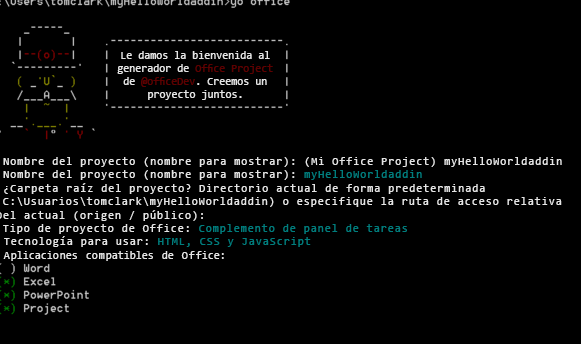

# <a name="create-an-office-add-in-using-any-editor"></a>Crear un complemento de Office con cualquier editor

Un complemento de Office es una aplicación web que se hospeda dentro de una aplicación de Office. En este artículo se describe cómo usar el generador Yeoman proporciona scaffolding de proyectos y administración de compilaciones. El archivo `manifest.xml` indica a la aplicación de Office dónde se encuentra el complemento y cómo quiere que aparezca. La aplicación de Office se encarga de hospedarlo en Office.

 >**Nota**  Las instrucciones incluyen pasos que usan el símbolo del sistema de Windows, pero también se pueden aplicar a otros entornos de shell. 


## <a name="prerequisites-for-yeoman-generator"></a>Requisitos previos para el generador Yeoman

Para ejecutar el generador de Yeoman Office, necesita lo siguiente:


- [Git](https://git-scm.com/downloads)
    
- [npm](https://www.nodejs.org/en/download)
    
- [Bower](http://bower.io/)
    
- [Generador de Yeoman Office](https://www.npmjs.com/package/generator-office)
    
- [Gulp](http://gulpjs.com/)
    
- [TSD](http://definitelytyped.org/tsd/)
    
Solo Git y npm requieren una instalación independiente. Los otros se pueden instalar mediante npm.

Cuando instale Git, use los valores predeterminados pero elija las opciones siguientes: 


- Usar Git desde el símbolo del sistema de Windows
    
- Usar la ventana de consola predeterminada de Windows
    
Instale npm usando los valores predeterminados. Luego abra un símbolo del sistema como administrador e instale el resto del software globalmente. Esto se puede hacer como sigue:


```
npm install -g bower yo generator-office gulp tsd
```


## <a name="create-the-default-files-for-your-add-in"></a>Crear los archivos predeterminados para el complemento

Antes de desarrollar un complemento de Office, primero debe crear una carpeta para el proyecto y ejecutar el generador desde ella. El generador Yeoman se ejecuta en el directorio donde se quiere aplicar la técnica scaffolding al proyecto. 

En el símbolo del sistema, vaya a la carpeta principal donde quiere crear el proyecto. Después use los siguientes comandos para crear una nueva carpeta denominada  _myHelloWorldaddin_ y establezca en ella el directorio actual:


```
mkdir myHelloWorldaddin
cd myHelloWorldaddin
```

Use el generador Yeoman para crear el complemento de Office que quiera: de Outlook, de contenido o de panel de tareas. En este tema, crearemos un complemento de panel de tareas. Para ejecutar el generador, escriba la siguiente instrucción:


```
yo office
```

El generador le pedirá lo siguiente: 


- Nombre del complemento: use  _myHelloWorldaddin_
    
- Carpeta raíz del proyecto: use  _current folder_
    
- Tipo de complemento: use  _task pane_
    
- Tecnología para crear el complemento: use  _HTML, CSS &amp; JavaScript_
    
- La aplicación de Office compatible: puede elegir cualquier aplicación
    

**Entrada del generador Yeoman para un complemento**



Así se crean la estructura y los archivos básicos del complemento.


## <a name="hosting-your-office-add-in"></a>Hospedar el complemento de Office

Los complementos de Office deben suministrarse a través de HTTPS. La aplicación de Office no cargará una aplicación web como complemento si es HTTP. Para desarrollar, depurar y hospedar el complemento localmente, necesita una manera de crear y suministrar una aplicación web localmente mediante HTTPS. Se puede crear un sitio HTTPS autohospedado a través de Gulp (se describe en la sección siguiente) o se puede usar Azure. 


### <a name="using-a-self-hosted-https-site"></a>Usar un sitio HTTPS autohospedado

El complemento gulp-webserver crea un sitio HTTPS autohospedado. El generador de Office lo agrega a gulpfile.js como una tarea denominada serve-static para el proyecto que se genera. Inicie el servidor web autohospedado con la siguiente instrucción: 


```
gulp serve-static
```

Se iniciará un servidor HTTPS en https://localhost:8443.


## <a name="develop-your-office-add-in"></a>Desarrollar el complemento de Office

Se puede usar cualquier editor de texto para desarrollar los archivos del complemento de Office personalizado.


### <a name="javascript-project-support"></a>Compatibilidad con proyectos de JavaScript

El generador de Office creará un archivo jsconfig.json cuando cree el proyecto. Este es el archivo que puede usar para inferir todos los archivos de JavaScript dentro del proyecto. Así se evita tener que incluir los bloques de código repetitivos /// <reference path="../App.js" />.

Obtenga más información sobre el archivo jsconfig.json en la página [Lenguaje JavaScript](https://code.visualstudio.com/docs/languages/javascript#_javascript-projects-jsconfigjson).


### <a name="javascript-intellisense-support"></a>Compatibilidad con Intellisense de JavaScript

Además, aunque esté escribiendo JavaScript sin formato, puede usar los archivos de definición del tipo TypeScript ( `*.d.ts`) para proporcionar compatibilidad adicional con IntelliSense. El generador de Office agrega un archivo  `tsd.json` a los archivos creados con referencias a todas las bibliotecas de terceros que usa el tipo de proyecto seleccionado.

Lo único que hay que hacer después de crear el proyecto mediante el generador de Yeoman Office es ejecutar el siguiente comando para descargar los archivos de definición de tipo a los que se hace referencia:


```
tsd install
```


### <a name="create-a-hello-world-office-add-in"></a>Crear un Complemento de Office Hello World


En este ejemplo, vamos a crear un complemento Hello World. La interfaz de usuario del complemento la proporciona un archivo HTML que, opcionalmente, puede suministrar la lógica de programación de JavaScript. 


### <a name="to-create-the-files-for-a-hello-world-add-in"></a>Para crear los archivos de un complemento Hello World


- En la carpeta de proyecto, vaya a _[carpeta de proyecto]/app/home_ (en el ejemplo, es myHelloWorldaddin/app/home), abra home.html y reemplace el código existente, que proporciona el conjunto mínimo de etiquetas HTML para mostrar la interfaz de usuario de un complemento.
    
```HTML
        <!DOCTYPE html>  
      <html> 
        <head> 
           <meta charset="UTF-8" /> 
           <meta http-equiv="X-UA-Compatible" content="IE=Edge"/> 
           <link rel="stylesheet" type="text/css" href="program.css" />
         </head> 
   
        <body> 
           <p>Hello World!</p> 
        </body> 
      
       </html> 
```

  
    
- Después, en la misma carpeta, abra el archivo home.css y agregue el siguiente código CSS.
    
```css
     body 
   { 
        position:relative; 
   } 
   li :hover 
   { 
        text-decoration: underline; 
        cursor:pointer; 
   } 
   h1,h3,h4,p,a,li 
   { 
        font-family: "Segoe UI Light","Segoe UI",Tahoma,sans-serif; 
        text-decoration-color:#4ec724; 
   } 
```
    
- Vuelva a la carpeta de proyecto principal y asegúrese de que el archivo XML manifest-myHelloWorldaddin.xml contiene el siguiente código XML.
    
     >**Importante** El valor en la etiqueta `<id>` es un GUID que el generador de Yeoman crea al generar el proyecto. No cambie el GUID que el generador de Yeoman creó para el complemento. Si el host es Azure, el valor `SourceLocation` tendrá una dirección URL similar a _https:// [nombre-de-la-aplicación-web].azurewebsites.net/[ruta de acceso-al-complemento]_. Si usa la opción autohospedada, como en este ejemplo, será _https://localhost:8443/[ruta de acceso-a-complemento]_.

```XML
     <?xml version="1.0" encoding="utf-8"?> 
   <OfficeApp xmlns="http://schemas.microsoft.com/office/appforoffice/1.1" 
              xmlns:xsi="http://www.w3.org/2001/XMLSchema-instance" 
              xsi:type="TaskPaneApp"> 
   <Id>[GUID-for-your-add-in]</Id> 
   <Version>1.0</Version> 
   <ProviderName>Microsoft</ProviderName> 
   <DefaultLocale>EN-US</DefaultLocale> 
   <DisplayName DefaultValue="myHelloWorldaddin"/> 
   <Description DefaultValue="My first app."/> 
    
   <Hosts> 
     <Host Name="Document"/> 
     <Host Name="Workbook"/> 
   </Hosts>
    
   <DefaultSettings> 
     <SourceLocation DefaultValue="https://localhost:8443/app/home/home.html"/> 
   </DefaultSettings> 
   
   <Permissions>ReadWriteDocument</Permissions>
    
   </OfficeApp> 
```


### <a name="running-the-add-in-locally"></a>Ejecutar el complemento localmente


Para probar el complemento localmente, abra el explorador y escriba la dirección URL del archivo home.html, que puede estar en el servidor web o en el sitio HTTPS autohospedado. Si lo hospedó localmente, escriba la dirección URL en el explorador. En nuestro ejemplo es  `https://localhost:8443/app/home/home.html`. 

Verá este error: "Existe un problema con el certificado de seguridad de este sitio web". Seleccione "Ir a este sitio web..." y verá el texto "Hello World!".


 >**Nota**  El complemento generado viene con una clave y un certificado autofirmado. Agréguelos a la lista de confianza de entidades de certificación para que el explorador no emita advertencias de certificado. Consulte la documentación de [gulp-webserver](https://www.npmjs.com/package/gulp-webserver) si quiere usar sus propios certificados autofirmados.Consulte [el artículo de Knowledge Base #PH18677](https://support.apple.com/kb/PH18677?locale=en_US) para ver las instrucciones de cómo confiar en un certificado en OS X Yosemite.


## <a name="install-the-add-in-for-testing"></a>Instalar el complemento en una aplicación de Office

Puede usar la transferencia local para instalar el complemento para pruebas:


- [Transferir localmente complementos de Office para pruebas](../testing/sideload-an-office-add-in-on-ipad-and-mac.md)
    
- [Transferir localmente complementos de Outlook para pruebas](../outlook/testing-and-tips.md)
    
Como alternativa, puede publicar el complemento en un catálogo o en un recurso compartido de red e instalarlo como lo harían los usuarios finales. Para más información, vea [Crear un catálogo de carpeta compartida de red para complementos de panel de tareas y de contenido](https://technet.microsoft.com/en-us/browser/fp123503(v=office.14)).


## <a name="debugging-your-office-add-in"></a>Depurar el complemento de Office

Un complemento se puede depurar de varias formas:


- Puede usar los clientes web de Office y abrir las herramientas de desarrollo del explorador para depurar el complemento como cualquier otra aplicación de JavaScript del lado cliente. 
    
- Si está usando Office de escritorio en Windows 10, puede [Depurar complementos con las herramientas de desarrollo F12 en Windows 10](../testing/debug-add-ins-using-f12-developer-tools-on-windows-10.md).
    


## <a name="additional-resources"></a>Recursos adicionales


- [Crear y depurar complementos de Office en Visual Studio](../../docs/get-started/create-and-debug-office-add-ins-in-visual-studio.md)
    
