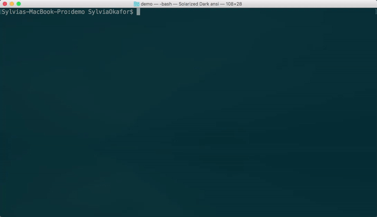

# <a name="create-an-office-add-in-using-any-editor"></a>Crear un complemento de Office con cualquier editor

Puede utilizar el generador Yeoman para el complemento de Office. El generador Yeoman proporciona la administración de scaffolding y compilación del proyecto. El archivo `manifest.xml` indica a la aplicación de Office dónde se encuentra el complemento y cómo desea que aparezca. La aplicación de Office se encarga de alojarlo dentro de Office.

 >**Nota**: En estas instrucciones se usa Terminal en un Mac, pero también sirven otros entornos de shell. 


## <a name="prerequisites-for-the-yeoman-generator"></a>Requisitos previos para el generador Yeoman

Para instalar el generador de Yeoman Office, debe tener [Git](https://git-scm.com/downloads) y node.js instalados en el equipo. Si está en un Mac, le recomendamos que utilice [Administrador de versiones de nodo](https://github.com/creationix/nvm) para instalar node.js con los permisos adecuados. Si está en Windows, puede instalar node.js desde [nodejs.org](https://nodejs.org/en/).

>**Nota**: Si está en Windows, utilice los valores predeterminados al instalar Git, con las excepciones siguientes:

>- Usar Git desde el símbolo del sistema de Windows
>- Usar la ventana de consola predeterminada de Windows

Después de instalar node.js, abrir una instancia de Terminal e instalar el generador de forma global.

```
npm install -g yo generator-office
```


## <a name="create-the-default-files-for-your-add-in"></a>Crear los archivos predeterminados para el complemento

El generador Yeoman se ejecuta en el directorio donde desee estructurar su proyecto. Antes de desarrollar un complemento de Office, debe crear una carpeta para el proyecto.

En Terminal, diríjase a la carpeta primaria donde desee crear el proyecto. A continuación, utilice los comandos siguientes para crear una carpeta con el nombre _myHelloWorldaddin_ y cambie el directorio actual a ella:


```
mkdir myHelloWorldaddin
cd myHelloWorldaddin
```

Use el generador Yeoman para crear un complemento de su elección. Los pasos de este artículo sirven para crear un complemento simple del panel de tareas. Para ejecutar el generador, escriba el comando siguiente:


```
yo office
```

**Entrada del generador Yeoman para un complemento**

El generador le pedirá lo siguiente: 


- Subcarpeta nueva: use _N_
- Nombre del complemento: use  _myHelloWorldaddin_ 
- La aplicación de Office compatible: puede elegir cualquier aplicación
- Crear complemento: use _Sí, quiero un complemento nuevo._
- Agregar [TypeScript](https://www.typescriptlang.org/) use _N_
- Elegir marco: use _Jquery_




Así se crean la estructura y los archivos básicos del complemento.


## <a name="hosting-your-office-add-in"></a>Alojar el complemento de Office

Los complementos de Office, aunque estén en desarrollo, deben hospedarse a través de HTTPS. Yo Office crea un bsconfig.json, que utiliza Browsersync para que sea más rápido ajustar y probar el complemento mediante la sincronización de cambios de archivo en varios dispositivos. 

Inicie el sitio HTTPS local en https://localhost:3000 escribiendo el comando siguiente en la consola:


```
npm start
```

Browsersync iniciará un servidor HTTPS y el archivo index.html en el proyecto. Verá un error que dice "Existe un problema con el certificado de seguridad de este sitio web".


Este error se produce porque Browsersync incluye un certificado SSL autofirmado que su entorno de desarrollo no considera de confianza. Para obtener información sobre cómo resolver este error, consulte [Agregar certificados autofirmados](https://github.com/OfficeDev/generator-office/blob/master/src/docs/ssl.md).

## <a name="sideload-the-add-in-into-office"></a>Transferencia del complemento a Office

Puede usar la transferencia local para instalar el complemento para pruebas en los clientes de Office:

- [Transferir complementos de Office para pruebas](../testing/create-a-network-shared-folder-catalog-for-task-pane-and-content-add-ins.md)
- [Transferir complementos de Office para pruebas en dispositivos iPad y Mac](../testing/sideload-an-office-add-in-on-ipad-and-mac.md)   
- [Transferir complementos de Outlook para pruebas](../outlook/testing-and-tips.md)

## <a name="develop-your-office-add-in"></a>Desarrollar el complemento de Office

Se puede usar cualquier editor de texto para desarrollar los archivos del complemento de Office personalizado.

> **Importante:** El archivo manifest-myHelloWorldaddin.xml indica a las aplicaciones cliente de Office cómo interactuar con el complemento. El valor en la etiqueta `<id>` es un GUID que Yo Office crea al generar el proyecto. No cambie el GUID para el complemento. Si el host es Azure, el valor `SourceLocation` tendrá una URL similar a _https:// [nombre-de-la-aplicación-web].azurewebsites.net/[ruta de acceso-al-complemento]_. Si usa la opción autohospedada, como en este ejemplo, será _https://localhost:3000/[ruta de acceso-a-complemento]_.


## <a name="debug-your-office-add-in"></a>Depurar el complemento de Office

Puede depurar un complemento de varias formas:

- Asociar un depurador del panel de tareas (Office 2016 para Windows).
- Utilizar herramientas de desarrollo de su explorador.
- Usar las herramientas de desarrollador F12 en Windows 10.

### <a name="attach-debugger-from-the-task-pane"></a>Asociar un depurador del panel de tareas

En Office 2016 para Windows, compilación 77xx.xxxx o una versión posterior, puede asociar un depurador del panel de tareas. 

Para iniciar la herramienta **Asociar depurador**, elija la esquina superior derecha del panel de tareas para activar el menú **Personalidad** (tal como se muestra en el círculo rojo de la imagen siguiente).   


Seleccione **Asociar depurador**. Se abrirá el cuadro de diálogo **Depurador Just-In-Time de Visual Studio**, como se indica en la imagen siguiente. 


A continuación, puede asociar y depurar en Visual Studio.   

  >  **Nota**:  [Visual Studio 2015](https://www.visualstudio.com/downloads/) es el único depurador que actualmente es compatible con [Update 3](https://msdn.microsoft.com/en-us/library/mt752379.aspx). Si no tiene Visual Studio instalado, al seleccionar la opción **Asociar depurador** no se lleva a cabo ninguna acción.  
  
Para obtener más información al respecto, vea lo siguiente:

-    Para iniciar y usar el Explorador DOM en Visual Studio, vea la sugerencia 4 de la sección [Tips and Tricks](https://blogs.msdn.microsoft.com/officeapps/2013/04/16/building-great-looking-apps-for-office-using-the-new-project-templates/#tips_tricks) (Sugerencias y trucos) de la publicación de blog [Building great-looking apps for Office using the new project templates](https://blogs.msdn.microsoft.com/officeapps/2013/04/16/building-great-looking-apps-for-office-using-the-new-project-templates) (Crear aplicaciones para Office con un gran diseño mediante las nuevas plantillas de proyecto).
-    Para establecer puntos de interrupción, consulte el artículo [Usar puntos de interrupción](https://msdn.microsoft.com/en-US/library/5557y8b4.aspx).
-    Para utilizar F12, consulte [Usar las herramientas de desarrollo F12](https://msdn.microsoft.com/en-us/library/bg182326(v=vs.85).aspx).

### <a name="browser-developer-tools"></a>Herramientas de desarrollo del explorador 

Puede usar los clientes web de Office y abrir las herramientas de desarrollo del explorador para depurar un complemento como cualquier otra aplicación de JavaScript del lado cliente. 

### <a name="f12-developer-tools-on-windows-10"></a>Herramientas de desarrollo F12 de Windows 10

Si está usando el cliente de escritorio de Office en Windows 10, puede [Depurar complementos con las herramientas de desarrollo F12 en Windows 10](../testing/debug-add-ins-using-f12-developer-tools-on-windows-10.md).
    
## <a name="additional-resources"></a>Recursos adicionales


- [Crear y depurar complementos de Office en Visual Studio](../../docs/get-started/create-and-debug-office-add-ins-in-visual-studio.md)
    
