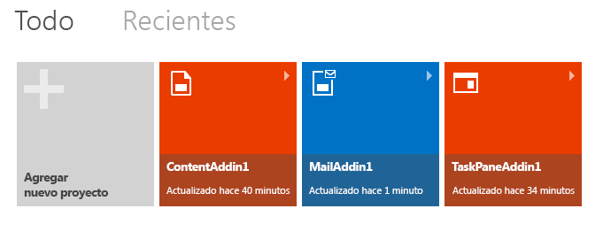

# Crear un complemento de Office con Napa

Un [Complemento de Office](../../docs/overview/office-add-ins.md) es una aplicación web hospedada en un control de explorador o iframe que se ejecuta en el contexto de una aplicación de Office. Los Complementos pueden acceder a los datos del documento o elemento de correo actual y conectarse a los servicios web y a otros recursos basados en web. Para desarrollar complementos, se usan tecnologías basadas en estándares web, como HTML5, JavaScript, CSS3, XML y API de REST. Un complemento no se instala realmente en el equipo que ejecuta la aplicación host de Office; su implementación se hospeda en un servidor web para que pueda mantenerlo y actualizarlo con facilidad desde ese servidor.

Puede crear un Complemento de Office sencillo por medio de Napa. Para ello, necesitará:

- Una [cuenta de Microsoft](http://www.microsoft.com/en-us/account/default.aspx)
    
- La URL de la aplicación web de [Napa](https://www.napacloudapp.com/ )

>**Nota:** Para empezar con un complemento de OneNote, consulte [Crear el primer complemento de OneNote](../onenote/onenote-add-ins-getting-started.md).

## Crear un complemento básico

1. Abra [Napa](https://www.napacloudapp.com/ ) en el explorador.
    
2. Elija el icono **Agregar nuevo proyecto**.
    
     **Nota:** el icono **Agregar nuevo proyecto** aparece solamente si ha creado otros proyectos. Si este es su primer proyecto, vaya al paso siguiente.
    
    

3. Elija el tipo de complemento que desea crear, dele nombre al proyecto y seleccione el botón  **Crear**.
    
    

    El editor de código abre y muestra la página web predeterminada, que ya contiene código de ejemplo que puede ejecutar sin necesidad de hacer nada más.
    
4. En el lado de la página, elija el botón Ejecutar ().
    
    Se abre la aplicación de Office asociada con el tipo de complemento elegido, y aparece el complemento de ejemplo. Ahora puede experimentar con las características del complemento.
    

## Recursos adicionales

- [Información general sobre los complementos de Office](../../docs/overview/office-add-ins.md)
    
- [Proporcione comentarios sobre la plataforma de desarrollador de Office](http://officespdev.uservoice.com/)
    
- [Publicar una pregunta en los foros de Complementos de Office](http://social.msdn.microsoft.com/Forums/officeapps/en-US/home?forum=appsforoffice%2Cofficestore&amp;filter=alltypes&amp;sort=lastpostdesc)
    
