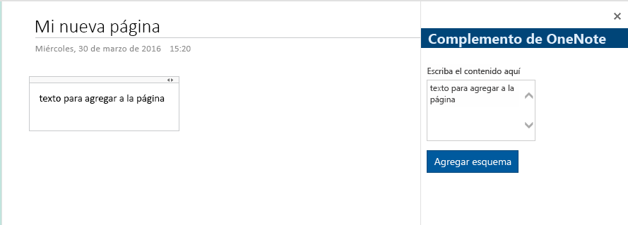
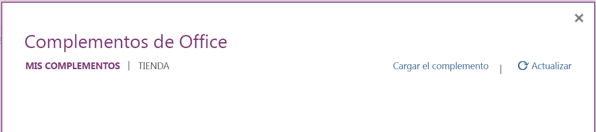
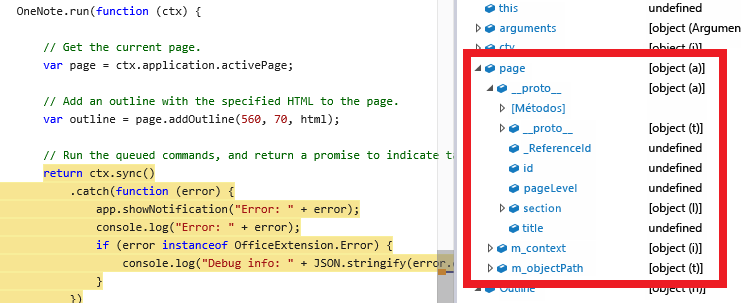

# Crear el primer complemento de OneNote

En este artículo se indican los pasos necesarios para crear un complemento de panel de tareas sencillo que agrega texto a una página de OneNote.

En la imagen siguiente se muestra el complemento que creará.

   

<a name="setup"></a>
## Paso 1: Configurar el entorno de desarrollo
1. Instale Yeoman Office Generator y sus requisitos previos según estas [instrucciones de instalación](https://dev.office.com/docs/add-ins/get-started/create-an-office-add-in-using-any-editor).

   Yeoman Office Generator facilita la creación de proyectos de complementos si no tiene Visual Studio o si quiere usar tecnologías distintas de HTML, CSS y JavaScript. También proporciona acceso rápido a un servidor web de Gulp local para realizar pruebas. 

   >De manera opcional, puede [usar Visual Studio](https://dev.office.com/docs/add-ins/get-started/create-and-debug-office-add-ins-in-visual-studio) para crear sus archivos de proyectos, pero no recibirá la asistencia del servidor de Gulp integrado.

<a name="create-project"></a>
## Paso 2: Crear el proyecto de complemento 
1. Cree una carpeta local llamada *onenote add-in*.

Abra una ventana del símbolo del sistema (**cmd**) y navegue hasta la carpeta **onenote add-in**. Ejecute el comando `yo office`, como se muestra a continuación.

```
C:\your-local-path\onenote add-in\> yo office
```
>En estas instrucciones se usa el símbolo del sistema de Windows, pero también son válidas para otros entornos de shell. 

3. Use las siguientes opciones para crear el proyecto.

| Opción | Valor |
|:------|:------|
| Nombre del proyecto | Complemento de OneNote |
| Carpeta raíz del proyecto | (acepte los valores predeterminados) |
| Tipo de proyecto de Office | Complemento de panel de tareas |
| Aplicaciones de Office compatibles | (elija cualquiera, agregaremos un host de OneNote posteriormente) |
| Tecnología que se usará | HTML, CSS y JavaScript |

<a name="manifest"></a>
## Paso 3: Configurar el manifiesto del complemento 
Abra **manifest-onenote-add-in.xml** en sus archivos del proyecto. Agregue la línea siguiente a la sección **Hosts**. Esto especifica que el complemento es compatible con la aplicación host de OneNote.

```
<Host Name="Notebook" />
```

Tenga en cuenta que **SourceLocation** ya se ha configurado para el servidor web de Gulp.

```
<SourceLocation DefaultValue="https://localhost:8443/app/home/home.html"/>
```

<a name="develop"></a>
## Paso 4: Desarrollar el complemento
Puede desarrollar el complemento con cualquier editor de texto o IDE. Si aún no ha probado Visual Studio Code, puede [descargarlo de forma gratuita](https://code.visualstudio.com/) en Linux, Mac OS X y Windows.

Abra **home.html** en la carpeta *app/home*. 

Edite las referencias a la API de JavaScript para Office y los estilos y componentes de [Office UI Fabric](http://dev.office.com/fabric).

   a. Elimine la marca de comentario del vínculo a fabric.components.min.css.

   b. Reemplace la referencia del script a Office.js con la siguiente referencia a la versión *beta*.

```
<script src="https://appsforoffice.microsoft.com/lib/1.1/hosted/office.js"></script>
```

Las referencias de Office serán similares a esta.

```
<link href="//appsforoffice.microsoft.com/fabric/1.0/fabric.min.css" rel="stylesheet">
<link href="//appsforoffice.microsoft.com/fabric/1.0/fabric.components.min.css" rel="stylesheet">
<script src="https://appsforoffice.microsoft.com/lib/1.1/hosted/office.js"></script>
```

3. Reemplace el elemento `<body>` con el código siguiente. Esto agrega un área de texto y un botón mediante [componentes de Office UI Fabric](http://dev.office.com/fabric/components). El diseño **Responsive Grid** pertenece al conjunto de [estilos de Office UI Fabric](http://dev.office.com/fabric/styles). 

```
<body class="ms-font-m">
    <div class="home flex-container">
        <div class="ms-Grid">
            <div class="ms-Grid-row ms-bgColor-themeDarker">
                <div class="ms-Grid-col">
                    <span class="ms-font-xl ms-fontColor-themeLighter ms-fontWeight-semibold">OneNote Add-in</span>
                </div>
            </div>
        </div>
        <br />
        <div class="ms-Grid">
            <div class="ms-Grid-row">
                <div class="ms-Grid-col">
                    <label class="ms-Label">Enter content here</label>
                    <div class="ms-TextField ms-TextField--placeholder">
                        <textarea id="textBox" rows="5"></textarea>
                    </div>
                </div>
            </div>
            <div class="ms-Grid-row">
                <div class="ms-Grid-col">
                    <div class="ms-font-m ms-fontColor-themeLight header--text">
                        <button class="ms-Button ms-Button--primary" id="addOutline">
                            <span class="ms-Button-icon"><i class="ms-Icon"></i></span>
                            <span class="ms-Button-label">Add outline</span>
                            <span class="ms-Button-description">Adds the content above to the current page.</span>
                        </button>
                    </div>
                </div>
            </div>
        </div>
    </div>
</body>
```

Abra **home.js** en la carpeta *app/home*. Edite la función **Office.initialize** para agregar un evento de clic al botón **Add outline** como se indica a continuación. 

```
// The initialize function is run each time the page is loaded.
Office.initialize = function (reason) {
    $(document).ready(function () {
        app.initialize();

        // Set up event handler for the UI.
        $('#addOutline').click(addOutlineToPage);
    });
};
```
 
Reemplace el método **getDataFromSelection** con el método **addOutlineToPage**. Esto obtiene el contenido del área de texto y lo agrega a la página.

```
// Add the contents of the text area to the page.
function addOutlineToPage() {        
    OneNote.run(function (context) {
       var html = '<p>' + $('#textBox').val() + '</p>';

        // Get the current page.
        var page = context.application.getActivePage();

        // Queue a command to load the page with the title property.             
        page.load('title'); 

        // Add an outline with the specified HTML to the page.
        var outline = page.addOutline(40, 90, html);

        // Run the queued commands, and return a promise to indicate task completion.
        return context.sync()
            .then(function() {
                console.log('Added outline to page ' + page.title);
            })
            .catch(function(error) {
                app.showNotification("Error: " + error); 
                console.log("Error: " + error); 
                if (error instanceof OfficeExtension.Error) { 
                    console.log("Debug info: " + JSON.stringify(error.debugInfo)); 
                } 
            }); 
        });
}
```

<a name="test"></a>
## Paso 5: Probar el complemento en OneNote Online
1. Ejecute el servidor web de Gulp.  

   a. Abra una ventana del símbolo del sistema (**cmd**) y navegue hasta la carpeta **onenote add-in**. 

   b. Ejecute el comando `gulp serve-static`, como se muestra a continuación.

```
C:\your-local-path\onenote add-in\> gulp serve-static
```

Instale el certificado autofirmado del servidor web de Gulp como un certificado de confianza. Solo necesita realizar esto una vez en el equipo para los proyectos de complemento creados con Yeoman Office Generator.

   a. Navegue hasta la página del complemento hospedado. De forma predeterminada, es la misma URL que aparece en el manifiesto:

```
https://localhost:8443/app/home/home.html
```

   b. Instale el certificado como un certificado de confianza. Para más información, vea [Adding Self-Signed Certificates as Trusted Root Certificate](https://github.com/OfficeDev/generator-office/blob/master/docs/trust-self-signed-cert.md) (Agregar certificados autofirmados como certificado raíz de confianza).

3. En OneNote Online, abra un bloc de notas.

4. Elija **Insertar > Complementos de Office**. Se abrirá el cuadro de diálogo Complementos de Office.
  - Si ha iniciado sesión con su cuenta de consumidor, elija la pestaña **MIS COMPLEMENTOS** y después elija **Cargar mi complemento**.
  - Si ha iniciado sesión con su cuenta escolar o de trabajo, elija la pestaña **MI ORGANIZACIÓN** y después elija **Cargar mi complemento**. 
  
  La siguiente imagen muestra la pestaña **MIS COMPLEMENTOS** en blocs de notas de consumidor.

  
  
  >**NOTA**: Para habilitar el botón **Complementos de Office**, haga clic dentro de la página de OneNote.

5. En el diálogo Cargar complemento, busque **manifest-onenote-add-in.xml** en los archivos del proyecto y, después, elija **Cargar**. Mientras realiza pruebas, el archivo de manifiesto se puede almacenar de forma local.

6. El complemento se abre en un iFrame junto a la página de OneNote. Escriba texto en el área de texto y, después, elija **Agregar esquema**. El texto que escriba se agregará a la página. 

## Solución de problemas y sugerencias
- Puede depurar el complemento con las herramientas de desarrollo del navegador. Si usa el servidor web de Gulp y realiza la depuración en Internet Explorer o en Chrome, puede guardar los cambios de forma local y, después, actualizar el iframe del complemento.

- Al inspeccionar un objeto de OneNote, las propiedades que están disponibles actualmente para su uso se muestran como valores reales. Las propiedades que es necesario cargar se muestran como *undefined*. Expanda el nodo `_proto_` para ver las propiedades que se han definido en el objeto pero que aún no se han cargado.

      

- Necesita habilitar el contenido mixto en el explorador si el complemento usa recursos HTTP. Los complementos de producción solo tienen que usar recursos HTTPS seguros.

## Recursos adicionales

- [Introducción a la programación de API de JavaScript para OneNote](onenote-add-ins-programming-overview.md)
- [Referencia de la API de JavaScript de complementos de OneNote](../../reference/onenote/onenote-add-ins-javascript-reference.md)
- [Rubric Grader sample (Ejemplo de Rubric Grader)](https://github.com/OfficeDev/OneNote-Add-in-Rubric-Grader)
- [Office Add-ins platform overview (Información general sobre la plataforma de complementos para Office)](https://dev.office.com/docs/add-ins/overview/office-add-ins)
