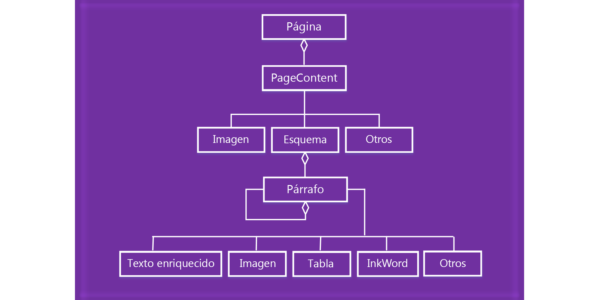

# Trabajar con el contenido de la página de OneNote 

En la API de JavaScript de los complementos de OneNote, el contenido de la página se representa mediante el modelo de objetos siguiente.

  

- Un objeto Page contiene una colección de objetos PageContent.
- Un objeto PageContent contiene un tipo de contenido Outline, Image u Other.
- Un objeto Outline contiene una colección de objetos Paragraph.
- Un objeto Paragraph contiene un tipo de contenido RichText, Image, Table u Other.

Para crear una página de OneNote vacía, use uno de los siguientes métodos:

- [Section.addPage](../../reference/onenote/section.md#addpagetitle-string)
- [Page.insertPageAsSibling](../../reference/onenote/page.md#insertpageassiblinglocation-string-title-string)

Después, use métodos de los objetos siguientes para trabajar con el contenido de la página, como Page.addOutline y Outline.appendHtml. 

- [Page](../../reference/onenote/page.md)
- [Outline](../../reference/onenote/outline.md)
- [Paragraph](../../reference/onenote/paragraph.md)

El contenido y la estructura de una página de OneNote se representan mediante HTML. Solo se admite un subconjunto de HTML para crear o actualizar el contenido de la página, tal como se describe a continuación.

## HTML compatible

La API de JavaScript del complemento de OneNote admite el siguiente HTML para crear y actualizar el contenido de la página:

- `<html>`, `<body>`, `
`, ``, ` ` 
- `
`
- ``
- `<a>`
- `<ul>`, `<ol>`, `<li>` 
- `<table>`, `<tr>`, `<td>`
- `<h1>` ... `<h6>`
- `<b>`, `<em>`, `<strong>`, `<i>`, `<u>`, `<del>`, ``, ``, `<cite>`

## Tener acceso al contenido de la página

Solo es posible tener acceso al *contenido de la página* a través de `Page#load` para la página activa. Para cambiar la página activa, invoque `navigateToPage($page)`.

Se pueden seguir consultando los metadatos, como el título, desde cualquier página.

## Recursos adicionales

- [Introducción a la programación de API de JavaScript para OneNote](onenote-add-ins-programming-overview.md)
- [Referencia de la API de JavaScript de complementos de OneNote](../../reference/onenote/onenote-add-ins-javascript-reference.md)
- [Rubric Grader sample (Ejemplo de Rubric Grader)](https://github.com/OfficeDev/OneNote-Add-in-Rubric-Grader)
- [Office Add-ins platform overview (Información general sobre la plataforma de complementos para Office)](https://dev.office.com/docs/add-ins/overview/office-add-ins)
