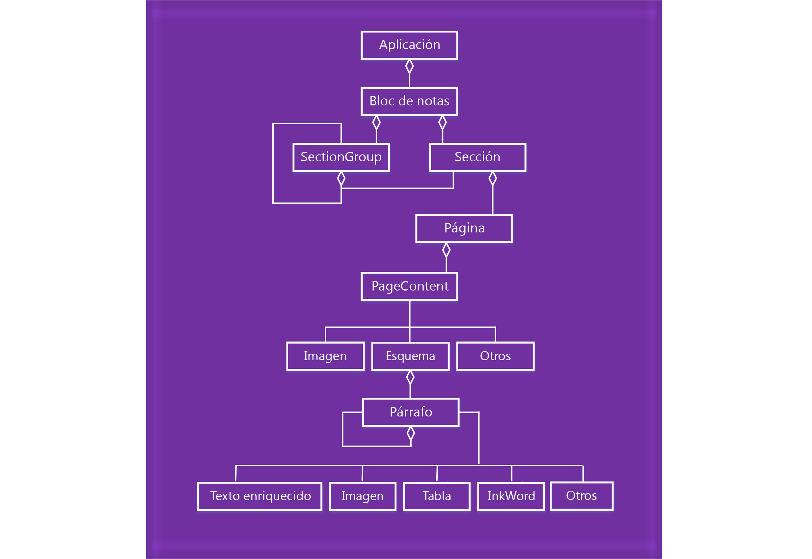

# Introducción a la programación de API de JavaScript para OneNote

OneNote introduce una API de JavaScript para complementos de OneNote Online. Puede crear complementos de panel de tareas, complementos de contenido y comandos de complementos que interactúan con objetos de OneNote y se conectan a servicios web o a otros recursos basados en Web.

Los complementos están formados por dos componentes básicos:

- Una **aplicación web** formada por una página web y los archivos de JavaScript, CSS o de otro tipo. Estos archivos se hospedan en un servidor web o un servicio de hospedaje de sitios web, como Microsoft Azure. En OneNote Online, la aplicación web se muestra en un control de explorador o iframe.
    
- Un **manifiesto XML** que especifica la URL de la página web del complemento y todos los requisitos de acceso, configuraciones y funciones del complemento. Este archivo se almacena en el cliente. Los complementos de OneNote usan el mismo formato de [manifiesto](https://dev.office.com/docs/add-ins/overview/add-in-manifests) que otros complementos de Office.

**Complemento de Office = manifiesto + página web**


### Uso de la API de JavaScript

Los complementos usan el contexto de tiempo de ejecución de la aplicación host para tener acceso a la API de JavaScript. La API tiene dos capas: 

- Una **API avanzada** para operaciones específicas de OneNote a la que se tiene acceso a través del objeto **Application**.
- Una **API común** que se comparte con todas las aplicaciones de Office y a la que se tiene acceso a través del objeto **Document**.

#### Acceso a la API avanzada a través del objeto *Application*

Use el objeto **Application** para tener acceso a objetos de OneNote como **Notebook**, **Section** y **Page**. Con las API avanzadas, puede ejecutar operaciones por lotes en objetos de proxy. El flujo básico sería parecido a este: 

1- Obtenga la instancia de la aplicación desde el contexto.

2- Cree un proxy que representa el objeto de OneNote con el que quiere trabajar. Se interactúa de forma sincrónica con los objetos del proxy mediante operaciones de lectura y escritura en sus propiedades y llamadas a sus métodos. 

3- Realice una llamada a **load** en el proxy para rellenarla con los valores especificados de la propiedad en el parámetro. Esta llamada se agrega a la cola de comandos. 

   Las llamadas del método a la API (como `context.application.getActiveSection().pages;`) también se agregan a la cola.
    
4- Realice una llamada a **context.sync** para ejecutar todos los comandos de la cola en el orden en que se agregaron a la cola. Esto sincroniza el estado entre el script que se ejecuta y los objetos reales, y recupera las propiedades de los objetos de OneNote cargados para su uso en el script. Puede usar el objeto de compromiso devuelto para encadenar acciones adicionales.

Por ejemplo: 

```
    function getPagesInSection() {
        OneNote.run(function (context) {
            
            // Get the pages in the current section.
            var pages = context.application.getActiveSection().pages;
            
            // Queue a command to load the id and title for each page.            
            pages.load('id,title');
            
            // Run the queued commands, and return a promise to indicate task completion.
            return context.sync()
                .then(function () {
                    
                    // Read the id and title of each page. 
                    $.each(pages.items, function(index, page) {
                        var pageId = page.id;
                        var pageTitle = page.title;
                        console.log(pageTitle + ': ' + pageId); 
                    });
                })
                .catch(function (error) {
                    app.showNotification("Error: " + error);
                    console.log("Error: " + error);
                    if (error instanceof OfficeExtension.Error) {
                        console.log("Debug info: " + JSON.stringify(error.debugInfo));
                    }
                });
        });
    }
```

Consulte los objetos y operaciones de OneNote compatibles en la [referencia de la API](../../reference/onenote/onenote-add-ins-javascript-reference.md).

### Acceso a la API común a través del objeto *Document*

Use el objeto **Document** para tener acceso a la API común, como los métodos [getSelectedDataAsync](https://dev.office.com/reference/add-ins/shared/document.getselecteddataasync) y [setSelectedDataAsync](https://dev.office.com/reference/add-ins/shared/document.setselecteddataasync). 

Por ejemplo:  

```
function getSelectionFromPage() {
    Office.context.document.getSelectedDataAsync(
        Office.CoercionType.Text,
        { valueFormat: "unformatted" },
        function (asyncResult) {
            var error = asyncResult.error;
            if (asyncResult.status === Office.AsyncResultStatus.Failed) {
                console.log(error.message);
            }
            else $('#input').val(asyncResult.value);
        });
}
```
Los complementos de OneNote solo son compatibles con las siguientes API comunes:

| API | Notas |
|:------|:------|
| [Office.context.document.getSelectedDataAsync](https://msdn.microsoft.com/en-us/library/office/fp142294.aspx) | **Office.CoercionType.Text** y **Office.CoercionType.Matrix** solo |
| [Office.context.document.setSelectedDataAsync](https://msdn.microsoft.com/en-us/library/office/fp142145.aspx) | **Office.CoercionType.Text**, **Office.CoercionType.Image** y **Office.CoercionType.Html** solo | 
| [var mySetting = Office.context.document.settings.get(name);](https://msdn.microsoft.com/en-us/library/office/fp142180.aspx) | Las opciones de configuración solo son compatibles con complementos de contenido | 
| [Office.context.document.settings.set(name, value);](https://msdn.microsoft.com/en-us/library/office/fp161063.aspx) | Las opciones de configuración solo son compatibles con complementos de contenido | 
| [Office.EventType.DocumentSelectionChanged](https://dev.office.com/reference/add-ins/shared/document.selectionchanged.event) ||

En general, solo se usa la API común para realizar una acción que no es compatible con la API avanzada. Para más información sobre el uso de la API común, vea la [documentación](https://dev.office.com/docs/add-ins/overview/office-add-ins) y la [referencia](https://dev.office.com/reference/add-ins/javascript-api-for-office) de Complementos de Office.


<a name="om-diagram"></a>
## Diagrama del modelo de objetos de OneNote 
En el diagrama siguiente se representa lo que está disponible actualmente en la API de JavaScript de OneNote.

  


## Recursos adicionales

- [Crear el primer complemento de OneNote](onenote-add-ins-getting-started.md)
- [Referencia de la API de JavaScript de complementos de OneNote](../../reference/onenote/onenote-add-ins-javascript-reference.md)
- [Rubric Grader sample (Ejemplo de Rubric Grader)](https://github.com/OfficeDev/OneNote-Add-in-Rubric-Grader)
- [Office Add-ins platform overview (Información general sobre la plataforma de complementos para Office)](https://dev.office.com/docs/add-ins/overview/office-add-ins)
