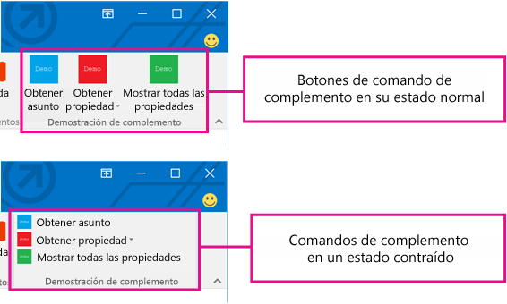
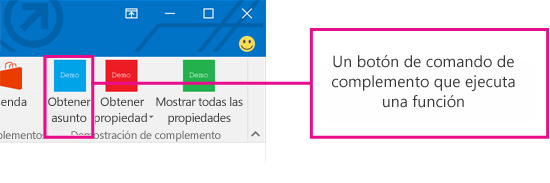
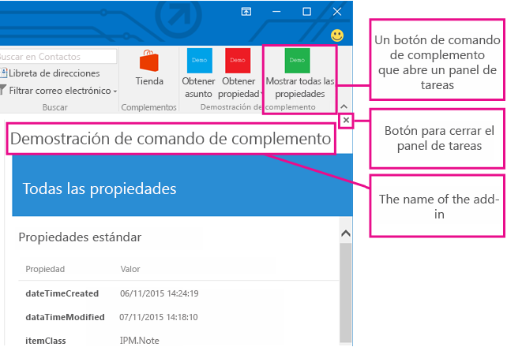
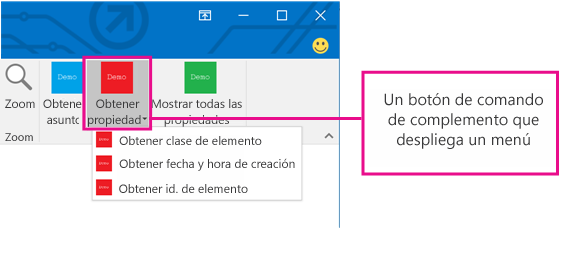

# Comandos de complementos de Outlook

Los comandos de Outlook de correo ofrecen formas de iniciar acciones específicas de los complementos desde la cinta agregando botones o menús desplegables. Esto permite a los usuarios obtener acceso a los complementos de una forma simple, intuitiva y discreta. Como ofrecen mayor funcionalidad de forma perfecta, los comandos de complementos se pueden usar para crear soluciones más atractivas.

> **Nota**: Los comandos de complemento solo están disponibles en Outlook 2016 y Outlook 2013 para Windows. Para admitir los comandos de complemento se necesita la [actualización de seguridad del 8 de marzo de 2016](https://support.microsoft.com/en-us/kb/3114829).

Los comandos de complemento solo están disponibles para complementos contextuales que no usen reglas [temHasAttachment, ItemHasKnownEntity o ItemHasRegularExpressionMatch](manifests/activation-rules.md) que limiten los tipos de elementos en los que se activen. Pero los complementos contextuales pueden presentar comandos distintos dependiendo de si el elemento seleccionado es un mensaje o cita, y pueden elegir aparecer en escenarios de lectura o redacción. Usar comandos de complemento cuando sea posible es un [procedimiento recomendado](../../docs/overview/add-in-development-best-practices.md).

## Crear el comando del complemento

Los comandos de complemento se declaran en el manifiesto del complemento, en el elemento  **VersionOverrides**. Este elemento es una adición al esquema de manifiesto v1.1 que garantiza la compatibilidad inversa. En un cliente que no admite  **VersionOverrides**, los complementos existentes seguirán funcionando como lo hacían sin los comandos de complementos.

Las entradas de manifiesto **VersionOverrides** especifican varios parámetros del complemento, como el host, los tipos de controles que agregar a la cinta, el texto, los iconos y las funciones asociadas. Para más información, consulte [Definir comandos de complemento en el manifiesto de complemento de Outlook](../outlook/manifests/define-add-in-commands.md). 

Cuando un complemento debe proporcionar actualizaciones de estado, como indicadores de progreso o mensajes de error, debe hacerlo a través de las [API de notificación](../../reference/outlook/NotificationMessages.md). El procesamiento de las notificaciones también se debe definir en un archivo HTML separado que se especifica en el nodo  **FunctionFile** del manifiesto.

Los desarrolladores tienen que definir iconos para todos los tamaños necesarios para que los comandos de complemento se adapten correctamente a la cinta. Los iconos tienen tamaños de 80 x 80, 32 x 32 y 16 x 16 píxeles.

## ¿Cómo aparecen los comandos de complementos?

Un comando de complemento aparece en la cinta como un botón. Cuando un usuario instala un complemento, sus comandos aparecen en la interfaz de usuario como un grupo de botones con el nombre del complemento. Esto puede aparecer en una pestaña predeterminada de la cinta o en una pestaña personalizada. Para los mensajes, el lugar predeterminado son las pestañas **Inicio** o **Mensajes**. Para el calendario, la pestaña predeterminada es **Reunión**, **Repetición de la reunión**, **Serie de reuniones** o **Cita**. Para las extensiones de módulo, el lugar predeterminado es una pestaña personalizada. En la pestaña predeterminada, cada complemento puede tener un grupo de la barra de herramientas con un máximo de 6 comandos. En las pestañas personalizadas, el complemento puede tener hasta 10 grupos, cada uno con 6 comandos. Los complementos se limitan a solo una pestaña personalizada.

A medida que la cinta se llena, los comandos de los complementos se adaptan (contraen) de forma ordenada. En todos los casos, los comandos de complementos para un complemento se agrupan.

Después de agregar un comando a un complemento, se quita el nombre del complemento de la barra de la aplicación, excepto si el complemento incluye también un [complemento de Outlook de panel personalizado](../outlook/custom-pane-outlook-add-ins.md). Solo permanece en la cinta el botón de comando de complemento.

## ¿Qué experiencia del usuario existe para los comandos de complementos?

La forma de experiencia del usuario para un comando de complemento consiste en una ficha de cinta de la aplicación host que contiene botones que pueden realizar varias funciones. En este momento se admiten tres formas de interfaz de usuario:

- Un botón que ejecuta una función de JavaScript
        
- Un botón que muestra un menú desplegable con uno o varios botones de los dos tipos

Además, los complementos contextuales admiten lo siguiente: 
- Un botón que inicia el panel de tareas

### Ejecutar una función de JavaScript

Use un botón de comando de complemento que ejecuta una función de JavaScript para escenarios en los que el usuario no necesita realizar selecciones adicionales para iniciar la acción. Esto podría ser para acciones de seguimiento, recordatorios o impresiones. También se podría usar en escenarios en que el usuario necesita información más detallada sobre un servicio. 

En extensiones de módulo, el botón de comando de complemento puede ejecutar funciones de JavaScript que interactúan con el contenido en la interfaz de usuario principal.

### Iniciar el panel de tareas

Use un botón de comando de complemento para abrir un panel de tareas en escenarios en los que un usuario necesita interactuar con un complemento durante un tiempo más prolongado. Por ejemplo, el complemento puede necesitar cambios en las configuraciones o que se completen varios campos. 

El ancho predeterminado del panel de tareas vertical es de 300 píxeles. Se puede modificar el tamaño en Outlook Explorer y en el Inspector. El panel puede cambiar de tamaño de la misma forma que el panel de tareas y de listas.

En la captura de pantalla anterior se muestra un ejemplo de un panel de tareas vertical. El panel se abre con el nombre del comando de complemento en la esquina superior izquierda. También hay un botón **X** en la esquina superior derecha del panel para que el usuario pueda cerrar el complemento cuando termine de usarlo. Este panel no persiste de un mensaje a otro. El complemento proporciona todos los elementos de la interfaz de usuario representados en el panel de tareas, además del nombre del complemento y el botón Cerrar.

Si un usuario elige otro comando de complemento que abre un panel de tareas, el panel se reemplaza por el comando usado recientemente. Si un usuario elige un botón de comando de complemento que ejecuta una función, o un menú desplegable mientras está abierto el panel de tareas, la acción se completa y el panel de tareas permanece abierto.

### Menú desplegable

Un comando de complemento de menú desplegable define una lista estática de botones que se presentan en el menú desplegable. Los botones dentro del menú pueden ser cualquier combinación de botones que ejecuten una función o botones que abran un panel de tareas. No se admiten los submenús.

## ¿Dónde aparecen los comandos de complementos en la IU?

Los comandos de complementos se admiten en cuatro situaciones:

### Leer un mensaje

Cuando el usuario está leyendo un mensaje, los comandos de complemento agregados a la pestaña predeterminada aparecen en la pestaña  **Inicio** cuando el mensaje se ve en el panel de lectura, y en la pestaña **Mensaje** en el caso de los formularios de lectura emergentes.

### Redactar un mensaje

Cuando el usuario está redactando un mensaje, los comandos de complemento agregados a la pestaña predeterminada aparecen en la pestaña  **Mensaje**.

### Crear o ver una cita o reunión como organizador

Al crear o ver una cita o reunión como organizador, los comandos de complemento agregados a la pestaña predeterminada aparecen en las pestañas  **Reunión**,  **Repetición de la reunión**,  **Serie de reuniones** o **Cita** en el caso de los formularios emergentes. Sin embargo, si el usuario selecciona un elemento en el calendario pero no abre el elemento emergente, el grupo del complemento no será visible en la cinta.

### Ver una reunión como asistente

Cuando se ve una reunión como asistente, los comandos de complemento agregados a la pestaña predeterminada aparecen en las pestañas  **Reunión**,  **Repetición de la reunión** o **Serie de reuniones** en el caso de los formularios emergentes. Sin embargo, si el usuario selecciona un elemento en el calendario pero no abre el elemento emergente, el grupo del complemento no será visible en la cinta.

### Usar una extensión de módulo

Al usar una extensión de módulo, los comandos de complemento aparecen en la pestaña personalizada de la extensión.

## Recursos adicionales

- [Definir comandos de complementos en el manifiesto de complemento de Outlook](../outlook/manifests/define-add-in-commands.md)
    
- [Demostración de comando de complemento en complemento de Outlook](https://github.com/jasonjoh/command-demo)
    
