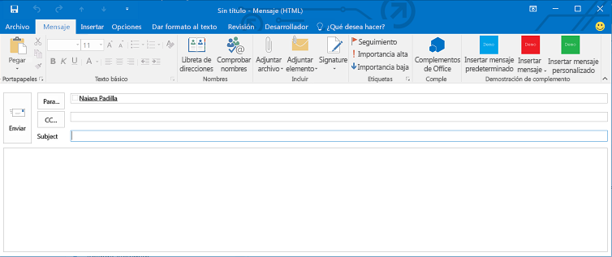
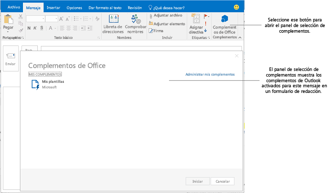

# Crear complementos de Outlook para formularios de redacción

Desde la versión 1.1 del esquema de manifiestos de Complementos de Office y office.js v1.1, puede crear complementos de redacción, que son complementos de Outlook que se activan en los formularios de redacción. Al contrario que los complementos de lectura (complementos de Outlook que se activan en modo de lectura cuando un usuario ve un mensaje o cita), los complementos de redacción están disponibles en los siguientes escenarios:

- Redactar un nuevo mensaje, convocatoria de reunión o cita en un formulario de redacción.
    
- Ver o modificar un elemento de cita o reunión existente en el que el usuario es el organizador.
    
     >**Nota** Si el usuario está en la versión RTM de 2013 de Outlook e Exchange 2013 y visualiza un elemento de reunión organizado por el usuario, el usuario puede encontrar complementos de lectura disponibles. A partir de Office 2013 SP1, hay un cambio tal que en el mismo escenario, solo pueden activarse y estar disponibles los complementos de redacción.
- Redactar un mensaje de respuesta en línea o responder a un mensaje en un formulario de redacción separado.
    
- Editar una respuesta ( **Aceptar**,  **Provisional** o **Rechazar**) a un elemento de reunión o convocatoria.
    
- Proponer una nueva hora para un elemento de reunión.
    
- Reenviar o responder a un elemento de reunión o convocatoria.
    
En todos estos escenarios de redacción se muestran los botones de comando de complemento definidos por el complemento. Para los complementos anteriores que no implementan comandos de complemento, los usuarios pueden seleccionar **Complementos de Office** en la cinta para abrir el panel de selección de complementos y, después, seleccionar e iniciar un complemento de redacción. En la ilustración siguiente se muestran los comandos de complemento en un formulario de redacción.

En la ilustración siguiente se muestra el panel de selección de complementos formado por dos complementos de redacción que no implementan comandos de complemento, activados cuando el usuario redacta una respuesta directa en Outlook.

## Tipos de complementos disponibles en modo de redacción

Los complementos de redacción se implementan como [Comandos de complementos de Outlook](../outlook/add-in-commands-for-outlook.md).

## Características de la API disponibles para complementos de redacción

- Para activar complementos en formularios de redacción, consulte la tabla 1 de [Especificar las reglas de activación en un manifiesto](../outlook/manifests/activation-rules.md#specify-activation-rules-in-a-manifest).
    
- [Agregar y quitar datos adjuntos de un elemento en un formulario de redacción en Outlook](../outlook/add-and-remove-attachments-to-an-item-in-a-compose-form.md)
    
- [Obtener y definir datos de elementos en un formulario de redacción de Outlook](../outlook/get-and-set-item-data-in-a-compose-form.md)
    
- [Obtener, establecer o agregar destinatarios al redactar una cita o un mensaje en Outlook](../outlook/get-set-or-add-recipients.md)
    
- [Obtener o establecer el asunto al redactar una cita o un mensaje en Outlook](../outlook/get-or-set-the-subject.md)
    
- [Introducir datos en el cuerpo al redactar una cita o un mensaje en Outlook](../outlook/insert-data-in-the-body.md)
    
- [Obtener o definir la ubicación al redactar una cita en Outlook](../outlook/get-or-set-the-location-of-an-appointment.md)
    
- [Obtener o establecer la hora al redactar una cita en Outlook](../outlook/get-or-set-the-time-of-an-appointment.md)
    
- [Outlook-Power-Hour_Code-Samples](https://github.com/OfficeDev/Outlook-Power-Hour-Code-Samples):  `ComposeAppDemo`
    

## Recursos adicionales

- [Introducción a los complementos de Outlook para Office 365](https://dev.outlook.com/MailAppsGettingStarted/GetStarted)
    
- [Complementos de Outlook](../outlook/outlook-add-ins.md)
    
