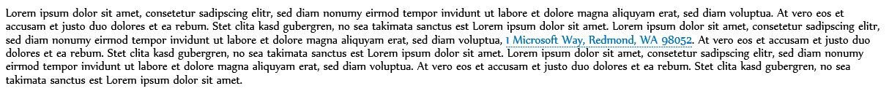
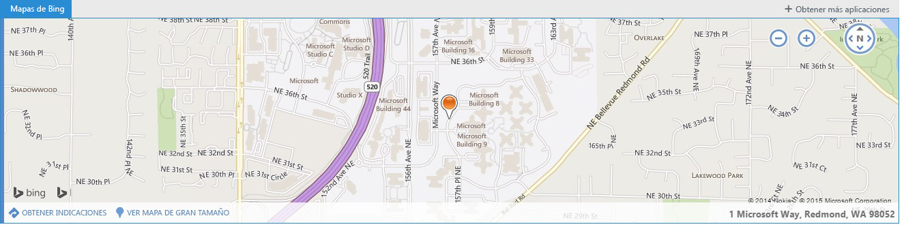

# <a name="contextual-outlook-add-ins"></a>Complementos de Outlook contextuales

Los complementos contextuales son complementos de Outlook que se activan en función del texto de un mensaje o una cita. Mediante el uso de complementos contextuales, un usuario puede iniciar tareas relacionadas con un mensaje sin salir del propio mensaje, lo que da como resultado una experiencia de usuario más fácil y completa.

Los complementos contextuales son diferentes de los que implican datos adjuntos o que son específicos de ciertos tipos de mensajes. Los siguientes son ejemplos de complementos contextuales:


- Seleccionar una dirección para abrir un mapa de la ubicación.
    
- Hacer clic en una cadena que abre un complemento de sugerencia de reunión.
    
- Seleccionar un número de teléfono para agregar contactos.
    
Actualmente, los complementos contextuales se limitan a Outlook Web App.

## <a name="how-to-make-a-contextual-add-in"></a>Cómo hacer un complemento contextual

Para crear un complemento contextual, su manifiesto de complemento debe especificar la entidad o la expresión regular que puede activarlo. La entidad puede ser cualquiera de las propiedades del objeto [Entities](../../reference/outlook/simple-types.md). Por lo tanto, el manifiesto del complemento debe contener una regla de tipo  **ItemHasKnownEntity** o **ItemHasRegularExpressionMatch**. En el ejemplo siguiente se muestra cómo especificar una entidad que es un número de teléfono:


```XML
<Rule xsi:type="ItemHasKnownEntity" EntityType="PhoneNumber"/>

```

Después de asociar un complemento contextual a una cuenta, se iniciará automáticamente cuando el usuario haga clic en una expresión regular o una entidad resaltada. Para más información sobre las expresiones regulares para los complementos de Outlook, vea [Usar las reglas de activación de las expresiones regulares para mostrar un complemento de Outlook](../outlook/use-regular-expressions-to-show-an-outlook-add-in.md).

Hay varias restricciones sobre los complementos contextuales:


- Un complemento contextual solo puede existir en complementos de lectura (no en complementos de redacción).
    
- No se puede especificar el color de la entidad resaltada.
    
- Una entidad que no está resaltada no iniciará un complemento contextual en una tarjeta.
    
- La dimensión de la tarjeta es de 140 a 450 píxeles (se recomienda un límite de 300 píxeles) de alto y 570 píxeles de ancho.
    
- No se puede especificar si el complemento se mostrará en la tarjeta o en la barra de complementos.
    

## <a name="how-to-launch-a-contextual-add-in"></a>Cómo iniciar un complemento contextual

Un usuario inicia un complemento contextual a través de texto, ya sea una entidad conocida o la expresión regular de un desarrollador, o mediante la barra de complementos. Normalmente, un usuario identifica un complemento contextual porque la entidad está resaltada. El siguiente ejemplo muestra cómo aparece el resaltado en un mensaje. Aquí, la entidad (una dirección) es de color azul y está subrayada con una línea de puntos azul. Un usuario inicia el complemento contextual haciendo clic en la entidad resaltada. 


**Ejemplo de texto con la entidad resaltada (una dirección)**



Aunque el resaltado es la mejor indicación de los complementos contextuales, existen algunos casos en los que un complemento contextual aparecerá en la barra de complementos:

- Cuando la entidad es una dirección URL o una dirección de correo electrónico
    
- Cuando el manifiesto del complemento tiene una regla con type="ItemHasRegularExpressionMatch" y PropertyName="BodyAsHTML" o PropertyName="SenderSMTPAddress"
    
- Si el manifiesto de complemento contiene una regla de activación que usa una OR RuleCollection o donde la primera regla tiene type="ItemIs" con itemType="Appointment" o "Message" y donde la segunda regla tiene type="ItemHasKnownEntity" o "ItemHasRegularExpressionMatch"
    
- Si la complejidad del cuerpo del correo electrónico afecta al cliente de correo
    
Cuando hay varias entidades o complementos contextuales en un mensaje, hay unas cuantas reglas de interacción del usuario:


- Si hay varias entidades, el usuario debe hacer clic en una entidad diferente para iniciar el complemento para este.
    
- Si una entidad activa varios complementos, cada uno abre una pestaña nueva. El usuario cambia entre las pestañas, de forma similar a la barra de complementos, para cambiar entre complementos. Por ejemplo, un nombre y dirección que podría desencadenar un complemento de teléfono y un mapa.
    
- Si una única cadena contiene varias entidades que activan varios complementos, se resalta la cadena completa y, al hacer clic, en la cadena se muestran todas los complementos relacionados con la cadena en pestañas diferentes. Por ejemplo, una cadena que describe una propuesta de reunión en un restaurante podría activar el complemento de reunión sugerida y un complemento de clasificación de restaurantes.
    

## <a name="how-a-contextual-add-in-displays"></a>Cómo se muestra un complemento contextual

Un complemento contextual activado aparece en dos lugares:


- En la tarjeta, que es una ventana independiente junto a la entidad
    
- En la barra de complementos, que es la línea entre el remitente y el cuerpo de un mensaje
    
La tarjeta normalmente aparecerá debajo de la entidad y se centra respecto a la entidad tanto como sea posible. Si no hay suficiente espacio debajo de la entidad, la tarjeta se coloca por encima de esta. La siguiente captura de pantalla muestra la entidad resaltada y, debajo de esta, un complemento activado (Mapas de Bing) en una tarjeta.


**Ejemplo de un complemento que se muestra en una tarjeta**


Tenga en cuenta lo siguiente:

- La pestaña "Mapas de Bing" aparece como texto blanco con un fondo azul. Si se selecciona un complemento, la pestaña cambiará a texto azul con un fondo blanco.
    
- Las pestañas de complementos adicionales, si las hay, aparecerán en una pestaña a la derecha "Mapas de Bing" con texto azul y un fondo blanco. Cuando un usuario hace clic en cualquier pestaña, esta cambia a texto blanco con un fondo azul y se carga el nuevo complemento.
    
- Cuando se hace clic en el botón "+ Obtener más complementos", se abre la Tienda Office.
    
- Si el nombre del complemento es demasiado largo para el espacio disponible, se reemplazará por "…", que está a la izquierda de "+ Obtener más complementos". Después, el usuario puede hacer clic en una lista desplegable de los complementos que no caben en la barra.
    
- Para cerrar la tarjeta y finalizar el complemento, el usuario hace clic en cualquier lugar fuera de la tarjeta.
    
La siguiente captura de pantalla muestra cómo aparecerá el mismo complemento (en este caso, Mapas de Bing) en la barra si no se resalta el texto (por ejemplo, si se incluye en un hipervínculo).


**Ejemplo de una barra de complementos y un complemento en un iframe**



Tenga en cuenta lo siguiente:

- En esta captura de pantalla, la barra de complementos muestra el nombre del complemento iniciado y el botón "+ Obtener más complementos" encima del iframe. Si hay otros complementos (contextuales o no) que se inician desde la barra de la complementos, también aparecerán.
    
- El iframe muestra el complemento. El desarrollador puede establecer la altura del iframe, pero el ancho es un valor fijo. Se usa la misma altura para la barra de complementos del complemento que para la tarjeta. El desarrollador no necesita especificar dos alturas distintas.
    

## <a name="how-contextual-add-ins-appear-on-different-devices"></a>Cómo aparece un complemento contextual en distintos dispositivos

En un equipo de escritorio, un complemento contextual se muestra normalmente en una tarjeta y, si hay varios complementos, aparecen en pestañas diferentes. En tabletas, el mismo complemento se muestra al dorso y, si hay varios complementos, aparecen en pestañas. En teléfonos, el complemento se muestra como una experiencia envolvente. En caso de que haya varios complementos activados en la entidad, se muestra "…" en la parte superior derecha para permitir a los usuarios navegar entre los diferentes complementos de la entidad específica.


## <a name="current-contextual-add-ins"></a>Complementos contextuales actuales

Los siguientes complementos contextuales están instalados de forma predeterminada para los usuarios con complementos de Outlook:


- Mapas de Bing 
    
- Reuniones sugeridas
    
Además, el complemento contextual [Package Tracker](https://store.office.com/package-tracker-WA104162083.aspx?assetid=WA104162083.aspx) está disponible en la Tienda Office.


## <a name="additional-resources"></a>Recursos adicionales


- [Introducción a los complementos de Outlook para Office 365](https://dev.outlook.com/MailAppsGettingStarted/GetStarted.aspx)
    
- [Usar las reglas de activación de las expresiones regulares para mostrar un complemento de Outlook](../outlook/use-regular-expressions-to-show-an-outlook-add-in.md)

- [Objeto Entities](../../reference/outlook/simple-types.md)
    
