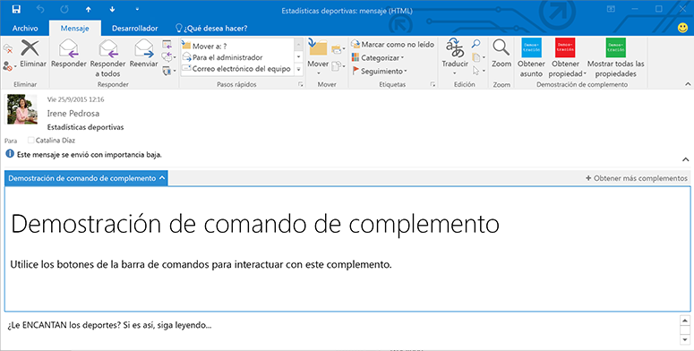

# Panel personalizado Complementos de Outlook

Un panel personalizado es un punto de extensión para un complemento que se activa cuando se cumplen ciertas condiciones en el elemento que está seleccionado. Se define en el manifiesto del complemento en el elemento  **VersionOverrides** con los demás comandos de complemento que este implementa. Para obtener más información, consulte [Definir comandos de complementos en el manifiesto de complemento de Outlook](../outlook/manifests/define-add-in-commands.md). Un panel personalizado solo puede aparecer en un mensaje leído o en las vistas de asistentes de una cita. Muestra una entrada en la barra de complementos. Cuando el usuario hace clic en la entrada, se muestra el panel personalizado en orientación horizontal encima del cuerpo del elemento. Tienen la misma apariencia y el mismo comportamiento que los complementos del modo de lectura que no implementan comandos de complemento.

**Un complemento con un panel personalizado en modo lectura**



En el siguiente ejemplo se define un panel personalizado de elementos que son mensajes, tienen datos adjuntos o contienen una dirección. 


```
<ExtensionPoint xsi:type="CustomPane">
  <RequestedHeight>100< /RequestedHeight> 
  <SourceLocation resid="residReadTaskpaneUrl"/>
  <Rule xsi:type="RuleCollection" Mode="Or">
    <Rule xsi:type="ItemIs" ItemType="Message"/>
    <Rule xsi:type="ItemHasAttachment"/>
    <Rule xsi:type="ItemHasKnownEntity" EntityType="Address"/>
  </Rule>
</ExtensionPoint>
```


-  **RequestedHeight** especifica la altura deseada en píxeles de este complemento de correo cuando se ejecuta en un equipo de escritorio. En otros dispositivos se omite. Puede ser un valor de entre 32 y 450. Si no se establece, el valor predeterminado es 350 px. Opcional.
    
-  **SourceLocation** especifica la página HTML que proporciona la interfaz de usuario para el panel personalizado. El atributo **resid** se establece en el valor del atributo **id** de un elemento **Url** en el elemento **Resources**. Obligatorio.
    
-  
  **Rule** especifica la regla o colección de reglas que indican el momento de activación del complemento. Es lo mismo que se define en [Manifiestos de complementos de Outlook](../outlook/manifests/manifests.md), pero la regla [ItemIs](http://msdn.microsoft.com/en-us/library/f7dac4a3-1574-9671-1eda-47f092390669%28Office.15%29.aspx) tiene los cambios siguientes: **ItemType** es "Message" o "AppointmentAttendee" y no existe el atributo **FormType**. Para obtener más información, consulte [Reglas de activación para complementos de Outlook](../outlook/manifests/activation-rules.md).
    

## Recursos adicionales


- [Introducción a los complementos de Outlook para Office 365](https://dev.outlook.com/MailAppsGettingStarted)
    
- [Reglas de activación para complementos de Outlook](../outlook/manifests/activation-rules.md)
    
- [Manifiestos de complementos de Outlook](../outlook/manifests/manifests.md)
    
- [Definir comandos de complementos en el manifiesto de complemento de Outlook](../outlook/manifests/define-add-in-commands.md)
    
