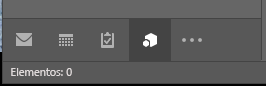
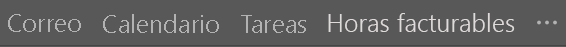
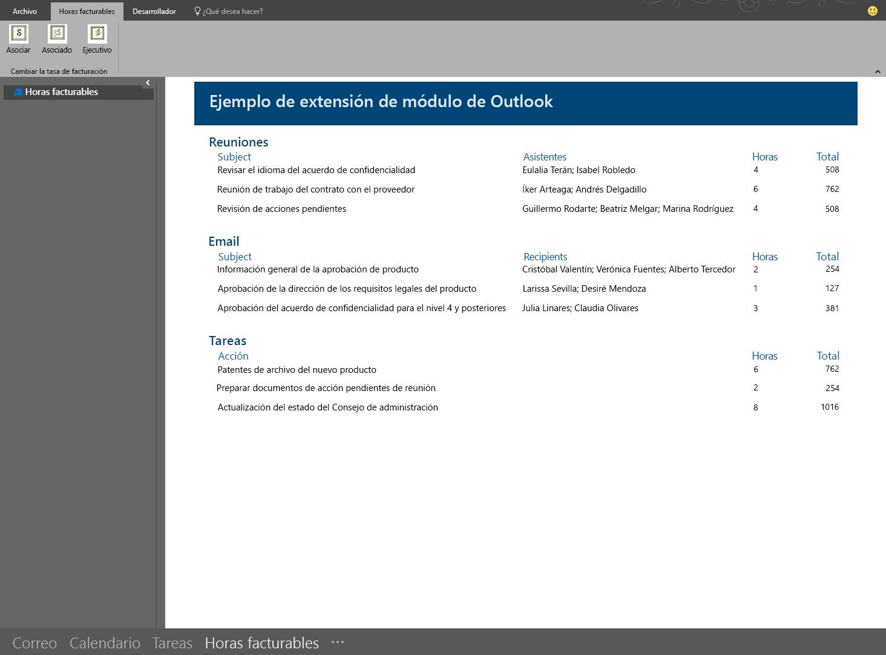

# Complementos de extensión de módulo de Outlook 

Los complementos de extensión de módulo se muestran en la barra de navegación de Outlook junto al correo, las tareas y los calendarios. Una extensión de módulo no está limitada al uso de información de correos y citas, sino que se pueden crear aplicaciones que se ejecutan dentro de Outlook para que sus usuarios puedan tener acceso fácilmente a información sobre la empresa y herramientas de productividad sin tener que salir de Outlook.

> **Nota**: Las extensiones de módulo solo están disponibles en Office 2016.

Para abrir una extensión de módulo, los usuarios hacen clic en el nombre o el icono del módulo en la barra de navegación de Outlook. Si el usuario tiene seleccionada la navegación compacta, en la barra de navegación se mostrará un icono para indicar que se ha cargado una extensión.

Si el usuario no usa la navegación compacta, la barra de navegación tiene dos apariencias (si se ha cargado una extensión, se muestra el nombre del complemento).

Cuando se han cargado más de un complemento, se muestra la palabra "Complementos". Al hacer clic en una de las dos opciones, se abre la interfaz de usuario de la extensión.

Al hacer clic en una extensión, Outlook reemplaza el módulo integrado con el módulo personalizado para que los usuarios puedan interactuar con el complemento. Puede usar todas las características de la API de JavaScript para Outlook en el complemento, así como crear botones de comando en la cinta de Outlook que interactuarán con el contenido del complemento. Este complemento de ejemplo está integrado en la barra de navegación de Outlook y tiene comandos de la cinta que actualizarán el contenido del complemento.

Esta es una sección de un archivo de manifiesto donde se define una extensión de módulo.

    <!-- Add Outlook module extension point -->
    <VersionOverrides xmlns="http://schemas.microsoft.com/office/mailappversionoverrides"
                      xsi:type="VersionOverridesV1_0">
       <VersionOverrides xmlns="http://schemas.microsoft.com/office/mailappversionoverrides/1.1"
                         xsi:type="VersionOverridesV1_1">

         <!-- Begin override of existing elements -->
         <Description resid="residVersionOverrideDesc" />
    
         <Requirements>
           <bt:Sets DefaultMinVersion="1.3">
              <bt:Set Name="Mailbox" />
            </bt:Sets>
          </Requirements>
          <!-- End override of existing elements -->

          <Hosts>
            <Host xsi:type="MailHost">
              <DesktopFormFactor>
                <!-- Set the URL of the file that contains the
                     JavaScript function that controls the extension -->
                <FunctionFile resid="residFunctionFileUrl" />
    
                <!--New Extension Point - Module for a ModuleApp -->
                <ExtensionPoint xsi:type="Module">
                  <SourceLocation resid="residExtensionPointUrl" />
                  <Label resid="residExtensionPointLabel" />
    
                  <CommandSurface>
                    <CustomTab id="idTab">
                      <Group id="idGroup">
                        <Label resid="residGroupLabel" />
    
                        <Control xsi:type="Button" id="group.changeToAssociate">
                          <Label resid="residChangeToAssociateLabel" />
                          <Supertip>
                            <Title resid="residChangeToAssociateLabel" />
                            <Description resid="residChangeToAssociateDesc" />
                          </Supertip>
                          <Icon>
                            <bt:Image size="16" resid="residAssociateIcon16" />
                            <bt:Image size="32" resid="residAssociateIcon32" />
                            <bt:Image size="80" resid="residAssociateIcon80" />
                          </Icon>
                          <Action xsi:type="ExecuteFunction">
                            <FunctionName>changeToAssociateRate</FunctionName>
                          </Action>
                        </Control>
                        
                    </Group>
                      <Label resid="residCustomTabLabel" />
                    </CustomTab>
                  </CommandSurface>
                </ExtensionPoint>
              </DesktopFormFactor>
            </Host>
          </Hosts>
    
          <Resources>
            <bt:Images>
              <bt:Image id="residAddinIcon16" 
                        DefaultValue="https://localhost:8080/Executive-16.png" />
              <bt:Image id="residAddinIcon32" 
                        DefaultValue="https://localhost:8080/Executive-32.png" />
              <bt:Image id="residAddinIcon80" 
                        DefaultValue="https://localhost:8080/Executive-80.png" />
            
              <bt:Image id="residAssociateIcon16" 
                        DefaultValue="https://localhost:8080/Associate-16.png" />
              <bt:Image id="residAssociateIcon32" 
                        DefaultValue="https://localhost:8080/Associate-32.png" />
              <bt:Image id="residAssociateIcon80" 
                        DefaultValue="https://localhost:8080/Associate-80.png" />
            </bt:Images>
    
            <bt:Urls>
              <bt:Url id="residFunctionFileUrl" 
                      DefaultValue="https://localhost:8080/" />
              <bt:Url id="residExtensionPointUrl" 
                      DefaultValue="https://localhost:8080/" />
            </bt:Urls>
    
            <!--Short strings must be less than 30 characters long -->
            <bt:ShortStrings>
              <bt:String id="residExtensionPointLabel" 
                         DefaultValue="Billable Hours" />
              <bt:String id="residGroupLabel" 
                         DefaultValue="Change billing rate" />
              <bt:String id="residCustomTabLabel" 
                         DefaultValue="Billable hours" />
    
              <bt:String id="residChangeToAssociateLabel" 
                         DefaultValue="Associate" />
            </bt:ShortStrings>
    
            <bt:LongStrings>
              <bt:String id="residVersionOverrideDesc" 
                         DefaultValue="Version override description" />
    
              <bt:String id="residChangeToAssociateDesc" 
                         DefaultValue="Change to the associate billing rate: $127/hr" />
            </bt:LongStrings>
          </Resources>
        </VersionOverrides>
      </VersionOverrides>

## Recursos adicionales

* [Manifiestos de complementos de Outlook](manifests/manifests.md)
* [Definir comandos de complementos en el manifiesto de complemento de Outlook](manifests/define-add-in-commands.md)
* [Ejemplo Horas facturables de extensiones de módulo de Outlook](https://github.com/OfficeDev/Outlook-Add-in-JavaScript-ModuleExtension)
