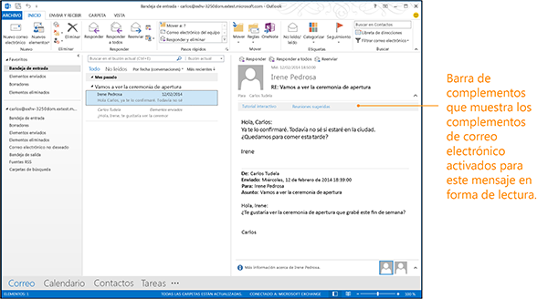

# <a name="activation-rules-for-outlook-addins"></a>Reglas de activación para complementos de Outlook

Outlook activa algunos tipos de complemento si el mensaje o la cita que lee o redacta el usuario cumple las reglas de activación de los mismos. Esto se aplica a todos los complementos que utilizan el esquema de manifiesto 1.1. A continuación, el usuario puede elegir el complemento de la interfaz de usuario de Outlook para que se inicie con el elemento actual.

En la siguiente ilustración se muestran complementos de Outlook activados en la barra de complementos del mensaje en el panel de lectura. 




## <a name="specify-activation-rules-in-a-manifest"></a>Especificar las reglas de activación en un manifiesto


Para que Outlook active un complemento para condiciones específicas, especifique reglas de activación en el manifiesto del complemento. Hay dos elementos **Rule** que se pueden usar:

- [Elemento Rule (MailApp complexType)](../../../reference/manifest/rule.md): especifica una regla individual.
- [Elemento Rule (RuleCollection complexType)](#rulecollection-rule): combina varias reglas con operaciones lógicas.
    

 > **Nota:**  El elemento **Rule** que usa para especificar una regla individual es del tipo complejo abstracto [Rule](../../../reference/manifest/rule.md). Cada uno de los tipos siguientes de reglas extiende este tipo complejo abstracto **Rule**. Si especifica una regla individual en un manifiesto, debe usar el atributo [xsi:type](http://www.w3.org/TR/xmlschema-1/) para definir uno de los tipos siguientes de reglas. Por ejemplo, la regla siguiente define una regla [ItemIs](#itemis-rule): `<Rule xsi:type="ItemIs" ItemType="Message" />` El atributo **FormType** se aplica a reglas de activación en el manifiesto v1.1, pero no está definido en **VersionOverrides** v1.0. Por lo tanto, no se puede usar si [ItemIs](#itemis-rule) se usa en el nodo **VersionOverrides**.

En la tabla siguiente se muestran los tipos de reglas disponibles. Puede obtener más información en la tabla y en los artículos especificados en [Crear complementos de Outlook para formularios de lectura](../../outlook/read-scenario.md).


|**Nombre de la regla**|**Formularios correspondientes**|**Descripción**|
|:-----|:-----|:-----|
|[ItemIs](#itemis-rule)|Lectura, Redacción|Comprueba si el elemento actual es del tipo especificado (mensaje o cita). También puede comprobar la clase del elemento y tipo de formulario, y opcionalmente la clase de mensaje del elemento.|
|[ItemHasAttachment](#itemhasattachment-rule)|Lectura|Comprueba si el elemento seleccionado contiene datos adjuntos.|
|[ItemHasKnownEntity](#itemhasknownentity-rule)|Lectura|Comprueba si el elemento seleccionado contiene una o más entidades conocidas. Más información: [Coincidencia de cadenas en un elemento de Outlook como entidades conocidas](../../outlook/match-strings-in-an-item-as-well-known-entities.md).|
|[ItemHasRegularExpressionMatch](#itemhasregularexpressionmatch-rule)|Lectura|Comprueba si la dirección de correo del remitente, el asunto o el cuerpo del elemento seleccionado contienen algún resultado con una expresión regular.Más información: [Usar las reglas de activación de las expresiones regulares para mostrar un complemento de Outlook](../../outlook/use-regular-expressions-to-show-an-outlook-add-in.md).|
|[RuleCollection](#rulecollection-rule)|Lectura, Redacción|Combina un conjunto de reglas de forma que se puedan formar reglas más complejas.|

## <a name="itemis-rule"></a>Regla ItemIs


El tipo complejo  **ItemIs** define una regla que se evalúa en **true** si el elemento actual coincide con el tipo de elemento y, opcionalmente, la clase de mensaje del elemento si está indicada en la regla.

Especifique uno de los siguientes tipos de elementos en el atributo  **ItemType** de una regla **ItemIs**. Puede especificar más de una regla  **ItemIs** en un manifiesto. ItemType simpleType define los tipos de elementos de Outlook compatibles con complementos de Outlook.


|**Valor**|**Descripción**|
|:-----|:-----|
|**Appointment**|Especifica un elemento en un calendario de Outlook. Esto incluye un elemento de reunión al que se ha respondido y tiene un organizador y asistentes o una cita que no tiene un organizador ni asistentes y es simplemente un elemento del calendario.Corresponde a la clase de mensaje IPM.Appointment en Outlook.|
|**Message**|Especifica uno de los siguientes elementos recibidos normalmente en la Bandeja de entrada: <ul><li><p>Un mensaje de correo. Corresponde a la clase de mensaje IPM.Note en Outlook.</p></li><li><p>Una convocatoria, respuesta o cancelación de reunión. Corresponde a las siguientes clases de mensaje en Outlook:</p><p>IPM.Schedule.Meeting.Request</p><p>IPM.Schedule.Meeting.Neg</p><p>IPM.Schedule.Meeting.Pos</p><p>IPM.Schedule.Meeting.Tent</p><p>IPM.Schedule.Meeting.Canceled</p></li></ul>|
El atributo  **FormType** se usa para especificar el modo (lectura o redacción) en el que el complemento se debe activar.


 > **Nota:** El atributo ItemIs **FormType** se define en el esquema versión 1.1 y posteriores, pero no en **VersionOverrides** versión 1.0. No incluya el atributo **FormType** al definir comandos de complemento.

Una vez activado un complemento, se puede usar la propiedad [mailbox.item](../../../reference/outlook/Office.context.mailbox.item.md) para obtener el elemento seleccionado actualmente en Outlook y la propiedad [item.itemType](../../../reference/outlook/Office.context.mailbox.item.md) para obtener el tipo del elemento actual.

Puede usar el atributo  **ItemClass** para especificar la clase de mensaje del elemento, y el atributo **IncludeSubClasses** para especificar si la regla debería ser **true** cuando el elemento es una subclase de la clase especificada.

Para más información sobre las clases de mensajes, vea [Tipos de elementos y clases de mensajes](http://msdn.microsoft.com/library/15b709cc-7486-b6c7-88a3-4a4d8e0ab292%28Office.15%29.aspx).

En el ejemplo siguiente se muestra una regla  **ItemIs** que muestra el complemento en la barra de complementos de Outlook cuando el usuario lee un mensaje.

```xml
<Rule xsi:type="ItemIs" ItemType="Message" FormType="Read" />
```

El ejemplo siguiente es una regla  **ItemIs** que permite a los usuarios ver el complemento en la barra de complementos de Outlook cuando el usuario está leyendo un mensaje o una cita.

```xml
<Rule xsi:type="RuleCollection" Mode="Or">
  <Rule xsi:type="ItemIs" ItemType="Message" FormType="Read" />
  <Rule xsi:type="ItemIs" ItemType="Appointment" FormType="Read" />
</Rule>
```


## <a name="itemhasattachment-rule"></a>Regla ItemHasAttachment


El tipo de complejo  **ItemHasAttachment** define una regla que comprueba si el elemento seleccionado contiene datos adjuntos.

```xml
<Rule xsi:type="ItemHasAttachment" />
```


## <a name="itemhasknownentity-rule"></a>Regla ItemHasKnownEntity

Antes de que un elemento esté disponible para un complemento, el servidor lo examina para determinar si el asunto y el cuerpo contienen texto que pueda ser una de las entidades conocidas. Si se encuentra alguna de estas entidades, se coloca en una colección de entidades conocidas a la cual se puede obtener acceso usando el método  **getEntities** o **getEntitiesByType** de ese elemento.

Puede especificar una regla con el tipo complejo **ItemHasKnownEntity**, que muestra su complemento cuando hay una entidad del tipo especificado en el elemento. Puede especificar las siguientes entidades conocidas en el atributo **EntityType** de una regla **ItemHasKnownEntity**:
-  Address
-  Contact
-  EmailAddress
-  MeetingSuggestion
-  PhoneNumber
-  TaskSuggestion
-  URL
    
Puede incluir una expresión regular en el atributo  **RegularExpression** de forma que su complemento se muestre solo cuando haya una entidad que coincida con la expresión regular. Para obtener resultados con expresiones regulares especificadas en reglas **ItemHasKnownEntity**, puede usar el método  **getRegExMatches** o **getFilteredEntitiesByName** para el elemento de Outlook seleccionado actualmente.

En el ejemplo siguiente aparece una colección de elementos  **Rule** que muestran el complemento cuando una de las entidades conocidas especificadas aparece en el mensaje.

```xml
<Rule xsi:type="RuleCollection" Mode="Or">
    <Rule xsi:type="ItemHasKnownEntity" EntityType="Address" />
    <Rule xsi:type="ItemHasKnownEntity" EntityType="MeetingSuggestion" />
    <Rule xsi:type="ItemHasKnownEntity" EntityType="TaskSuggestion" />
</Rule>
```

En el ejemplo siguiente aparece una regla  **ItemHasKnownEntity** con un atributo **RegularExpression** que activa el complemento cuando una URL que contiene la palabra "contoso" aparece en el mensaje.


```xml
<Rule xsi:type="ItemHasKnownEntity" EntityType="Url" RegularExpression="contoso" />
```

Para más información sobre las entidades en las reglas de activación, vea [Coincidencia de cadenas en un elemento de Outlook como entidades conocidas](../../outlook/match-strings-in-an-item-as-well-known-entities.md).


## <a name="itemhasregularexpressionmatch-rule"></a>Regla ItemHasRegularExpressionMatch


El tipo complejo  **ItemHasRegularExpressionMatch** define una regla que usa una expresión regular para buscar resultados en el contenido de una propiedad especificada para un elemento. Si el texto que coincide con la expresión regular se encuentra en la propiedad especificada, Outlook activa la barra de complementos y muestra el complemento. Puede usar el método **getRegExMatches** o **getRegExMatchesByName** del objeto que representa el elemento seleccionado actualmente para obtener resultados para la expresión regular especificada.

El siguiente ejemplo muestra un elemento  **ItemHasRegularExpressionMatch** que activa el complemento cuando el cuerpo del elemento seleccionado contiene "apple", "banana" o "coconut", sin distinción de mayúsculas y minúsculas.

```xml
<Rule xsi:type="ItemHasRegularExpressionMatch" RegExName="fruits" RegExValue="apple|banana|coconut" pPropertyName="BodyAsPlaintext" IgnoreCase="true" />
```

Para más información sobre el uso de la regla  **ItemHasRegularExpressionMatch**, consulte [Usar las reglas de activación de las expresiones regulares para mostrar un complemento de Outlook](../../outlook/use-regular-expressions-to-show-an-outlook-add-in.md).


## <a name="rulecollection-rule"></a>Regla RuleCollection


El tipo complejo  **RuleCollection** combina varias reglas en una sola regla. Se puede especificar si las reglas en la colección deben combinarse según un operador lógico OR o un operador AND con el atributo **Mode**.

Cuando se especifica el operador lógico AND, un elemento debe satisfacer todas las reglas seleccionadas en la colección para mostrar el complemento. Si se especifica el operador lógico OR, un elemento que solo satisfaga alguna de las reglas especificadas en la colección mostrará el complemento.

Puede combinar reglas  **RuleCollection** para formar reglas complejas. El ejemplo siguiente activa el complemento cuando una cita o mensaje contiene una dirección.

```xml
<Rule xsi:type="RuleCollection" Mode="And">
  <Rule xsi:type="RuleCollection" Mode="Or">
    <Rule xsi:type="ItemIs" ItemType="Message" FormType="Read" />
    <Rule xsi:type="ItemIs" ItemType="Appointment" FormType="Read"/>
  </Rule>
  <Rule xsi:type="ItemHasKnownEntity" EntityType="Address" />
</Rule>
```

El siguiente ejemplo activa el complemento cuando el usuario está redactando un mensaje o cuando está viendo una cita y el asunto o el cuerpo de la cita contiene una dirección.

```xml
<Rule xsi:type="RuleCollection" Mode="Or"> 
  <Rule xsi:type="ItemIs" ItemType="Message" FormType="Edit" /> 
  <Rule xsi:type="RuleCollection" Mode="And">
    <Rule xsi:type="ItemIs" ItemType="Appointment" FormType="Read" />
    <Rule xsi:type="ItemHasKnownEntity" EntityType="Address" />
  </Rule> 
</Rule>
```


## <a name="limits-for-rules-and-regular-expressions"></a>Límites de reglas y expresiones regulares


Para proporcionar una experiencia satisfactoria con los complementos de Outlook, debe cumplir las instrucciones de uso de API y activación. En la siguiente tabla se muestran los límites generales para las expresiones regulares y las reglas, pero existen reglas específicas para distintos hosts. Para obtener más información, consulte [Límites de activación y API de JavaScript para complementos de Outlook](../../outlook/limits-for-activation-and-javascript-api-for-outlook-add-ins.md) y [Solucionar problemas relacionados con la activación de los complementos de Outlook](../../outlook/troubleshoot-outlook-add-in-activation.md).

|**Elemento de complemento**|**Instrucciones**|
|:-----|:-----|
|Tamaño del manifiesto|No más de 256 KB.|
|Reglas|No más de 15 reglas.|
|ItemHasKnownEntity|Un cliente enriquecido de Outlook aplicará la regla en el primer 1 MB del cuerpo y no en el resto del cuerpo.|
|Expresiones regulares|Para las reglas ItemHasKnownEntity o ItemHasRegularExpressionMatch para todos los hosts de Outlook:<br><ul><li>Especifique no más de 5 expresiones regulares en reglas de activación de un complemento de Outlook. No puede instalar un complemento si supera dicho límite.</li><li>Especifique expresiones regulares cuyos resultados anticipados se encuentren entre los 50 primeros con la llamada de método <b>getRegExMatches</b>. </li><li>Especifique aserciones look-ahead en expresiones regulares, pero no look-behind (?<=text) ni look-behind negativo (?<!text).</li><li>Especifique expresiones regulares cuya coincidencia no exceda los límites en la tabla siguiente.<br/><br/><table><tr><th>Límite de longitud para un resultado regex</th><th>Clientes enriquecidos de Outlook</th><th>Outlook Web App para dispositivos</th></tr><tr><td>El cuerpo del elemento es texto sin formato</td><td>1,5 KB</td><td>3 KB</td></tr><tr><td>El cuerpo del elemento es HTML</td><td>3 KB</td><td>3 KB</td></tr></table>|

## <a name="additional-resources"></a>Recursos adicionales

- [Complementos de Outlook](../../outlook/outlook-add-ins.md)
- [Crear complementos de Outlook para formularios de redacción](../../outlook/compose-scenario.md)
- [Límites para la activación y API de JavaScript para complementos de Outlook](../../outlook/limits-for-activation-and-javascript-api-for-outlook-add-ins.md)
- [Tipos de elementos y clases de mensajes](http://msdn.microsoft.com/library/15b709cc-7486-b6c7-88a3-4a4d8e0ab292%28Office.15%29.aspx)
- [Usar las reglas de activación de las expresiones regulares para mostrar un complemento de Outlook](../../outlook/use-regular-expressions-to-show-an-outlook-add-in.md)
- [Coincidencia de cadenas en un elemento de Outlook como entidades conocidas](../../outlook/match-strings-in-an-item-as-well-known-entities.md)
    
