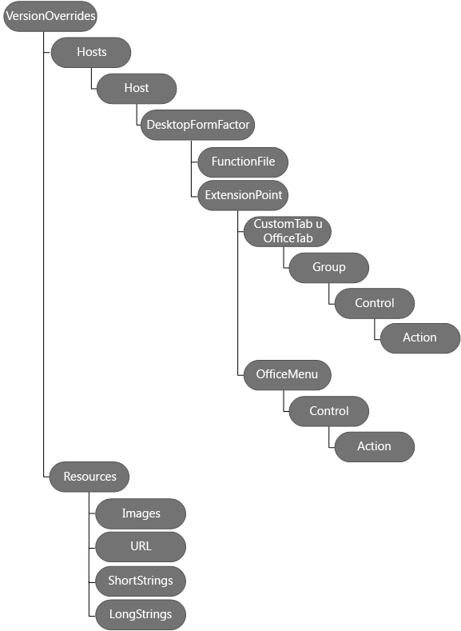

# Definir comandos de complemento en el manifiesto

Los comandos de complemento proporcionan una forma sencilla de personalizar la interfaz de usuario predeterminada de Office con elementos de la interfaz de usuario que realizan acciones (por ejemplo, puede agregar botones personalizados a la cinta). Para crear comandos, agregue un nodo **[VersionOverrides](../../../reference/manifest/versionoverrides.md)** a un manifiesto de panel de tareas existente. 

Cuando un manifiesto contiene el elemento **VersionOverrides**, las versiones de Word, Excel, Outlook y PowerPoint que admiten comandos de complemento usarán la información dentro de dicho elemento para cargar el complemento. Las versiones anteriores de productos de Office que no admiten comandos de complemento omitirán el elemento.

Cuando las aplicaciones cliente reconocen el nodo **VersionOverrides**, el nombre del complemento aparece en la cinta de opciones y no en un panel tareas o de lectura y redacción. El complemento no aparece en ambos lugares.
 

## Nodo VersionOverrides

El elemento [VersionOverrides](../../../reference/manifest/versionoverrides.md) es el elemento raíz que contiene la información de los comandos de complemento implementados por el complemento. Se admite en la versión 1.1 del esquema del manifiesto y en versiones posteriores, pero se define en el esquema de la versión 1.0 de VersionOverrides. 

El elemento VersionOverrides incluye los siguientes elementos secundarios:

- [Descripción](../../../reference/manifest/description.md)
- [Requisitos](../../../reference/manifest/requirements.md)
- [Hosts](../../../reference/manifest/hosts.md)
- [Recursos](../../../reference/manifest/resources.md)

En el diagrama siguiente se muestra la jerarquía de los elementos usados para definir comandos de complemento. 

## Cambios en las reglas para comandos de complemento de Outlook

Los siguientes cambios afectan a las reglas del manifiesto:

- Las reglas de activación ahora se encuentran dentro de cada punto de entrada.
    
- Se ha modificado el atributo **ItemIs** del elemento [Rule](../../../reference/manifest/rule.md). **ItemType** puede ser Message o AppointmentAttendee. Se ha quitado el atributo **FormType**.
    
- Se ha actualizado el atributo **ItemHasKnownEntity** del elemento [Rule](../../../reference/manifest/rule.md) para aceptar una cadena para el EntityType.
    

## Manifiestos de ejemplo

Para ver un manifiesto de ejemplo que implementa los comandos de complemento para Word, Excel y PowerPoint, consulte [Simple add-in commands sample](https://github.com/OfficeDev/Office-Add-in-Commands-Samples/tree/master/Simple) (Ejemplo sencillo de comandos de complemento).

Para ver un manifiesto de ejemplo que implementa comandos de complemento para Outlook, consulte [Sample manifest file for an Outlook add-in](https://gist.github.com/mlafleur/95b7ac030bb7a7ae742527e85a36b095) (Ejemplo de archivo de manifiesto para un complemento de Outlook).

## Recursos adicionales

- [Comandos de complemento para Outlook](../../outlook/add-in-commands-for-outlook.md)
    
- [Manifiestos de complementos de Outlook](../../outlook/manifests/manifests.md)
    
- [Ejemplo de demostración de comando de complemento de Outlook](https://github.com/jasonjoh/command-demo)
