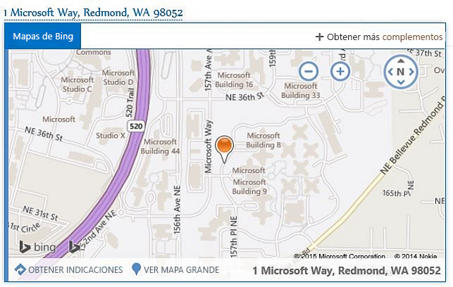
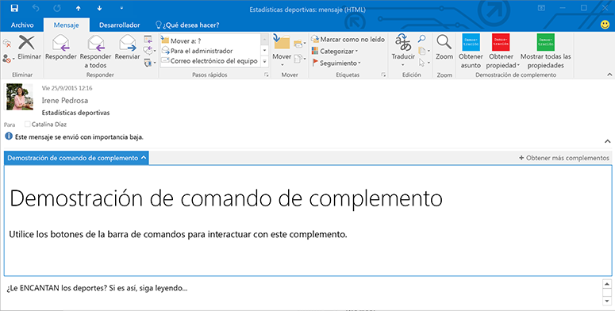

# Complementos de Outlook

Los complementos de Outlook son integraciones creadas por terceros en Outlook con la nueva plataforma basada en tecnologías web. Los complementos de Outlook tienen tres aspectos principales:

- La misma lógica empresarial y de complementos funciona en Outlook de escritorio para Windows y Mac, web (Office 365 y Outlook.com) y móvil.
    
-  Los complementos de Outlook están formados por un manifiesto, que describe cómo se integra el complemento en Outlook (por ejemplo, un botón o un panel de tareas), y por código JavaScript y HTML, que compone la lógica de la interfaz de usuario y la lógica empresarial del complemento.
    
- Los complementos de Outlook se pueden adquirir en la Tienda Office o los pueden cargar los usuarios finales o administradores.
    
Los complementos de Outlook son diferentes de los complementos COM o VSTO, que son integraciones anteriores específicas de Outlook en Windows. A diferencia de los complementos COM, los complementos de Outlook no instalan código físicamente en el dispositivo o el cliente de Outlook del usuario. Para un complemento de Outlook, Outlook lee el manifiesto y enlaza los controles especificados en la interfaz de usuario, y luego carga el HTML y JavaScript. Todo esto se ejecuta en el contexto de un explorador en un espacio aislado.

Entre los elementos de Outlook compatibles con los complementos de correo se incluyen mensajes de correo, convocatorias, respuestas o cancelaciones de reuniones y citas. Cada complemento de correo define el contexto en el que está disponible, incluidos los tipos de elementos y si el usuario está leyendo o redactando un elemento.

## Puntos de extensión

Los puntos de extensión son la forma en que los complementos se integran con Outlook. La integración se puede hacer de las siguientes maneras:

- Los complementos pueden declarar los botones que aparecen en superficies de comando a través de mensajes y citas. Para obtener más información, vea [Comandos de complementos de Outlook](../outlook/add-in-commands-for-outlook.md).
    
    **Un complemento con botones de comandos en la cinta de opciones**

    

- Los complementos pueden desvincular coincidencias de expresiones regulares o entidades detectadas en mensajes y citas. Para obtener más información, vea [Complementos de Outlook contextuales](../outlook/contextual-outlook-add-ins.md).
    
    **Un complemento contextual para una entidad resaltada (una dirección)**

    

- Los complementos pueden aparecer en un panel horizontal encima del cuerpo del mensaje o de la cita. Esto se basa en reglas complejas, como la presencia de datos adjuntos o la clase de elemento de Exchange de la cita o el mensaje. Para obtener más información, vea [Panel personalizado Complementos de Outlook](../outlook/custom-pane-outlook-add-ins.md).
    
    **Un complemento con un panel personalizado en modo lectura**

    

## Elementos del buzón disponibles para los complementos

Los complementos de Outlook están disponibles en los mensajes o citas mientras se redactan o leen, pero no en otros elementos. Outlook no activa complementos si el elemento de mensaje actual de un formulario de redacción o lectura cumple una de las condiciones siguientes:

- Está protegido por Information Rights Management (IRM) en formato S/MIME o cifrado de otras formas de protección. Un mensaje firmado digitalmente es un ejemplo, puesto que la firma digital se basa en uno de estos mecanismos.
    
- Está en la carpeta Correo no deseado.
    
- Es un informe o una notificación de entrega que tiene la clase de mensaje IPM.Report.*, como los informes de entrega y los informes de no entrega (NDR) y las notificaciones de leído, no leído y con retraso.
    
- Un archivo .msg que está adjunto a otro mensaje.
    
- Abre un archivo .msg desde el sistema de archivos.
    
En general, Outlook puede activar complementos en formularios de lectura para elementos de la carpeta Elementos enviados, excepto los complementos que se activan según coincidencias de entidades conocidas. Para más información sobre los motivos por los que esto ocurre, vea "Compatibilidad con entidades conocidas" en [Coincidencia de cadenas en un elemento de Outlook como entidades conocidas](../outlook/match-strings-in-an-item-as-well-known-entities.md).

## Host compatibles

Los complementos de Outlook son compatibles con Outlook 2013 y versiones posteriores, Outlook 2016 para Mac, Outlook Web App para Exchange 2013 local, Outlook Web App en Office 365 y Outlook.com. No todas las características más recientes son compatibles con todos los clientes al mismo tiempo. Consulte los distintos temas y referencias de API para ver en qué hosts se admiten y en cuáles no.

## Introducción a la compilación de complementos de Outlook

Para empezar a compilar complementos de Outlook, vea [Introducción a los complementos de Outlook para Office 365](https://dev.outlook.com/MailAppsGettingStarted/GetStarted).

## Recursos adicionales

- [Introducción a las características y la arquitectura de los complementos de Outlook](../outlook/overview.md)
- [Procedimientos recomendados para desarrollar complementos para Office](../../docs/overview/add-in-development-best-practices.md)
- [Directrices de diseño para complementos de Office](../../docs/design/add-in-design.md)
- [Licencias de complementos de Office y SharePoint](http://msdn.microsoft.com/library/3e0e8ff6-66d6-44ff-b0c2-59108ebd9181%28Office.15%29.aspx)
- [Publicar el complemento para Office](../publish/publish.md)
- [Enviar complementos de Office y SharePoint y aplicaciones web de Office 365 a la Tienda Office](http://msdn.microsoft.com/library/ff075782-1303-4517-91cc-b3d730e9b9ae%28Office.15%29.aspx)

