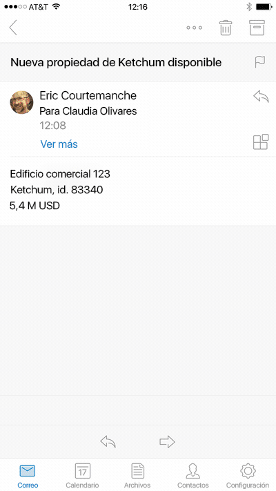

# Complementos para Outlook Mobile 

> **Nota:** Los complementos están disponibles en Outlook para iOS. La compatibilidad con Outlook para Android estará disponible próximamente.

Los complementos ahora funcionan en Outlook Mobile, con las mismas API disponibles para otros puntos de conexión de Outlook. Si ya ha creado un complemento para Outlook, es fácil conseguir que funcione en Outlook Mobile.

Los complementos de Outlook Mobile se admiten en todas las cuentas comerciales de Office 365, y la compatibilidad se está implementando en cuentas de Outlook.com.

**Un panel de tareas de ejemplo en Outlook para iOS**

## ¿Cuál es la diferencia en la versión móvil? 

- El tamaño pequeño y las interacciones rápidas hacen que el diseño para dispositivos móviles sea un desafío. Para garantizar a nuestros clientes experiencias de calidad, estamos estableciendo estrictos criterios de validación que debe cumplir un complemento que declare compatibilidad móvil, para que se apruebe en la Tienda Office.
    - El complemento **DEBE** adherirse a las [instrucciones de la interfaz de usuario](./outlook-addin-design.md).
    - El escenario del complemento **DEBE** [tener sentido en la versión móvil](#what-makes-a-good-scenario-for-mobile-add-ins).
- Solo se admite la lectura de correo en este momento. Esto significa que `MobileMessageReadCommandSurface` es el único elemento [ExtensionPoint](../../reference/manifest/extensionpoint.md) que debe declarar en la sección móvil de su manifiesto
- La API [makeEwsRequestAsync](../../reference/outlook/Office.context.mailbox.md) no se admite en la versión móvil, ya que la aplicación móvil usa API de REST para comunicarse con el servidor. Si el back-end de aplicación necesita conectarse al servidor de Exchange, puede usar el token de devolución de llamada para realizar llamadas a la API de REST. Para obtener información, vea [Use the Outlook REST APIs from an Outlook add-in (Usar las API de REST de Outlook desde un complemento de Outlook)](./use-rest-api.md).
- Cuando envíe su complemento a la tienda con [MobileFormFactor](../../reference/manifest/mobileformfactor.md) en el manifiesto, necesitará aceptar nuestro anexo de desarrollador para complementos en iOS, y debe enviar su id. de desarrollador de Apple para su comprobación.
- Por último, el manifiesto necesitará declarar `MobileFormFactor`, y tener los tipos correctos de [controles](../../reference/manifest/control.md) y [tamaños de icono](../../reference/manifest/icon.md) incluidos.

## ¿Qué hace un buen escenario para complementos móviles?

Recuerde que la longitud media de la sesión de Outlook en un teléfono es mucho más corta que en un equipo PC. Eso significa que su complemento debe ser rápido, y el escenario debe permitir que el usuario entre, salga y continúe con el flujo de trabajo de su correo electrónico.

Aquí se muestran ejemplos de escenarios que tienen sentido en Outlook Mobile.

- El complemento aporta información valiosa en Outlook, lo que ayuda a los usuarios a evaluar su correo electrónico y responder de manera adecuada. Ejemplo: un complemento de CRM que permite que el usuario vea información del cliente y comparta información apropiada.
- El complemento agrega valor al contenido de correo electrónico del usuario guardando la información en un seguimiento, colaboración o sistema similar. Ejemplo: un complemento que permite a los usuarios convertir correos electrónicos en elementos de tarea para el seguimiento de proyectos, o en vales de ayuda para un equipo de soporte técnico.

Definitivamente existen más escenarios adecuados, por lo que si tiene una idea para un complemento que vaya más allá de estos, indíquenoslo con el [formulario aquí](https://aka.ms/outlookmobileaddin) para obtener comentarios sobre si es un escenario correcto para Outlook Mobile. Estaremos encantados de proporcionarle instrucciones, y cuanta más información tengamos mejor. Nos encanta un buen tutorial de interfaz de usuario.

**Un ejemplo de interacción del usuario para crear una tarjeta de Trello desde un mensaje de correo electrónico**

## Probar los complementos en dispositivos móviles

Para probar un complemento en Outlook Mobile, puede transferir localmente un complemento a una cuenta de O365 u Outlook.com. En Outlook Web App, vaya al engranaje de configuración y seleccione "Administrar integraciones" o "Administrar complementos". Cerca de la parte superior, haga clic donde dice "Haga clic aquí para agregar un complemento personalizado" y cargue su manifiesto. Asegúrese de que su manifiesto tiene el formato correcto para contener `MobileFormFactor` o no se cargará.

Una vez que el complemento esté funcionando, asegúrese de probarlo en diferentes tamaños de pantalla, incluidos los teléfonos y tabletas. Debe asegurarse de que cumple las directrices de accesibilidad respecto al contraste, tamaño de fuente y color, así como su uso con un lector de pantalla como VoiceOver en iOS o TalkBack en Android.

La solución de problemas en dispositivos móviles puede ser difícil, ya que puede que no tenga las herramientas a las que está acostumbrado. Una opción para solucionar problemas es [usar Vorlon.js](../testing/debug-office-add-ins-on-ipad-and-mac.md). O, si ha usado Fiddler antes, vea [este tutorial sobre cómo usarlo en un dispositivo iOS](http://www.telerik.com/blogs/using-fiddler-with-apple-ios-devices).

## Pasos siguientes

- Obtenga información sobre cómo [agregar compatibilidad con dispositivos móviles al manifiesto del complemento](./manifests/add-mobile-support.md).
- Obtenga información sobre cómo [diseñar una excelente experiencia móvil para el complemento](./outlook-addin-design.md).
- Obtenga información sobre cómo [obtener un token de acceso y llamar a las API de REST de Outlook](./use-rest-api.md) desde el complemento.