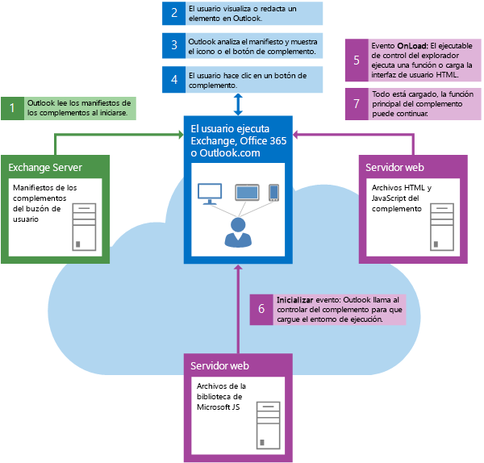

# Introducción a las características y la arquitectura de los complementos de Outlook

Un complemento de Outlook está formado por un manifiesto XML y código (JavaScript y HTML). El manifiesto especifica el nombre y la descripción del complemento, así como el modo en que se integra en Outlook. Con el manifiesto, los desarrolladores pueden colocar botones en superficies de comando y desvincular coincidencias de expresiones regulares, entre otras cosas. El manifiesto también define la dirección URL que hospeda el código de JavaScript y HTML para el complemento.

Cuando un usuario o administrador adquieren un complemento, el manifiesto del complemento se guarda en el buzón del usuario o en la organización. Cuando Outlook se inicia, carga todos los manifiestos que instaló el usuario, los procesa y configura todos los puntos de extensión para el complemento (por ejemplo, mostrar botones en superficies de comando, ejecutar la expresión regular en el mensaje seleccionado, etc.). Ahora el usuario puede usar el complemento.

Cuando el usuario interactúa con el complemento, los archivos JavaScript y HTML se cargan desde la ubicación de host especificada en el manifiesto.

Los complementos usan la API de Office.js para obtener acceso a la API del complemento de Outlook e interactuar con Outlook.

**Interacción de los componentes típicos cuando el usuario inicia Outlook**

### Control de versiones

A medida que desarrollamos los clientes de Outlook y la plataforma de complementos, y con la adición de nuevas formas de integrar los complementos, en ocasiones no podemos implementar una característica al mismo tiempo en todos los clientes (Mac, Windows, web, móvil). Para controlar esta situación, se versiona tanto el manifiesto como las API. De esta forma, la plataforma admite la compatibilidad con versiones anteriores en todo momento, con lo que los desarrolladores pueden crear un complemento que funcione en un nivel inferior en los clientes más antiguos, pero también le permite aprovechar las nuevas características de los clientes más recientes. Encontrará información adicional sobre cómo funciona el control de versiones en [Manifiestos de complementos de Outlook](manifests/manifests.md).

## Características de los complementos de Outlook

Los complementos de Outlook ofrecen muchas características enriquecidas que se pueden usar para admitir varios escenarios.

|**Característica**|**Descripción**|
|:-----|:-----|
|Activación contextual|Se pueden activar complementos contextuales de Outlook según los siguientes criterios:<ul><li>(predeterminado) para cualquier elemento del buzón o del calendario</li><li>para un tipo de elemento concreto (un mensaje de correo electrónico, un mensaje de convocatoria de reunión o una cita)</li><li>para una clase de mensaje del elemento</li><li>para entidades específicas de un mensaje o una cita, consulte [Complementos de Outlook contextuales](contextual-outlook-add-ins.md).</li><li>a partir de reglas específicas o expresiones regulares, consulte [Reglas de activación para complementos de Outlook](manifests/activation-rules.md) y [Usar las reglas de activación de las expresiones regulares para mostrar un complemento de Outlook](use-regular-expressions-to-show-an-outlook-add-in.md)</li><li>para coincidencia de cadenas con propiedades, vea [Coincidencia de cadenas en un elemento de Outlook como entidades conocidas](match-strings-in-an-item-as-well-known-entities.md)</li></ul>|
|Extensiones de módulo|Una extensión de módulo de Outlook integra su complemento con la barra de navegación de Outlook. Para más información, vea [Integrar el complemento de Outlook con la barra de navegación de Outlook](../outlook/extension-module-outlook-add-ins.md). Las extensiones de módulo solo están disponibles en Outlook 2016 para Windows.|
|Comandos de complemento|Los comandos de complemento de Outlook ofrecen formas de iniciar acciones específicas de complemento desde la cinta. Solo están disponibles para las extensiones de módulo y los complementos que se aplican a todos los correos electrónicos o eventos. Para más información, vea [Comandos de complementos de Outlook](../outlook/add-in-commands-for-outlook.md). |
|Configuración de movilidad|Un complemento de Outlook puede guardar datos específicos sobre un elemento del buzón del usuario a los que se puede obtener acceso en una sesión de Outlook posterior. Para obtener más información, vea [Obtener y establecer los metadatos de complemento de un complemento de Outlook](../outlook/metadata-for-an-outlook-add-in.md). |
|Propiedades personalizadas|Un complemento de Outlook puede guardar datos específicos a un elemento del buzón del usuario a los que se puede obtener acceso en una sesión de Outlook posterior. Para obtener más información, vea [Obtener y establecer los metadatos de complemento de un complemento de Outlook](../outlook/metadata-for-an-outlook-add-in.md).|
|Obtener datos adjuntos o todo el elemento seleccionado|Un complemento de Outlook contextual puede tener acceso a datos adjuntos y a todos los elementos seleccionados del lado servidor. Vea lo siguiente:<ul><li>Adjuntos: consulte [Obtener datos adjuntos de un elemento de Outlook desde el servidor](get-attachments-of-an-outlook-item.md) y [Agregar y quitar datos adjuntos de un elemento en un formulario de redacción de Outlook](agregar-y-quitar-datos-adjuntos-de-un-elemento-en-un-formulario-de-redacción.md)</li><li>Todo el elemento seleccionado: esto es similar al uso de un token de devolución de llamada para obtener datos adjuntos. Vea lo siguiente:<ul><li>Método **mailbox.getCallbackTokenAsync** en [Office.context.mailbox](../../reference/outlook/Office.context.mailbox.md): proporciona un token de devolución de llamada para identificar el código del lado servidor del complemento para Exchange Server.</li><li>Propiedad **item.itemId** en [Office.context.mailbox](../../reference/outlook/Office.context.mailbox.item.md): identifica el elemento que está leyendo el usuario y que está obteniendo el código del lado servidor.</li><li>Propiedad **mailbox.ewsUrl** en [Office.context.mailbox](../../reference/outlook/Office.context.mailbox.md): proporciona la dirección URL del punto de conexión EWS que, junto con el token de devolución de llamada y el identificador del elemento, puede usar el código del lado servidor para tener acceso a la operación [GetItem](http://msdn.microsoft.com/en-us/library/e3590b8b-c2a7-4dad-a014-6360197b68e4(Office.15).aspx) de EWS y obtener el elemento completo.</li></ul></li></ul>|
|Perfil de usuario|Un complemento de correo puede tener acceso al nombre para mostrar, la dirección de correo electrónico y la zona horaria establecida en el perfil del usuario. Para obtener más información, vea el objeto [UserProfile](../../reference/outlook/Office.context.mailbox.userProfile.md).|

## Introducción a la compilación de complementos de Outlook

Para empezar a compilar complementos de Outlook, vea [Introducción a los complementos de Outlook para Office 365](https://dev.outlook.com/MailAppsGettingStarted/GetStarted) o [Integrar el complemento de Outlook con la barra de navegación de Outlook](../outlook/extension-module-outlook-add-ins.md).

## Recursos adicionales

Para tener acceso a conceptos que se pueden aplicar al desarrollo de complementos de Office en general, consulte los recursos siguientes:

- [Instrucciones de diseño para complementos de Office](../../docs/design/add-in-design.md)

- [Procedimientos recomendados para desarrollar complementos de Office](../../docs/design/add-in-development-best-practices.md)

- 
  [Licencias de complementos de Office y SharePoint](http://msdn.microsoft.com/library/3e0e8ff6-66d6-44ff-b0c2-59108ebd9181%28Office.15%29.aspx)

- 
  [Enviar complementos de Office y SharePoint, y aplicaciones web de Office 365 a la Tienda Office](http://msdn.microsoft.com/library/ff075782-1303-4517-91cc-b3d730e9b9ae%28Office.15%29.aspx)

- [API de JavaScript para Office](../../reference/javascript-api-for-office.md)

- [Manifiestos de complementos de Outlook](../outlook/manifests/manifests.md)

