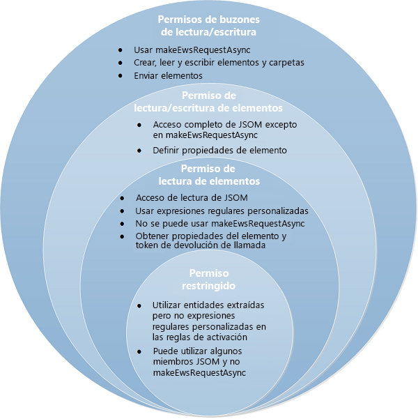

# Privacidad, permisos y seguridad para los complementos de Outlook
Los usuarios finales, los desarrolladores y los administradores pueden usar los niveles de permisos en capas del modelo de seguridad en los complementos de Outlook para controlar la privacidad y el rendimiento.


En este artículo se describen los posibles permisos que pueden solicitar los complementos de Outlook y se examina el modelo de seguridad desde las siguientes perspectivas:

- Tienda Office: integridad del complemento.
    
- Usuarios finales: dudas sobre privacidad y rendimiento.
    
- Desarrolladores: opciones de permisos y límites del uso de recursos.
    
- Administradores: privilegios para establecer umbrales de rendimiento.
    

## Modelo de permisos


La percepción de los clientes sobre la seguridad de un complemento puede influir en la opción de instalarlo o no. Por ello, la seguridad de los complementos de Outlook se basa en un modelo de permisos en niveles. Un complemento de Outlook revelaría el nivel de permisos necesarios, al identificar el posible acceso y las acciones que el complemento puede realizar en los datos de los buzones del cliente. 

La versión 1.1 del esquema del manifiesto incluye cuatro niveles de permisos. 


**Tabla 1. Niveles de permisos de complementos**


|**Nivel de permisos**|**Valor en el manifiesto del complemento de Outlook**|
|:-----|:-----|
|Restringido|Restricted|
|Elemento de lectura|ReadItem|
|Elemento de lectura y escritura|ReadWriteItem|
|Buzón de lectura y escritura|ReadWriteMailbox|
Los cuatro niveles de permisos son acumulativos: el permiso  **buzón de lectura y escritura** incluye los permisos de **lectura y escritura de elemento**,  **lectura de elemento** y **restringido**, el permiso  **lectura y escritura de elemento** incluye **lectura de elemento** y la opción **restringido**, y el permiso  **lectura de elemento** incluye el permiso **restringido**. En la figura 1 se muestran los cuatro niveles de permisos y se describen las capacidades que se ofrecen al usuario final, al desarrollador y al administrador en cada nivel. Para más información sobre estos permisos, vea [Usuarios finales: dudas sobre privacidad y rendimiento](#usuarios-finales-dudas-sobre-privacidad-y-rendimiento), [Desarrolladores: opciones de permisos y límites de uso de recursos.](#developers-permission-choices-and-resource-usage-limits) y [Especificar permisos para el acceso de los complementos de Outlook al buzón del usuario](../outlook/understanding-outlook-add-in-permissions.md). 


**Figura 1. Adaptación del modelo de permisos de cuatro niveles al usuario final, al desarrollador y al administrador**




## Tienda Office: integridad del complemento


La Tienda Office hospeda complementos que los usuarios finales y los administradores pueden instalar. La Tienda Office aplica las siguientes medidas para mantener la integridad de estos complementos de Outlook:


- Requiere que el servidor host de un complemento siempre use la capa de sockets seguros (SSL) para comunicarse.
    
- Requiere que el desarrollador proporcione pruebas de identidad, un acuerdo contractual y una directiva de privacidad válida para enviar complementos. 
    
- Archiva los complementos en modo de solo lectura.
    
- Admite un sistema de revisión del usuario para que los complementos disponibles promuevan una comunidad autocontrolada.
    

## Usuarios finales: dudas sobre privacidad y rendimiento


El modelo de seguridad aborda las dudas de los usuarios finales sobre seguridad, privacidad y rendimiento de las siguientes maneras:


- Los mensajes del usuario final que están protegidos por Information Rights Management (IRM) de Outlook no interactúan con los complementos de Outlook.
    
- Antes de instalar un complemento de la Tienda Office, los usuarios finales pueden ver el acceso a los datos que puede realizar el complemento y las acciones que puede llevar a cabo con ellos, y deben confirmar de forma explícita que quieren continuar. Ningún complemento de Outlook se instala automáticamente en un equipo cliente sin que el usuario o el administrador validen la operación de forma manual.
    
- La concesión del permiso  **restringido** permite que el complemento de Outlook tenga un acceso limitado solo en el elemento actual. La concesión del permiso **lectura de elemento** permite que el complemento de Outlook obtenga acceso a información de identificación personal, como los nombres y las direcciones de correo electrónico del remitente y del destinatario, solo en el elemento actual.
    
- El usuario final puede instalar un complemento de Outlook de nivel de confianza bajo para uso personal. Los complementos de Outlook que afectan a una organización los instala un administrador.
    
- Los usuarios finales pueden instalar complementos de Outlook que permitan escenarios contextuales que sean atractivos para los usuarios y que minimicen los riesgos de seguridad de los usuarios.
    
- Los archivos de manifiesto de los complementos de Outlook instalados están protegidos en la cuenta de correo del usuario.
    
- Los datos comunicados con servidores que hospedan Complementos de Office siempre se cifran de acuerdo con el protocolo de la capa de sockets seguros (SSL).
    
- Solo para el cliente enriquecido de Outlook: los clientes enriquecidos de Outlook supervisan el rendimiento de los complementos de correo instalados, ejercen un control de gobernanza y deshabilitan los complementos de Outlook que superan los límites en las siguientes áreas:
    
      - Response time to activate
    
  - Número de errores para activarse o reactivarse
    
  - Uso de memoria
    
  - Uso de CPU
    

    La gobernanza impide los ataques por denegación de servicio y mantiene el rendimiento de los complementos a un buen nivel. La barra empresarial avisa a los usuarios cuando hay complementos de Outlook que el cliente enriquecido de Outlook deshabilitó basándose en el control de gobernanza.
    
- Siempre que lo deseen, los usuarios finales pueden comprobar los permisos que solicitan los complementos de Outlook instalados y habilitar (o deshabilitar posteriormente) cualquier complemento de Outlook en el Centro de administración de Exchange.
    

## Desarrolladores: opciones de permisos y límites de uso de recursos.


El modelo de seguridad proporciona a los desarrolladores niveles pormenorizados de permisos entre los que pueden elegir y unas instrucciones estrictas sobre el rendimiento que es necesario cumplir.


### Los permisos en niveles aumentan la transparencia

Los desarrolladores deben seguir el modelo de permisos en niveles para proporcionar transparencia y disipar las dudas de los usuarios sobre lo que los complementos pueden hacer en sus datos y buzones. De hacerlo así, estará promoviendo indirectamente que los usuarios instalen el complemento:


- Los desarrolladores solicitan un nivel de permiso apropiado para un complemento de Outlook en función de cómo debe activarse el complemento de Outlook y su necesidad de leer o escribir ciertas propiedades de un elemento, o bien de crear y enviar un elemento.
    
- Los desarrolladores solicitan permiso con el elemento [Permissions](http://msdn.microsoft.com/en-us/library/c20cdf29-74b0-564c-e178-b75d148b36d1%28Office.15%29.aspx) en el manifiesto del complemento de Outlook al asignar un valor de **Restricted**,  **ReadItem**,  **ReadWriteItem** o **ReadWriteMailbox**, según corresponda. 
    
     >**Nota** Tenga en cuenta que el permiso **ReadWriteItem** se encuentra disponible a partir del esquema de manifiesto v1.1.

    En el ejemplo siguiente se solicita el permiso de **elemento de lectura**.
    


```XML
  <Permissions>ReadItem</Permissions>
```

- Los desarrolladores solicitan el permiso  **restringido** si el complemento de correo se activa en un tipo concreto de elementos de Outlook (cita o mensaje) o en entidades extraídas específicas (número de teléfono, dirección, dirección URL) presentes en el tema o en el cuerpo del elemento. Por ejemplo, la siguiente regla activa el complemento de Outlook si se encuentra una o más de las tres entidades (número de teléfono, dirección postal o dirección URL) en el tema o en el cuerpo del mensaje.
    
```XML
  <Permissions>Restricted</Permissions>
    <Rule xsi:type="RuleCollection" Mode="And">
    <Rule xsi:type="ItemIs" FormType="Read" ItemType="Message" />
    <Rule xsi:type="RuleCollection" Mode="Or">
        <Rule xsi:type="ItemHasKnownEntity" EntityType="PhoneNumber" />
        <Rule xsi:type="ItemHasKnownEntity" EntityType="Address" />
        <Rule xsi:type="ItemHasKnownEntity" EntityType="Url" />
    </Rule>
</Rule>
```

- Los desarrolladores solicitan el permiso  **lectura de elemento** si el complemento de Outlook necesita leer propiedades del elemento actual que no sean las entidades extraídas predeterminadas, o bien si necesita especificar propiedades personalizadas que estableció el complemento en el elemento, pero no necesita leer o escribir en otros elementos ni crear o enviar un mensaje en el buzón de correo del usuario. Por ejemplo, sería necesario que un desarrollador solicitara el permiso **lectura de elemento** si, para su activación, un complemento de Outlook necesita buscar en el tema o en el cuerpo de un elemento una entidad como una sugerencia de reunión, una sugerencia de tarea, una dirección de correo electrónico o un nombre de contacto, o bien si usa una expresión regular.
    
- Los desarrolladores deben solicitar el permiso  **lectura y escritura de elemento** si el complemento de Outlook debe escribir en las propiedades del elemento redactado, como nombres de destinatarios, direcciones de correo electrónico, cuerpo y tema, o necesita agregar o quitar datos adjuntos.
    
- Los desarrolladores solicitan el permiso  **buzón de lectura y escritura** solo si el complemento de Outlook necesita llevar a cabo una o varias de las siguientes acciones con el método [mailbox.makeEWSRequestAsync](../../reference/outlook/Office.context.mailbox.md):
    
      - Read or write to properties of items in the mailbox.
    
  - Cree, envíe, lea o escriba en elementos del buzón de correo.
    
  - Cree, lea o escriba en carpetas del buzón de correo.
    

### Ajuste del uso de recursos

Los desarrolladores deben estar al tanto de los límites del uso de recursos para la activación e incorporar el ajuste del rendimiento en su flujo de trabajo de desarrollo a fin de reducir las posibilidades de un complemento con bajo rendimiento que deniega el servicio del host. Para ello, deben seguir las instrucciones relativas al diseño de reglas de activación descritas en [Límites de activación y API de JavaScript para complementos de Outlook](../outlook/limits-for-activation-and-javascript-api-for-outlook-add-ins.md). Si está previsto que un complemento de Outlook se ejecute en un cliente enriquecido de Outlook, será necesario que los desarrolladores comprueben que el complemento funciona dentro de los límites de uso de recursos.


### Otras medidas para promover la seguridad del usuario

Los desarrolladores deben conocer y planear lo siguiente:


- Los desarrolladores no pueden usar los controles ActiveX en los complementos porque no son compatibles.
    
- Para enviar un complemento de Outlook a la Tienda Office, es necesario que los desarrolladores hagan lo siguiente:
    
      - Produce an Extended Validation (EV) SSL certificate as a proof of identity.
    
  - Hospedar el complemento que van a enviar en un servidor web que admita SSL.
    
  - Presentar una directiva de privacidad compatible.
    
  - Firmar un acuerdo contractual al enviar el complemento.
    

## Administradores: privilegios


El modelo de seguridad proporciona a los administradores los siguientes derechos y responsabilidades:


- Posibilidad de impedir que los usuarios finales instalen algún complemento de Outlook, incluidos los complementos de la Tienda Office.
    
- Posibilidad de deshabilitar o habilitar cualquier complemento de Outlook en el Centro de administración de Exchange.
    
- Solo aplicable a Outlook para Windows: posibilidad de invalidar la configuración del umbral de rendimiento con la configuración del Registro de GPO.
    


## Recursos adicionales


- [Complementos de Outlook](../outlook/outlook-add-ins.md)
    
- [Privacidad y seguridad de complementos para Office](../../docs/develop/privacy-and-security.md)
    
- [API de complementos de Outlook](../outlook/apis.md)
    
- [Solicitar permisos para el uso de API en complementos de contenido y de panel de tareas](../../docs/develop/requesting-permissions-for-api-use-in-content-and-task-pane-add-ins.md)
    
- [Límites para la activación y API de JavaScript para complementos de Outlook](../outlook/limits-for-activation-and-javascript-api-for-outlook-add-ins.md)
    
