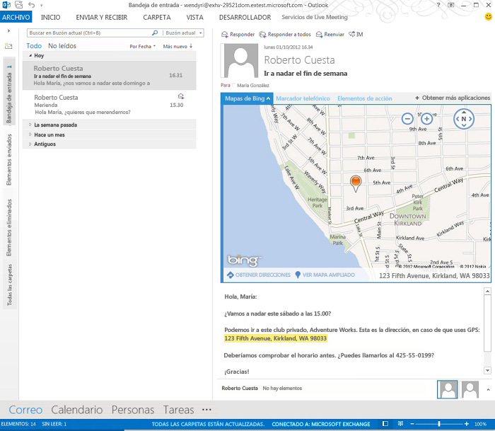

# Crear complementos de Outlook para formularios de lectura

Los complementos de lectura son complementos de Outlook que se activan en el panel de lectura o en el inspector de lectura de Outlook. A diferencia de los complementos de redacción (complementos de Outlook que se activan cuando un usuario crea un mensaje o una cita), los complementos de lectura están disponibles cuando los usuarios:

- Ven un mensaje de correo o una convocatoria, respuesta o cancelación de una reunión.*
    
- Ven un elemento de reunión en el que el usuario es un asistente.
    
- Ven un elemento de reunión en el que el usuario es el organizador (versión RTM de Outlook 2013 y Exchange 2013 únicamente).
    
     >**Nota** A partir de Office 2013 SP1, si el usuario está viendo un elemento de reunión que ha organizado el usuario, solo pueden activarse y estar disponibles los complementos de redacción. Los complementos de lectura ya no están disponibles en este escenario.
* Outlook no activa los complementos en formularios de lectura para algunos tipos de mensajes, incluidos los elementos que son datos adjuntos de otro mensaje, los elementos de las carpetas Borradores o Correo no deseado de Outlook, o los elementos que están cifrados o protegidos de alguna otra forma.

En todos estos escenarios de lectura, Outlook activa los complementos cuando se cumplen sus condiciones de activación y los usuarios pueden seleccionar y abrir los complementos activados en la barra del complemento en el inspector o panel de lectura. La figura 1 muestra el complemento de  **Mapas de Bing** activado y abierto mientras el usuario lee un mensaje que contiene una dirección geográfica.

**Figura 1: El panel del complemento muestra el complemento de Mapas de Bing en acción para el mensaje de Outlook seleccionado que contiene una dirección**

## Tipos de complementos disponibles en modo lectura

Los complementos de lectura pueden ser cualquier combinación de los siguientes tipos.

- [Comandos de complementos para Outlook](../outlook/add-in-commands-for-outlook.md)
    
- [Complementos de Outlook contextuales](../outlook/contextual-outlook-add-ins.md)
    

## Características de la API disponibles para complementos de lectura

Para obtener una lista de las características que ofrece la API de JavaScript para Office a los complementos en los formularios de lectura, vea las tablas 1 y 2 de [Características de aplicación de correo por versión](http://msdn.microsoft.com/library/f34e2f44-8c9d-4e90-b1d7-3f29506adb92%28Office.15%29.aspx). 

Vea también:

- Para activar complementos en formularios de lectura, consulte la tabla 1 de [Especificar las reglas de activación en un manifiesto](../outlook/manifests/activation-rules.md#specify-activation-rules-in-a-manifest).
    
- [Usar las reglas de activación de las expresiones regulares para mostrar un complemento de Outlook](../outlook/use-regular-expressions-to-show-an-outlook-add-in.md)
    
- [Coincidencia de cadenas en un elemento de Outlook como entidades conocidas](../outlook/match-strings-in-an-item-as-well-known-entities.md)
    
- [Extraer cadenas de entidad de un elemento de Outlook](../outlook/extract-entity-strings-from-an-item.md)
    
- [Obtener datos adjuntos de un elemento de Outlook desde el servidor](../outlook/get-attachments-of-an-outlook-item.md)
    

## Recursos adicionales

- [Introducción a los complementos de Outlook para Office 365](https://dev.outlook.com/MailAppsGettingStarted/GetStarted.aspx)
    
- [Complementos de Outlook](../outlook/outlook-add-ins.md)
    
