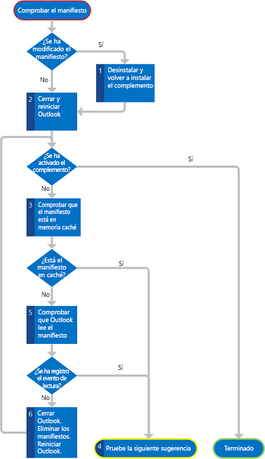

# <a name="troubleshoot-outlook-add-in-activation"></a>Solucionar problemas relacionados con la activación de los complementos de Outlook


La activación de los complementos de Outlook es contextual y se basa en las reglas de activación del manifiesto del complemento. Cuando las condiciones del elemento seleccionado actualmente cumplen las reglas de activación del complemento, la aplicación host activa y muestra el botón de complemento en la interfaz de usuario de Outlook (en el panel de selección del complemento para complementos de redacción y en la barra de complementos para complementos de lectura). Pero, si el complemento no se activa de la manera esperada, tiene que fijarse en las siguientes áreas para buscar las posibles razones.

<a name="troubleshootingmailapps"></a>
## <a name="is-the-user-mailbox-on-a-version-of-exchange-server-that-is-at-least-exchange-2013?"></a>¿Está el buzón de usuario en una versión de Exchange Server que sea, como mínimo, Exchange 2013?


En primer lugar, asegúrese de que la cuenta de correo electrónico del usuario que está probando está en una versión de Exchange Server que sea como mínimo Exchange 2013. Si usa características específicas que se publicaron después de Exchange 2013, asegúrese de que la cuenta del usuario se encuentre en la versión adecuada de Exchange.

Puede verificar la versión de Exchange 2013 con uno de los siguientes métodos:


- Consultarlo con el administrador de Exchange Server.
    
- Si está probando el complemento en Outlook Web App u OWA para dispositivos, abra un depurador de scripts (por ejemplo, el depurador de JScript que se incluye con Internet Explorer), busque el atributo **src** de la etiqueta **script** que especifica la ubicación desde donde se cargan los scripts. La ruta de acceso tiene que contener la subcadena **owa/15.0.516.x/owa2/...**, donde **15.0.516.x** representa la versión de Exchange Server (por ejemplo, **15.0.516.2**).
    
- Otra opción es usar la propiedad [Office.context.mailbox.diagnostics.hostVersion](../../reference/outlook/Office.context.mailbox.diagnostics.md) para comprobar la versión. En Outlook Web App y OWA para dispositivos, esta propiedad devuelve la versión de Exchange Server.
    
- Si puede probar el complemento en Outlook, puede utilizar la sencilla técnica de depuración siguiente que usa el modelo de objetos de Outlook y el Editor de Visual Basic:
    
      1. En primer lugar, compruebe que las macros están habilitadas para Outlook. Seleccione **Archivo**, **Opciones**, **Centro de confianza**, **Configuración del Centro de confianza de**, **Configuración de macros**. Asegúrese de que **Notificaciones para todas las macros** está seleccionada en el Centro de confianza. También debería haber seleccionado **Habilitar macros** durante el inicio de Outlook.
    
      2. En la pestaña **Desarrollador** de la cinta de opciones, seleccione **Visual Basic**.
    
     >
  **Note**  Not seeing the  **Developer** tab? See [How to: Show the Developer Tab on the Ribbon](http://msdn.microsoft.com/en-us/library/ce7cb641-44f2-4a40-867e-a7d88f8e98a9%28Office.15%29.aspx) to turn it on. 3. En el Editor de Visual Basic, seleccione  **Vista**,  **Ventana Ejecución**.
    
      4. Para mostrar la versión de Exchange Server, escriba lo siguiente en la ventana Ejecución. La versión principal del valor devuelto debe ser igual a o superior a 15.
    
        - Si solo existe una cuenta de Exchange en el perfil del usuario:
        
            
            ?Session.ExchangeMailboxServerVersion
            
        
        - Si existen múltiples cuentas de Exchange en el mismo perfil de usuario:
        
            
            ?Session.Accounts.Item(emailAddress).ExchangeMailboxServerVersion
         
        
        - _emailAddress_ representa una cadena que contiene la dirección SMTP principal del usuario. Por ejemplo, si la dirección SMTP principal del usuario es randy@contoso.com, escriba lo siguiente:
        
            
            ?Session.Accounts.Item("randy@contoso.com").ExchangeMailboxServerVersion
        


## <a name="is-the-add-in-disabled?"></a>¿Está el complemento deshabilitado?


Cualquiera de los clientes enriquecidos de Outlook puede deshabilitar un complemento por razones de rendimiento, como un exceso en los umbrales de uso del núcleo o la memoria de la CPU, tolerancia ante bloqueos y duración del procesamiento de todas las expresiones regulares para un complemento. Cuando esto ocurre, el cliente enriquecido de Outlook muestra una notificación de que está deshabilitando el complemento. 


 >**Nota**  Solo los clientes enriquecidos de Outlook supervisan el uso de recursos, pero deshabilitar un complemento en este cliente también lo deshabilita en Outlook Web App y en OWA para dispositivos.

Para comprobar si un complemento está deshabilitado, use uno de los siguientes métodos: 


- En Outlook Web App, inicie sesión directamente en la cuenta de correo, seleccione el icono Configuración y luego seleccione  **Administrar complementos** para ir al Centro de administración de Exchange y comprobar si el complemento está habilitado.
    
- En Outlook, vaya a la vista Backstage y seleccione  **Administrar complementos**. Inicie sesión en el Centro de administración de Exchange y compruebe si el complemento está habilitado.
    
- En Outlook para Mac, seleccione  **Administrar complementos** en la barra de complementos. Inicie sesión en el Centro de administración de Exchange y compruebe si el complemento está habilitado.
    

## <a name="does-the-tested-item-support-outlook-add-ins?-is-the-selected-item-delivered-by-a-version-of-exchange-server-that-is-at-least-exchange-2013?"></a>¿Son los elementos probados compatibles con complementos de Outlook? ¿Se entregan con una versión de Exchange Server que sea, como mínimo, Exchange 2013?


Si el complemento de Outlook es uno de lectura y debe activarse cuando el usuario está viendo un mensaje (incluyendo mensajes de correo electrónico, convocatorias de reunión, respuestas y cancelaciones) o una cita, aunque estos elementos por lo general son compatibles con complementos, se hace una excepción en los casos siguientes:


- El elemento seleccionado está protegido por Information Rights Management (IRM).
    
- Está en formato S/MIME o encriptado con otros tipos de protección.
    
- Es un borrador (no tiene asignado ningún destinatario), o está actualmente en la carpeta Borradores de Outlook.
    
- Está en la carpeta Correo no deseado.
    
- Es un informe o una notificación de entrega que tiene la clase de mensaje IPM.Report.*, como los informes de entrega y los informes de no entrega (NDR) y las notificaciones de leído, no leído y con retraso.
    
- Es un archivo .msg adjunto a otro mensaje o que se abrió desde el sistema de archivos.
    
Además, como las citas se guardan siempre en formato RTF, una regla [ItemHasRegularExpressionMatch](http://msdn.microsoft.com/en-us/library/bfb726cd-81b0-a8d5-644f-2ca90a5273fc%28Office.15%29.aspx) que especifique un valor **PropertyName** de **BodyAsHTML** no activará un complemento en una cita o mensaje que se guarde como texto sin formato o como RTF.

Incluso si un elemento de correo no pertenece a ninguno de los tipos anteriores y no se entregó con una versión de Exchange Server que fuese, como mínimo, Exchange 2013, las entidades y las propiedades conocidas, como la dirección SMTP del remitente, no se identificarían en el elemento. No se cumpliría ninguna regla de activación que se basara en estas entidades o propiedades, por lo que el complemento no se activaría.

Si su complemento es de redacción y debe activarse cuando el usuario crea un mensaje o una convocatoria de reunión, compruebe que el elemento no esté protegido por IRM.


## <a name="is-the-add-in-manifest-installed-properly,-and-does-outlook-have-a-cached-copy?"></a>¿Está el manifiesto de complemento instalado correctamente? ¿Tiene Outlook una copia de él en la memoria caché?


Este escenario se aplica solo a Outlook para Windows. Normalmente, cuando instala un complemento de Outlook para un buzón, Exchange Server copia el manifiesto de complemento desde la ubicación que usted indique al buzón de ese Exchange Server. Cada vez que se inicia Outlook, lee todos los manifiestos instalados para ese buzón en una memoria caché temporal en la ubicación siguiente: 

%LocalAppData%\Microsoft\Office\15.0\WEF 

Por ejemplo, para el usuario Enrique, la memoria caché podría estar en C:\Users\enrique\AppData\Local\Microsoft\Office\15.0\WEF.

Si un complemento no se activa para ningún elemento, puede que el manifiesto no se haya instalado correctamente en Exchange Server o que Outlook no haya leído el manifiesto correctamente al iniciarse. Utilice el Centro de administración de Exchange para asegurarse de que el complemento esté instalado y habilitado para el buzón y, si es necesario, reinicie Exchange Server.

La figura 1 muestra un resumen de los pasos necesarios para comprobar si Outlook dispone de una versión válida del manifiesto. 


**Figura 1: Gráfico de flujo de los pasos necesarios para comprobar si Outlook guardó en la memoria caché correctamente una versión del manifiesto**

El procedimiento siguiente describe los detalles.


1. Si ha modificado el manifiesto mientras estaba abierto Outlook y no usa Napa, Visual Studio 2012 o una versión posterior de Visual Studio para desarrollar el complemento, debe desinstalar el complemento y reinstalarlo con el Centro de administración de Exchange. 
    
2. Reinicie Outlook y compruebe si ahora activa el complemento.
    
3. Si Outlook no activa el complemento, compruebe si tiene una copia del manifiesto del complemento guardada correctamente en la memoria caché. Busque en la siguiente ruta de acceso:
    
    %LocalAppData%\Microsoft\Office\15.0\WEF
    
    Puede encontrar el manifiesto en la subcarpeta siguiente:
```
    \<insert your guid>\<insert base 64 hash>\Manifests\<ManifestID>_<ManifestVersion>
```
    
     >**Note**  The following is an example of a path to a manifest installed for a mailbox for the user John:
    
    C:\Users\john\appdata\Local\Microsoft\Office\15.0\WEF\{8D8445A4-80E4-4D6B-B7AC-D4E6AF594E73}\GoRshCWa7vW8+jhKmyiDhA==\Manifests\b3d7d9d5-6f57-437d-9830-94e2aaccef16_1.2
    
    Verify whether the manifest of the add-in you're testing is among the cached manifests.
    
4. Si el manifiesto está en la memoria caché, omita el resto de la sección y tenga en cuenta las otras posibles razones que se exponen más adelante.
    
5. Si el manifiesto no está en la memoria caché, compruebe si realmente Outlook leyó el manifiesto de Exchange Server de forma correcta. Para hacerlo, utilice el Visor de eventos de Windows.
    
      1. En  **Registros de Windows**, seleccione  **Aplicación**.
    
      2. Busque un evento razonablemente reciente para el que el ID de evento sea igual a 63, que representa a Outlook descargando un manifiesto de un Exchange Server.
    
      3. Si Outlook leyó correctamente un manifiesto, el evento registrado debería tener la siguiente descripción:
    
         **La solicitud de servicio web de Exchange GetAppManifests se realizó correctamente.**
    
        Después, omita el resto de la sección y tenga en cuenta las otras posibles razones que se exponen más adelante.
    

    Para obtener información acerca de cómo abrir el Visor de eventos en Windows 7, consulte [Abrir el Visor de eventos](http://windows.microsoft.com/en-US/windows7/Open-Event-Viewer).
    
6. Si no ve ningún evento correcto, salga de Outlook y elimine todos los manifiestos en la siguiente ruta de acceso:
```
    %LocalAppData%\Microsoft\Office\15.0\WEF\<insert your guid>\<insert base 64 hash>\Manifests\
```
    Start Outlook and test whether Outlook now activates the add-in.
    
7. Si no lo activa, vuelva al paso 3 para comprobar de nuevo si Outlook leyó el manifiesto correctamente.
    

## <a name="are-you-using-the-appropriate-activation-rules?"></a>¿Está usando las reglas de activación adecuadas?


Desde la versión 1.1 del esquema de manifiestos Complementos de Office, puede crear complementos que se activan cuando el usuario se encuentra en un formulario de redacción (complementos de redacción) o en un formulario de lectura (complementos de lectura). Asegúrese de que especifica las reglas de activación adecuadas para cada uno de los tipos de formulario que el complemento debe activar. Por ejemplo, puede activar los complementos de redacción usando únicamente reglas [ItemIs](http://msdn.microsoft.com/en-us/library/f7dac4a3-1574-9671-1eda-47f092390669%28Office.15%29.aspx) con el atributo **FormType** definido como **Edit** o **ReadOrEdit** y no podrá usar ningún otro tipo de reglas, como [ItemHasKnownEntity](http://msdn.microsoft.com/en-us/library/87e10fd2-eab4-c8aa-bec3-dff92d004d39%28Office.15%29.aspx) o [ItemHasRegularExpressionMatch](http://msdn.microsoft.com/en-us/library/bfb726cd-81b0-a8d5-644f-2ca90a5273fc%28Office.15%29.aspx) para los complementos de redacción. Para obtener más información, vea [Reglas de activación para complementos de Outlook](../outlook/manifests/activation-rules.md).


## <a name="if-you-use-a-regular-expression,-is-it-properly-specified?"></a>Si utiliza una expresión regular, ¿se especifica correctamente?


Las expresiones regulares de las reglas de activación forman parte del archivo de manifiesto XML de un complemento de lectura. Si una expresión regular usa ciertos caracteres, asegúrese de seguir la secuencia de escape correspondiente compatible con procesadores XML. En la tabla 1 se enumeran los caracteres especiales. 


**Tabla 1: Secuencias de escape para expresiones regulares**


|**Carácter**|**Descripción**|**Secuencia de escape que debe usarse**|
|:-----|:-----|:-----|
|"|Comilla doble|&amp;quot;|
|&amp;|Y comercial|&amp;amp;|
|'|Apóstrofo|&amp;apos;|
|<|Signo de menor que|&amp;lt;|
|>|Signo de mayor que|&amp;gt;|

## <a name="if-you-use-a-regular-expression,-is-the-read-add-in-activating-in-outlook-web-app-or-owa-for-devices,-but-not-in-any-of-the-outlook-rich-clients?"></a>Si utiliza una expresión regular, ¿el complemento de lectura se activa en Outlook Web App o en OWA para dispositivos, pero no lo hace en ninguno de los clientes enriquecidos de Outlook?


Los clientes enriquecidos de Outlook usan un motor de expresiones regulares distinto del que usan Outlook Web App y OWA para dispositivos. Los clientes enriquecidos de Outlook usan el motor de expresiones regulares C++ proporcionado como parte de la biblioteca de plantillas estándar de Visual Studio. Este motor se ajusta a las normas ECMAScript 5. Outlook Web App y OWA para dispositivos usan una evaluación de expresiones regulares que forma parte de JavaScript, la proporciona el explorador y es compatible con un superconjunto de ECMAScript 5. 

En la mayor parte de los casos, estas aplicaciones host encuentran los mismos resultados para las mismas expresiones regulares en una regla de activación, pero hay excepciones. Por ejemplo, si el regex incluye una clase de caracteres personalizada basada en clases de caracteres predefinidas, es posible que un cliente enriquecido de Outlook devuelva resultados distintos de los de Outlook Web App y OWA para dispositivos. Por ejemplo, clases de caracteres que contienen clases de caracteres abreviados  `[\d\w]` devolverían resultados distintos. En este caso, para evitar diferentes resultados en diferentes hosts, use `(\d|\w)` en su lugar.

Pruebe la expresión regular exhaustivamente. Si devuelve resultados distintos, reescríbala para que sea compatible con los dos motores. Para comprobar los resultados de la evaluación en un cliente enriquecido de Outlook, escriba un pequeño programa C++ que aplique la expresión regular a una muestra del texto con el que está tratando de obtener coincidencias. Si se ejecuta en Visual Studio, el programa de pruebas C++ utilizará la biblioteca de plantillas estándar para simular el comportamiento del cliente enriquecido de Outlook al ejecutar la misma expresión regular. Para comprobar los resultados de la evaluación en Outlook Web App o en OWA para dispositivos, use su comprobador de expresiones regulares de JavaScript favorito.


## <a name="if-you-use-an-itemis,-itemhasattachment,-or-itemhasregularexpressionmatch-rule,-have-you-verified-the-related-item-property?"></a>Si utiliza una regla ItemIs, ItemHasAttachment o ItemHasRegularExpressionMatch, ¿ha comprobado la propiedad de elemento relacionada?


Si utiliza una regla de activación  **ItemHasRegularExpressionMatch**, compruebe si el valor del atributo  **PropertyName** es el que espera para el elemento seleccionado. He aquí algunas sugerencias para depurar las propiedades correspondientes:


- Si el elemento seleccionado es un mensaje y especifica  **BodyAsHTML** en el atributo **PropertyName**, abra el mensaje y luego seleccione **Ver origen** para comprobar el cuerpo del mensaje de la representación HTML de ese elemento.
    
- Si el elemento seleccionado es una cita, o si la regla de activación especifica  **BodyAsPlaintext** en **PropertyName**, puede utilizar el modelo de objetos de Outlook y el Editor de Visual Basic en el cliente enriquecido de Outlook para Windows:
    
      1. Asegúrese de que las macros estén habilitadas y de que la pestaña **Desarrollador** aparece en la cinta de Outlook. Si no está seguro de cómo hacerlo, consulte los pasos 1 y 2 de [¿Está el buzón de usuario en una versión de Exchange Server que sea, como mínimo, Exchange 2013?](#troubleshootingmailapps)
    
      2. En el Editor de Visual Basic, seleccione **Vista**, **Ventana Inmediato**.
    
      3. Escriba lo siguiente para mostrar varias propiedades según el escenario. 
    
      - El cuerpo HTML del elemento de mensaje o cita seleccionado en el explorador de Outlook:
    
            
              ?ActiveExplorer.Selection.Item(1).HTMLBody
        


     - El cuerpo del texto sin formato del elemento de mensaje o cita seleccionado en el explorador de Outlook:
    
            
              ?ActiveExplorer.Selection.Item(1).Body
            


      - El cuerpo HTML del elemento de mensaje o cita abierto en el actual inspector de Outlook:
    
            
              ?ActiveInspector.CurrentItem.HTMLBody
        
      - El cuerpo del texto sin formato del elemento de mensaje o cita abierto en el actual inspector de Outlook:
    
            
              ?ActiveInspector.CurrentItem.Body
            

Si la regla de activación  **ItemHasRegularExpressionMatch** especifica **Subject** o **SenderSMTPAddress**, o si utiliza una regla  **ItemIs** o **ItemHasAttachment** y está familiarizado con MAPI o interesado en usarlo, puede utilizar [MFCMAPI](http://mfcmapi.codeplex.com/) para comprobar el valor de la tabla 2 del que depende la regla.


**Tabla 2: Reglas de activación y propiedades MAPI correspondientes**


|**Tipo de regla**|**Comprobar esta propiedad MAPI**|
|:-----|:-----|
|Regla **ItemHasRegularExpressionMatch** con **Subject**|
  [PidTagSubject](http://msdn.microsoft.com/en-us/library/aa7ba4d9-c5e0-4ce7-a34e-65f675223bc9%28Office.15%29.aspx)|
|Regla **ItemHasRegularExpressionMatch** con **SenderSMTPAddress**|
  [PidTagSenderSmtpAddress](http://msdn.microsoft.com/en-us/library/321cde5a-05db-498b-a9b8-cb54c8a14e34%28Office.15%29.aspx) y [PidTagSentRepresentingSmtpAddress](http://msdn.microsoft.com/en-us/library/5ed122a2-0967-4de3-a2ee-69f81ae77b16%28Office.15%29.aspx)|
|**ItemIs**|
  [PidTagMessageClass](http://msdn.microsoft.com/en-us/library/1e704023-1992-4b43-857e-0a7da7bc8e87%28Office.15%29.aspx)|
|**ItemHasAttachment**|
  [PidTagHasAttachments](http://msdn.microsoft.com/en-us/library/fd236d74-2868-46a8-bb3d-17f8365931b6%28Office.15%29.aspx)|
Tras comprobar el valor de la propiedad puede utilizar una herramienta de evaluación de expresiones regulares para probar si la expresión regular encuentra un resultado en ese valor.


## <a name="does-the-host-application-apply-all-the-regular-expressions-to-the-portion-of-the-item-body-as-you-expect?"></a>¿La aplicación host aplica todas las expresiones regulares a la porción del cuerpo del elemento tal como esperaba?


Esta sección es válida para todas las reglas de activación que usan expresiones regulares (en concreto, las que se aplican al cuerpo del elemento, que pueden tener un tamaño grande y un tiempo de evaluación de resultados más prolongado). Tenga en cuenta que, aunque la propiedad de elemento de la que depende una regla de activación tenga el valor que espera, es posible que la aplicación host no pueda evaluar todas las expresiones regulares del valor completo de la propiedad de elemento. Para proporcionar un rendimiento razonable y controlar el uso de recursos excesivo por parte de un complemento de lectura, Outlook, Outlook Web App y OWA para dispositivos establecen los siguientes límites de procesamiento de expresiones regulares en reglas de activación en el tiempo de ejecución:


- El tamaño del cuerpo de elemento evaluado. La parte de un cuerpo de elemento tiene unos límites sobre los que la aplicación host evalúa una expresión regular. Estos límites dependen de la aplicación host, del factor de forma y del formato del cuerpo del elemento. Consulte los detalles en la tabla 2 en [Límites de activación y API de JavaScript para complementos de Outlook](../outlook/limits-for-activation-and-javascript-api-for-outlook-add-ins.md).
    
- El número de resultados de expresiones regulares. Los clientes avanzados de Outlook, Outlook Web App y OWA para dispositivos devuelven, cada uno, un máximo de 50 resultados de expresiones regulares. Estos resultados son únicos y los duplicados no se tienen en cuenta en el límite. No espere que los resultados devueltos estén en orden ni tampoco que el orden en un cliente avanzado de Outlook y en Outlook Web App y OWA para dispositivos sea el mismo. Si espera muchos resultados de expresiones regulares en las reglas de activación y le falta uno, puede que haya superado el límite.
    
- Longitud de un resultado de expresión regular. Existen límites en la longitud de un resultado de expresión regular que devolvería la aplicación host. Esta no incluye ningún resultado por encima del límite ni muestra ningún mensaje de advertencia. Puede ejecutar la expresión regular con otras herramientas de evaluación de regex o un programa de comprobación C++ independiente para comprobar si tiene algún resultado que supere estos límites, que se resumen en la tabla 3. Para más información, consulte la tabla 3 en [Límites de activación y API de JavaScript para complementos de Outlook](../outlook/limits-for-activation-and-javascript-api-for-outlook-add-ins.md).
    
    **Tabla 3: Límites de longitud para una coincidencia de expresión regular**


|**Límite de longitud para un resultado regex**|**Clientes enriquecidos de Outlook**|**Outlook Web App o OWA para dispositivos**|
|:-----|:-----|:-----|
|El cuerpo del elemento es texto sin formato|1,5 KB|3 KB|
|El cuerpo del elemento es HTML|3 KB|3 KB|
- Tiempo empleado en evaluar todas las expresiones regulares de un complemento de lectura. Para un cliente enriquecido de Outlook: de forma predeterminada, para cada complemento de lectura, Outlook tiene que finalizar la evaluación de todas las expresiones regulares de sus reglas de activación en 1 segundo. De lo contrario, vuelve a intentarlo hasta tres veces y deshabilita el complemento si Outlook no puede completar la evaluación. Outlook muestra un mensaje en la barra de notificaciones de que el complemento se ha deshabilitado. La cantidad de tiempo disponible para la expresión regular puede modificarse estableciendo una directiva grupal o una clave de registro. 
    
     >**Nota** Tenga en cuenta que si el cliente enriquecido de Outlook deshabilita un complemento de lectura, el complemento de lectura no está disponible para su uso para el mismo buzón en el cliente enriquecido de Outlook, Outlook Web App y OWA para dispositivos.

## <a name="additional-resources"></a>Recursos adicionales


- [Implementar e instalar complementos de Outlook para probarlos](../outlook/testing-and-tips.md)
    
- [Reglas de activación para complementos de Outlook](../outlook/manifests/activation-rules.md)
    
- [Usar las reglas de activación de las expresiones regulares para mostrar un complemento de Outlook](../outlook/use-regular-expressions-to-show-an-outlook-add-in.md)
    
- [Límites para la activación y API de JavaScript para complementos de Outlook](../outlook/limits-for-activation-and-javascript-api-for-outlook-add-ins.md)
    
- [Abrir el Visor de eventos](http://windows.microsoft.com/en-US/windows7/Open-Event-Viewer)
    
- 
  [ItemHasAttachment complexType](http://msdn.microsoft.com/en-us/library/031db7be-8a25-5185-a9c3-93987e10c6c2%28Office.15%29.aspx)
    
- 
  [ItemHasRegularExpressionMatch complexType](http://msdn.microsoft.com/en-us/library/bfb726cd-81b0-a8d5-644f-2ca90a5273fc%28Office.15%29.aspx)
    
- 
  [ItemIs complexType](http://msdn.microsoft.com/en-us/library/926249ab-2d2f-39f5-1d73-fab1c989966f%28Office.15%29.aspx)
    
- 
  [MailApp complexType](http://msdn.microsoft.com/en-us/library/696b9fcf-cd10-3f20-4d49-86d3690c887a%28Office.15%29.aspx)
    
