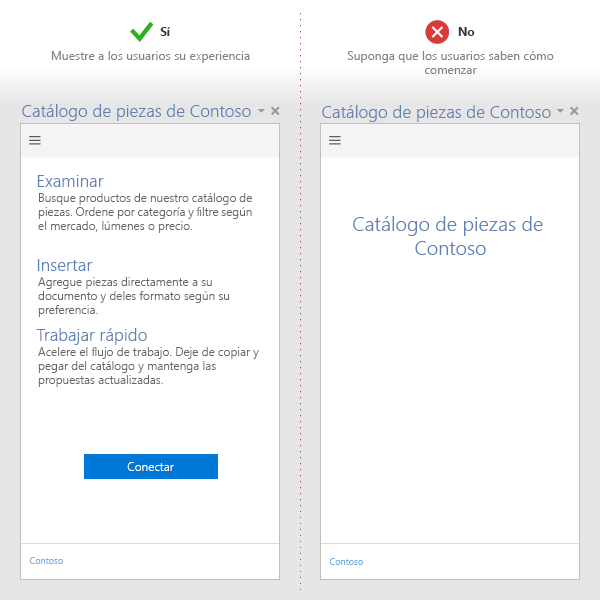
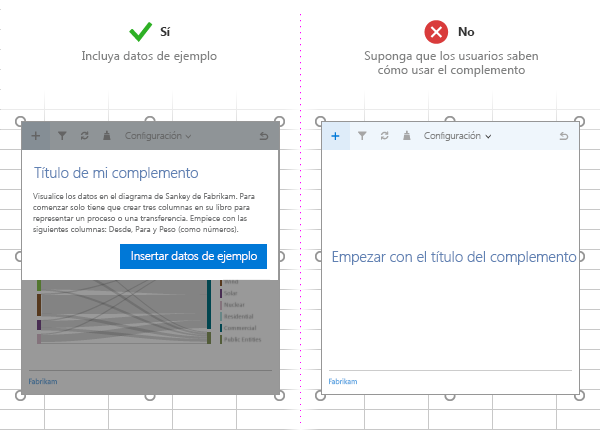
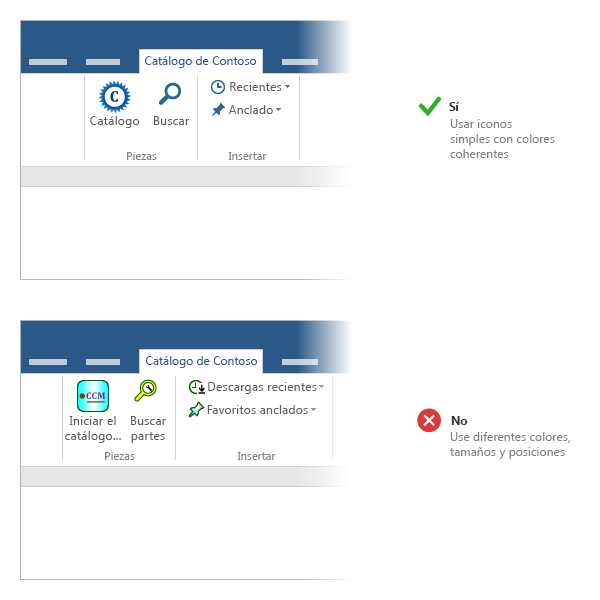
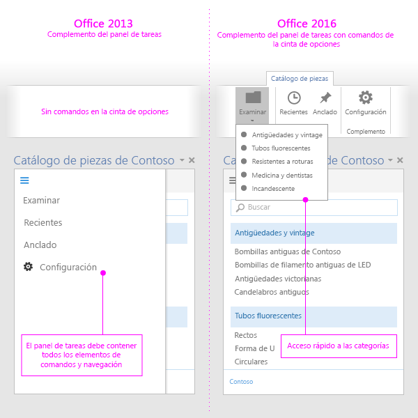

# Procedimientos recomendados para desarrollar complementos para Office

Los complementos eficaces ofrecen una funcionalidad única y atractiva que amplía las aplicaciones de Office de forma visualmente interesante. Para crear un complemento excelente, proporcione una experiencia atractiva la primera vez para sus usuarios, diseñe una experiencia de interfaz de usuario de primera clase y optimice el rendimiento de los complementos. Aplique los procedimientos recomendados descritos en este artículo para crear complementos que ayuden a los usuarios a completar las tareas de forma rápida y eficaz.

## Proporcionar un valor claro

- Cree complementos que ayuden a los usuarios a completar las tareas con rapidez y eficacia. Céntrese en escenarios relevantes para las aplicaciones de Office. Por ejemplo:
 - Realizar las tareas de creación básicas de formas más rápida y fácil, y reducir las interrupciones.
 - Habilitar escenarios nuevos dentro de Office.
 - Insertar servicios complementarios en los hosts de Office.
 - Mejorar la experiencia de Office para aumentar la productividad.
- Asegúrese de que el valor de los complementos quede claro a los usuarios inmediatamente con la [creación de una primera experiencia atractiva](#create-an-engaging-first-run-experience).
- Cree una [descripción eficaz para la Tienda Office](http://msdn.microsoft.com/library/c66a6e6b-2e96-458f-8f8c-2a499fe942c9%28Office.15%29.aspx). Asegúrese de que las ventajas del complemento aparezcan claramente en el título y la descripción. No se base en su marca para comunicar lo que hace el complemento.

## Crear una atractiva experiencia de primera vista

- Atraiga nuevos usuarios con una primera experiencia muy útil e intuitiva. Recuerde que los usuarios aún están decidiendo si usar o abandonar un complemento después de descargarlo desde la tienda.

 - Para que el usuario se sienta atraido por el complemento, los pasos a seguir deben ser claros. Use vídeos, hojas de instrucciones, paneles de paginación u otros recursos para seducir a los usuarios.

 - Refuerce la propuesta de valor del complemento en el inicio en lugar de limitarse a pedir a los usuarios que inicien sesión.

 - Ofrezca interfaz de usuario de enseñanza para guiar a los usuarios y hacer que la interfaz de usuario sea personal.

    

  - Si el complemento de contenido se enlaza a los datos en el documento del usuario, incluya una plantilla o datos de ejemplo para mostrar a los usuarios el formato de datos que hay que usar.

    

- Ofrezca [pruebas gratuitas](http://msdn.microsoft.com/library/145d9466-3c3d-4294-aa23-82068a8e7ae9.aspx%28Office.15%29.aspx#sectionSection1). Si el complemento requiere una suscripción, haga que ciertas funcionalidades estén disponibles sin una suscripción.

- Simplifique el registro. Rellene previamente la información (correo electrónico, nombre para mostrar) y omita las comprobaciones de correo electrónico.

- Evite los elementos emergentes. Si tiene que usarlos, guíe al usuario para habilitar el elemento emergente.

- Use la [autenticación de inicio de sesión único (SSO)](../outlook/authenticate-a-user-with-an-identity-token.md).

Para consultar plantillas donde se muestran modelos que puede aplicar cuando desarrolle su experiencia de primera ejecución, vea [Modelos de diseño de la experiencia del usuario para complementos de Office](https://github.com/OfficeDev/Office-Add-in-UX-Design-Patterns-Code).

## Usar comandos de complementos

- Proporcione puntos de entrada relevantes de interfaz de usuario para el complemento con [comandos de complemento](../design/add-in-commands.md).

- Use comandos para representar una acción específica con un resultado claro y específico para los usuarios. No combine varias acciones en un solo botón.

- Ofrezca acciones pormenorizadas para que las tareas más comunes del complemento sean más eficientes de realizar. Minimice el número de pasos que una acción se tarda en completar.

- Para complementos que amplían la cinta de Office:
    - Coloque los comandos en una pestaña existente (Insertar, Revisar, etc.) si la función proporcionada se ajusta a la pestaña. Por ejemplo, si el complemento permite a los usuarios insertar archivos multimedia, agregue un grupo en la pestaña Insertar. Tenga en cuenta que no todas las pestañas están disponibles en todas las versiones de Office. Para más información, vea [Manifiesto XML de complementos de Office](../overview/add-in-manifests.md). 
    - Coloque los comandos en la pestaña Inicio si la función no se ajusta a ninguna otra pestaña y si tiene menos de seis comandos de nivel superior. También puede agregar comandos a la pestaña Inicio si necesita que el complemento funcione en diferentes versiones de Office (como el software de escritorio de Office y Office Online) y no hay una pestaña disponible en todas las versiones (por ejemplo, la pestaña Diseño no existe en Office Online).  
    - Coloque comandos en una pestaña personalizada si tiene más de seis comandos de nivel superior. 
  - Asigne un nombre al grupo que coincida con el nombre del complemento. Si tiene varios grupos, asigne un nombre a cada grupo según la función de los comandos del grupo.
  - No agregue botones superfluos para aumentar el valor del complemento.

     >
  **Note**  Add-ins that take up too much space might not pass [Office Store validation](https://msdn.microsoft.com/library/cd90836a-523e-42f5-ab02-5123cdf9fefe(Office.15).aspx).

- Para todos los iconos:
    - Coloque iconos y [etiquetas](http://msdn.microsoft.com/library/8cef4fce-e6a1-459b-951f-47ac03ec95a6%28Office.15%29.aspx) pertinentes para los botones que identifiquen claramente la acción que el usuario va a realizar.

 - Use el formato PNG con un fondo transparente.

 - Incluya [los ocho tamaños admitidos](https://msdn.microsoft.com/EN-US/library/mt267547.aspx#bk_resources). Así creará la mejor experiencia para todas las resoluciones compatibles.

  - Siga la línea del estilo visual de Office. Por ejemplo:

    - Use formas sencillas y evite usar varios colores. Los gráficos complejos son difíciles de ver en los tamaños y las resoluciones reducidos.

    - No reutilice metáforas visuales para distintos comandos. Si se usa un mismo icono para diferentes acciones, pueden darse confusiones.

    - Cree etiquetas de botón claras y concisas. Use una combinación de información textual y visual para transmitir un significado.

    - Pruebe los iconos en temas de Office claros y oscuros, así como en configuraciones de contraste alto. Tenga en cuenta que los iconos pueden resultar difíciles de ver en un fondo oscuro o en el modo de contraste alto.

    - Use posiciones y tamaños de icono coherentes para favorecer la alineación visual en la cinta de opciones.

    

- Proporcione una versión del complemento que también funcione en hosts que no sean compatibles con comandos. Un solo manifiesto de complemento puede funcionar en hosts compatibles con comandos y no compatibles con comandos.

    

## Aplicar principios de diseño de experiencia del usuario

- Asegúrese de que la apariencia y las funciones del complemento se adapten a la experiencia de Office. Use [Office UI Fabric](https://dev.office.com/fabric).

- Dé prioridad al contenido sobre el contenedor visual. Evite elementos superfluos de interfaz de usuario que no agreguen valor a la experiencia del usuario.

- Mantenga a los usuarios bajo control. Asegúrese de que comprendan las decisiones importantes y puedan revertir fácilmente las acciones que el complemento realiza.

- Use la personalización de marca para inspirar confianza y orientar a los usuarios. No la use para saturar o invadir con anuncios a los usuarios.

- Evite el desplazamiento. Optimice para una resolución de 1366 x 768.

- No incluya imágenes sin licencia.

- Use un [lenguaje claro y sencillo](http://msdn.microsoft.com/library/8cef4fce-e6a1-459b-951f-47ac03ec95a6%28Office.15%29.aspx) en el complemento.

- Tenga en cuenta la [accesibilidad](http://msdn.microsoft.com/library/3be1abbb-237a-48ec-8e17-72caa25a3cb2%28Office.15%29.aspx): cree un complemento con el que todos los usuarios puedan interactuar fácilmente y dé cabida a las tecnologías de asistencia como los lectores de pantalla.

- Diseñe para todas las plataformas y métodos de entrada, como mouse o teclado y [función táctil](#optimize-for-touch). Garantice que la interfaz de usuario responda a distintos factores de forma.

Para consultar plantillas donde se apliquen principios de diseño que puede usar y personalizar cuando desarrolle un complemento, vea [Modelos de diseño de la experiencia del usuario para complementos de Office](https://github.com/OfficeDev/Office-Add-in-UX-Design-Patterns-Code).

### Optimizar para la función táctil

- Use la propiedad [Context.touchEnabled](../../reference/shared/office.context.touchenabled.md) para detectar si la aplicación host en la que se ejecuta el complemento está habilitada para la función táctil.

     >**Nota** Esta propiedad no es compatible con Outlook.
- Asegúrese de que todos los controles tengan el tamaño adecuado para la interacción táctil. Por ejemplo, los botones tienen destinos táctiles adecuados y los cuadros de entrada son lo suficientemente grandes para que los usuarios escriban datos.

- No se base en los métodos que no son de entrada táctil como mantener el puntero o hacer clic con el botón derecho.

- Asegúrese de que el complemento funcione en orientación vertical y horizontal. Tenga en cuenta que, en los dispositivos táctiles, el teclado en pantalla podría ocultar parte del complemento.

- Pruebe el complemento en un dispositivo real mediante una [instalación de prueba](../testing/sideload-an-office-add-in-on-ipad-and-mac.md).

 >**Nota**  Si está usando [Office UI Fabric](https://github.com/OfficeDev/Office-UI-Fabric) para sus elementos de diseño, muchos de estos elementos se controlan.

## Optimizar y supervisar el rendimiento de los complementos

- Cree la percepción de respuestas rápidas de interfaz de usuario. El complemento debería cargarse en 500 milisegundos o menos.

- Asegúrese de que todas las interacciones del usuario respondan en menos de un segundo.

-  Proporcione indicadores de carga para las operaciones de larga duración.

- Use una red CDN para hospedar imágenes, recursos y bibliotecas comunes. Cargue tanto como pueda desde un solo lugar.

- Siga las prácticas web estándar para optimizar su página web. En producción, use solo versiones reducidas de las bibliotecas. Cargue únicamente los recursos que necesita y optimice cómo se cargan los recursos.

- Si las operaciones tardan tiempo en ejecutarse, informe a los usuarios. Tenga en cuenta los umbrales enumerados en la tabla siguiente. Vea también [Límites de recursos y optimización de rendimiento para los complementos de Office](../../docs/develop/resource-limits-and-performance-optimization.md)

|**Clase de interacción**|**Destino**|**Límite superior**|**Percepción humana**|
|:-----|:-----|:-----|:-----|
|Instantánea|<=50 ms|100 ms|No se percibe demora.|
|Rápido|50-100 ms|200 ms|Demora mínimamente perceptible. No es necesario informar.|
|Típica|100-300 ms|500 ms|Breve, pero demasiado lenta para describirse como rápida. No es necesario informar.|
|Respuesta correcta|300-500 ms|1 segundo|No es rápida, pero la respuesta se percibe como correcta. No es necesario informar.|
|Continuo.|>500 ms|5 segundos|Espera media. La respuesta ya no se percibe como correcta. Podría ser necesario informar.|
|Cautiva|>500 ms|10 segundos|Larga, pero no lo suficiente para poder hacer otra cosa. Podría ser necesario informar.|
|Extendido|>500 ms|>10 segundos|Suficientemente larga para poder hacer otra cosa mientras se espera. Podría ser necesario informar.|
|Larga duración|>5 ms|>1 minuto|Los usuarios ciertamente harán otra cosa.|
- Supervise el estado del servicio y use telemetría para supervisar el éxito del usuario.

## Comercializar el complemento

- Publique su complemento en la [Tienda Office](http://msdn.microsoft.com/library/ff075782-1303-4517-91cc-b3d730e9b9ae%28Office.15%29.aspx) y [promuévalo](http://msdn.microsoft.com/library/b19e21f8-76f5-44e1-9971-bef79cad4c71%28Office.15%29.aspx) desde su sitio web. Cree una [descripción de la Tienda Office eficaz](http://msdn.microsoft.com/library/c66a6e6b-2e96-458f-8f8c-2a499fe942c9%28Office.15%29.aspx).

- Use títulos concisos y descriptivos para el complemento. No incluya más de 128 caracteres.

- Transmita la propuesta de valor de su complemento en el título y la descripción. No dependa de la marca.

- Transmita la propuesta de valor de su complemento en el título y la descripción. No dependa de la marca.

- Publique su complemento en la Tienda Office y promuévalo  desde su sitio web.

