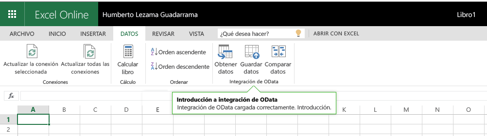

# Información general sobre la plataforma de complementos para Office

Los complementos de Office le permiten ampliar los clientes de Office como Word, Excel, PowerPoint y Outlook con tecnologías web como HTML, CSS y JavaScript. 

Puede usar los complementos de Office para: 

-  **Agregar nuevas funciones a clientes de Office**: por ejemplo, puede mejorar Word, Excel, PowerPoint y Outlook si interactúa con documentos de Office y elementos de correo, importar datos externos en Office, procesar documentos de Office, mostrar funciones de terceros en clientes de Office y mucho más. 
    
-  **Crear objetos interactivos avanzados que se pueden insertar en documentos de Office**: por ejemplo, mapas, gráficos y visualizaciones interactivas que los usuarios pueden agregar a sus propias hojas de cálculo de Excel y presentaciones de PowerPoint.
    
**Los complementos de Office son compatibles con diferentes versiones de Office** como Office para escritorio de Windows, Office Online, Office para Mac y Office para iPad.

>**Nota:** Al generar el complemento, si va a [publicar](../publish/publish.md) el complemento en la Tienda Office, asegúrese de que se ajusta a las [directivas de validación de la Tienda Office](https://msdn.microsoft.com/en-us/library/jj220035.aspx). Por ejemplo, para superar la validación, el complemento debe funcionar en todas las plataformas que sean compatibles con los métodos especificados (para más información, consulte la [sección 4.12](https://msdn.microsoft.com/en-us/library/jj220035.aspx#Anchor_3) y el [host del complemento de Office y la página de disponibilidad](https://dev.office.com/add-in-availability)).

Para consultar una lista detallada de dónde se pueden usar actualmente los complementos de Office, vea la página [Disponibilidad de plataformas y hosts de los complementos de Office](http://dev.office.com/add-in-availability). 

## ¿Qué puede hacer un complemento de Office?

Un complemento de Office puede hacer lo mismo que puede hacer cualquier página web dentro del explorador, por ejemplo:

- Ampliar la interfaz de usuario nativa de Office al crear pestañas y botones personalizados en la cinta.

- Proporcionar una interfaz de usuario interactiva y una lógica personalizada a través de HTML y JavaScript.
    
- Usar marcos de JavaScript como jQuery y Angular, entre otros.
    
- Conectarse a los extremos de REST y a servicios web a través de HTTP y AJAX.
    
- Ejecutar código o lógica del lado servidor, si la página se ha implementado con un lenguaje de scripting del lado servidor, como ASP o PHP.
    

Además, los complementos de Office pueden interactuar con la aplicación de Office y con el contenido del usuario del complemento a través de una [API de JavaScript](../../docs/develop/understanding-the-javascript-api-for-office.md) que proporciona la infraestructura de Complementos de Office. 

## Tipos de complementos de Office

Se pueden crear los siguientes tipos de complementos de Office:
 
- Complementos de Word, Excel y PowerPoint que amplían funciones
- Complementos de Excel y PowerPoint que crean objetos
- Complementos de Outlook que amplían funciones

### Complementos de Word, Excel y PowerPoint que amplían funciones 
Puede **agregar una nueva función** a Word, Excel o PowerPoint, registre el complemento con un [manifiesto de complemento de panel de tareas](../design/add-in-commands.md). Este manifiesto es compatible con **dos modos de integración**:

- Comandos de complementos
- Paneles de tareas insertables

####Comandos de complementos
Use comandos de complementos para ampliar la interfaz de usuario de Office para escritorio de Windows y Office Online. Por ejemplo, puede agregar **botones para sus complementos en la cinta** o menús contextuales seleccionados, lo que permitirá a los usuarios tener acceso de forma sencilla a sus complementos en Office. Los botones de comando pueden iniciar diferentes acciones, como **mostrar un panel (o varios paneles) con HTML personalizado** o **ejecutar una función de JavaScript**. Le recomendamos que [vea este vídeo de Channel9](https://channel9.msdn.com/events/Build/2016/P551) para obtener más información sobre esta característica.

**Complemento con comandos que se ejecuta en la versión para equipos de escritorio de Excel**

**Complemento con comandos que se ejecuta en Excel Online**

Puede definir los comandos en el manifiesto del complemento si usa **VersionOverrides**. La plataforma de Office se encarga de interpretarlos en la interfaz de usuario nativa. Para empezar, consulte estos [ejemplos en GitHub](https://github.com/OfficeDev/Office-Add-in-Commands-Samples/) y vea [Comandos de complementos para Excel, Word y PowerPoint](../design/add-in-commands.md)

####Paneles de tareas insertables
Los clientes que aún no son compatibles con comandos de complementos (Office 2013, Office para Mac y Office para iPad) ejecutarán el complemento como un **panel de tareas** con la **DefaultUrl** proporcionada en el manifiesto. Después, el complemento se puede iniciar a través del menú **Mis complementos** de la pestaña Insertar. 

>**Importante:** Un solo manifiesto puede tener un complemento de panel de tareas que se ejecuta en clientes no compatibles con comandos y una versión que se ejecuta con comandos. Esto le permite tener un solo complemento que funciona en todos los clientes compatibles con complementos de Office.
 
###Complementos de Excel y PowerPoint que crean objetos 

Use un manifiesto de complemento de contenido para integrar **objetos basados en web que se pueden insertar dentro de documentos**. Los complementos de contenido le permiten integrar visualizaciones de datos avanzadas basadas en web, contenido multimedia insertado (como un reproductor de vídeo de YouTube o una galería de imágenes) y otro contenido externo.

>**Nota:** Actualmente, los complementos de contenido no admiten los comandos de complementos.

**Complemento de contenido**

Para probar un complemento de contenido en Excel 2013 o en Excel Online, instale el complemento [Mapas de Bing](https://store.office.com/bing-maps-WA102957661.aspx?assetid=WA102957661).

### Complementos de Outlook que amplían funciones

Los complementos de Outlook pueden ampliar la cinta de Office y también se pueden mostrar en contexto al ver o redactar un elemento de Outlook. Pueden trabajar con un mensaje de correo electrónico, una convocatoria de reunión, una respuesta a una reunión, una cancelación de reunión o una cita en un escenario de lectura (el usuario visualiza un elemento recibido) o en un escenario de redacción (el usuario responde o crea un elemento). 

Los complementos de Outlook pueden tener acceso a información contextual del elemento (como una dirección o un id. de seguimiento) y, después, usar esos datos para tener acceso a información adicional en el servidor y en servicios web para crear experiencias del usuario atractivas. En la mayoría de los casos, un complemento de Outlook se ejecuta sin modificación en las diferentes aplicaciones host compatibles, como Outlook, Outlook para Mac, Outlook Web App y OWA para dispositivos, para proporcionar una experiencia unificada en el escritorio, la web y en tabletas y dispositivos móviles.

Para más información, vea [Complementos de Outlook](../outlook/outlook-add-ins.md).

 >**Nota** Los complementos de Outlook necesitan una versión mínima de Exchange 2013 o Exchange Online para hospedar el buzón del usuario. Las cuentas de correo electrónico POP e IMAP no son compatibles.

**Complemento de Outlook con botones de comando en la cinta**

**Complemento de Outlook contextual**

Para probar un complemento de Outlook en Outlook, Outlook para Mac o Outlook Web App, instale el complemento [Package Tracker](https://store.office.com/package-tracker-WA104162083.aspx?assetid=WA104162083).

## Anatomía de un complemento de Office

Los componentes básicos de un complemento de Office son un archivo de manifiesto XML y su propia aplicación web. El manifiesto define diferentes opciones de configuración, como la forma en que el complemento se integra con los clientes de Office. Es necesario que la aplicación web este hospedada en un servidor web o un servicio de hospedaje de sitios web como [Microsoft Azure](../publish/host-an-office-add-in-on-microsoft-azure.md).

**Manifiesto + página web = complemento de Office**

###Manifiesto

El manifiesto especifica la configuración y las funcionalidades del complemento, por ejemplo:
    
- El nombre para mostrar, la descripción, el identificador, la versión y la configuración regional predeterminada del complemento.
    
- Cómo se integra el complemento con Office: 
      - Para complementos que amplían Word/Excel/PowerPoint/Outlook: Los puntos de extensión nativos que apuntan al complemento se usan para exponer funciones, como los botones de la cinta. 
      - Para complementos que crean objetos que se pueden insertar: La dirección URL de la página predeterminada que se carga para el objeto.
       
    
- El nivel de permiso y los requisitos de acceso a datos del complemento.
    
Para más información, vea [Manifiesto XML de complementos de Office](../../docs/overview/add-in-manifests.md).

###Aplicación web

La versión mínima de una aplicación web compatible es una página web HTML estática. La página se puede hospedar en cualquier servidor web o servicio de hospedaje de sitios web, como [Microsoft Azure](../publish/host-an-office-add-in-on-microsoft-azure.md). Puede hospedar su aplicación web en el servicio que prefiera.  

El complemento de Office más básico está formado por una página HTML estática que se muestra dentro de una aplicación de Office, pero no interactúa con el documento de Office ni con un recurso de Internet. Pero, como es una aplicación web, puede usar cualquier tecnología (del lado cliente o del lado servidor) compatible con su proveedor de hospedaje (como ASP.net, PHP o Node.js). Para interactuar con clientes y documentos de Office, puede usar la [API de JavaScript](../../docs/develop/understanding-the-javascript-api-for-office.md) de office.js que proporcionamos. 

**Componentes de un complemento de Office Hola a todos**

### API de JavaScript

Las API de JavaScript de Word y Excel proporcionan modelos de objetos específicos de host que puede usar en un complemento de Office. Estas API proporcionan acceso a objetos bien conocidos como párrafos y libros, por lo que resulta sencillo crear un complemento para Word o Excel. Para más información sobre estas API, consulte [Complementos de Word](../word/word-add-ins-programming-overview.md) y [Complementos de Excel](../excel/excel-add-ins-javascript-programming-overview.md).

La API de JavaScript para Office contiene objetos y miembros que permiten crear complementos e interactuar con el contenido y los servicios web de Office.

Para más información sobre la API de JavaScript para Office, vea [Información sobre la API de JavaScript para Office](../../docs/develop/understanding-the-javascript-api-for-office.md) y la referencia de la [API de JavaScript para Office](../../reference/javascript-api-for-office.md).
    
## Recursos adicionales

- [Instrucciones de diseño para complementos de Office](../../docs/design/add-in-design.md)
    
- [Referencia de API](../../docs/develop/understanding-the-javascript-api-for-office.md)
    
