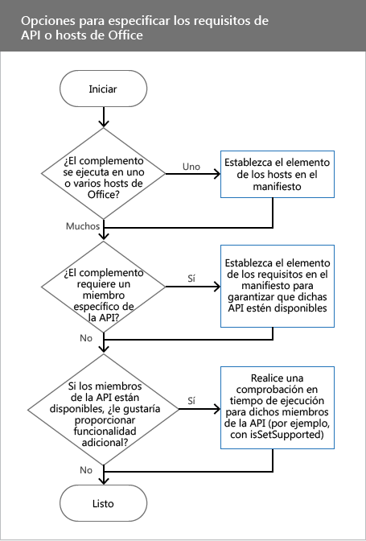

# <a name="specify-office-hosts-and-api-requirements"></a>Especificar los hosts de Office y los requisitos de la API


Para que funcione según lo esperado, el complemento de Office puede depender de un host de Office específico, un conjunto de requisitos, un miembro de la API o una versión de la API. Por ejemplo, el complemento podría:

- Ejecutarse en una sola aplicación de Office (Word o Excel), o en varias aplicaciones.
    
- Usar las API de JavaScript que solo están disponibles en algunas versiones de Office. Por ejemplo, podría usar las API de JavaScript para Excel en un complemento que se ejecuta en Excel 2016. 
    
- Ejecutarse solo en versiones de Office que admitan los miembros de la API que se usan en el complemento.
    
Este artículo ayuda a comprender las opciones que se tienen que elegir para asegurarse de que el complemento funciona según lo esperado y de que llega al público más amplio posible.

>**Nota:** Para consultar una lista detallada de dónde se pueden usar actualmente los complementos de Office, vea la página [Disponibilidad de plataformas y hosts de los complementos de Office](http://dev.office.com/add-in-availability). 

En esta tabla se enumeran los conceptos básicos que se explican en el artículo.


|**Concepto**|**Descripción**|
|:-----|:-----|
|Aplicación de Office, aplicación host de Office, host de Office o host|La aplicación de Office que se usa para ejecutar la complemento. Por ejemplo, Word, Word Online o Excel.|
|Plataforma|Donde se ejecuta el host de Office, como Office Online u Office para iPad.|
|Conjunto de requisitos|Un grupo con nombre de miembros de la API relacionados. Los complementos usan conjuntos de requisitos para determinar si el host de Office es compatible con miembros de la API usados por el complemento. Es más fácil comprobar la compatibilidad de un conjunto de requisitos que comprobar la compatibilidad de miembros de la API individuales. La compatibilidad de conjuntos de requisitos varía en función del host de Office y la versión del host de Office. <br >Los conjuntos de requisitos se especifican en el archivo de manifiesto. Al especificar conjuntos de requisitos en el manifiesto, se establece el nivel mínimo de compatibilidad de la API que el host de Office tiene que proporcionar para poder ejecutar el complemento. Los hosts de Office que no sean compatibles con los conjuntos de requisitos especificados en el manifiesto no podrán ejecutar el complemento, que no se mostrará en <span class="ui">Mis complementos</span>. Esto limita dónde está disponible el complemento en el código con comprobaciones en tiempo de ejecución. Para obtener la lista completa de conjuntos de requisitos, consulte [Conjuntos de requisitos de complementos de Office](../../reference/office-add-in-requirement-sets.md).|
|Comprobación en tiempo de ejecución|En el tiempo de ejecución se realiza una prueba para determinar si el host de Office que ejecuta el complemento admite los conjuntos de requisitos o los métodos que usa la complemento. Para realizar una comprobación en tiempo de ejecución, use una instrucción  **if** con el método **isSetSupported**, conjuntos de requisitos o nombres de método que no formen parte de un conjunto de requisitos.Use comprobaciones en tiempo de ejecución para garantizar que el complemento alcance el mayor número de clientes. A diferencia de los conjuntos de requisitos, las comprobaciones en tiempo de ejecución no especifican el nivel mínimo de compatibilidad con la API que el host de Office debe proporcionar para que el complemento se ejecute. Use la instrucción  **if** para determinar si un miembro de la API se admite o no. En caso afirmativo, puede agregar funciones al complemento. La complemento siempre se mostrará en **Mis complementos** al usar las comprobaciones en tiempo de ejecución.|

## <a name="before-you-begin"></a>Antes de empezar

La complemento debe usar la versión más reciente del esquema de manifiesto de la complemento. Si se usan comprobaciones en tiempo de ejecución en la complemento, hay que asegurarse de usar la API de JavaScript más reciente para la biblioteca de Office (office.js).


### <a name="specify-the-latest-add-in-manifest-schema"></a>Especificar el esquema del manifiesto del complemento más reciente

El manifiesto del complemento debe usar la versión 1.1 del esquema del manifiesto del complemento. Establezca el elemento **OfficeApp** del manifiesto del complemento como sigue.


```XML
<OfficeApp xmlns="http://schemas.microsoft.com/office/appforoffice/1.1" xmlns:xsi="http://www.w3.org/2001/XMLSchema-instance" xsi:type="TaskPaneApp">
```


### <a name="specify-the-latest-javascript-api-for-office-library"></a>Especificar la API de JavaScript más reciente para la biblioteca de Office


Si usa comprobaciones en tiempo de ejecución, haga referencia a la versión más reciente de la API de JavaScript para la biblioteca de Office desde la red de entrega de contenido (CDN). Agregue la siguiente etiqueta  `script` al código HTML. El uso de `/1/` en la dirección URL de la red CDN garantiza que se haga referencia a la versión más reciente de Office.js.


```HTML
<script src="https://appsforoffice.microsoft.com/lib/1/hosted/Office.js" type="text/javascript"></script>
```


## <a name="options-to-specify-office-hosts-or-api-requirements"></a>Opciones para especificar hosts de Office o requisitos de API

Al especificar hosts de Office o requisitos de la API, es necesario tener en cuenta varios factores. En el diagrama siguiente se muestra cómo decidir la técnica que usar en el complemento.




- Si el complemento se ejecuta en un host de Office, establezca el elemento **Hosts** en el manifiesto. Para obtener más información, consulte [Establecer el elemento Hosts](../../docs/overview/specify-office-hosts-and-api-requirements.md#set-the-hosts-element).
    
- Para establecer el conjunto de requisitos mínimos o los miembros de la API que un host de Office debe admitir para ejecutar el complemento, establezca el elemento  **Requirements** en el manifiesto. Para obtener más información, consulte [Establecer el elemento Requirements en el manifiesto](../../docs/overview/specify-office-hosts-and-api-requirements.md#set-the-requirements-element-in-the-manifest).
    
- Si quiere proporcionar funciones adicionales si en el host de Office hay disponibles conjuntos de requisitos o miembros de la API específicos, realice una comprobación en tiempo de ejecución en el código JavaScript del complemento. Por ejemplo, si el complemento se ejecuta en Excel 2016, puede usar miembros de la nueva API de JavaScript para Excel para conseguir funciones adicionales. Para más información, vea [Usar comprobaciones en tiempo de ejecución en el código JavaScript](../../docs/overview/specify-office-hosts-and-api-requirements.md#use-runtime-checks-in-your-javascript-code).
    

## <a name="set-the-hosts-element"></a>Establecer el elemento Hosts


Para ejecutar el complemento en una aplicación host de Office, use los elementos **Hosts** y **Host** en el manifiesto. Si el elemento **Hosts** no se especifica en el manifiesto, el complemento se ejecutará en todos los hosts.

Por ejemplo, la siguiente declaración **Hosts** y **Host** especifica que el complemento funcionará con cualquier versión de Excel (como Excel en Windows, Excel Online y Excel para iPad).


```XML
  <Hosts>
    <Host Name="Workbook" />
  </Hosts>
```

El elemento  **Hosts** puede contener uno o varios elementos **Host**. El elemento  **Host** especifica el host de Office que necesita la complemento. El atributo **Name** es obligatorio y se puede establecer en uno de los siguientes valores.


| Nombre          | Aplicaciones host de Office                      |
|:--------------|:----------------------------------------------|
| Base de datos      | Aplicaciones web de Access                               |
| Documento      | Word para Windows, Mac, iPad y Online        |
| Buzón de correo       | Outlook para Windows, Mac, en la Web y Outlook.com | 
| Presentación  | PowerPoint para Windows, Mac, iPad y Online  |
| Project       | Project                                       |
| Libro      | Excel para Windows, Mac, iPad y Online           |

 >**Nota:**  El atributo `Name` especifica la aplicación host de Office que puede ejecutar el complemento. Los hosts de Office son compatibles con distintas plataformas y se ejecutan en equipos de sobremesa, exploradores web, tabletas y dispositivos móviles. No es posible especificar las plataformas que se pueden usar para ejecutar el complemento. Por ejemplo, si especifica `Mailbox`, pueden usarse tanto Outlook como Outlook Web App para ejecutar el complemento. 


## <a name="set-the-requirements-element-in-the-manifest"></a>Establecer el elemento Requirements en el manifiesto


El elemento  **Requirements** especifica los conjuntos de requisitos mínimos o miembros de la API que deben ser compatibles con el host de Office para ejecutar su complemento. El elemento **Requirements** puede especificar tanto los conjuntos de requisitos como los métodos individuales que se usan en su complemento. En la versión 1.1 del esquema de manifiesto de complemento, el elemento **Requirements** es opcional para todas las complementos, excepto las complementos de Outlook.


 >**Precaución:**  Use el elemento **Requirements** únicamente para especificar conjuntos de requisitos críticos o miembros de la API que debe usar el complemento. Si la plataforma o el host de Office no son compatibles con los conjuntos de requisitos o los miembros de la API especificados en el elemento **Requirements**, el complemento no se ejecutará en la plataforma o el host ni se mostrará en **Mis complementos**. Por esta razón, es recomendable que el complemento esté disponible en todas las plataformas de un host de Office, como Excel para Windows, Excel Online y Excel para iPad. Para que el complemento esté disponible en _todos_ los hosts y plataformas de Office, use comprobaciones en tiempo de ejecución en lugar del elemento **Requirements**.

En el siguiente ejemplo de código se muestra un complemento que se carga en todas aplicaciones host de Office que admiten lo siguiente:


-  El conjunto de requisitos de  **OOXML**, cuya versión mínima es 1.1.
    
-  El método  **Document.getSelectedDataAsync**.
    
-  El método **Document.getSelectedDataAsync**.
    


```XML
<Requirements>
   <Sets DefaultMinVersion="1.1">
      <Set Name="TableBindings" MinVersion="1.1"/>
      <Set Name="OOXML" MinVersion="1.1"/>
   </Sets>
   <Methods>
      <Method Name="Document.getSelectedDataAsync"/>
   </Methods>
</Requirements>
```

- El elemento **Requirements** contiene los elementos secundarios **Sets** y **Methods**.
    
- El elemento  **Sets** puede contener uno o varios elementos **Set**.  **DefaultMinVersion** especifica el valor predeterminado **MinVersion** de todos los elementos secundarios **Set**.
    
- El elemento  **Set** especifica los conjuntos de requisitos que el host de Office debe admitir para ejecutar la complemento. El atributo **Name** especifica el nombre del conjunto de requisitos. El atributo **MinVersion** especifica la versión mínima del conjunto de requisitos. **MinVersion** invalida el valor de **DefaultMinVersion**. Para obtener más información sobre los conjuntos de requisitos y las versiones del conjunto de requisitos a los que pertenecen los miembros de la API, consulte [Conjuntos de requisitos de complementos de Office](../../reference/office-add-in-requirement-sets.md).
    
- El elemento  **Methods** puede contener uno o varios elementos **Method**. No puede usar el elemento  **Methods** con complementos de Outlook.
    
- El elemento  **Method** especifica un método individual que debe ser compatible con el host de Office en el que se ejecuta la complemento. El atributo **Name** es obligatorio y especifica el nombre del método completo con su objeto principal.
    

## <a name="use-runtime-checks-in-your-javascript-code"></a>Usar comprobaciones en tiempo de ejecución en el código JavaScript


Es posible que quiera proporcionar funcionalidad adicional en el complemento si el host de Office admite ciertos conjuntos de requisitos. Por ejemplo, tal vez quiera usar las nuevas API de JavaScript para Word en su complemento existente si este se ejecuta en Word 2016. Para ello, se usa el método **isSetSupported** con el nombre del conjunto de requisitos. **isSetSupported** determina en tiempo de ejecución si el host de Office que ejecuta el complemento admite el conjunto de requisitos. Si admite el conjunto de requisitos, **isSetSupported** devuelve **true** y se ejecuta el código adicional que usa los miembros de la API de ese conjunto de requisitos. Si el host de Office no admite el conjunto de requisitos, **isSetSupported** devuelve **false** y no se ejecuta el código adicional. El código siguiente muestra la sintaxis que se usa con **isSetSupported**.


```js
if (Office.context.requirements.isSetSupported(RequirementSetName , VersionNumber )
{
   // Code that uses API members from RequirementSetName .
}

```


-  _RequirementSetName_ (obligatorio) es una cadena que representa el nombre del conjunto de requisitos. Para obtener más información sobre los conjuntos de requisitos disponibles, consulte [Conjuntos de requisitos de complementos de Office](../../reference/office-add-in-requirement-sets.md).
    
-  _VersionNumber_ (opcional) es la versión del conjunto de requisitos.
    
En Excel 2016 o Word 2016, use  **isSetSupported** con los conjuntos de requisitos de **ExcelAPI** o **WordAPI**. El método  **isSetSupported** y los conjuntos de requisitos de **ExcelAPI** y **WordAPI** están disponibles en el archivo Office.js más reciente disponible en la red CDN. Si no usa Office.js desde la red CDN, el complemento podría generar excepciones porque **isSetSupported** no estará definido. Para obtener más información, consulte [Especificar la API de JavaScript más reciente para la biblioteca de Office](../../docs/overview/specify-office-hosts-and-api-requirements.md#specify-the-latest-javascript-api-for-office-library). 


 >**Nota:** **isSetSupported** no funciona en Outlook ni en Outlook Web App. Para usar una comprobación en tiempo de ejecución en Outlook o Outlook Web App, use la técnica descrita en [Comprobaciones en tiempo de ejecución mediante métodos que no están en un conjunto de requisitos](../../docs/overview/specify-office-hosts-and-api-requirements.md#runtime-checks-using-methods-not-in-a-requirement-set).

El siguiente ejemplo de código muestra cómo un complemento puede proporcionar distintas funciones para distintos hosts de Office que podrían admitir diversos conjuntos de requisitos o miembros de la API.


```js
if (Office.context.requirements.isSetSupported('WordApi', 1.1)
{
    // Run code that provides additional functionality using the JavaScript API for Word when the add-in runs in Word 2016.
}
else if (Office.context.requirements.isSetSupported('CustomXmlParts')
{
      // Run code that uses API members from the CustomXmlParts requirement set.
}
else 
{
    // Run additional code when the Office host is not Word 2016, and when the Office host does not support the CustomXmlParts requirement set.
}

```


## <a name="runtime-checks-using-methods-not-in-a-requirement-set"></a>Comprobaciones en tiempo de ejecución mediante métodos que no están en un conjunto de requisitos


Algunos miembros de la API no pertenecen a conjuntos de requisitos. Esto solo se aplica a los miembros de la API que forman parte del espacio de nombres de la [API de JavaScript para Office](../../reference/javascript-api-for-office.md) (todo lo que esté bajo Office.), no a los miembros de la API que pertenecen a los espacios de nombres de la API de JavaScript para Word (todo lo que esté bajo Word.) o la [referencia de la API de JavaScript de complementos de Excel](https://msdn.microsoft.com/library/office/mt616490.aspx) (todo lo que esté bajo Excel.). Cuando el complemento depende de un método que no forma parte de un conjunto de requisitos, puede usar la comprobación en tiempo de ejecución para determinar si el método es compatible con el host de Office, como se muestra en el ejemplo de código siguiente. Para obtener una lista completa de los métodos que no pertenecen a un conjunto de requisitos, consulte [Conjuntos de requisitos de complementos de Office](../../reference/office-add-in-requirement-sets.md).


 >**Nota** Se recomienda limitar el uso de este tipo de comprobación en tiempo de ejecución en el código de complemento.

El siguiente ejemplo de código comprueba si el host es compatible con  **document.setSelectedDataAsync**.


```js
if (Office.context.document.setSelectedDataAsync)
{
    // Run code that uses document.setSelectedDataAsync.
}
```


## <a name="additional-resources"></a>Recursos adicionales


- [Manifiesto XML de complementos para Office](../../docs/overview/add-in-manifests.md)
    
- [Conjuntos de requisitos de complementos de Office](../../reference/office-add-in-requirement-sets.md)
    
- [Word-Add-in-Get-Set-EditOpen-XML ](https://github.com/OfficeDev/Word-Add-in-Get-Set-EditOpen-XML)
    
