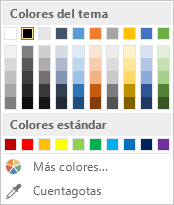
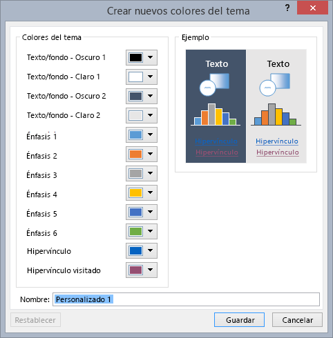
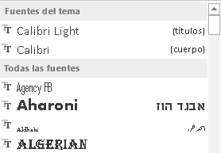
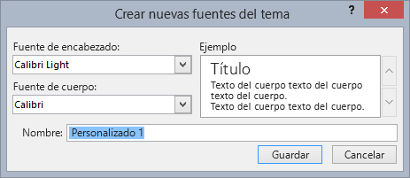
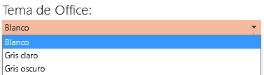
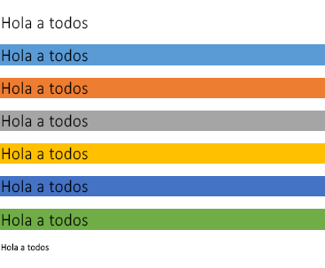
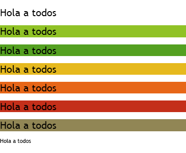
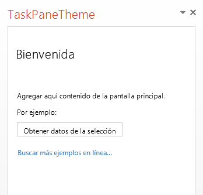
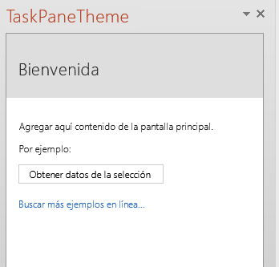
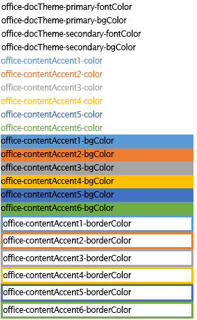

# <a name="use-document-themes-in-your-powerpoint-add-ins"></a>Uso de temas de documentos en los complementos para PowerPoint


Un [tema de Office](https://support.office.com/en-US/Article/What-is-a-theme--7528ccc2-4327-4692-8bf5-9b5a3f2a5ef5) consiste, en parte, en un conjunto coordinado visualmente de fuentes y colores que se puede aplicar a presentaciones, documentos, hojas de cálculo y correos electrónicos. Para aplicar o personalizar el tema de una presentación en PowerPoint, use los grupos **Temas** y **Variantes** en la pestaña **Diseño** de la cinta. PowerPoint asigna una presentación en blanco con el **Tema de Office** predeterminado, pero puede elegir otros temas disponibles en la pestaña **Diseño**, descargar temas adicionales de Office.com, o crear y personalizar su propio tema.

Con OfficeThemes.css puede diseñar complementos que se coordinan con PowerPoint de dos formas:


-  **En los complementos de contenido para PowerPoint** Use las clases de temas de documentos de OfficeThemes.css para especificar fuentes y colores que coincidan con el tema de la presentación en la que se inserta la complemento de contenido; esas fuentes y colores se actualizarán dinámicamente si un usuario cambia o personaliza el tema de la presentación.
    
-  **En los complementos de panel de tareas para PowerPoint** Use las clases de temas de la interfaz de usuario de Office de OfficeThemes.css para especificar las mismas fuentes y colores de fondo que se usan en la interfaz de usuario de modo que los complementos de panel de tareas coincidan con los colores de los paneles de tareas integrados; y dichos colores se actualizarán dinámicamente si un usuario cambia el tema de la interfaz de usuario de Office.
    

### <a name="document-theme-colors"></a>Colores de temas del documento

Cada tema del documento de Office define 12 colores. Diez de esos colores se encuentran disponibles cuando establece la fuente, el fondo y otras opciones de colores en una presentación con el selector de colores:




Para ver o personalizar el conjunto total de 12 colores de temas en PowerPoint, en el grupo **Variantes** de la pestaña **Diseño**, haga clic en el menú desplegable **Más** y, después, elija **Color** y haga clic en **Personalizar colores** para que aparezca el cuadro de diálogo **Crear nuevos colores del tema**:




Los primeros cuatro colores son para texto y fondos. El texto que se crea con colores claro siempre será legible sobre colores oscuros y el texto que se crea con colores oscuros siempre será legible sobre colores claros. Los seis colores siguientes son colores de énfasis que siempre están visibles en los cuatro colores de fondo posibles. Los dos últimos colores son para hipervínculos e hipervínculos visitados.


### <a name="document-theme-fonts"></a>Fuentes de temas del documento

Cada tema del documento de Office también define dos fuentes: una para los encabezados y otra para el texto de cuerpo. PowerPoint usa estas fuentes para crear estilos de texto automáticos. Además, las galerías de **Estilos rápidos** para texto y **WordArt** usan las mismas fuentes del tema. Estas dos fuentes están disponibles como las primeras dos selecciones cuando selecciona fuentes con el selector de fuentes:




Para ver o personalizar las fuentes de temas en PowerPoint, en el grupo **Variantes** de la pestaña **Diseño**, haga clic en el menú desplegable **Más** y, después, elija **Fuentes** y haga clic en **Personalizar fuentes** para mostrar el cuadro de diálogo **Crear nuevas fuentes del tema**.





### <a name="office-ui-theme-fonts-and-colors"></a>Fuentes y colores del tema de la interfaz de usuario de Office

Office también permite elegir entre varios temas predefinidos que especifican algunos de los colores y las fuentes que se usan en la interfaz de usuario de todas las aplicaciones de Office. Para ello, use el menú desplegable  **Archivo**  >  **Cuenta**  >  **Tema de Office** (desde cualquier aplicación de Office).




OfficeThemes.css incluye clases que puede usar en los complementos de panel de tareas para PowerPoint de modo que usen las mismas fuentes y colores. Esto le permite diseñar complementos de panel de tareas que coincidan con la apariencia de los paneles de tareas integrados.


## <a name="using-officethemes.css"></a>Usar OfficeThemes.css

Usar el archivo OfficeThemes.css con los complementos de contenido para PowerPoint permite coordinar la apariencia de complemento con el tema aplicado a la presentación con la que se está ejecutando. Usar el archivo OfficeThemes.css con los complementos de paneles de tareas para PowerPoint permite coordinar la apariencia de complemento con las fuentes y los colores de la interfaz de usuario de Office.


### <a name="adding-the-officethemes.css-file-to-your-project"></a>Agregar el archivo OfficeThemes.css al proyecto

Use los siguientes pasos para agregar el archivo OfficeThemes.css al proyecto de complemento, y hacer referencia a él.


### <a name="to-add-officethemes.css-to-your-visual-studio-project"></a>Para agregar OfficeThemes.css al proyecto de Visual Studio


1. En el **Explorador de soluciones**, haga clic con el botón derecho en la carpeta **Contenido** del proyecto _**nombre_proyecto**_**Web**, elija **Agregar** y, después, haga clic en **Hoja de estilo**.
    
2. Asígnele a la hoja de estilo nueva el nombre OfficeThemes.
    
     >**Importante** La hoja de estilos debe tener el nombre OfficeThemes o no funcionará la característica que actualiza de forma dinámica las fuentes y los colores de complementos cuando un usuario cambia el tema.
3. Elimine la clase  **body** predeterminada ( `body {}`) en el archivo, y copie y pegue el siguiente código CSS en el archivo.
    
```
  /* The following classes describe the common theme information for office documents */ /* Basic Font and Background Colors for text */ .office-docTheme-primary-fontColor { color:#000000; } .office-docTheme-primary-bgColor { background-color:#ffffff; } .office-docTheme-secondary-fontColor { color: #000000; } .office-docTheme-secondary-bgColor { background-color: #ffffff; } /* Accent color definitions for fonts */ .office-contentAccent1-color { color:#5b9bd5; } .office-contentAccent2-color { color:#ed7d31; } .office-contentAccent3-color { color:#a5a5a5; } .office-contentAccent4-color { color:#ffc000; } .office-contentAccent5-color { color:#4472c4; } .office-contentAccent6-color { color:#70ad47; } /* Accent color for backgrounds */ .office-contentAccent1-bgColor { background-color:#5b9bd5; } .office-contentAccent2-bgColor { background-color:#ed7d31; } .office-contentAccent3-bgColor { background-color:#a5a5a5; } .office-contentAccent4-bgColor { background-color:#ffc000; } .office-contentAccent5-bgColor { background-color:#4472c4; } .office-contentAccent6-bgColor { background-color:#70ad47; } /* Accent color for borders */ .office-contentAccent1-borderColor { border-color:#5b9bd5; } .office-contentAccent2-borderColor { border-color:#ed7d31; } .office-contentAccent3-borderColor { border-color:#a5a5a5; } .office-contentAccent4-borderColor { border-color:#ffc000; } .office-contentAccent5-borderColor { border-color:#4472c4; } .office-contentAccent6-borderColor { border-color:#70ad47; } /* links */ .office-a { color: #0563c1; } .office-a:visited { color: #954f72; } /* Body Fonts */ .office-bodyFont-eastAsian { } /* East Asian name of the Font */ .office-bodyFont-latin { font-family:"Calibri"; } /* Latin name of the Font */ .office-bodyFont-script { } /* Script name of the Font */ .office-bodyFont-localized { font-family:"Calibri"; } /* Localized name of the Font. Corresponds to the default font of the culture currently used in Office.*/ /* Headers Font */ .office-headerFont-eastAsian { } .office-headerFont-latin { font-family:"Calibri Light"; } .office-headerFont-script { } .office-headerFont-localized { font-family:"Calibri Light"; } /* The following classes define font and background colors for Office UI themes. These classes should only be used in task pane add-ins */ /* Basic Font and Background Colors for PPT */ .office-officeTheme-primary-fontColor { color:#b83b1d; } .office-officeTheme-primary-bgColor { background-color:#dedede; } .office-officeTheme-secondary-fontColor { color:#262626; } .office-officeTheme-secondary-bgColor { background-color:#ffffff; } 
```

4. Si está usando otra herramienta que no es Visual Studio para crear su complemento, copie el código CSS del paso 3 en un archivo de texto y asegúrese de guardar el archivo como OfficeThemes.css.
    

### <a name="referencing-officethemes.css-in-your-add-in's-html-pages"></a>Referencia a OfficeThemes.css en las páginas HTML del complemento

Para usar el archivo OfficeThemes.css en su proyecto de complemento, agregue una etiqueta  `<link>` que haga referencia al archivo OfficeThemes.css dentro de la etiqueta `<head>` de las páginas web (como un archivo .html, .aspx o .php) que implementa la interfaz de usuario de su complemento en este formato:


```HTML
<link href="<local_path_to_OfficeThemes.css> " rel="stylesheet" type="text/css" />
```

Para realizar esta acción en Visual Studio, siga estos pasos


### <a name="to-reference-officethemes.css-in-your-add-in-for-powerpoint"></a>Para hacer referencia a OfficeThemes.css en el complemento para PowerPoint


1. En Visual Studio 2015, abra o cree un nuevo proyecto de  **Complemento de Office**.
    
2. En las páginas HTML que implementan la interfaz de usuario de complemento, como Home.html en la plantilla predeterminada, agregue la siguiente etiqueta  `<link>` dentro de la etiqueta `<head>` que hace referencia al archivo OfficeThemes.css:
    
```HTML
  <link href="../../Content/OfficeThemes.css" rel="stylesheet" type="text/css" />
```

Si va a crear su complemento con otra herramienta que no es Visual Studio, agregue una etiqueta  `<link>` con el mismo formato que especifica una ruta de acceso relativa a la copia de OfficeThemes.css que se implementará con su complemento.


### <a name="using-officethemes.css-document-theme-classes-in-your-content-add-in's-html-page"></a>Usar clases de temas del documento OfficeThemes.css en la página HTML del complemento de contenido

A continuación, se muestra un ejemplo simple de HTML en una complemento de contenido que usa las clases de temas del documento OfficeTheme.css. Para obtener información detallada sobre las clases de OfficeThemes.css que corresponden a los 12 colores y las 2 fuentes que se usan en un tema del documento, vea [Clases de temas para complementos de contenido](#theme-classes-for-content-add-ins).


```HTML
<body> <div id="themeSample" class="office-docTheme-primary-fontColor "> <h1 class="office-headerFont-latin">Hello world!</h1> <h1 class="office-headerFont-latin office-contentAccent1-bgColor">Hello world!</h1> <h1 class="office-headerFont-latin office-contentAccent2-bgColor">Hello world!</h1> <h1 class="office-headerFont-latin office-contentAccent3-bgColor">Hello world!</h1> <h1 class="office-headerFont-latin office-contentAccent4-bgColor">Hello world!</h1> <h1 class="office-headerFont-latin office-contentAccent5-bgColor">Hello world!</h1> <h1 class="office-headerFont-latin office-contentAccent6-bgColor">Hello world!</h1> <p class="office-bodyFont-latin office-docTheme-secondary-fontColor">Hello world!</p> </div> </body>
```

En tiempo de ejecución, cuando se inserta en una presentación que usa el  **Tema de Office** predeterminado, el contenido de complemento se representa de la siguiente manera:




Si cambia la presentación para usar otro tema o personalizar el tema de la presentación, las fuentes y los colores especificados con las clases de OfficeThemes.css se actualizarán de forma dinámica para que coincidan con las fuentes y los colores del tema de la presentación. Con el mismo ejemplo de HTML anterior, si la presentación donde se inserta el complemento usa el tema **Faceta**, la representación del complemento será similar a la siguiente:





### <a name="using-officethemes.css-office-ui-theme-classes-in-your-task-pane-add-in's-html-page"></a>Usar clases de temas de la interfaz de usuario de Office de OfficeThemes.css en la página HTML del complemento de panel de tareas

Además del tema del documento, los usuarios pueden personalizar el esquema de color de la interfaz de usuario de Office para todas las aplicaciones de Office mediante el cuadro desplegable  **Archivo**  >  **Cuenta**  >  **Tema de Office**.

A continuación, se muestra un ejemplo simple de HTML en una complemento de panel de tareas que usa clases de OfficeTheme.css para especificar el color de la fuente y el fondo. Para obtener información detallada sobre las clases de OfficeThemes.css que corresponden a las fuentes y los colores del tema de interfaz de usuario de Office, vea [Clases de temas para complementos de panel de tareas](#theme-classes-for-task-pane-add-ins).


```HTML
<body> <div id="content-header" class="office-officeTheme-primary-fontColor office-officeTheme-primary-bgColor"> <div class="padding"> <h1>Welcome</h1> </div> </div> <div id="content-main" class="office-officeTheme-secondary-fontColor office-officeTheme-secondary-bgColor"> <div class="padding"> <p>Add home screen content here.</p> <p>For example:</p> <button id="get-data-from-selection">Get data from selection</button> <p> <a target="_blank" class="office-a" href="https://go.microsoft.com/fwlink/?LinkId=276812"> Find more samples online... </a> </p> </div> </div> </body> 
```

Cuando se ejecuta en PowerPoint con  **Archivo**  >  **Cuenta**  >  **Tema de Office** establecido como **Blanco**, la complemento de panel de tareas se representa de la siguiente forma:




Si cambia el **Tema de Office** a **Gris oscuro**, las fuentes y los colores especificados con las clases de OfficeThemes.css se actualizarán de forma dinámica para representar algo similar a esto:





## <a name="officetheme.css-classes"></a>Clases de OfficeTheme.cs


El archivo OfficeThemes.css contiene dos conjuntos de clases que puede usar con los complementos de contenido y de panel de tareas para PowerPoint.


### <a name="theme-classes-for-content-add-ins"></a>Clases de temas para complementos de contenido


El archivo OfficeThemes.css proporciona clases que corresponden a las 2 fuentes y los 12 colores usados en un tema del documento. Estas clases son apropiadas para los complementos de contenido para PowerPoint de modo que las fuentes y los colores del complemento puedan coordinarse con la presentación en la que se inserta.


**Fuentes del tema para complementos de contenido**


|**Clase**|**Descripción**|
|:-----|:-----|
| `office-bodyFont-eastAsian`|Nombre del este asiático de la fuente del cuerpo.|
| `office-bodyFont-latin`|Nombre latino de la fuente del cuerpo. Valor predeterminado "Calabri"|
| `office-bodyFont-script`|Nombre de script de la fuente del cuerpo.|
| `office-bodyFont-localized`|Nombre localizado de la fuente del cuerpo. Especifica el nombre de fuente predeterminado conforme a la cultura que se usa actualmente en Office.|
| `office-headerFont-eastAsian`|Nombre del este asiático de la fuente de los encabezados.|
| `office-headerFont-latin`|Nombre latino de la fuente de los encabezados. Valor predeterminado "Calabri Light"|
| `office-headerFont-script`|Nombre de script de la fuente de los encabezados.|
| `office-headerFont-localized`|Nombre localizado de la fuente de los encabezados. Especifica el nombre de fuente predeterminado conforme a la referencia cultural que se usa actualmente en Office.|

**Colores de temas para complementos de contenido**


|**Clase**|**Descripción**|
|:-----|:-----|
| `office-docTheme-primary-fontColor`|Color de fuente principal. Valor predeterminado #000000|
| `office-docTheme-primary-bgColor`|Color de fondo de fuente principal. Valor predeterminado #FFFFFF|
| `office-docTheme-secondary-fontColor`|Color de fuente secundario. Valor predeterminado #000000|
| `office-docTheme-secondary-bgColor`|Color de fondo de fuente secundario. Valor predeterminado #FFFFFF|
| `office-contentAccent1-color`|Color de énfasis de fuente 1. Valor predeterminado #5B9BD5|
| `office-contentAccent2-color`|Color de énfasis de fuente 2. Valor predeterminado #ED7D31|
| `office-contentAccent3-color`|Color de énfasis de fuente 3. Valor predeterminado #A5A5A5|
| `office-contentAccent4-color`|Color de énfasis de fuente 4. Valor predeterminado #FFC000|
| `office-contentAccent5-color`|Color de énfasis de fuente 5. Valor predeterminado #4472C4|
| `office-contentAccent6-color`|Color de énfasis de fuente 6. Valor predeterminado #70AD47|
| `office-contentAccent1-bgColor`|Color de énfasis de fondo 1. Valor predeterminado #5B9BD5|
| `office-contentAccent2-bgColor`|Color de énfasis de fondo 2. Valor predeterminado #ED7D31|
| `office-contentAccent3-bgColor`|Color de énfasis de fondo 3. Valor predeterminado #A5A5A5|
| `office-contentAccent4-bgColor`|Color de énfasis de fondo 4. Valor predeterminado #FFC000|
| `office-contentAccent5-bgColor`|Color de énfasis de fondo 5. Valor predeterminado #4472C4|
| `office-contentAccent6-bgColor`|Color de énfasis de fondo 6. Valor predeterminado #70AD47|
| `office-contentAccent1-borderColor`|Color de énfasis del borde 1. Valor predeterminado #5B9BD5|
| `office-contentAccent2-borderColor`|Color de énfasis del borde 2. Valor predeterminado #ED7D31|
| `office-contentAccent3-borderColor`|Color de énfasis del borde 3. Valor predeterminado #A5A5A5|
| `office-contentAccent4-borderColor`|Color de énfasis del borde 4. Valor predeterminado #FFC000|
| `office-contentAccent5-borderColor`|Color de énfasis del borde 5. Valor predeterminado #4472C4|
| `office-contentAccent6-borderColor`|Color de énfasis del borde 6. Valor predeterminado #70AD47|
| `office-a`|Color de hipervínculo. Valor predeterminado #0563C1|
| `office-a:visited`|Color de hipervínculo visitado. Valor predeterminado #954F72|
En la siguiente captura de pantalla se muestran ejemplos de todas las clases de colores de temas (excepto para los dos colores de hipervínculos) asignadas al texto de la complemento cuando se usa el tema predeterminado de Office.





### <a name="theme-classes-for-task-pane-add-ins"></a>Clases de temas para complementos de panel de tareas


El archivo OfficeThemes.css proporciona clases que corresponden a los cuatro colores asignados a fuentes y fondos que el tema de la interfaz de usuario de la aplicación de Office utiliza. Estas clases son apropiadas para usar con complementos de tareas para PowerPoint de modo que los colores de los complementos se coordinen con los otros paneles de tareas integrados en Office.


**Colores de fuente y de fondo del tema para los complementos de panel de tareas**


|**Clase**|**Descripción**|
|:-----|:-----|
| `office-officeTheme-primary-fontColor`|Color de fuente principal. Valor predeterminado: #B83B1D|
| `office-officeTheme-primary-bgColor`|Color de fondo principal. Valor predeterminado #DEDEDE|
| `office-officeTheme-secondary-fontColor`|Color de fuente secundario. Valor predeterminado #262626|
| `office-officeTheme-secondary-bgColor`|Color de fondo secundario. Valor predeterminado #FFFFFF|

## <a name="additional-resources"></a>Recursos adicionales

- [Crear complementos de contenido y panel de tareas para PowerPoint](../powerpoint/powerpoint-add-ins.md)
