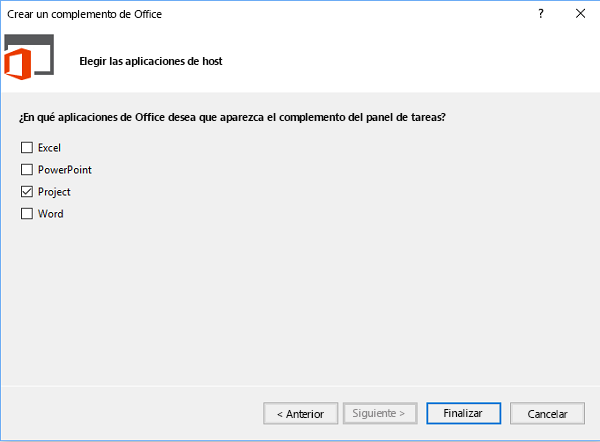

# <a name="create-a-project-add-in-that-uses-rest-with-an-on-premises-project-server-odata-service"></a>Crear un complemento de Project que use REST con un servicio OData local de Project Server

En este artículo se describe cómo crear un complemento de panel de tareas para Project Profesional 2013 que compare datos de coste y trabajo en el proyecto activo con las medias de todos los proyectos de la sesión actual de Project Web App. El complemento usa REST con la biblioteca jQuery para obtener acceso al servicio de informes OData de **ProjectData** en Project Server 2013.


El código en este artículo se basa en una muestra desarrollada por Saurabh Sanghvi y Arvind Iyer, Microsoft Corporation.

## <a name="prerequisites-for-creating-a-task-pane-add-in-that-reads-project-server-reporting-data"></a>Requisitos previos para crear un complemento de panel de tareas que lea datos de informes de Project Server


A continuación, se indican los requisitos previos para crear un complemento de panel de tareas de Project que lea el servicio **ProjectData** de una instancia de Project Web App en una instalación local de Project Server 2013:


- Asegúrese de haber instalado los Service Pack y las actualizaciones de Windows más recientes en el equipo de desarrollo local. El sistema operativo puede ser Windows 7, Windows 8, Windows Server 2008 o Windows Server 2012.
    
- Project Profesional 2013 es necesario para conectarse con Project Web App. El equipo de desarrollo debe tener Project Profesional 2013 instalado para permitir la depuración  **F5** con Visual Studio.
    
     >**Nota** Project Standard 2013 también puede hospedar complementos de panel de tareas, pero no puede iniciar sesión en Project Web App.
- Visual Studio 2015 con Office Developer Tools para Visual Studio incluye plantillas para la creación de Complementos de Office y SharePoint. Asegúrese de haber instalado la versión más reciente de Office Developer Tools. Vea la sección  _Herramientas_ en [Descargas de complementos para Office y SharePoint](http://msdn.microsoft.com/en-us/office/apps/fp123627.aspx).
    
     >**Nota** Napa no se puede usar para crear complementos de panel de tareas de Project 2013.
- Los procedimientos y ejemplos de códigos de este artículo dan acceso al servicio  **ProjectData** de Project Server 2013 en un dominio local. Los métodos jQuery de este artículo no funcionan con Project Online.
    
    Comprobar que el servicio **ProjectData** sea accesible desde el equipo de desarrollo
    

### <a name="procedure-1.-to-verify-that-the-projectdata-service-is-accessible"></a>Procedimiento 1. Comprobar que el servicio ProjectData sea accesible


1- Para permitir que el explorador muestre directamente los datos XML desde una consulta de REST, deshabilite la vista de lectura de fuentes. Para más información sobre cómo hacer esto en Internet Explorer, vea el procedimiento 1, paso 4 en [Consulta de fuentes OData de datos de informes de Project](http://msdn.microsoft.com/library/3eafda3b-f006-48be-baa6-961b2ed9fe01%28Office.15%29.aspx).
    
2- Realice una consulta al servicio **ProjectData** con el explorador con la siguiente URL: **http://NombreDeServidor /NombreDeServidorDeProject /_api/ProjectData**. Por ejemplo, si la instancia de Project Web App es `http://MyServer/pwa`, en el explorador se mostrarán estos resultados:
    
```xml
     <?xml version="1.0" encoding="utf-8"?>
        <service xml:base="http://myserver/pwa/_api/ProjectData/" 
        xmlns="http://www.w3.org/2007/app" 
        xmlns:atom="http://www.w3.org/2005/Atom">
        <workspace>
            <atom:title>Default</atom:title>
            <collection href="Projects">
                <atom:title>Projects</atom:title>
            </collection>
            <collection href="ProjectBaselines">
                <atom:title>ProjectBaselines</atom:title>
            </collection>
            <!-- ... and 33 more collection elements -->
        </workspace>
        </service>
```
3- Es posible que tenga que proporcionar las credenciales de red para ver los resultados. Si en el explorador se muestra el mensaje "Error 3, acceso denegado", quiere decir que no tiene el permiso de inicio de sesión para esa instancia de Project Web App, o bien que hay un problema de red y necesita la ayuda de un administrador.
    

## <a name="using-visual-studio-to-create-a-task-pane-add-in-for-project"></a>Usar Visual Studio para crear un complemento de panel de tareas para Project

Office Developer Tools para Visual Studio incluye una plantilla para complementos de panel de tareas para Project 2013. Si crea una solución con el nombre  **HelloProjectOData**, la solución contiene los siguientes dos proyectos de Visual Studio:


- El proyecto del complemento adopta el nombre de la solución. Incluye el archivo de manifiesto XML para el complemento y se orienta a .NET Framework 4.5. En el procedimiento 3 se muestran los pasos para modificar el manifiesto para el complemento  **HelloProjectOData**.
    
- El proyecto web se denomina  **HelloProjectODataWeb**. Incluye páginas web, archivos JavaScript, archivos CSS, imágenes, referencias y archivos de configuración para el contenido web en el panel de tareas. El proyecto web se orienta a .NET Framework 4. En los procedimientos 4 y 5 se muestra cómo modificar los archivos en el proyecto web para crear la funcionalidad del complemento  **HelloProjectOData**.
    

### <a name="procedure-2.-to-create-the-helloprojectodata-add-in-for-project"></a>Procedimiento 2. Crear el complemento HelloProjectOData para Project


1. Ejecute Visual Studio 2015 como administrador y después seleccione  **Nuevo proyecto** en la página Inicio.
    
2. En el cuadro de diálogo  **Nuevo proyecto**, expanda los nodos  **Plantillas**,  **Visual C#** y **Office/SharePoint** y después seleccione **Complementos de Office**. Seleccione **.NET Framework 4.5.2** de la lista desplegable de marcos de trabajo de destino en la parte superior del panel central y después seleccione **Complemento de Office** (vea la siguiente captura de pantalla).
    
3. Para ubicar ambos proyectos de Visual Studio en el mismo directorio, seleccione  **Crear directorio para la solución** y después vaya hasta la ubicación deseada.
    
4. En el campo **Nombre**, escriba HelloProjectOData y haga clic en **Aceptar**.
    
    **Creación de un complemento de Office**

    

5. En el cuadro de diálogo **Elegir el tipo de complemento**, seleccione **Panel de tareas** y elija **Siguiente** (consulte la siguiente captura de pantalla).
    
    **Elección del tipo de complemento para crear**

    

6. En el cuadro de diálogo  **Elija las aplicaciones host**, desactive todas las casillas excepto la casilla  **Project** (vea la siguiente captura de pantalla) y elija **Finalizar**.
    
    **Elección de la aplicación host**

    
    
    Visual Studio crea el proyecto **HelloProjectOdata** y el proyecto **HelloProjectODataWeb**.
    
La carpeta  **Complementos** (vea la siguiente captura de pantalla) contiene el archivo App.css para estilos CSS personalizados. En la subcarpeta **Inicio**, el archivo Home.html contiene referencias a los archivos CSS y a los archivos de JavaScript que usa el complemento, así como el contenido HTML5 para el complemento. Además, el archivo Home.js es para el código personalizado de JavaScript. La carpeta  **Scripts** incluye los archivos de la biblioteca jQuery. La subcarpeta **Office** incluye las bibliotecas de JavaScript, tales como office.js y project-15.js, además de las bibliotecas de idiomas para las cadenas estándar en los complementos de Office. En la carpeta **Contenido**, el archivo Office.css contiene los estilos predeterminados para todos los complementos de Office.

**Visualización de los archivos de proyecto web predeterminados en el Explorador de soluciones**


El manifiesto para el proyecto  **HelloProjectOData** es el archivo HelloProjectOData.xml. Si lo desea, puede modificar el manifiesto para agregar una descripción del complemento, una referencia a un icono, información para idiomas adicionales y otras configuraciones. El procedimiento 3 simplemente modifica el nombre y la descripción del complemento, y agrega un icono.

Para más información sobre el manifiesto, vea [Manifiesto XML de complementos de Office](../../docs/overview/add-in-manifests.md) y [Referencia de esquema para manifiestos de complementos de Office (versión 1.1)](../overview/add-in-manifests.md).


### <a name="procedure-3.-to-modify-the-add-in-manifest"></a>Procedimiento 3. Modificar el manifiesto del complemento


1. En Visual Studio, abra el archivo HelloProjectOData.xml.
    
2. El nombre para mostrar predeterminado es el nombre del proyecto de Visual Studio ("HelloProjectOData"). Por ejemplo, cambie el valor predeterminado del elemento  **DisplayName** por"Hola ProjectData".
    
3. La descripción predeterminada es también "HelloProjectOData". Por ejemplo, cambie el valor predeterminado del elemento Descripción a "Probar consultas de REST del servicio ProjectData".
    
4. Agregue un icono para mostrarlo en la lista desplegable **Complementos de Office** de la pestaña **PROYECTO** de la cinta. Puede agregar un archivo de icono en la solución Visual Studio o usar una URL para un icono. 

En los pasos siguientes se muestra cómo agregar un archivo de icono a la solución Visual Studio:
    
1. En el  **Explorador de soluciones**, vaya a la carpeta llamada Imágenes.
    
2. Para que aparezca en la lista desplegable **Complementos de Office**, el tamaño del icono tiene que ser de 32 x 32 píxeles. Por ejemplo, instale el SDK de Project 2013, elija la carpeta **Imágenes** y agregue el siguiente archivo del SDK: `\Samples\Apps\HelloProjectOData\HelloProjectODataWeb\Images\NewIcon.png`
    
    Alternately, use your own 32 x 32 icon; or, copy the following image to a file named NewIcon.png, and then add that file to the  `HelloProjectODataWeb\Images` folder: 

3. En el manifiesto HelloProjectOData.xml, agregue un elemento **IconUrl** debajo del elemento **Description**, donde el valor de la URL del icono es la ruta de acceso relativa al archivo de icono de 32x32. Por ejemplo, agregue la línea siguiente: **<IconUrl DefaultValue="~remoteAppUrl/Images/NewIcon.png" />**. El archivo de manifiesto HelloProjectOData.xml contiene ahora lo siguiente (el valor de **Id** será distinto en su caso):

```XML
    <?xml version="1.0" encoding="UTF-8"?>
    <OfficeApp xmlns="http://schemas.microsoft.com/office/appforoffice/1.1" 
           xmlns:xsi="http://www.w3.org/2001/XMLSchema-instance" xsi:type="TaskPaneApp">
        <Id>c512df8d-a1c5-4d74-8a34-d30f6bbcbd82 </Id>
        <Version>1.0</Version>
        <ProviderName> [Provider name]</ProviderName>
        <DefaultLocale>en-US</DefaultLocale>
        <DisplayName DefaultValue="Hello ProjectData" />
        <Description DefaultValue="Test REST queries of the ProjectData service"/>
        <IconUrl DefaultValue="~remoteAppUrl/Images/NewIcon.png" />
    
        <Hosts>
            <Host Name="Project" />
        </Hosts>
        <DefaultSettings>
            <SourceLocation DefaultValue="~remoteAppUrl/AddIn/Home/Home.html" />
        </DefaultSettings>
        <Permissions>ReadWriteDocument</Permissions>
    </OfficeApp>
```

## <a name="creating-the-html-content-for-the-helloprojectodata-add-in"></a>Crear el contenido HTML para el complemento HelloProjectOData

El complemento  **HelloProjectOData** es un ejemplo que incluye depuración e informe de errores. No está pensado para la producción. Antes de comenzar a codificar el contenido HTML, diseñe la IU y la experiencia de usuario para el complemento, y esboce las funciones de JavaScript que interactúan con el código HTML. Para obtener más información, vea[Directrices de diseño para complementos de Office](../../docs/design/add-in-design.md). 

En el panel de tareas, el nombre para mostrar del complemento, que es el valor del elemento  **DisplayName** del manifiesto, aparece en la parte superior. El elemento **body** del archivo HelloProjectOData.html contiene los otros elementos de la interfaz de usuario:

- Un subtítulo que indica la función general o tipo de operación, por ejemplo,  **CONSULTA DE REST ODATA**.
    
- El botón  **Obtener extremo de ProjectData** activa la función **setOdataUrl** para obtener el extremo del servicio de **ProjectData** y mostrarlo en un cuadro de texto. Si Project no está conectado con Project Web App, el complemento activa un controlador de error para que muestre un mensaje de error emergente.
    
- El botón  **Comparar todos los proyectos** está deshabilitado hasta que el complemento obtiene un extremo de OData válido. Cuando selecciona el botón, se llama a la función **retrieveOData**, que usa una consulta de REST para obtener los datos de costo y trabajo del proyecto del servicio  **ProjectData**.
    
- Una tabla muestra los valores promedio del costo del proyecto, el costo real y el porcentaje completado. La tabla también compara los valores del proyecto activo actual con el promedio. Si el valor actual es mayor que el promedio para todos los proyectos, el valor aparece en rojo. Si el valor actual es menor que el promedio, el valor aparece en verde. Si el valor actual no está disponible, la tabla muestra  **ND** en azul.
    
    La función **retrieveOData** llama a la función **parseODataResult** que calcula y muestra los valores de la tabla.
    
     >**Nota** En este ejemplo, los datos de costo y de trabajo para el proyecto activo se derivan de los valores publicados. Si cambia los valores en Project, el servicio **ProjectData** no tiene los cambios hasta que se publique el proyecto.


### <a name="procedure-4.-to-create-the-html-content"></a>Procedimiento 4. Crear el contenido HTML

1. En el elemento  **head** del archivo Home.html, agregue todos los elementos **link** adicionales para los archivos CSS que el complemento use. La plantilla de proyecto de Visual Studio incluye un vínculo para el archivo App.css que puede usar para los estilos CSS personalizados.
    
2. Agregue todos los elementos  **script** adicionales para las bibliotecas JavaScript que el complemento use. La plantilla de proyecto incluye vínculos a los archivos jQuery- _[versión]_.js, office.js y MicrosoftAjax.js de la carpeta  **Scripts**.
    
     >**Nota**  Antes de implementar el complemento, cambie las referencias a office.js y a jQuery por la referencia a la red de entrega de contenido (CDN). La referencia a CDN proporciona la versión más reciente y el mejor rendimiento.

    El complemento **HelloProjectOData** también usa el archivo SurfaceErrors.js, que muestra los errores en un mensaje emergente. Puede copiar el código desde la sección _Programación robusta_ de [Procedimiento para crear el primer complemento de panel de tareas para Project 2013 con un editor de texto](../project/create-your-first-task-pane-add-in-for-project-by-using-a-text-editor.md) y, después, agregar un archivo SurfaceErrors.js en la carpeta **Scripts\Office** del proyecto **HelloProjectODataWeb**.
    
    Lo que sigue es el código HTML actualizado del elemento **head**, con la línea adicional para el archivo SurfaceErrors.js:
    
```html
      <!DOCTYPE html>
    <html>
    <head>
      <meta charset="UTF-8" />
      <meta http-equiv="X-UA-Compatible" content="IE=Edge" />
      <title>Test ProjectData Service</title>
    
      <link rel="stylesheet" type="text/css" href="../Content/Office.css" />
    
      <!-- Add your CSS styles to the following file -->
      <link rel="stylesheet" type="text/css" href="../Content/App.css" />
    
      <!-- Use the CDN reference to the mini-version of jQuery when deploying your add-in. -->
      <!--<script src="http://ajax.aspnetcdn.com/ajax/jquery/jquery-1.9.0.min.js"></script> -->
      <script src="../Scripts/jquery-1.7.1.js"></script>
    
      <!-- Use the CDN reference to office.js when deploying your add-in. -->
      <!--<script src="https://appsforoffice.microsoft.com/lib/1/hosted/office.js"></script>-->
    
      <!-- Use the local script references for Office.js to enable offline debugging -->
      <script src="../Scripts/Office/1.0/MicrosoftAjax.js"></script>
      <script src="../Scripts/Office/1.0/Office.js"></script>
    
      <!-- Add your JavaScript to the following files -->
      <script src="../Scripts/HelloProjectOData.js"></script>
      <script src="../Scripts/SurfaceErrors.js"></script>
    </head>
    <body>
    <!-- See the code in Step 3. -->
    </body>
    </html>
```

3. En el elemento  **body**, elimine el código existente de la plantilla y agregue el código para la interfaz de usuario. Si un elemento se va a completar con datos o a manipular mediante una instrucción jQuery, el elemento debe incluir un único atributo de  **id** exclusivo. En el siguiente código, los atributos de **id** para los elementos **button**,  **span** y **td** (definición de celda de tabla) que usan las funciones jQuery se muestran en negrita.
    
    El código HTML siguiente agrega una imagen gráfica, que podría ser un logotipo de la compañía. También puede usar un logotipo de su elección, o copiar el archivo NewLogo.png de la descarga del SDK de Project 2013 y, después, usar **Explorador de soluciones** para agregar el archivo a la carpeta `HelloProjectODataWeb\Images`.
    


```HTML
      <body>
      <div id="SectionContent">
        <div id="odataQueries">
          ODATA REST QUERY
        </div>
        <div id="odataInfo">
          <button class="button-wide" onclick="setOdataUrl()">Get ProjectData Endpoint</button>
          <br /><br />
          <span class="rest" id="projectDataEndPoint">Endpoint of the 
            <strong>ProjectData</strong> service</span>
          <br />
        </div>
        <div id="compareProjectData">
          <button class="button-wide" disabled="disabled" id="compareProjects"
            onclick="retrieveOData()">Compare All Projects</button>
          <br />
        </div>
      </div>
      <div id="corpInfo">
        <table class="infoTable" aria-readonly="True" style="width: 100%;">
          <tr>
            <td class="heading_leftCol"></td>
            <td class="heading_midCol"><strong>Average</strong></td>
            <td class="heading_rightCol"><strong>Current</strong></td>
          </tr>
          <tr>
            <td class="row_leftCol"><strong>Project Cost</strong></td>
            <td class="row_midCol" id="AverageProjectCost">&amp;nbsp;</td>
            <td class="row_rightCol" id="CurrentProjectCost">&amp;nbsp;</td>
          </tr>
          <tr>
            <td class="row_leftCol"><strong>Project Actual Cost</strong></td>
            <td class="row_midCol" id="AverageProjectActualCost">&amp;nbsp;</td>
            <td class="row_rightCol" id="CurrentProjectActualCost">&amp;nbsp;</td>
          </tr>
          <tr>
            <td class="row_leftCol"><strong>Project Work</strong></td>
            <td class="row_midCol" id="AverageProjectWork">&amp;nbsp;</td>
            <td class="row_rightCol" id="CurrentProjectWork">&amp;nbsp;</td>
          </tr>
          <tr>
            <td class="row_leftCol"><strong>Project % Complete</strong></td>
            <td class="row_midCol" id="AverageProjectPercentComplete">&amp;nbsp;</td>
            <td class="row_rightCol" id="CurrentProjectPercentComplete">&amp;nbsp;</td>
          </tr>
        </table>
      </div>
      
      <br />
      <textarea id="odataText" rows="12" cols="40"></textarea>
    </body>
```


## <a name="creating-the-javascript-code-for-the-add-in"></a>Crear el código JavaScript para el complemento


La plantilla para un complemento de panel de tareas de Project incluye un código de inicialización predeterminado, diseñado para demostrar las acciones básicas de obtener y seleccionar datos en un documento para un complemento de Office 2013 típico. Como Project 2013 no admite acciones que escriban en el proyecto activo y el complemento  **HelloProjectOData** no usa el método **getSelectedDataAsync**, puede eliminar el script dentro de la función  **Office.initialize** y eliminar las funciones **setData** y **getData** del archivo HelloProjectOData.js predeterminado.

JavaScript incluye constantes globales para la consulta de REST y variables globales que se usan en varias funciones. El botón  **Obtener extremo de ProjectData** llama a la función **setOdataUrl**, que inicializa las variables globales y determina si Project está conectado con Project Web App.

El resto del archivo HelloProjectOData.js incluye dos funciones: la función  **retrieveOData** se llama cuando el usuario selecciona **Comparar todos los proyectos**; y la función  **parseODataResult** calcula promedios y después rellena la tabla comparativa con valores que tienen formatos de color y unidades.


### <a name="procedure-5.-to-create-the-javascript-code"></a>Procedimiento 5. Crear el código JavaScript


1. Elimine todo el código del archivo HelloProjectOData.js predeterminado y después agregue las variables globales y la función  **Office.initialize**. Los nombres de las variables que están escritos todos en mayúscula indican que son constantes; se usan más adelante con la variable  **_pwa** para crear la consulta de REST en este ejemplo.
    
```js
      var PROJDATA = "/_api/ProjectData";
    var PROJQUERY = "/Projects?";
    var QUERY_FILTER = "$filter=ProjectName ne 'Timesheet Administrative Work Items'";
    var QUERY_SELECT1 = "&amp;$select=ProjectId, ProjectName";
    var QUERY_SELECT2 = ", ProjectCost, ProjectWork, ProjectPercentCompleted, ProjectActualCost";
    var _pwa;           // URL of Project Web App.
    var _projectUid;    // GUID of the active project.
    var _docUrl;        // Path of the project document.
    var _odataUrl = ""; // URL of the OData service: http[s]://ServerName /ProjectServerName /_api/ProjectData
    
    // The initialize function is required for all add-ins.
    Office.initialize = function (reason) {
        // Checks for the DOM to load using the jQuery ready function.
        $(document).ready(function () {
            // After the DOM is loaded, app-specific code can run.
        });
    }
```

2. Agregue **setOdataUrl** y las funciones relacionadas. La función **setOdataUrl** llama a **getProjectGuid** y a **getDocumentUrl** para inicializar las variables globales. En el [método getProjectFieldAsync](../../reference/shared/projectdocument.getprojectfieldasync.md), la función anónima para el parámetro _callback_ habilita el botón **Comparar todos los proyectos** con el método **removeAttr** en la biblioteca jQuery y, después, muestra la dirección URL del servicio de **ProjectData**. Si Project no está conectado con Project Web App, la función produce un error, que se muestra en un mensaje de error emergente. El archivo SurfaceErrors.js incluye el método **throwError**.
    
     >**Nota** Si ejecuta Visual Studio en el equipo de Project Server, para usar la depuración **F5**, quite el comentario del código después de la línea que inicializa la variable global **_pwa**. Para habilitar el uso del método **ajax** de jQuery al depurar en el equipo de Project Server, debe establecer el valor **localhost** para la dirección URL de PWA. Si ejecuta Visual Studio en un equipo remoto, no se necesita la dirección URL **localhost**. Antes de implementar el complemento, comente el código.

```js
      function setOdataUrl() {
        Office.context.document.getProjectFieldAsync(
            Office.ProjectProjectFields.ProjectServerUrl,
            function (asyncResult) {
                if (asyncResult.status == Office.AsyncResultStatus.Succeeded) {
                    _pwa = String(asyncResult.value.fieldValue);
    
                    // If you debug with Visual Studio on a local Project Server computer, 
                    // uncomment the following lines to use the localhost URL.
                    //var localhost = location.host.split(":", 1);
                    //var pwaStartPosition = _pwa.lastIndexOf("/");
                    //var pwaLength = _pwa.length - pwaStartPosition;
                    //var pwaName = _pwa.substr(pwaStartPosition, pwaLength);
                    //_pwa = location.protocol + "//" + localhost + pwaName;
    
                    if (_pwa.substring(0, 4) == "http") {
                        _odataUrl = _pwa + PROJDATA;
                        $("#compareProjects").removeAttr("disabled");
                        getProjectGuid();
                    }
                    else {
                        _odataUrl = "No connection!";
                        throwError(_odataUrl, "You are not connected to Project Web App.");
                    }
                    getDocumentUrl();
                    $("#projectDataEndPoint").text(_odataUrl);
                }
                else {
                    throwError(asyncResult.error.name, asyncResult.error.message);
                }
            }
        );
    }

    // Get the GUID of the active project.
    function getProjectGuid() {
        Office.context.document.getProjectFieldAsync(
            Office.ProjectProjectFields.GUID,
            function (asyncResult) {
                if (asyncResult.status == Office.AsyncResultStatus.Succeeded) {
                    _projectUid = asyncResult.value.fieldValue;
                }
                else {
                    throwError(asyncResult.error.name, asyncResult.error.message);
                }
            }
        );
    }
    
    // Get the path of the project in Project web app, which is in the form <>\ProjectName .
    function getDocumentUrl() {
        _docUrl = "Document path:\r\n" + Office.context.document.url;
    }
```

3. Agregue la función  **retrieveOData**, que concatena valores para la consulta de REST y después llama a la función  **ajax** en jQuery para obtener los datos solicitados del servicio de **ProjectData**. La variable  **support.cors** habilita el uso compartido de recursos de origen cruzado (CORS) con la función **ajax**. Si falta la instrucción  **support.cors** o está establecida como **false**, la función  **ajax** devuelve el error **Sin transporte**.
    
     >**Nota** El código siguiente funciona con una instalación local de Project Server 2013. Para Project Online, puede usar OAuth para autenticación basada en tokens. Para obtener más información, consulte [Abordar las limitaciones de la directiva del mismo origen en complementos para Office](../../docs/develop/addressing-same-origin-policy-limitations.md).

    En la llamada **ajax**, puede usar el parámetro _headers_ o el parámetro _beforeSend_. El parámetro _complete_ es una función anónima de modo que está en el mismo ámbito que las variables de **retrieveOData**. La función del parámetro _complete_ muestra los resultados en el control **odataText** y también llama al método **parseODataResult** para analizar y mostrar la respuesta JSON. El parámetro _error_ especifica la función con nombre **getProjectDataErrorHandler**, que escribe un mensaje de error en el control **odataText** y también usa el método **throwError** para mostrar un mensaje emergente.
    


```js
      /****************************************************************
    * Functions to get and parse the Project Server reporting data.
    *****************************************************************/
    
    // Get data about all projects on Project Server, 
    // by using a REST query with the ajax method in jQuery.
    function retrieveOData() {
        var restUrl = _odataUrl + PROJQUERY + QUERY_FILTER + QUERY_SELECT1 + QUERY_SELECT2;
        var accept = "application/json; odata=verbose";
        accept.toLocaleLowerCase();
    
        // Enable cross-origin scripting (required by jQuery 1.5 and later).
        // This does not work with Project Online.
        $.support.cors = true;
    
        $.ajax({
            url: restUrl,
            type: "GET",
            contentType: "application/json",
            data: "",      // Empty string for the optional data.
            //headers: { "Accept": accept },
            beforeSend: function (xhr) {
                xhr.setRequestHeader("ACCEPT", accept);
            },
            complete: function (xhr, textStatus) {
                // Create a message to display in the text box.
                var message = "\r\ntextStatus: " + textStatus +
                    "\r\nContentType: " + xhr.getResponseHeader("Content-Type") +
                    "\r\nStatus: " + xhr.status +
                    "\r\nResponseText:\r\n" + xhr.responseText;
    
                // xhr.responseText is the result from an XmlHttpRequest, which 
                // contains the JSON response from the OData service.
                parseODataResult(xhr.responseText, _projectUid);
    
                // Write the document name, response header, status, and JSON to the odataText control.
                $("#odataText").text(_docUrl);
                $("#odataText").append("\r\nREST query:\r\n" + restUrl);
                $("#odataText").append(message);
    
                if (xhr.status != 200 &amp;&amp; xhr.status != 1223 &amp;&amp; xhr.status != 201) {
                    $("#odataInfo").append("<div>" + htmlEncode(restUrl) + "</div>");
                }
            },
            error: getProjectDataErrorHandler
        });
    }
    
    function getProjectDataErrorHandler(data, errorCode, errorMessage) {
        $("#odataText").text("Error code: " + errorCode + "\r\nError message: \r\n"
          + errorMessage);
        throwError(errorCode, errorMessage);
    }
```

4. Agregue el método  **parseODataResult**, que deserializa y procesa la respuesta JSON del servicio OData. El método  **parseODataResult** calcula los valores promedio de los datos de costo y trabajo con una exactitud de una o dos posiciones decimales, da formato a los valores con el color correcto, agrega una unidad ( **$**,  **h** o **%**) y después muestra los valores en las celdas de las tablas especificadas.
    
    Si el GUID del proyecto activo coincide con el valor **ProjectId**, la variable **myProjectIndex** se establece en el índice de proyecto. Si **myProjectIndex** indica que se publica el proyecto activo en Project Server, el método **parseODataResult** aplica formato y muestra datos de costo y de trabajo para ese proyecto. Si no se publica el proyecto activo, los valores para el proyecto activo se muestran como **NA** en azul.
    


```js
      // Calculate the average values of actual cost, cost, work, and percent complete   
    // for all projects, and compare with the values for the current project.
    function parseODataResult(oDataResult, currentProjectGuid) {
        // Deserialize the JSON string into a JavaScript object.
        var res = Sys.Serialization.JavaScriptSerializer.deserialize(oDataResult);
        var len = res.d.results.length;
        var projActualCost = 0;
        var projCost = 0;
        var projWork = 0;
        var projPercentCompleted = 0;
        var myProjectIndex = -1;
        for (i = 0; i < len; i++) {
            // If the current project GUID matches the GUID from the OData query,  
            // store the project index.
            if (currentProjectGuid.toLocaleLowerCase() == res.d.results[i].ProjectId) {
                myProjectIndex = i;
            }
            projCost += Number(res.d.results[i].ProjectCost);
            projWork += Number(res.d.results[i].ProjectWork);
            projActualCost += Number(res.d.results[i].ProjectActualCost);
            projPercentCompleted += Number(res.d.results[i].ProjectPercentCompleted);
        }
        var avgProjCost = projCost / len;
        var avgProjWork = projWork / len;
        var avgProjActualCost = projActualCost / len;
        var avgProjPercentCompleted = projPercentCompleted / len;
        
        // Round off cost to two decimal places, and round off other values to one decimal place.
        avgProjCost = avgProjCost.toFixed(2);
        avgProjWork = avgProjWork.toFixed(1);
        avgProjActualCost = avgProjActualCost.toFixed(2);
        avgProjPercentCompleted = avgProjPercentCompleted.toFixed(1);
        
        // Display averages in the table, with the correct units. 
        document.getElementById("AverageProjectCost").innerHTML = "$"
            + avgProjCost;
        document.getElementById("AverageProjectActualCost").innerHTML
            = "$" + avgProjActualCost;
        document.getElementById("AverageProjectWork").innerHTML
            = avgProjWork + " hrs";
        document.getElementById("AverageProjectPercentComplete").innerHTML
            = avgProjPercentCompleted + "%";
            
        // Calculate and display values for the current project.
        if (myProjectIndex != -1) {
            var myProjCost = Number(res.d.results[myProjectIndex].ProjectCost);
            var myProjWork = Number(res.d.results[myProjectIndex].ProjectWork);
            var myProjActualCost = Number(res.d.results[myProjectIndex].ProjectActualCost);
            var myProjPercentCompleted =
              Number(res.d.results[myProjectIndex].ProjectPercentCompleted);
              
            myProjCost = myProjCost.toFixed(2);
            myProjWork = myProjWork.toFixed(1);
            myProjActualCost = myProjActualCost.toFixed(2);
            myProjPercentCompleted = myProjPercentCompleted.toFixed(1);
            
            document.getElementById("CurrentProjectCost").innerHTML = "$" + myProjCost;
            
            if (Number(myProjCost) <= Number(avgProjCost)) {
                document.getElementById("CurrentProjectCost").style.color = "green"
            }
            else {
                document.getElementById("CurrentProjectCost").style.color = "red"
            }
            
            document.getElementById("CurrentProjectActualCost").innerHTML = "$" + myProjActualCost;
            
            if (Number(myProjActualCost) <= Number(avgProjActualCost)) {
                document.getElementById("CurrentProjectActualCost").style.color = "green"
            }
            else {
                document.getElementById("CurrentProjectActualCost").style.color = "red"
            }
            
            document.getElementById("CurrentProjectWork").innerHTML = myProjWork + " hrs";
            
            if (Number(myProjWork) <= Number(avgProjWork)) {
                document.getElementById("CurrentProjectWork").style.color = "red"
            }
            else {
                document.getElementById("CurrentProjectWork").style.color = "green"
            }
            
            document.getElementById("CurrentProjectPercentComplete").innerHTML = myProjPercentCompleted + "%";
            
            if (Number(myProjPercentCompleted) <= Number(avgProjPercentCompleted)) {
                document.getElementById("CurrentProjectPercentComplete").style.color = "red"
            }
            else {
                document.getElementById("CurrentProjectPercentComplete").style.color = "green"
            }
        }
        else {
            document.getElementById("CurrentProjectCost").innerHTML = "NA";
            document.getElementById("CurrentProjectCost").style.color = "blue"
            
            document.getElementById("CurrentProjectActualCost").innerHTML = "NA";
            document.getElementById("CurrentProjectActualCost").style.color = "blue"
            
            document.getElementById("CurrentProjectWork").innerHTML = "NA";
            document.getElementById("CurrentProjectWork").style.color = "blue"
            
            document.getElementById("CurrentProjectPercentComplete").innerHTML = "NA";
            document.getElementById("CurrentProjectPercentComplete").style.color = "blue"
        }
    }
```


## <a name="testing-the-helloprojectodata-add-in"></a>Probar el complemento HelloProjectOData


Para probar y depurar el complemento  **HelloProjectOData** con Visual Studio 2015, Project Profesional 2013 debe estar instalado en el equipo de desarrollo. Para habilitar diferentes escenarios de prueba, asegúrese de elegir si Project se abrirá para archivos en el equipo local o se conectará con Project Web App. Por ejemplo, haga lo siguiente:


1. En la pestaña  **ARCHIVO** de la cinta, elija la pestaña **Información** en la vista Backstage y elija **Administrar cuentas**.
    
2. En el cuadro de diálogo  **Cuentas de Project Web App**, la lista  **Cuentas disponibles** puede tener múltiples cuentas de Project Web App además de la cuenta **Equipo** local. En la sección **Al iniciar**, seleccione  **Elegir una cuenta**.
    
3. Cierre Project para que Visual Studio pueda iniciarlo para depurar el complemento.
    
Las pruebas básicas deben incluir lo siguiente:


- Ejecute el complemento desde Visual Studio y después abra un proyecto publicado desde Project Web App que contenga datos de costo y trabajo. Compruebe que el complemento muestre el extremo de  **ProjectData** y muestre correctamente los datos de costo y trabajo en la tabla. Puede usar el resultado del control **odataText** para comprobar la consulta de REST y demás información.
    
- Ejecute el complemento nuevamente y elija el perfil de equipo local en el cuadro de diálogo  **Inicio de sesión** cuando se inicia Project. Abra un archivo .mpp local y después pruebe el complemento. Compruebe que el complemento muestre un mensaje de error cuando intenta obtener el extremo de **ProjectData**.
    
- Ejecute el complemento nuevamente y cree un proyecto que tenga tareas con datos de costo y trabajo. Puede guardar el proyecto en Project Web App, pero no lo publique. Compruebe que el complemento muestre datos de Project Server, pero que aparezca  **ND** para el proyecto actual.
    

### <a name="procedure-6.-to-test-the-add-in"></a>Procedimiento 6. Probar el complemento


1. Ejecute Project Profesional 2013, conéctese con Project Web App y después cree un proyecto de prueba. Asigne tareas a recursos locales o empresariales, establezca diversos valores de porcentaje completado en algunas tareas y después publique el proyecto. Salga de Project, lo que permitirá que Visual Studio inicie Project para depurar el complemento.
    
2. En Visual Studio, presione  **F5**. Inicie sesión en Project Web App y después abra el proyecto que creó en el paso anterior. Puede abrir el proyecto en modo de solo lectura o en modo de edición.
    
3. En la pestaña  **PROYECTO** de la cinta, en la lista desplegable **Complementos para Office**, seleccione  **Hola ProjectData** (ver Figura 4). El botón **Comparar todos los proyectos** debe estar deshabilitado.
    
    **Figura 4: Iniciar el complemento HelloProjectOData**

    

4. En el panel de tareas  **Hola ProjectData**, seleccione  **Obtener extremo de ProjectData**. La línea  **projectDataEndPoint** debe mostrar la dirección URL del servicio **ProjectData** y el botón **Comparar todos los proyectos** debe estar habilitado (vea la figura 5).
    
5. Seleccione  **Comparar todos los proyectos**. El complemento puede hacer una pausa mientras recupera datos del servicio  **ProjectData** y después debe mostrar los valores actuales y promedio con formato en la tabla.
    
    **Figura 5: Visualización de los resultados de la consulta de REST**

    

6. Revise el resultado en el cuadro de texto. Debería mostrar la ruta del documento, la consulta de REST, la información de estado y los resultados JSON de las llamadas a  **ajax** y **parseODataResult**. El resultado ayuda a entender, crear y depurar código en el método  **parseODataResult**, como por ejemplo  `projCost += Number(res.d.results[i].ProjectCost);`.
    
    Lo que sigue es un ejemplo de la salida con saltos de línea y espacios que se agregan al texto para mayor claridad, para tres proyectos en una instancia de Project Web App:
    


```
          Document path: <>\WinProj test1
    
        REST query:
        http://sphvm-37189/pwa/_api/ProjectData/Projects?$filter=ProjectName ne 'Timesheet Administrative Work Items'
            &amp;$select=ProjectId, ProjectName, ProjectCost, ProjectWork, ProjectPercentCompleted, ProjectActualCost
        
        textStatus: success
        ContentType: application/json;odata=verbose;charset=utf-8
        Status: 200
        
        ResponseText:
        {"d":{"results":[
        {"__metadata":
            {"id":"http://sphvm-37189/pwa/_api/ProjectData/Projects(guid'ce3d0d65-3904-e211-96cd-00155d157123')",
            "uri":"http://sphvm-37189/pwa/_api/ProjectData/Projects(guid'ce3d0d65-3904-e211-96cd-00155d157123')",
            "type":"ReportingData.Project"},
            "ProjectId":"ce3d0d65-3904-e211-96cd-00155d157123",
            "ProjectActualCost":"0.000000",
            "ProjectCost":"0.000000",
            "ProjectName":"Task list created in PWA",
            "ProjectPercentCompleted":0,
            "ProjectWork":"16.000000"},
        {"__metadata":
            {"id":"http://sphvm-37189/pwa/_api/ProjectData/Projects(guid'c31023fc-1404-e211-86b2-3c075433b7bd')",
            "uri":"http://sphvm-37189/pwa/_api/ProjectData/Projects(guid'c31023fc-1404-e211-86b2-3c075433b7bd')",
            "type":"ReportingData.Project"},
            "ProjectId":"c31023fc-1404-e211-86b2-3c075433b7bd",
            "ProjectActualCost":"700.000000",
            "ProjectCost":"2400.000000",
            "ProjectName":"WinProj test 2",
            "ProjectPercentCompleted":29,
            "ProjectWork":"48.000000"},
        {"__metadata":
            {"id":"http://sphvm-37189/pwa/_api/ProjectData/Projects(guid'dc81fbb2-b801-e211-9d2a-3c075433b7bd')",
            "uri":"http://sphvm-37189/pwa/_api/ProjectData/Projects(guid'dc81fbb2-b801-e211-9d2a-3c075433b7bd')",
            "type":"ReportingData.Project"},
            "ProjectId":"dc81fbb2-b801-e211-9d2a-3c075433b7bd",
            "ProjectActualCost":"1900.000000",
            "ProjectCost":"5200.000000",
            "ProjectName":"WinProj test1",
            "ProjectPercentCompleted":37,
            "ProjectWork":"104.000000"}
        ]}}
```

7. Detenga la depuración (presione  **Mayús + F5**) y presione  **F5** otra vez para ejecutar una nueva instancia de Project. En el cuadro de diálogo **Inicio de sesión**, elija el perfil  **Equipo** local, no Project Web App. Cree o abra un archivo .mpp de proyecto local, abra el panel de tareas **Hola ProjectData** y seleccione **Obtener extremo de ProjectData**. El complemento debe mostrar el error  **Sin conexión** (vea la figura 6) y el botón **Comparar todos los proyectos** debe seguir deshabilitado.
    
    **Figura 6: Uso del complemento sin conexión a Project Web App**

    

8. Detenga la depuración y presione  **F5** nuevamente. Inicie sesión en Project Web App y cree un proyecto que contenga datos de costo y trabajo. Puede guardar el proyecto, pero no lo publique.
    
    En el panel de tareas **Hola ProjectData**, al seleccionar **Comparar todos los proyectos**, debería ver un **ND** azul para los campos en la columna **Actual** (véase Figura 7).
    

    **Figura 7: Comparación de un proyecto no publicado con otros proyectos**

    

Aun cuando el complemento haya funcionado correctamente en las pruebas anteriores, hay otras pruebas que se deben ejecutar. Por ejemplo:

- Abra un proyecto de Project Web App que no tenga datos de costo y trabajo para las tareas. Los valores de los campos de la columna  **Actual** deben estar en cero.
    
- Pruebe un proyecto que no tenga tareas.
    
- Si modifica el complemento y lo publica, debe ejecutar pruebas similares nuevamente con el complemento publicado. Para otras consideraciones, vea [Pasos siguientes](#next-steps).
    

 >
  **Nota**  Existen límites para la cantidad de datos que se pueden devolver en una consulta del servicio  **ProjectData** y varían según la entidad. Por ejemplo, el conjunto de entidades **Projects** tiene un límite predeterminado de 100 proyectos por consulta, pero el límite predeterminado de **Risks** es de 200. En una instalación de producción, el código del ejemplo **HelloProjectOData** se tendría que modificar para habilitar consultas de más de 100 proyectos. Si desea más información, consulte [Pasos siguientes](#next-steps) y [Consulta de fuentes OData de datos de informes de Project](http://msdn.microsoft.com/library/3eafda3b-f006-48be-baa6-961b2ed9fe01%28Office.15%29.aspx).


## <a name="example-code-for-the-helloprojectodata-add-in"></a>Ejemplo de código para el complemento HelloProjectOData


 **Archivo HelloProjectOData.html**   El siguiente código está en el archivo  `Pages\HelloProjectOData.html` del proyecto **HelloProjectODataWeb**:


```html
    <!DOCTYPE html>
    <html>
    <head>
      <meta charset="UTF-8" />
      <meta http-equiv="X-UA-Compatible" content="IE=Edge" />
      <title>Test ProjectData Service</title>
    
      <link rel="stylesheet" type="text/css" href="../Content/Office.css" />
    
      <!-- Add your CSS styles to the following file -->
      <link rel="stylesheet" type="text/css" href="../Content/App.css" />
    
      <!-- Use the CDN reference to the mini-version of jQuery when deploying your add-in. -->
      <!--<script src="http://ajax.aspnetcdn.com/ajax/jquery/jquery-1.9.0.min.js"></script> -->
      <script src="../Scripts/jquery-1.7.1.js"></script>
    
      <!-- Use the CDN reference to Office.js when deploying your add-in -->
      <!--<script src="https://appsforoffice.microsoft.com/lib/1/hosted/office.js"></script>-->
    
      <!-- Use the local script references for Office.js to enable offline debugging -->
      <script src="../Scripts/Office/1.0/MicrosoftAjax.js"></script>
      <script src="../Scripts/Office/1.0/Office.js"></script>
    
      <!-- Add your JavaScript to the following files -->
      <script src="../Scripts/HelloProjectOData.js"></script>
      <script src="../Scripts/SurfaceErrors.js"></script>
    </head>
    <body>
      <div id="SectionContent">
        <div id="odataQueries">
          ODATA REST QUERY
        </div>
        <div id="odataInfo">
          <button class="button-wide" onclick="setOdataUrl()">Get ProjectData Endpoint</button>
          <br />
          <br />
          <span class="rest" id="projectDataEndPoint">Endpoint of the 
            <strong>ProjectData</strong> service</span>
          <br />
        </div>
        <div id="compareProjectData">
          <button class="button-wide" disabled="disabled" id="compareProjects"
            onclick="retrieveOData()">
            Compare All Projects</button>
          <br />
        </div>
      </div>
      <div id="corpInfo">
        <table class="infoTable" aria-readonly="True" style="width: 100%;">
          <tr>
            <td class="heading_leftCol"></td>
            <td class="heading_midCol"><strong>Average</strong></td>
            <td class="heading_rightCol"><strong>Current</strong></td>
          </tr>
          <tr>
            <td class="row_leftCol"><strong>Project Cost</strong></td>
            <td class="row_midCol" id="AverageProjectCost">&amp;nbsp;</td>
            <td class="row_rightCol" id="CurrentProjectCost">&amp;nbsp;</td>
          </tr>
          <tr>
            <td class="row_leftCol"><strong>Project Actual Cost</strong></td>
            <td class="row_midCol" id="AverageProjectActualCost">&amp;nbsp;</td>
            <td class="row_rightCol" id="CurrentProjectActualCost">&amp;nbsp;</td>
          </tr>
          <tr>
            <td class="row_leftCol"><strong>Project Work</strong></td>
            <td class="row_midCol" id="AverageProjectWork">&amp;nbsp;</td>
            <td class="row_rightCol" id="CurrentProjectWork">&amp;nbsp;</td>
          </tr>
          <tr>
            <td class="row_leftCol"><strong>Project % Complete</strong></td>
            <td class="row_midCol" id="AverageProjectPercentComplete">&amp;nbsp;</td>
            <td class="row_rightCol" id="CurrentProjectPercentComplete">&amp;nbsp;</td>
          </tr>
        </table>
      </div>
      
      <br />
      <textarea id="odataText" rows="12" cols="40"></textarea>
    </body>
    </html>
```

    **HelloProjectOData.js file** The following code is in the `Scripts\Office\HelloProjectOData.js` file of the **HelloProjectODataWeb** project:


```js
    /* File: HelloProjectOData.js
    * JavaScript functions for the HelloProjectOData example task pane app.
    * October 2, 2012
    */
    
    var PROJDATA = "/_api/ProjectData";
    var PROJQUERY = "/Projects?";
    var QUERY_FILTER = "$filter=ProjectName ne 'Timesheet Administrative Work Items'";
    var QUERY_SELECT1 = "&amp;$select=ProjectId, ProjectName";
    var QUERY_SELECT2 = ", ProjectCost, ProjectWork, ProjectPercentCompleted, ProjectActualCost";
    var _pwa;           // URL of Project Web App.
    var _projectUid;    // GUID of the active project.
    var _docUrl;        // Path of the project document.
    var _odataUrl = ""; // URL of the OData service: http[s]://ServerName /ProjectServerName /_api/ProjectData
    
    // The initialize function is required for all add-ins.
    Office.initialize = function (reason) {
        // Checks for the DOM to load using the jQuery ready function.
        $(document).ready(function () {
            // After the DOM is loaded, app-specific code can run.
        });
    }
    
    // Set the global variables, enable the Compare All Projects button,
    // and display the URL of the ProjectData service.
    // Display an error if Project is not connected with Project Web App.
    function setOdataUrl() {
        Office.context.document.getProjectFieldAsync(
            Office.ProjectProjectFields.ProjectServerUrl,
            function (asyncResult) {
                if (asyncResult.status == Office.AsyncResultStatus.Succeeded) {
                    _pwa = String(asyncResult.value.fieldValue);
    
                    // If you debug with Visual Studio on a local Project Server computer, 
                    // uncomment the following lines to use the localhost URL.
                    //var localhost = location.host.split(":", 1);
                    //var pwaStartPosition = _pwa.lastIndexOf("/");
                    //var pwaLength = _pwa.length - pwaStartPosition;
                    //var pwaName = _pwa.substr(pwaStartPosition, pwaLength);
                    //_pwa = location.protocol + "//" + localhost + pwaName;
    
                    if (_pwa.substring(0, 4) == "http") {
                        _odataUrl = _pwa + PROJDATA;
                        $("#compareProjects").removeAttr("disabled");
                        getProjectGuid();
                    }
                    else {
                        _odataUrl = "No connection!";
                        throwError(_odataUrl, "You are not connected to Project Web App.");
                    }
                    getDocumentUrl();
                    $("#projectDataEndPoint").text(_odataUrl);
                }
                else {
                    throwError(asyncResult.error.name, asyncResult.error.message);
                }
            }
        );
    }
    
    // Get the GUID of the active project.
    function getProjectGuid() {
        Office.context.document.getProjectFieldAsync(
            Office.ProjectProjectFields.GUID,
            function (asyncResult) {
                if (asyncResult.status == Office.AsyncResultStatus.Succeeded) {
                    _projectUid = asyncResult.value.fieldValue;
                }
                else {
                    throwError(asyncResult.error.name, asyncResult.error.message);
                }
            }
        );
    }
    
    // Get the path of the project in Project web app, which is in the form <>\ProjectName .
    function getDocumentUrl() {
        _docUrl = "Document path:\r\n" + Office.context.document.url;
    }
    
    /****************************************************************
    * Functions to get and parse the Project Server reporting data.
    *****************************************************************/
    
    // Get data about all projects on Project Server, 
    // by using a REST query with the ajax method in jQuery.
    function retrieveOData() {
        var restUrl = _odataUrl + PROJQUERY + QUERY_FILTER + QUERY_SELECT1 + QUERY_SELECT2;
        var accept = "application/json; odata=verbose";
        accept.toLocaleLowerCase();
    
        // Enable cross-origin scripting (required by jQuery 1.5 and later).
        // This does not work with Project Online.
        $.support.cors = true;
    
        $.ajax({
            url: restUrl,
            type: "GET",
            contentType: "application/json",
            data: "",      // Empty string for the optional data.
            //headers: { "Accept": accept },
            beforeSend: function (xhr) {
                xhr.setRequestHeader("ACCEPT", accept);
            },
            complete: function (xhr, textStatus) {
                // Create a message to display in the text box.
                var message = "\r\ntextStatus: " + textStatus +
                    "\r\nContentType: " + xhr.getResponseHeader("Content-Type") +
                    "\r\nStatus: " + xhr.status +
                    "\r\nResponseText:\r\n" + xhr.responseText;
    
                // xhr.responseText is the result from an XmlHttpRequest, which 
                // contains the JSON response from the OData service.
                parseODataResult(xhr.responseText, _projectUid);
    
                // Write the document name, response header, status, and JSON to the odataText control.
                $("#odataText").text(_docUrl);
                $("#odataText").append("\r\nREST query:\r\n" + restUrl);
                $("#odataText").append(message);
    
                if (xhr.status != 200 &amp;&amp; xhr.status != 1223 &amp;&amp; xhr.status != 201) {
                    $("#odataInfo").append("<div>" + htmlEncode(restUrl) + "</div>");
                }
            },
            error: getProjectDataErrorHandler
        });
    }
    
    function getProjectDataErrorHandler(data, errorCode, errorMessage) {
        $("#odataText").text("Error code: " + errorCode + "\r\nError message: \r\n"
          + errorMessage);
        throwError(errorCode, errorMessage);
    }
    
    // Calculate the average values of actual cost, cost, work, and percent complete   
    // for all projects, and compare with the values for the current project.
    function parseODataResult(oDataResult, currentProjectGuid) {
        // Deserialize the JSON string into a JavaScript object.
        var res = Sys.Serialization.JavaScriptSerializer.deserialize(oDataResult);
        var len = res.d.results.length;
        var projActualCost = 0;
        var projCost = 0;
        var projWork = 0;
        var projPercentCompleted = 0;
        var myProjectIndex = -1;
    
        for (i = 0; i < len; i++) {
            // If the current project GUID matches the GUID from the OData query,  
            // then store the project index.
            if (currentProjectGuid.toLocaleLowerCase() == res.d.results[i].ProjectId) {
                myProjectIndex = i;
            }
            projCost += Number(res.d.results[i].ProjectCost);
            projWork += Number(res.d.results[i].ProjectWork);
            projActualCost += Number(res.d.results[i].ProjectActualCost);
            projPercentCompleted += Number(res.d.results[i].ProjectPercentCompleted);
    
        }
        var avgProjCost = projCost / len;
        var avgProjWork = projWork / len;
        var avgProjActualCost = projActualCost / len;
        var avgProjPercentCompleted = projPercentCompleted / len;
    
        // Round off cost to two decimal places, and round off other values to one decimal place.
        avgProjCost = avgProjCost.toFixed(2);
        avgProjWork = avgProjWork.toFixed(1);
        avgProjActualCost = avgProjActualCost.toFixed(2);
        avgProjPercentCompleted = avgProjPercentCompleted.toFixed(1);
    
        // Display averages in the table, with the correct units. 
        document.getElementById("AverageProjectCost").innerHTML = "$"
            + avgProjCost;
        document.getElementById("AverageProjectActualCost").innerHTML
            = "$" + avgProjActualCost;
        document.getElementById("AverageProjectWork").innerHTML
            = avgProjWork + " hrs";
        document.getElementById("AverageProjectPercentComplete").innerHTML
            = avgProjPercentCompleted + "%";
    
        // Calculate and display values for the current project.
        if (myProjectIndex != -1) {
    
            var myProjCost = Number(res.d.results[myProjectIndex].ProjectCost);
            var myProjWork = Number(res.d.results[myProjectIndex].ProjectWork);
            var myProjActualCost = Number(res.d.results[myProjectIndex].ProjectActualCost);
            var myProjPercentCompleted = Number(res.d.results[myProjectIndex].ProjectPercentCompleted);
    
            myProjCost = myProjCost.toFixed(2);
            myProjWork = myProjWork.toFixed(1);
            myProjActualCost = myProjActualCost.toFixed(2);
            myProjPercentCompleted = myProjPercentCompleted.toFixed(1);
    
            document.getElementById("CurrentProjectCost").innerHTML = "$" + myProjCost;
    
            if (Number(myProjCost) <= Number(avgProjCost)) {
                document.getElementById("CurrentProjectCost").style.color = "green"
            }
            else {
                document.getElementById("CurrentProjectCost").style.color = "red"
            }
    
            document.getElementById("CurrentProjectActualCost").innerHTML = "$" + myProjActualCost;
    
            if (Number(myProjActualCost) <= Number(avgProjActualCost)) {
                document.getElementById("CurrentProjectActualCost").style.color = "green"
            }
            else {
                document.getElementById("CurrentProjectActualCost").style.color = "red"
            }
    
            document.getElementById("CurrentProjectWork").innerHTML = myProjWork + " hrs";
    
            if (Number(myProjWork) <= Number(avgProjWork)) {
                document.getElementById("CurrentProjectWork").style.color = "red"
            }
            else {
                document.getElementById("CurrentProjectWork").style.color = "green"
            }
    
            document.getElementById("CurrentProjectPercentComplete").innerHTML = myProjPercentCompleted + "%";
    
            if (Number(myProjPercentCompleted) <= Number(avgProjPercentCompleted)) {
                document.getElementById("CurrentProjectPercentComplete").style.color = "red"
            }
            else {
                document.getElementById("CurrentProjectPercentComplete").style.color = "green"
            }
        }
        else {    // The current project is not published.
            document.getElementById("CurrentProjectCost").innerHTML = "NA";
            document.getElementById("CurrentProjectCost").style.color = "blue"
    
            document.getElementById("CurrentProjectActualCost").innerHTML = "NA";
            document.getElementById("CurrentProjectActualCost").style.color = "blue"
    
            document.getElementById("CurrentProjectWork").innerHTML = "NA";
            document.getElementById("CurrentProjectWork").style.color = "blue"
    
            document.getElementById("CurrentProjectPercentComplete").innerHTML = "NA";
            document.getElementById("CurrentProjectPercentComplete").style.color = "blue"
        }
    }
```

 **Archivo App.css**   El siguiente código está en el archivo  `Content\App.css` del proyecto **HelloProjectODataWeb**:


```
/*
*  File: App.css for the HelloProjectOData app.
*  Updated: 10/2/2012
*/
 
body
{
    font-size: 11pt;
}
h1 
{
    font-size: 22pt;
}
h2 
{
    font-size: 16pt;
}

/******************************************************************
Code label class
******************************************************************/

.rest 
{
    font-family: 'Courier New';
    font-size: 0.9em;
}

/******************************************************************
Button classes
******************************************************************/

.button-wide {
    width: 210px;
    margin-top: 2px;
}
.button-narrow 
{
    width: 80px;
    margin-top: 2px;
}

/******************************************************************
Table styles
******************************************************************/

.infoTable
{
    text-align: center; 
    vertical-align: middle
}
.heading_leftCol
{
    width: 20px;
    height: 20px;
}
.heading_midCol
{
    width: 100px;
    height: 20px;
    font-size: medium; 
    font-weight: bold; 
}
.heading_rightCol
{
    width: 101px;
    height: 20px;
    font-size: medium; 
    font-weight: bold; 
}
.row_leftCol
{
    width: 20px;
    font-size: small; 
    font-weight: bold; 
}
.row_midCol
{
    width: 100px;
}
.row_rightCol
{
    width: 101px;
}
.logo
{
    width: 135px;
    height: 53px;
}
```

 **Archivo SurfaceErrors.js**   Puede copiar el código para el archivo SurfaceErrors.js de la sección  _Programación sólida_ de [Procedimiento para crear el primer complemento de panel de tareas para Project 2013 con un editor de texto](../project/create-your-first-task-pane-add-in-for-project-by-using-a-text-editor.md).


## <a name="next-steps"></a>Pasos siguientes


Si  **HelloProjectOData** fuera un complemento de producción para ser vendido en la Tienda Office o distribuido en un catálogo de complementos de SharePoint, estaría diseñado de otra manera. Por ejemplo, no aparecería el resultado de la depuración en un cuadro de texto y, probablemente, no habría un botón para obtener el extremo de **ProjectData**. También debería volver a escribir la función  **retireveOData** para administrar instancias de Project Web App con más de 100 proyectos.

El complemento debe contener comprobaciones de errores adicionales, además de una lógica para captar y explicar o mostrar casos extremos. Por ejemplo, si una sesión de Project Web App tiene 1000 proyectos con una duración promedio de cinco días y un costo promedio de $2400, y el proyecto activo es el único que tiene una duración de más de 20 días, la comparación entre el costo y el trabajo sería sesgada. Esto se puede mostrar con un gráfico de frecuencias. Se podrían agregar opciones para mostrar la duración, comparar proyectos de duración similar o comparar proyectos del mismo departamento o de departamentos diferentes. O también podría agregar una forma de que el usuario elija de una lista los campos para mostrar.

Para otras consultas del servicio  **ProjectData**, se limita la longitud de la cadena de consulta, lo que afecta al número de pasos que una consulta puede dar desde una colección principal hasta un objeto de la colección secundaria. Por ejemplo, una consulta de dos pasos, de  **Projects** a **Tasks**, para el elemento de la tarea sí funcionaría. Mientras que una consulta de tres pasos, como de  **Projects** a **Tasks** y a **Assignments** para el elemento de asignación, podría exceder la longitud máxima predeterminada para la dirección URL. Si desea más información, vea [Consulta de fuentes OData de datos de informes de Project](http://msdn.microsoft.com/library/3eafda3b-f006-48be-baa6-961b2ed9fe01%28Office.15%29.aspx).

Si modifica el complemento  **HelloProjectOData** para el uso en producción, siga estos pasos:


- En el archivo HelloProjectOData.html, para un mejor rendimiento, cambie la referencia a office.js del proyecto local por la referencia a la red CDN:
    
```HTML
  <script src="https://appsforoffice.microsoft.com/lib/1/hosted/office.js"></script>
```

- Vuelva a escribir la función **retrieveOData** para habilitar las consultas de más de 100 proyectos. Por ejemplo, puede obtener el número de proyectos con una consulta `~/ProjectData/Projects()/$count` y usar los operadores _$skip_ y _$top_ en la consulta de REST para los datos del proyecto. Ejecute varias consultas en un bucle y, después, calcule el promedio de los datos de cada consulta. Cada consulta de datos del proyecto tendrá la forma siguiente: `~/ProjectData/Projects()?skip= [numSkipped]&amp;$top=100&amp;$filter=[filter]&amp;$select=[field1,field2, ???????]`.
    
    Para obtener más información, consulte [Opciones de la consulta del sistema OData mediante el punto de conexión de REST](http://msdn.microsoft.com/library/8a938b9b-7fdb-45a3-a04c-4d2d5cf2e353.aspx). También puede usar el comando [Set-SPProjectOdataConfiguration](http://technet.microsoft.com/library/jj219516%28v=office.15%29.aspx) en Windows PowerShell para reemplazar el tamaño de página predeterminado para una consulta del conjunto de entidades **Proyectos** (o cualquiera de los 33 conjuntos de entidades). Consulte [ProjectData: referencia del servicio OData de Project](http://msdn.microsoft.com/library/1ed14ee9-1a1a-4960-9b66-c24ef92cdf6b%28Office.15%29.aspx).
    
- Para implementar el complemento, consulte [Publicar el complemento para Office](../publish/publish.md).
    

## <a name="additional-resources"></a>Recursos adicionales


- [Complementos de panel de tareas para Project](../project/project-add-ins.md)
    
- [Crear el primer complemento de panel de tareas para Project 2013 con un editor de texto](../project/create-your-first-task-pane-add-in-for-project-by-using-a-text-editor.md)
    
- 
  [ProjectData: referencia del servicio OData de Project](http://msdn.microsoft.com/library/1ed14ee9-1a1a-4960-9b66-c24ef92cdf6b%28Office.15%29.aspx)
    
- [Manifiesto XML de complementos para Office](../../docs/overview/add-in-manifests.md)
    
- [Publicar el complemento de Office](../publish/publish.md)
    
