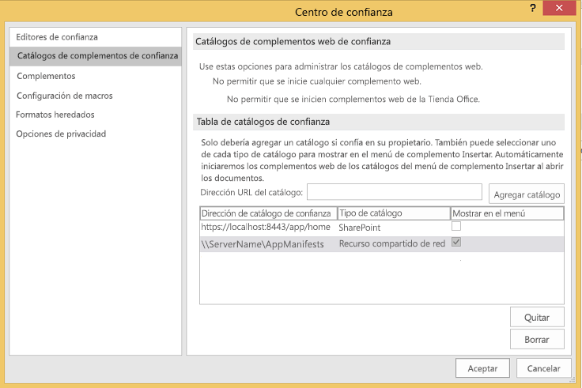
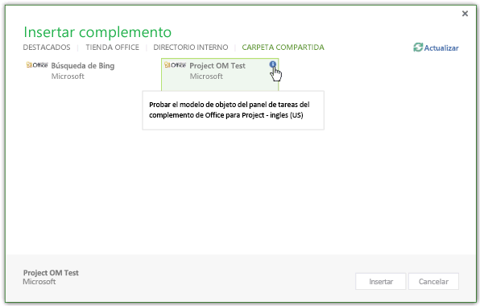
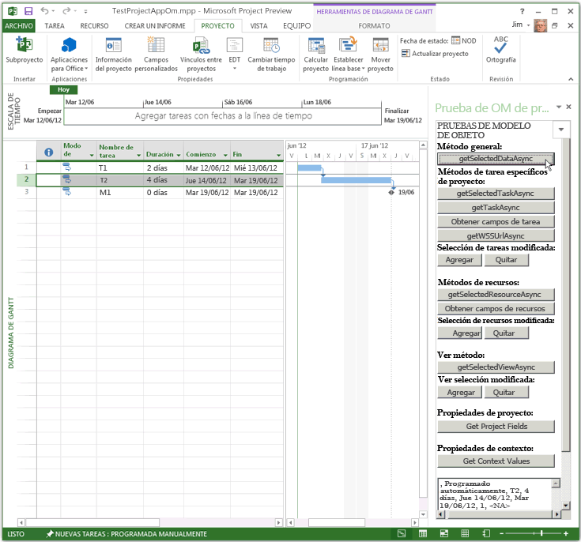
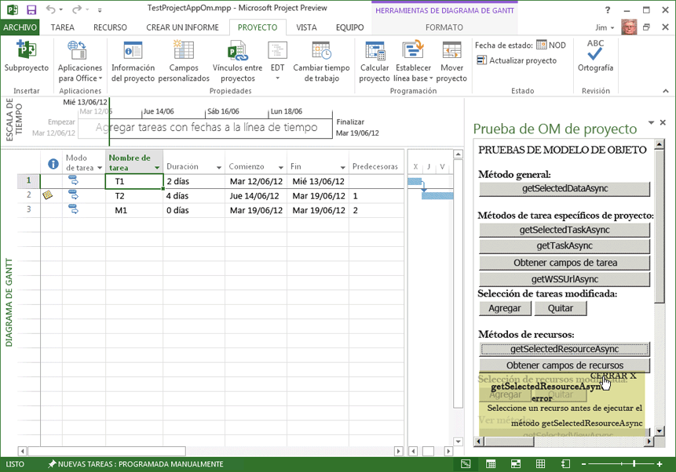

# Procedimiento para crear el primer complemento de panel de tareas para Project 2013 con un editor de texto

Puede crear un complemento de panel de tareas para Project Standard 2013 o Project Profesional 2013 con Visual Studio 2015 con el fin de crear una aplicación web compleja o un editor de texto con el que crear archivos para un complemento local. En este artículo se describe cómo crear un complemento sencillo, que use un manifiesto XML que apunte a un archivo HTML de un recurso compartido de archivos. El complemento de ejemplo Project OM Test prueba algunas funciones JavaScript que usan el modelo de objetos de los complementos. Después de usar el  **Centro de confianza** de Project 2013 para registrar el recurso compartido de archivos que contiene el archivo de manifiesto, puede abrir el complemento de panel de tareas desde la pestaña **PROYECTO** de la cinta de opciones. (El código de ejemplo de este artículo está basado en un complementos de prueba de Arvind Iyer, Microsoft Corporation).

Project 2013 usa el mismo esquema de manifiesto del complemento que otros clientes de Microsoft Office 2013 y prácticamente la misma API de JavaScript. El código completo del complementos que se describe en este artículo está disponible en el subdirectorio  `Samples\Apps` de la descarga del SDK Project 2013.

El complemento de ejemplo Project OM Test obtiene el GUID de una tarea y las propiedades de la aplicación y del proyecto activo. Si Project Profesional 2013 abre un proyecto de una biblioteca de SharePoint, el complementos puede mostrar la dirección URL del proyecto. La [descarga del SDK de Project 2013](https://www.microsoft.com/en-us/download/details.aspx?id=30435%20) incluye el código fuente completo. Cuando extraiga e instale el SDK y los ejemplos del archivo Project2013SDK.msi, examine el subdirectorio `\Samples\Apps\Copy_to_AppManifests_FileShare` para buscar el archivo de manifiesto y el subdirectorio `\Samples\Apps\Copy_to_AppSource_FileShare`, y así buscar el código fuente. El ejemplo JSOMCall.html usa las funciones JavaScript del archivo office.js y del archivo project-15.js, que también se incluyen. Puede usar los archivos de depuración correspondientes (office.debug.js y project-15.debug.js) para examinar las funciones. Para una introducción sobre el uso de JavaScript en Complementos de Office, vea [Información sobre la API de JavaScript para Office](../../docs/develop/understanding-the-javascript-api-for-office.md).

## Procedimiento 1. Para crear el archivo de manifiesto del complemento


- Cree un archivo XML en un directorio local. El archivo XML incluye el elemento  **OfficeApp** y los elementos secundarios, que se describen en [Manifiesto XML de complementos para Office](../../docs/overview/add-in-manifests.md). Por ejemplo, cree un archivo con el nombre JSOM_SimpleOMCalls.xml que contenga el siguiente XML (cambie el valor GUID del elemento **Id**).
    
```XML
     <?xml version="1.0" encoding="utf-8"?>
   <OfficeApp xmlns="http://schemas.microsoft.com/office/appforoffice/1.1" 
              xmlns:xsi="http://www.w3.org/2001/XMLSchema-instance" 
              xsi:type="TaskPaneApp">
     <Id>93A26520-9414-492F-994B-4983A1C7A607</Id>
     <Version>15.0</Version>
     <ProviderName>Microsoft</ProviderName>
     <DefaultLocale>en-us</DefaultLocale>
     <DisplayName DefaultValue="Project OM Test">
       <Override Locale="fr-fr" Value="Le Project OM Test"/>
     </DisplayName>
     <Description DefaultValue="Test the task pane add-in object model for Project - English (US)">
       <Override Locale="fr-fr" Value="Test the task pane add-in object model for Project - French (France)"/>
     </Description>
     <Hosts>
       <Host Name="Project"/>
       <Host Name="Workbook"/>
       <Host Name="Document"/>
     </Hosts>
    <DefaultSettings>
       <SourceLocation DefaultValue="\\ServerName\AppSource\JSOMCall.html">
         <Override Locale="fr-fr" Value="\\ServerName\AppSource\JSOMCall.html"/>
       </SourceLocation>
     </DefaultSettings>
     <Permissions>ReadWriteDocument</Permissions>
     <IconUrl DefaultValue="http://officeimg.vo.msecnd.net/_layouts/images/general/office_logo.jpg">
       <Override Locale="fr-fr" Value="http://officeimg.vo.msecnd.net/_layouts/images/general/office_logo.jpg"/>
     </IconUrl>
     <AllowSnapshot>true</AllowSnapshot>
   </OfficeApp>
```


    For Project, the  **OfficeApp** element must include the `xsi:type="TaskPaneApp"` attribute value. The **Id** element is a GUID. The **SourceLocation** value must be a file share path or a SharePoint URL for the add-in HTML source file or the web application that runs in the task pane. For an explanation of the other elements in manifest file, see [Task pane add-ins for Project](../project/project-add-ins.md).
    
En el procedimiento 2 se muestra cómo crear el archivo HTML que especifica el manifiesto JSOM_SimpleOMCalls.xml para el complemento de prueba de Project. Los botones especificados en el archivo HTML llaman a funciones JavaScript relacionadas. Puede agregar las funciones JavaScript en el archivo HTML o colocarlas en un archivo .js independiente.

## Procedimiento 2. Para crear los archivos de origen para el complemento Project OM Test


1. Cree un archivo HTML con un nombre especificado por el elemento **SourceLocation** en el manifiesto JSOM_SimpleOMCalls.xml. Por ejemplo, cree el archivoJSOMCall.html en el directorio `C:\Project\AppSource`. Si bien puede usar un editor de texto sencillo para crear los archivos de origen, es más fácil usar una herramienta como Visual Studio 2015, que funciona con tipos de documento específicos (HTML y JavaScript, por ejemplo) y ofrece otras ayudas para la edición. Si aún no completó el ejemplo de búsqueda de Bing descrito en [Complementos de panel de tareas para Project](../project/project-add-ins.md), en el procedimiento 3 se muestra cómo crear el recurso compartido de archivos  `\\ServerName\AppSource` que especifica el manifiesto.
    
    El archivo JSOMCall.html usa el archivo MicrosoftAjax.js común para la funcionalidad de AJAX y el archivo Office.js para la funcionalidad del complemento en las aplicaciones de Microsoft Office 2013.
    


```HTML
  <!DOCTYPE html>
<html>
<head>
    <title>Project OM Sample Code</title>
    <meta http-equiv="X-UA-Compatible" content="IE=Edge" />
    <script type="text/javascript" src="MicrosoftAjax.js"></script>

    <!-- Use the CDN reference to office.js when deploying your add-in. -->
    <!-- <script src="https://appsforoffice.microsoft.com/lib/1/hosted/Office.js"></script> -->
    <script type="text/javascript" src="Office.js"></script>
    <script type="text/javascript" src="JSOM_Sample.js"></script>
</head>
<body>
    <div id="Common_JSOM_API">
        OBJECT MODEL TESTS
    </div>

    <textarea id="text" rows="6" cols="25">This is the text result.</textarea>
</body>
</html>
```


    The  **textarea** element specifies a text box that shows results of the JavaScript functions.
    
     >**Note**  For the Project OM Test sample to work, copy the following files from the Project 2013 SDK download to the same directory as the JSOMCall.html file: Office.js, Project-15.js, and MicrosoftAjax.js.

    Step 2 adds the JSOM_Sample.js file for specific functions that the Project OM Test sample add-in uses. In later steps, you will add other HTML elements for buttons that call JavaScript functions.
    
2. Cree un archivo JavaScript con el nombre JSOM_Sample.js en el mismo directorio que el archivo JSOMCall.html. El siguiente código obtiene la información del documento y contexto de la aplicación con las funciones del archivo Office.js. El objeto **text** es el identificador del control **textarea** en el archivo HTML.
    
    La variable **_projDoc** se inicializa con un objeto **ProjectDocument**. El código incluye algunas funciones de control de errores simple y la función **getContextValues** que obtiene el contexto de aplicación y las propiedades de contexto del documento de proyecto. Para obtener más información sobre el modelo de objetos de JavaScript para Project, consulte [API de JavaScript para Office](../../reference/javascript-api-for-office.md).
    


```js
  /*
* JavaScript functions for the Project OM Test example app
* in the Project 2013 SDK.
*/

var _projDoc;
var _app;
var taskGuid;
var resourceGuid;

// The initialize function is required for all add-ins.
Office.initialize = function (reason) {
    // Checks for the DOM to load using the jQuery ready function.
    $(document).ready(function () {
        // After the DOM is loaded, app-specific code can run.
        _projDoc = Office.context.document;
        _app = Office.context;
    });
}

function logError(errorText) {
    text.value = "Error in " + errorText;
}

function logEventError(erroneousEvent) {
    logError("event " + erroneousEvent);
}

function logMethodError(methodName, errorName, errorMessage) {
    logError(methodName + " method.\nError name: " + errorName + "\nMessage: " + errorMessage);
}

// . . . Add other JavaScript functions here.

function getContextValues() {
    getDocumentUrl();
    getDocumentMode();
    getApplicationContentLanguage();
    getApplicationDisplayLanguage();
}

function getDocumentUrl() {
    text.value ="Document URL:\n" +_projDoc.url;
}

function getDocumentMode() {
    var docMode = _projDoc.mode;
    text.value = text.value + "\n\nDocument mode: " + docMode;
}

function getApplicationContentLanguage() {
    text.value = text.value + "\nApp language: " + _app.contentLanguage;
}

function getApplicationDisplayLanguage() {
    text.value = text.value + "\nDisplay language: " + _app.displayLanguage;
}
```


    For information about the functions in the Office.debug.js file, see [JavaScript API for Office](../../reference/javascript-api-for-office.md). For example, the  **getDocumentUrl** function gets the URL or file path of the open project.
    
3. Agregue las funciones JavaScript que llaman a funciones asincrónicas en Office.js y Project-15.js para obtener los datos seleccionados:
    
      - Por ejemplo, **getSelectedDataAsync** es una función general de Office.js que obtiene texto sin formato para los datos seleccionados. Para más información, vea el [objeto AsyncResult](../../reference/shared/asyncresult.md).
    
  - La función  **getSelectedTaskAsync** de Project-15.js obtiene el GUID de la tarea seleccionada. De manera similar, la función **getSelectedResourceAsync** obtiene el GUID del recurso seleccionado. Si llama a esas funciones sin haber seleccionado una tarea o un recurso, las funciones muestran un error no definido.
    
  - La función  **getTaskAsync** obtiene el nombre de la tarea y los nombres de los recursos asignados. Si la tarea está en una lista de tareas sincronizadas de SharePoint, **getTaskAsync** obtiene el identificador de tarea de la lista de SharePoint. De lo contrario, el identificador de tarea de SharePoint es 0.
    
     >**Nota** A fines ilustrativos, el código de ejemplo incluye un error. Si **taskGuid** no está definida, la función **getTaskAsync** no arroja errores. Si obtiene un GUID de tareas válido y, después, selecciona una tarea diferente, la función **getTaskAsync** obtiene datos de la tarea más reciente donde la función **getSelectedTaskAsync** realizó operaciones.
  -  **getTaskFields**,  **getResourceFields** y **getProjectFields** son funciones locales que llaman a **getTaskFieldAsync**,  **getResourceFieldAsync** o **getProjectFieldAsync** repetidamente para obtener campos específicos de una tarea o un recurso. En el archivo project-15.debug.js, la enumeración **ProjectTaskFields** y la enumeración **ProjectResourceFields** muestran qué campos se admiten.
    
  - La función  **getSelectedViewAsync** obtiene el tipo de vista (definido en la enumeración **ProjectViewTypes** de project-15.debug.js) y el nombre de la vista.
    
  - Si el proyecto está sincronizado con una lista de tareas de SharePoint, la función  **getWSSUrlAsync** obtiene la dirección URL y el nombre de la lista de tareas. Si el proyecto no está sincronizado con una lista de tareas de SharePoint, la función **getWSSUrlAsync** genera un error.
    
     >**Nota** Para obtener la dirección URL de SharePoint y el nombre de la lista de tareas, se recomienda que use la función **getProjectFieldAsync** con las constantes **WSSUrl** y **WSSList** en la enumeración [ProjectProjectFields](../../reference/shared/projectprojectfields-enumeration.md).

    Cada una de las funciones en el código siguiente incluye una función anónima que se especifica mediante `function (asyncResult)`, que es una devolución de llamada que obtiene el resultado asincrónico. En lugar de funciones anónimas, podría usar las funciones con nombre, que pueden ayudar con el mantenimiento de complementos complejos.
    


```js
  // Get the data in the selected cells of the grid in the active view.
function getSelectedDataAsync() {
    _projDoc.getSelectedDataAsync(
        Office.CoercionType.Text,
        { ValueFormat: "Formatted" },
        function (asyncResult) {
            if (asyncResult.status == Office.AsyncResultStatus.Succeeded)
                text.value = asyncResult.value;
            else
                logMethodError("getSelectedDataAsync", asyncResult.error.name,
                               asyncResult.error.message);
        }
    );
}

// Get the GUID of the selected task.
function getSelectedTaskAsync() {
    _projDoc.getSelectedTaskAsync(function (asyncResult) {
        if (asyncResult.status == Office.AsyncResultStatus.Succeeded) {
            text.value = asyncResult.value;
            taskGuid = asyncResult.value;
        }
        else {
            logMethodError("getSelectedTaskAsync", asyncResult.error.name,
                               asyncResult.error.message);
        }
    });
}

// Get the GUID of the selected resource.
function getSelectedResourceAsync() {
    _projDoc.getSelectedResourceAsync(function (asyncResult) {
        if (asyncResult.status == Office.AsyncResultStatus.Succeeded) {
            text.value = asyncResult.value;
            resourceGuid = asyncResult.value;
        }
        else {
            logMethodError("getSelectedResourceAsync", asyncResult.error.name,
                               asyncResult.error.message);
        }
    });
}

// Get data for the specified task.
function getTaskAsync() {
    if (taskGuid != undefined) {
        _projDoc.getTaskAsync(
            taskGuid,
            function (asyncResult) {
                if (asyncResult.status === Office.AsyncResultStatus.Failed) {
                    logMethodError("getTaskAsync", asyncResult.error.name,
                               asyncResult.error.message);
                } else {
                    var taskInfo = asyncResult.value;
                    var taskOutput = "Task name: " + taskInfo.taskName +
                                     "\nGUID: " + taskGuid +
                                     "\nWSS Id: " + taskInfo.wssTaskId +
                                     "\nResourceNames: " + taskInfo.resourceNames;
                    text.value = taskOutput;
                }
            }
        );
    } else {
        text.value = 'Task GUID not valid:\n' + taskGuid;
    } 
}

// Get additional data for task fields.
function getTaskFields() {
    text.value = "";

    _projDoc. getTaskFieldAsync(taskGuid, Office.ProjectTaskFields.Name,
        function (asyncResult) {
            if (asyncResult.status == Office.AsyncResultStatus.Succeeded) {
                text.value = text.value + "Name: "
                    + asyncResult.value.fieldValue + "\n";
            }
            else {
                logMethodError("getTaskFieldAsync", asyncResult.error.name,
                               asyncResult.error.message);
            }
        }
    );

    _projDoc.getTaskFieldAsync(taskGuid, Office.ProjectTaskFields.ID,
        function (asyncResult) {
            if (asyncResult.status == Office.AsyncResultStatus.Succeeded) {
                text.value = text.value + "ID: "
                    + asyncResult.value.fieldValue + "\n";
            }
            else {
                logMethodError("getTaskFieldAsync", asyncResult.error.name,
                               asyncResult.error.message);
            }
        }
    );

    _projDoc.getTaskFieldAsync(taskGuid, Office.ProjectTaskFields.Start,
        function (asyncResult) {
            if (asyncResult.status == Office.AsyncResultStatus.Succeeded) {
                text.value = text.value + "Start: "
                    + asyncResult.value.fieldValue + "\n";
            }
            else {
                logMethodError("getTaskFieldAsync", asyncResult.error.name,
                               asyncResult.error.message);
            }
        }
    );

    _projDoc.getTaskFieldAsync(taskGuid, Office.ProjectTaskFields.Duration,
        function (asyncResult) {
            if (asyncResult.status == Office.AsyncResultStatus.Succeeded) {
                text.value = text.value + "Duration: "
                    + asyncResult.value.fieldValue + "\n";
            }
            else {
                logMethodError("getTaskFieldAsync", asyncResult.error.name,
                               asyncResult.error.message);
            }
        }
    );

    _projDoc.getTaskFieldAsync(taskGuid, Office.ProjectTaskFields.Priority,
        function (asyncResult) {
            if (asyncResult.status == Office.AsyncResultStatus.Succeeded) {
                text.value = text.value + "Priority: "
                    + asyncResult.value.fieldValue + "\n";
            }
            else {
                logMethodError("getTaskFieldAsync", asyncResult.error.name,
                               asyncResult.error.message);
            }
        }
    );

    _projDoc.getTaskFieldAsync(taskGuid, Office.ProjectTaskFields.Notes,
        function (asyncResult) {
            if (asyncResult.status == Office.AsyncResultStatus.Succeeded) {
                text.value = text.value + "Notes: "
                    + asyncResult.value.fieldValue + "\n";
            }
            else {
                logMethodError("getTaskFieldAsync", asyncResult.error.name,
                               asyncResult.error.message);
            }
        }
    ); 
}

// Get data for the specified resource fields.
function getResourceFields() {
    text.value = "";

    _projDoc.getResourceFieldAsync(resourceGuid, Office.ProjectResourceFields.Name,
        function (asyncResult) {
            if (asyncResult.status == Office.AsyncResultStatus.Succeeded) {
                text.value = text.value + "Resource name: " + asyncResult.value.fieldValue + "\n";
            }
            else {
                logMethodError("getResourceFieldAsync", asyncResult.error.name,
                               asyncResult.error.message);
            }
        }
    );

    _projDoc.getResourceFieldAsync(resourceGuid, Office.ProjectResourceFields.Cost,
        function (asyncResult) {
            if (asyncResult.status == Office.AsyncResultStatus.Succeeded) {
                text.value = text.value + "Cost: " + asyncResult.value.fieldValue + "\n";
            }
            else {
                logMethodError("getResourceFieldAsync", asyncResult.error.name,
                               asyncResult.error.message);
            }
        }
    );

    _projDoc.getResourceFieldAsync(resourceGuid, Office.ProjectResourceFields.StandardRate,
        function (asyncResult) {
            if (asyncResult.status == Office.AsyncResultStatus.Succeeded) {
                text.value = text.value + "Standard Rate: " + asyncResult.value.fieldValue + "\n";
            }
            else {
                logMethodError("getResourceFieldAsync", asyncResult.error.name, asyncResult.error.message);
            }
        }
    );

    _projDoc.getResourceFieldAsync(resourceGuid, Office.ProjectResourceFields.ActualCost,
        function (asyncResult) {
            if (asyncResult.status == Office.AsyncResultStatus.Succeeded) {
                text.value = text.value + "Actual Cost: " + asyncResult.value.fieldValue + "\n";
            }
            else {
                logMethodError("getResourceFieldAsync", asyncResult.error.name, asyncResult.error.message);
            }
        }
    );

    _projDoc.getResourceFieldAsync(resourceGuid, Office.ProjectResourceFields.ActualWork,
        function (asyncResult) {
            if (asyncResult.status == Office.AsyncResultStatus.Succeeded) {
                text.value = text.value + "Actual Work: " + asyncResult.value.fieldValue + "\n";
            }
            else {
                logMethodError("getResourceFieldAsync", asyncResult.error.name,
                               asyncResult.error.message);
            }
        }
    );

    _projDoc.getResourceFieldAsync(resourceGuid, Office.ProjectResourceFields.Units,
        function (asyncResult) {
            if (asyncResult.status == Office.AsyncResultStatus.Succeeded) {
                text.value = text.value + "Units: " + asyncResult.value.fieldValue + "\n";
            }
            else {
                logMethodError("getResourceFieldAsync", asyncResult.error.name,
                               asyncResult.error.message);
            }
        }
    );
}

// Get the URL and list name of the synchronized SharePoint task list.
// Recommended: use getProjectField instead.
function getWSSUrlAsync() {
    _projDoc.getWSSUrlAsync(function (asyncResult) {
        if (asyncResult.status == Office.AsyncResultStatus.Succeeded) {
            text.value = "SharePoint URL:\n" + asyncResult.value.serverUrl
                + "\nList name: " + asyncResult.value.listName;
        }
        else {
            logMethodError("getWSSUrlAsync", asyncResult.error.name, asyncResult.error.message);
        }
    });
}

// Get the type and name of the selected view.
function getSelectedViewAsync() {
    _projDoc.getSelectedViewAsync(function (asyncResult) {
        text.value = "View type: " + asyncResult.value.viewType
            + "\nName: " + asyncResult.value.viewName;
    });
}

// Get information about the active project.
function getProjectFields() {
    text.value = "";

    _projDoc.getProjectFieldAsync(Office.ProjectProjectFields.GUID,
        function (asyncResult) {
            if (asyncResult.status == Office.AsyncResultStatus.Succeeded) {
                text.value = text.value + "Project GUID: " + asyncResult.value.fieldValue + "\n";
            }
            else {
                logMethodError("getProjectFieldAsync", asyncResult.error.name, asyncResult.error.message);
            }
        }
    );

    _projDoc.getProjectFieldAsync(Office.ProjectProjectFields.Start,
        function (asyncResult) {
            if (asyncResult.status == Office.AsyncResultStatus.Succeeded) {
                text.value = text.value + "\nStart: " + asyncResult.value.fieldValue + "\n";
            }
            else {
                logMethodError("getProjectFieldAsync", asyncResult.error.name, asyncResult.error.message);
            }
        }
    );

    _projDoc.getProjectFieldAsync(Office.ProjectProjectFields.Finish,
        function (asyncResult) {
            if (asyncResult.status == Office.AsyncResultStatus.Succeeded) {
                text.value = text.value + "\nFinish: " + asyncResult.value.fieldValue + "\n";
            }
            else {
                logMethodError("getProject " + errorText);
            }
        }
    );

    _projDoc.getProjectFieldAsync(Office.ProjectProjectFields.CurrencyDigits,
        function (asyncResult) {
            if (asyncResult.status == Office.AsyncResultStatus.Succeeded) {
                text.value = text.value + "\nCurrency digits: " + asyncResult.value.fieldValue + "\n";
            }
            else {
                logMethodError("getProjectFieldAsync", asyncResult.error.name, asyncResult.error.message);
            }
        }
    );


    _projDoc.getProjectFieldAsync(Office.ProjectProjectFields.CurrencySymbol,
        function (asyncResult) {
            if (asyncResult.status == Office.AsyncResultStatus.Succeeded) {
                text.value = text.value + "Currency symbol: " + asyncResult.value.fieldValue + "\n";
            }
            else {
                logMethodError("getProjectFieldAsync", asyncResult.error.name, asyncResult.error.message);
            }
        }
    );

    _projDoc.getProjectFieldAsync(Office.ProjectProjectFields.CurrencySymbolPosition,
        function (asyncResult) {
            if (asyncResult.status == Office.AsyncResultStatus.Succeeded) {
                text.value = text.value + "\nSymbol position: " + asyncResult.value.fieldValue + "\n";
            }
            else {
                logMethodError("getProjectFieldAsync", asyncResult.error.name, asyncResult.error.message);
            }
        }
    );

    _projDoc.getProjectFieldAsync(Office.ProjectProjectFields.ProjectServerUrl,
        function (asyncResult) {
            if (asyncResult.status == Office.AsyncResultStatus.Succeeded) {
                text.value = text.value + "\nProject web app URL:\n  " + asyncResult.value.fieldValue + "\n";
            }
            else {
                logMethodError("getProjectFieldAsync", asyncResult.error.name, asyncResult.error.message);
            }
        }
    );

    _projDoc.getProjectFieldAsync(Office.ProjectProjectFields.WSSUrl,
        function (asyncResult) {
            if (asyncResult.status == Office.AsyncResultStatus.Succeeded) {
                text.value = text.value + "\nSharePoint URL:\n  " + asyncResult.value.fieldValue + "\n";
            }
            else {
                logMethodError("getProjectFieldAsync", asyncResult.error.name, asyncResult.error.message);
            }
        }
    );

    _projDoc.getProjectFieldAsync(Office.ProjectProjectFields.WSSList,
        function (asyncResult) {
            if (asyncResult.status == Office.AsyncResultStatus.Succeeded) {
                text.value = text.value + "\nSharePoint list: " + asyncResult.value.fieldValue + "\n";
            }
            else {
                logMethodError("getProjectFieldAsync", asyncResult.error.name, asyncResult.error.message);
            }
        }
    );
}
```

4. Agregue devoluciones de llamada y funciones del controlador de eventos JavaScript para registrar los controladores de eventos de cambios de selección de tareas, recursos y vistas, y para anular el registro de los controladores de eventos. La función  **manageEventHandlerAsync** agrega o quita el controlador de eventos especificado, según el parámetro _operation_. La operación puede ser  **addHandlerAsync** o **removeHandlerAsync**.
    
    Las funciones **manageTaskEventHandler**, **manageResourceEventHandler** y **manageViewEventHandler** pueden agregar o quitar un controlador de eventos, como se especifica en el parámetro _docMethod_.
    


```js
  // Task selection changed event handler.
function onTaskSelectionChanged(eventArgs) {
    text.value = "In task selection change event handler";
}

// Resource selection changed event handler.
function onResourceSelectionChanged(eventArgs) {
    text.value = "In Resource selection changed event handler";
}

// View selection changed event handler.
function onViewSelectionChanged(eventArgs) {
    text.value = "In View selection changed event handler";
}

// Add or remove the specified event handler.
function manageEventHandlerAsync(eventType, handler, operation, onComplete) {
    _projDoc[operation]   //The operation is addHandlerAsync or removeHandlerAsync.
    (
        eventType,
        handler,
        function (asyncResult) {
            if (onComplete) {
                onComplete(asyncResult, operation);
            } else {
                var message = "Operation: " + operation;
                message = message + "\nStatus: " + asyncResult.status + "\n";
                text.value = message;
            }
        }
    );
}

// Write the asyncResult status from the manageEventHandlerAsync function (optional). 
function onComplete(asyncResult, operation) {
    var message = "In onComplete function for " + operation;
    message = message + "\nStatus: " + asyncResult.status;
    text.value = message;
}

// Add or remove a task selection changed event handler.
function manageTaskEventHandler(docMethod) {
    manageEventHandlerAsync(
        Office.EventType.TaskSelectionChanged,      // The task selection changed event.
        onTaskSelectionChanged,                     // The event handler.
        docMethod,                // The Office.Document method to add or remove an event handler.
        onComplete                // Manages the successful asyncResult data (optional).
    );
}

// Add or remove a resource selection changed event handler.
function manageResourceEventHandler(docMethod) {
    manageEventHandlerAsync(
        Office.EventType.ResourceSelectionChanged,  // The resource selection changed event.
        onResourceSelectionChanged,                 // The event handler.
        docMethod,                // The Office.Document method to add or remove an event handler.
        onComplete                // Manages the successful asyncResult data (optional).
    );
}

// Add or remove a view selection changed event handler.
function manageViewEventHandler(docMethod) {
    manageEventHandlerAsync(
        Office.EventType.ViewSelectionChanged,      // The view selection changed event.
        onViewSelectionChanged,                     // The event handler.
        docMethod,                // The Office.Document method to add or remove an event handler.
        onComplete                // Manages the successful asyncResult data (optional).
    );
}
```

5. Para el cuerpo del documento HTML, agregue botones que llamen a las funciones JavaScript para fines de prueba. Por ejemplo, en el elemento  **div** para la API común del JSOM, agregue un botón de entrada que llame a la función general **getSelectedDataAsync**.
    
```HTML
  <body>
    <div id="Common_JSOM_API">
    OBJECT MODEL TESTS
    <br /><br />       
    <strong>General function:</strong>
    <br />
    <input id="Button5" class="button-wide" type="button" onclick="getSelectedDataAsync()" 
        value="getSelectedDataAsync" />
    </div>
   <!--  more code . . .  -->
```

6. Agregue una sección  **div** con botones para las funciones de tareas específicas del proyecto y para el evento **TaskSelectionChanged**.
    
```HTML
  <div id="ProjectSpecificTask">
  <br />
  <strong>Project-specific task methods:</strong><br />
  <button class="button-wide" onclick="getSelectedTaskAsync()">getSelectedTaskAsync</button><br />
  <button class="button-wide" onclick="getTaskAsync()">getTaskAsync</button><br />
  <button class="button-wide" onclick="getTaskFields()">Get Task Fields</button><br />
  <button class="button-wide" onclick="getWSSUrlAsync()">getWSSUrlAsync</button>
  <strong>Task selection changed:</strong>
  <button class="button-narrow" onclick="manageTaskEventHandler('addHandlerAsync')">Add</button>
  <button class="button-narrow" onclick="manageTaskEventHandler('removeHandlerAsync')">Remove</button>         
</div>
```

7. Agregue secciones  **div** con botones para los métodos y eventos de recursos, los métodos y eventos de vistas, las propiedades de proyecto y las propiedades de contexto.
    
```HTML
  <div id="ResourceMethods">
  <br />
  <strong>Resource methods:</strong>
  <button class="button-wide" onclick="getSelectedResourceAsync()">getSelectedResourceAsync</button><br />
  <button class="button-wide" onclick="getResourceFields()">Get Resource Fields</button><br />
  <strong>Resource selection changed:</strong>
  <button class="button-narrow" onclick="manageResourceEventHandler('addHandlerAsync')">Add</button>
  <button class="button-narrow" onclick="manageResourceEventHandler('removeHandlerAsync')">Remove</button>
</div>
<div id="ViewMethods">
  <br />
  <strong>View method:</strong>
  <button class="button-wide" onclick="getSelectedViewAsync()">getSelectedViewAsync</button><br />
  <strong>View selection changed:</strong>
  <button class="button-narrow" onclick="manageViewEventHandler('addHandlerAsync')">Add</button>
  <button class="button-narrow" onclick="manageViewEventHandler('removeHandlerAsync')">Remove</button>         
</div>
<div id="ProjectMethods">
  <br />
  <strong>Project properties:</strong>
  <button class="button-wide" onclick="getProjectFields()">Get Project Fields</button><br />
</div>
<div id="ContextVariables">
  <br />
  <strong>Context properties:</strong>
  <button class="button-wide" onclick="getContextValues()">Get Context Values</button>
</div>
```

8. Para dar formato a los elementos del botón, agregue un elemento CSS  **style**. Por ejemplo, agregue lo siguiente como elemento secundario del elemento  **head**.
    
```HTML
  <style type="text/css">
    .button-wide
    {
        width: 210px;
        margin-top: 2px;
    }
    .button-narrow
    {
        width: 80px;
        margin-top: 2px;
    }
</style>
```


     >**Note**  The  **Task Pane Add-in (Project)** template in Visual Studio 2015 includes default .css files for a common look and feel of add-ins.
En el procedimiento 3 se muestra cómo instalar y usar las funciones del complemento Project OM Test.

## Procedimiento 3. Para instalar y usar el complemento Project OM Test


1. Cree un recurso compartido de archivos para el directorio que contiene el manifiesto JSOM_SimpleOMCalls.xml. Puede crear el recurso compartido de archivos en el equipo local o en un equipo remoto que esté disponible en la red. Por ejemplo, si el manifiesto está en el directorio  `C:\Project\AppManifests` del equipo local, ejecute el comando siguiente:
    
```
  Net share AppManifests=C:\Project\AppManifests
```

    
2. Cree un recurso compartido de archivos para el directorio que contiene los archivos HTML y JavaScript para el complemento Project OM Test. Asegúrese de que la ruta del recurso compartido de archivos coincide con la especificada en el manifiesto JSOM_SimpleOMCalls.xml. Por ejemplo, si los archivos están en el directorio  `C:\Project\AppSource` del equipo local, ejecute el comando siguiente:
    
```
  net share AppSource=C:\Project\AppSource
```

3. En Project, abra el cuadro de diálogo  **Opciones de Project**, elija  **Centro de confianza** y luego **Configuración del Centro de confianza**.
    
    El procedimiento para registrar un complemento también se describe en [Complementos de panel de tareas para Project](../project/project-add-ins.md), con información adicional.
    
4. En el cuadro de diálogo  **Centro de confianza**, en el panel izquierdo, elija  **Catálogos de complementos de confianza**.
    
5. Si ya agregó la ruta  `\\ServerName\AppManifests` para el complemento de búsqueda de Bing, omita este paso. De lo contrario, en el panel **Catálogos de complementos de confianza**, agregue la ruta  `\\ServerName\AppManifests` en el cuadro de texto **Dirección URL del catálogo**, elija  **Agregar catálogo**, habilite el recurso compartido de red como origen predeterminado (vea la figura 1) y luego elija  **Aceptar**.
    
    **Figura 1. Adición de un recurso compartido de red para manifiestos de complementos**

    

6. Después de agregar complementos nuevos o de cambiar el código fuente, reinicie Project. En la cinta de opciones  **PROYECTO**, elija el menú desplegable  **Complementos para Office** y luego elija **Ver todo**. En el cuadro de diálogo  **Insertar complemento**, elija  **CARPETA COMPARTIDA** (vea la figura 2), seleccione **Project OM Test** y luego elija **Insertar**. El complemento Project OM Test se inicia en un panel de tareas.
    
    **Figura 2. Ejecución del complemento Project OM Test que se encuentra en un recurso compartido de archivo**

    

7. En Project, cree y guarde un proyecto sencillo que tenga al menos dos tareas. Por ejemplo, cree tareas con el nombre T1, T2 y un hito con el nombreM1, y luego establezca que las duraciones y los predecesores de las tareas sean similares a los de la figura 3. Elija la pestaña  **PROYECTO** en la cinta, seleccione la fila completa para la tarea T2 y seleccione el botón **getSelectedDataAsync** en el panel de tareas. La figura 3 muestra los datos seleccionados en el cuadro de texto del complemento **Project OM Test**.
    
    **Figura 3. Uso del complemento Project OM Test**

    

8. Seleccione la celda de la columna  **Duración** para la primera tarea y luego elija el botón **getSelectedDataAsync** del complemento **Project OM Test**. La función  **getSelectedDataAsync** establece que el valor del cuadro de texto sea `2 days`. 
    
9. Seleccione las tres celdas  **Duración** para las tres tareas. La función **getSelectedDataAsync** devuelve valores de texto separados por punto y coma para las celdas seleccionadas en filas diferentes, por ejemplo, `2 days;4 days;0 days`.
    
    La función **getSelectedDataAsync** devuelve valores de texto separados por comas para las celdas seleccionadas dentro de una fila. Por ejemplo en la Figura 3, está seleccionada toda la fila de la tarea T2. Cuando elige **getSelectedDataAsync**, el cuadro de texto muestra lo siguiente: `,Auto Scheduled,T2,4 days,Thu 6/14/12,Tue 6/19/12,1,,<NA>`
    
    La columna **Indicadores** y la columna **Nombres de recursos** están vacías, por lo que la matriz de texto muestra valores vacíos para esas columnas. El valor `<NA>` es para la celda **Agregar nueva columna**.
    
10. Seleccione cualquier celda de la fila para la tarea T2, o toda la fila para la tarea T2, y luego elija  **getSelectedTaskAsync**. El cuadro de texto muestra el valor de GUID de la tarea, por ejemplo,  `{25D3E03B-9A7D-E111-92FC-00155D3BA208}`. Project almacena ese valor en la variable  **taskGuid** global del complemento **Project OM Test**.
    
11. Elija  **getTaskAsync**. Si la variable  **taskGuid** contiene el GUID de la tarea T2, el cuadro de texto muestra la información de la tarea. El valor **ResourceNames** está vacío.
    
    Cree dos recursos locales R1 y R2, asígnelos a la tarea T2 al 50 % y elija **getTaskAsync** otra vez. Los resultados en el cuadro de texto incluyen la información de recursos. Si la tarea está en una lista de tareas de SharePoint sincronizada, los resultados también incluyen el identificador de tarea de SharePoint.
    


```
  Task name: T2
GUID: {25D3E03B-9A7D-E111-92FC-00155D3BA208}
WSS Id: 0
ResourceNames: R1[50%],R2[50%]
```

12. Elija el botón  **Obtener campos de tareas**. La función  **getTaskFields** llama a la función **getTaskfieldAsync** repetidas veces para obtener el nombre, índice, fecha de inicio, duración, prioridad y notas de la tarea.
    
```
  Name: T2
ID: 2
Start: Thu 6/14/12
Duration: 4d
Priority: 500
Notes: This is a note for task T2. It is only a test note. If it had been a real note, there would be some real information.
```

13. Elija el botón  **getWSSUrlAsync**. Si el proyecto es uno de los tipos siguientes, los resultados muestran la lista de tareas, la dirección URL y el nombre.
    
      - Una lista de tareas de SharePoint importada a Project Server.
    
  - Una lista de tareas de SharePoint importada a Project Professional y luego guardada otra vez en SharePoint (sin usar Project Server).
    
     >**Nota** Si Project Professional está instalado en un equipo con Windows Server, para poder volver a guardar el proyecto en SharePoint, puede usar **Server Manager** para agregar la característica **Desktop Experience**.

    Si el proyecto es un proyecto local, o si usa Project Professional para abrir un proyecto administrado por Project Server, el método **getWSSUrlAsync** muestra un error no definido.
    


```
  SharePoint URL: http://ServerName
List name: Test task list
```

14. Elija el botón  **Agregar** de la sección **Evento TaskSelectionChanged**, que llama a la función  **manageTaskEventHandler** para registrar un evento de cambio de selección de tareas y devuelve `In onComplete function for addHandlerAsync Status: succeeded` en el cuadro de texto. Seleccione una tarea diferente. El cuadro de texto muestra `In task selection changed event handler`, que es el resultado de la función de devolución de llamada para el evento de cambio de selección de tareas. Elija el botón  **Quitar** para anular el registro del controlador de eventos.
    
15. Para usar los métodos de recursos, seleccione primero una vista, como  **Hoja de recursos**,  **Uso de recursos** o **Formulario de recursos**, y luego seleccione un recurso en esa vista. Elija  **getSelectedResourceAsync** para inicializar la variable **resourceGuid** y luego elija **Obtener campos de recursos** para llamar a **getResourceFieldAsync** repetidas veces para las propiedades del recurso. También puede agregar o quitar el controlador de eventos de cambio de selección de recursos.
    
```
  Resource name: R1
Cost: $800.00
Standard Rate: $50.00/h
Actual Cost: $0.00
Actual Work: 0h
Units: 100%
```

16. Elija  **getSelectedViewAsync** para mostrar el tipo y el nombre de la vista activa. También puede agregar o quitar el controlador de eventos de cambio de selección de vistas. Por ejemplo, si **Formulario de recursos** es la vista activa, la función **getSelectedViewAsync** muestra lo siguiente en el cuadro de texto:
    
```
  View type: 6
Name: Resource Form
```

17. Elija  **Obtener campos de proyectos** para llamar a la función **getProjectFieldAsync** repetidas veces para distintas propiedades del proyecto activo. Si el proyecto se abre desde Project Web App, la función **getProjectFieldAsync** puede obtener la dirección URL de la instancia de Project Web App.
    
```
  Project GUID: 9845922E-DAB4-E111-8AF3-00155D3BA208

Start: Tue 6/12/12
Finish: Tue 6/19/12

Currency digits: 2
Currency symbol: $
Symbol position: 0

Project web app URL:
  http://servername/pwa
```

18. Elija el botón  **Obtener valores de contexto** para obtener las propiedades del documento y el programa en el que se ejecuta el complemento al obtener las propiedades de los objetos **Office.Context.document** y **Office.context.application**. Por ejemplo, si el archivo Project1.mpp está en el escritorio del equipo local, la dirección URL del documento es  `C:\Users\UserAlias\Desktop\Project1.mpp`. Si el archivo .mpp está en una biblioteca de SharePoint, el valor es la dirección URL del documento. Si usa Project Profesional 2013 para abrir un proyecto con el nombre Project1 de Project Web App, la dirección URL del documento es  `<>\Project1`.
    
```
  Document URL:
<>\Project1
Document mode: readWrite
App language: en-US
Display language: en-US
```

19. Puede actualizar el complemento después de editar el código fuente al cerrar y reiniciar Project. En la cinta de opciones  **Proyecto**, la lista desplegable  **Complementos para Office** mantiene la lista de complemento usados recientemente.
    

## Ejemplo


La descarga del SDK de Project 2013 contiene el código completo en el archivo JSOMCall.html, el archivo JSOM_Sample.js y los archivos relacionados Office.js, Office.debug.js, Project-15.js y Project-15.debug.js. A continuación se muestra el código en el archivo JSOMCall.html.


```HTML
<!DOCTYPE html>
<html>
    <head>
        <title>Project OM Sample Code</title>
        <meta http-equiv="X-UA-Compatible" content="IE=Edge"/>

        <script type="text/javascript" src="MicrosoftAjax.js"></script>

        <!-- Use the CDN reference to office.js when deploying your add-in. -->
        <!-- <script src="https://appsforoffice.microsoft.com/lib/1/hosted/Office.js"></script> -->
        <script type="text/javascript" src="Office.js"></script>
        <script type="text/javascript" src="JSOM_Sample.js"></script>

        <style type="text/css">           
            .button-wide {
                width: 210px;
                margin-top: 2px;
            }
            .button-narrow 
            {
                width: 80px;
                margin-top: 2px;
            }
        </style>
    </head>

    <body>
      <div id="Common_JSOM_API">
        OBJECT MODEL TESTS
        <br /><br />       
        <strong>General method:</strong>
        <br />
        <input id="Button5" class="button-wide" type="button" onclick="getSelectedDataAsync()" 
            value="getSelectedDataAsync" />
      </div>

      <div id="ProjectSpecificTask">
        <br />
        <strong>Project-specific task methods:</strong><br />
        <button class="button-wide" onclick="getSelectedTaskAsync()">getSelectedTaskAsync</button><br />
        <button class="button-wide" onclick="getTaskAsync()">getTaskAsync</button><br />
        <button class="button-wide" onclick="getTaskFields()">Get Task Fields</button><br />
        <button class="button-wide" onclick="getWSSUrlAsync()">getWSSUrlAsync</button>
        <strong>Task selection changed:</strong>
        <button class="button-narrow" onclick="manageTaskEventHandler('addHandlerAsync')">Add</button>
        <button class="button-narrow" onclick="manageTaskEventHandler('removeHandlerAsync')">Remove</button>         
      </div>
<div id="ResourceMethods">
  <br />
  <strong>Resource methods:</strong>
  <button class="button-wide" onclick="getSelectedResourceAsync()">getSelectedResourceAsync</button><br />
  <button class="button-wide" onclick="getResourceFields()">Get Resource Fields</button><br />
  <strong>Resource selection changed:</strong>
  <button class="button-narrow" onclick="manageResourceEventHandler('addHandlerAsync')">Add</button>
  <button class="button-narrow" onclick="manageResourceEventHandler('removeHandlerAsync')">Remove</button>
</div>
<div id="ViewMethods">
  <br />
  <strong>View method:</strong>
  <button class="button-wide" onclick="getSelectedViewAsync()">getSelectedViewAsync</button><br />
  <strong>View selection changed:</strong>
  <button class="button-narrow" onclick="manageViewEventHandler('addHandlerAsync')">Add</button>
  <button class="button-narrow" onclick="manageViewEventHandler('removeHandlerAsync')">Remove</button>         
</div>
<div id="ProjectMethods">
  <br />
  <strong>Project properties:</strong>
  <button class="button-wide" onclick="getProjectFields()">Get Project Fields</button><br />
</div>
<div id="ContextVariables">
  <br />
  <strong>Context properties:</strong>
  <button class="button-wide" onclick="getContextValues()">Get Context Values</button>
</div>

      <br />
      <textarea id="text" rows="10" cols="25">This is the text result.</textarea>
    </body>
</html
```


## Programación sólida


El complemento  **Project OM Test** es un ejemplo que muestra el uso de algunas funciones JavaScript para Project 2013 en los archivos Project-15.js y Office.js. El ejemplo es solo para fines de prueba y no incluye comprobaciones de errores sólidas. Por ejemplo, si no selecciona un recurso y ejecuta la función **getSelectedResourceAsync**, la variable  **resourceGuid** no se inicializa y las llamadas a **getResourceFieldAsync** devuelven un error. Para un complemento de producción, debe comprobar si existen errores específicos y pasar por alto los resultados, ocultar las funciones no relevantes, o notificar al usuario que elija una vista y haga una selección válida antes de usar una función.

Para simplificar el ejemplo, el resultado del error del código siguiente incluye la variable  **actionMessage** que especifica la acción que se debe llevar a cabo para evitar un error en la función **getSelectedResourceAsync**.


```js
function logError(errorText) {
    text.value = "Error in " + errorText;
}

function logMethodError(methodName, errorName, errorMessage, actionMessage) {
    logError(methodName + " method.\nError name: " + errorName
        + "\nMessage: " + errorMessage
        + "\n\nAction: " + actionMessage);
}
// Get the GUID of the selected resource.
function getSelectedResourceAsync() {
    _projDoc.getSelectedResourceAsync(function (asyncResult) {
        if (asyncResult.status == Office.AsyncResultStatus.Succeeded) {
            text.value = asyncResult.value;
            resourceGuid = asyncResult.value;
        }
        else {
            var actionMessage = "Select a resource before running the getSelectedResourceAsync method.";
            logMethodError("getSelectedResourceAsync", asyncResult.error.name,
                               asyncResult.error.message, actionMessage);
        }
    });
}
```

Es más fácil desarrollar un complemento si se usa Visual Studio 2015, ya que es posible establecer puntos de interrupción que le ayudarán a depurar el código de JavaScript y a integrar rápidamente rutinas comunes para controlar los errores. Por ejemplo, la muestra  **HelloProject_OData** de la descarga de SDK de Project 2013 incluye el archivo SurfaceErrors.js que usa la biblioteca JQuery para mostrar un mensaje de error emergente. La figura 4 muestra el mensaje de error en una notificación de aviso. El ejemplo también incluye el archivo Office4-vsdoc.js, que proporciona Intellisense para funciones JavaScript en los archivos Office.js y Project-15.js.

El código siguiente del archivo SurfaceErrors.js incluye la función  **throwError** que crea un objeto **Toast**.


```js
/*
 * Show error messages in a "toast" notification.
 */

// Throws a custom defined error.
function throwError(errTitle, errMessage) {
    try {
        // Define and throw a custom error.
        var customError = { name: errTitle, message: errMessage }
        throw customError;
    }
    catch (err) {
        // Catch the error and display it to the user.
        Toast.showToast(err.name, err.message);
    }
}

// Add a dynamically-created div "toast" for displaying errors to the user.
var Toast = {

    Toast: "divToast",
    Close: "btnClose",
    Notice: "lblNotice",
    Output: "lblOutput",

    // Show the toast with the specified information.
    showToast: function (title, message) {

        if (document.getElementById(this.Toast) == null) {
            this.createToast();
        }

        document.getElementById(this.Notice).innerText = title;
        document.getElementById(this.Output).innerText = message;

        $("#" + this.Toast).hide();
        $("#" + this.Toast).show("slow");
    },

    // Create the display for the toast.
    createToast: function () {
        var divToast;
        var lblClose;
        var btnClose;
        var divOutput;
        var lblOutput;
        var lblNotice;

        // Create the container div.
        divToast = document.createElement("div");
        var toastStyle = "background-color:rgba(220, 220, 128, 0.80);" +
            "position:absolute;" +
            "bottom:0px;" +
            "width:90%;" +
            "text-align:center;" +
            "font-size:11pt;";
        divToast.setAttribute("style", toastStyle);
        divToast.setAttribute("id", this.Toast);

        // Create the close button.
        lblClose = document.createElement("div");
        lblClose.setAttribute("id", this.Close);
        var btnStyle = "text-align:right;" +
            "padding-right:10px;" +
            "font-size:10pt;" +
            "cursor:default";
        lblClose.setAttribute("style", btnStyle);
        lblClose.appendChild(document.createTextNode("CLOSE "));

        btnClose = document.createElement("span");
        btnClose.setAttribute("style", "cursor:pointer;");
        btnClose.setAttribute("onclick", "Toast.close()");
        btnClose.innerText = "X";
        lblClose.appendChild(btnClose);

        // Create the div to contain the toast title and message.
        divOutput = document.createElement("div");
        divOutput.setAttribute("id", "divOutput");
        var outputStyle = "margin-top:0px;";
        divOutput.setAttribute("style", outputStyle);

        lblNotice = document.createElement("span");
        lblNotice.setAttribute("id", this.Notice);
        var labelStyle = "font-weight:bold;margin-top:0px;";
        lblNotice.setAttribute("style", labelStyle);

        lblOutput = document.createElement("span");
        lblOutput.setAttribute("id", this.Output);

        // Add the child nodes to the toast div.
        divOutput.appendChild(lblNotice);
        divOutput.appendChild(document.createElement("br"));
        divOutput.appendChild(lblOutput);
        divToast.appendChild(lblClose);
        divToast.appendChild(divOutput);

        // Add the toast div to the document body.
        document.body.appendChild(divToast);
    },

    // Close the toast.
    close: function () {
        $("#" + this.Toast).hide("slow");
    }
}
```

Para usar la función  **throwError**, incluya la biblioteca JQuery y la secuencia de comandos SurfaceErrors.js en el archivo JSOMCall.html y agregue una llamada a  **throwError** en otras funciones JavaScript como, por ejemplo, **logMethodError**.


 >**Nota**  Antes de implementar el complemento, cambie las referencias a office.js y a jQuery por la referencia a la red de entrega de contenido (CDN). La referencia a CDN proporciona la versión más reciente y el mejor rendimiento.


```HTML
<!DOCTYPE html>
<html>
<head>
    <title>Project OM Sample Code</title>
    <meta http-equiv="X-UA-Compatible" content="IE=Edge" />

    <script type="text/javascript" src="MicrosoftAjax.js"></script>

    <!-- Use the CDN reference to Office.js and jQuery when deploying your add-in. -->
    <!-- <script src="https://appsforoffice.microsoft.com/lib/1/hosted/Office.js"></script> -->
    <script type="text/javascript" src="Office.js"></script>
    <script type="text/javascript" src="http://ajax.microsoft.com/ajax/jQuery/jquery-1.9.0.min.js"></script>

    <script type="text/javascript" src="JSOM_Sample.js"></script>
    <script type="text/javascript" src="SurfaceErrors.js"></script>

    <!-- . . . INVALID USE OF SYMBOLS
</head>

```


```js
function logMethodError(methodName, errorName, errorMessage, actionMessage) {
    logError(methodName + " method.\nError name: " + errorName
        + "\nMessage: " + errorMessage
        + "\n\nAction: " + actionMessage);

    throwError(methodName + " error", actionMessage);
}
```


**Figura 4. Funciones en el archivo SurfaceErrors.js pueden mostrar una notificación de "aviso"**




## Recursos adicionales


- [Complementos de panel de tareas para Project](../project/project-add-ins.md)
    
- [Información sobre la API de JavaScript para complementos](../develop/understanding-the-javascript-api-for-office.md)
    
- [Complementos de la API de JavaScript para Office](../../reference/javascript-api-for-office.md)

- [Referencia de esquema para manifiestos de Complementos de Office (v1.1)](../overview/add-in-manifests.md)     
    
- [Descarga del SDK de Project 2013](https://www.microsoft.com/en-us/download/details.aspx?id=30435%20)
    
