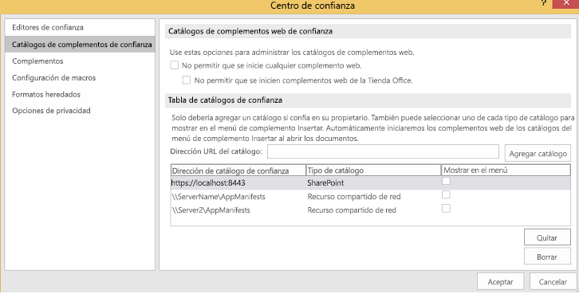
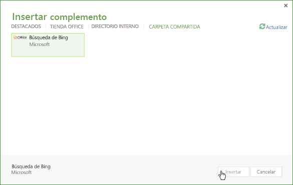
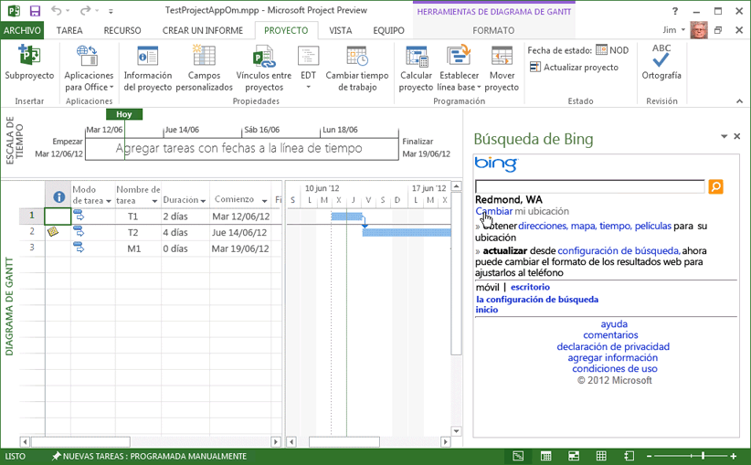

# <a name="task-pane-add-ins-for-project"></a>Complementos de panel de tareas para Project


Project Standard 2013 y Project Profesional 2013 son compatibles con complementos de panel de tareas. Se pueden usar complementos generales de panel de tareas desarrollados para Word 2013 o Excel 2013. También se pueden desarrollar complementos personalizados que administren eventos de selección en Project y que integren datos de tareas, recursos, vistas y otros datos de nivel de celda en un proyecto con listas de SharePoint, complementos de SharePoint, elementos web, servicios web y aplicaciones empresariales.

 >**Nota**  En la [Descarga del SDK de Project 2013](https://www.microsoft.com/en-us/download/details.aspx?id=30435%20) se incluyen complementos de ejemplo que muestran cómo usar el modelo de objetos de complementos en Project y cómo usar el servicio OData para datos de informe de Project Server 2013. Cuando extraiga e instale el SDK, consulte el subdirectorio `\Samples\Apps\`.

Vea una introducción a los complementos de Office en [Información general sobre la plataforma de complementos de Office](../../docs/overview/office-add-ins.md).

## <a name="add-in-scenarios-for-project"></a>Escenarios de complementos para Project


Los gestores de proyectos pueden usar complementos de panel de tareas de Project para facilitar las tareas de gestión de proyectos. En lugar de salir de Project y abrir otra aplicación para buscar información utilizada con frecuencia, los gestores de proyectos pueden obtener acceso directamente a la información desde Project. El contenido de un complemento de panel de tareas puede ser contextual, en función de la tarea, el recurso, la vista u otros datos de celdas de diagramas de Gantt seleccionados, la vista del uso de tareas o la vista del uso de recursos.


 >**Nota**  Con Project Profesional 2013, puede desarrollar complementos de panel de tareas que obtengan acceso a instalaciones locales de Project Server 2013, Project Online y a SharePoint 2013 de instalación local o en línea..Project Standard 2013 no admite la integración directa con datos de Project Server o listas de tareas de SharePoint sincronizadas con Project Server.

Los escenarios de complementos para Project incluyen:


-  **Programación de proyectos**   Vea los datos de proyectos relacionados que pueden afectar a la programación. Un complemento de panel de tareas puede integrar datos relevantes de otros proyectos Project Server 2013. Por ejemplo, puede ver la colección departamental de proyectos y fechas de hitos o los datos especificados de otros proyectos que están basados en un campo personalizado seleccionado.
    
-  **Administración de recursos**   Vea el grupo de recursos completo en Project Server 2013 o un subconjunto basado en las aptitudes especificadas, incluidos datos de costes y disponibilidad de recursos, para facilitar la selección de los recursos apropiados.
    
-  **Administración de estados y aprobaciones**   Utilice una aplicación web en un complemento de panel de tareas para actualizar o ver datos de una aplicación de planificación de recursos empresariales (ERP) externa, un sistema de partes de horas o una aplicación de contabilidad. También puede crear un elemento web de aprobación del estado personalizado que se puede usar tanto en Project Web App como en Project Profesional 2013.
    
-  **Comunicación del equipo**   Mantenga contacto directo con los miembros del equipo y con los recursos desde un complemento de panel de tareas en el contexto de un proyecto. También puede conservar fácilmente un conjunto de notas contextuales para uso propio mientras trabaja en un proyecto.
    
-  **Paquetes de trabajo**   Busque tipos de plantillas de proyecto específicos en las colecciones de plantillas en línea y en las bibliotecas de SharePoint. Por ejemplo, puede buscar plantillas para proyectos de construcción y agregarlas a su colección de plantillas de Project.
    
-  **Elementos relacionados**   Vea metadatos, documentos y mensajes que están relacionados con tareas específicas de un plan de proyecto. Por ejemplo, puede usar Project Profesional 2013 para administrar un proyecto importado desde una lista de tareas de SharePoint y sincronizar la lista de tareas con los cambios realizados en el proyecto. Un complemento de panel de tareas puede mostrar campos o metadatos adicionales que Project no importó para las tareas de la lista de SharePoint.
    
-  **Uso de los modelos de objetos de Project Server**   Utilice el GUID de una tarea seleccionada con métodos de la interfaz de Project Server (PSI) o el modelo de objetos de cliente (CSOM) de Project Server. Por ejemplo, la aplicación web para un complemento puede leer y actualizar los datos de administración de estados de una tarea y de un recurso o integrarse con una aplicación de partes de horas externa.
    
-  **Obtención de datos de informe**   Use las consultas de transferencia de estado presencial (REST), JavaScript o LINQ para buscar información relacionada con un recurso o tarea seleccionados en el servicio OData para tablas de informe de Project Web App. Las consultas que usan el servicio OData pueden realizarse con una instalación local o con conexión de Project Server 2013.
    
    Por ejemplo, consulte [Crear un complemento de Project que use REST con un servicio OData local de Project Server](../project/create-a-project-add-in-that-uses-rest-with-an-on-premises-odata-service.md).
    

## <a name="developing-project-add-ins"></a>Desarrollo de complementos de Project


La biblioteca JavaScript para Project complementos incluye extensiones del alias de espacio de nombres  **Office** que permiten a los desarrolladores obtener acceso a las propiedades de aplicaciones de Project y a las tareas, recursos y vistas de un proyecto. Las extensiones de la biblioteca JavaScript del archivo Project-15.js se usan en un complemento de Project creado con Visual Studio 2015. Los archivos Office.js, Office.debug.js, Project-15.js, Project-15.debug.js y todos los archivos relacionados también están incluidos en la descarga del SDK de Project 2013.

Para crear un complemento, puede usar un editor de texto simple para crear una página web HTML y archivos JavaScript, archivos CSS y consultas REST relacionados. Además de una página HTML o una aplicación web, un complemento necesita un archivo de manifiesto XML para su configuración. Project puede usar un archivo de manifiesto que incluye un atributo  **type**, designado como  **TaskPaneExtension**. El archivo de manifiesto lo pueden usar múltiples aplicaciones de cliente de Office 2013, o bien se puede crear un archivo de manifiesto específico para Project 2013. Para más información, consulte la sección  _Development basics_ en [Información general sobre la plataforma de complementos para Office](../../docs/overview/office-add-ins.md).

Para aplicaciones personalizadas complejas y para una depuración más sencilla, le recomendamos usar Visual Studio 2015 para el desarrollo de sitios web para complementos. Visual Studio 2015 incluye plantillas para proyectos de complementos, en las que se puede elegir el tipo de complemento (panel de tareas, contenido o correo) y la aplicación host (Project, Word, Excel o Outlook). Puede ver un ejemplo específico de Project que se integra con los datos de Project Online en [Conexión de un complemento de panel de tareas de Project a PWA](http://blogs.msdn.com/b/project_programmability/archive/2012/11/02/connecting-a-project-task-pane-app-to-pwa.aspx), en el blog Project Programmability de MSDN.


 >**Nota**  La versión de Project 2013 no es compatible con Napa.

Cuando se instala la descarga del SDK de Project 2013, el subdirectorio  `\Samples\Apps\` incluye las siguientes complementos de muestra:


-  **Búsqueda de Bing:**  El archivo de manifiesto BingSearch.xml apunta a la página de búsqueda de Bing para dispositivos móviles. Como la aplicación web de Bing ya existe en Internet, el complemento de búsqueda de Bing no usa otros archivos de código de origen ni modelos de objetos de complementos para Project.
    
-  **Prueba de modelos de objetos de Project:**  El archivo de manifiesto de JSOM_SimpleOMCalls.xml y el archivo JSOM_Call.html son, de manera conjunta, un ejemplo que prueba las características de los modelos de objetos y de los complementos en Project 2013. El archivo HTML hace referencia al archivo JSOM_Sample.js, que tiene funciones JavaScript que usan el archivo Office.js y el archivo Project-15.js para las características principales. La descarga del SDK incluye todos los archivos de código necesarios y el archivo XML de manifiesto para el complemento de prueba de modelos de objetos de Project. El desarrollo y la instalación del ejemplo de prueba de modelos de objetos de Project se describe en [Procedimiento para crear el primer complemento de panel de tareas para Project 2013 con un editor de texto](../project/create-your-first-task-pane-add-in-for-project-by-using-a-text-editor.md).
    
-  **HelloProject_OData:** es una solución de Visual Studio para Project Profesional 2013 que resume los datos del proyecto activo como, por ejemplo, los costes, el trabajo o el porcentaje completado, y los compara con los valores de promedio de todos los proyectos publicados en la instancia de Project Web App en la que está almacenado el proyecto activo. El desarrollo, la instalación y las pruebas del ejemplo, en los que se utiliza el protocolo REST con el servicio **ProjectData** de Project Web App, se describen en [Crear un complemento de Project que use REST con un servicio OData local de Project Server](../project/create-a-project-add-in-that-uses-rest-with-an-on-premises-odata-service.md).
    

### <a name="creating-an-add-in-manifest-file"></a>Creación de un archivo de manifiesto de complemento


El archivo de manifiesto especifica la dirección URL de la página web del complemento o de la aplicación web, el tipo de complemento (de panel de tareas o de Project), las direcciones URL opcionales de contenido para otros idiomas y configuraciones regionales, y otras propiedades.


### <a name="procedure-1.-to-create-the-add-in-manifest-file-for-bing-search"></a>Procedimiento 1. Para crear el archivo de manifiesto del complemento para la búsqueda de Bing


- Cree un archivo XML en un directorio local. El archivo XML incluye el elemento  **OfficeApp** y elementos secundarios, que se describen en [Manifiesto XML de complementos para Office](../../docs/overview/add-in-manifests.md). Cree, por ejemplo, un archivo con el nombre BingSearch.xml que contenga el XML siguiente.
    
```XML
   <?xml version="1.0" encoding="utf-8"?>
 <OfficeApp xmlns="http://schemas.microsoft.com/office/appforoffice/1.0" 
            xmlns:xsi="http://www.w3.org/2001/XMLSchema-instance" 
           xsi:type="TaskPaneApp">
   <Id>1234-5678</Id>
   <Version>15.0</Version>
   <ProviderName>Microsoft</ProviderName>
   <DefaultLocale>en-us</DefaultLocale>
   <DisplayName DefaultValue="Bing Search">
   </DisplayName>
   <Description DefaultValue="Search selected data on Bing">
   </Description>
   <IconUrl DefaultValue="http://officeimg.vo.msecnd.net/_layouts/images/general/office_logo.jpg">
   </IconUrl>
   <Capabilities>
     <Capability Name="Project"/>
   </Capabilities>
   <DefaultSettings>
     <SourceLocation DefaultValue="http://m.bing.com">
     </SourceLocation>
   </DefaultSettings>
   <Permissions>ReadWriteDocument</Permissions>
 </OfficeApp>
```

- A continuación se muestran los elementos necesarios en el manifiesto del complemento:
  - En el elemento  **OfficeApp**, el atributo  `xsi:type="TaskPaneApp"` especifica que el complemento es de tipo de panel de tareas.
  - El elemento  **Id** es un UUID y debe ser único
  - El elemento  **Version** es la versión del complemento. El elemento **ProviderName** es el nombre de la empresa o del desarrollador que proporciona el complemento. El elemento **DefaultLocale** define la configuración regional predeterminada para las cadenas del manifiesto.
  - El elemento  **DisplayName** es el nombre que aparece en la lista desplegable del **complemento de panel de tareas** en la pestaña **VER** de la cinta de opciones de Project 2013. El valor puede contener 32 caracteres como máximo.
  - El elemento  **Description** contiene la descripción del complemento para la configuración regional predeterminada. El valor puede contener 2000 caracteres como máximo.
  - El elemento  **Capabilities** contiene uno o más elementos secundarios **Capability** que especifican la aplicación host.
  - El elemento  **DefaultSettings** contiene el elemento **SourceLocation**, que define la ruta de acceso de un archivo HTML en un recurso compartido de archivos o la dirección URL de una página web que el complemento utilice. Un complemento de panel de tareas ignora los elementos  **RequestedHeight** y **RequestedWidth**.
  - El elemento **IconUrl** es opcional. Puede ser un icono en un recurso compartido de archivos o la dirección URL de un icono en una aplicación web.
    
- (Opcional) Agregue elementos  **Override** que tengan valores para otras configuraciones regionales. Por ejemplo, el manifiesto siguiente proporciona elementos **Override** para valores en francés de **DisplayName**,  **Description**,  **IconUrl** y **SourceLocation**.
    
```XML
   <?xml version="1.0" encoding="utf-8"?>
 <OfficeApp xmlns="http://schemas.microsoft.com/office/appforoffice/1.0" 
            xmlns:xsi="http://www.w3.org/2001/XMLSchema-instance" 
           xsi:type="TaskPaneApp">
   <Id>1234-5678</Id>
   <Version>15.0</Version>
   <ProviderName>Microsoft</ProviderName>
   <DefaultLocale>en-us</DefaultLocale>
   <DisplayName DefaultValue="Bing Search">
     <Override Locale="fr-fr" Value="Bing Search"/>
   </DisplayName>
   <Description DefaultValue="Search selected data on Bing">
     <Override Locale="fr-fr" Value="Search selected data on Bing"></Override>
   </Description>
   <IconUrl DefaultValue="http://officeimg.vo.msecnd.net/_layouts/images/general/office_logo.jpg">
     <Override Locale="fr-fr" Value="http://officeimg.vo.msecnd.net/_layouts/images/general/office_logo.jpg"/>
   </IconUrl>
   <Capabilities>
     <Capability Name="Project"/>
   </Capabilities>
   <DefaultSettings>
     <SourceLocation DefaultValue="http://m.bing.com">
       <Override Locale="fr-fr" Value="http://m.bing.com"/>
     </SourceLocation>
   </DefaultSettings>
   <Permissions>ReadWriteDocument</Permissions>
 </OfficeApp>
```


## <a name="installing-project-add-ins"></a>Instalación de complementos de Project


En Project 2013 se pueden instalar complementos como soluciones independientes en un recurso compartido de archivos o en un catálogo privado de complementos. También puede revisar y comprar complementos en la Tienda Office pública.

En un recurso compartido de archivos puede haber varios archivos y subdirectorios XML de manifiesto de complementos. Se pueden agregar o quitar ubicaciones y catálogos de directorios de manifiestos con la pestaña  **Catálogos de complementos de confianza** del cuadro de diálogo **Centro de confianza** de Project 2013. Para mostrar un complemento en Project, el elemento **SourceLocation** del manifiesto debe apuntar a un sitio web o a un archivo de origen HTML existente.


 >**Nota**  Internet Explorer 9 (o una versión posterior) debe estar instalado, pero no es necesario que sea el explorador predeterminado. Las Complementos de Office necesitan componentes de Internet Explorer 9. El explorador predeterminado puede ser Internet Explorer 9, Safari 5.0.6, Firefox 5, Chrome 13 o una versión posterior de alguno de estos exploradores.

En el Procedimiento 2, el complemento de búsqueda de Bing está instalado en el equipo local en el que Project 2013 está instalado. No obstante, como la infraestructura del complemento no utiliza directamente rutas de acceso de archivos locales como  `C:\Project\AppManifests`, se puede crear un recurso compartido de red en el equipo local. Si se desea, se puede crear un recurso compartido de archivos en un equipo remoto.


### <a name="procedure-2.-to-install-the-bing-search-add-in"></a>Procedimiento 2. Para instalar el complemento de búsqueda de Bing


1. Cree un directorio local para los manifiestos de complemento. Cree, por ejemplo, el directorio  `C:\Project\AppManifests`.
    
2. Comparta el directorio  `C:\Project\AppManifests` comoAppManifests, de manera que la ruta de acceso de red al recurso compartido de archivos pase a ser  `\\ServerName\AppManifests`.
    
3. Copie el archivo de manifiesto BingSearch.xml en el directorio  `C:\Project\AppManifests`.
    
4. En Project 2013, abra el cuadro de diálogo  **Opciones de Project**, elija  **Centro de confianza** y, después, **Configuración del Centro de confianza**.
    
5. En el cuadro de diálogo  **Centro de confianza**, en el panel izquierdo, elija  **Catálogos de complementos de confianza**.
    
6. En el panel  **Catálogos de complementos de confianza** (vea la Figura 1), agregue la ruta de acceso `\\ServerName\AppManifests` en el cuadro de texto **URL de catálogo**, elija  **Agregar catálogo** y, después, **Aceptar**.
    
     >**Nota** La Figura 1 muestra dos recursos compartidos de archivos y una dirección URL hipotética para un catálogo privado en la lista **Dirección de catálogo de confianza**. Un solo recurso compartido de archivos puede ser el predeterminado, y solo una dirección URL de catálogo puede ser el catálogo predeterminado. Por ejemplo, si establece `\\Server2\AppManifests` como valor predeterminado, Project desactiva la casilla **Predeterminado** para `\\ServerName\AppManifests`. Si cambia la selección predeterminada, puede elegir **Borrar** para quitar los complementos instalados y, después, volver a ejecutar Project. Si agrega un complemento para el recurso compartido de archivos o el catálogo de SharePoint predeterminado mientras Project está abierto, vuelva a ejecutar Project.

    **Figura 1: Uso del Centro de confianza para agregar catálogos de manifiestos de complementos**

    

7. En la cinta de opciones  **Proyecto**, seleccione el menú desplegable  **Complementos para Office** y elija **Todo**. En el cuadro de diálogo  **Insertar complemento**, elija  **CARPETA COMPARTIDA** (vea la Figura 2).
    
    **Figura 2: Inicio de un complemento que está en un recurso compartido de archivos**

    

8. Seleccione el complemento de búsqueda de Bing y elija  **Insertar**.
    
El complemento de búsqueda de Bing aparece en un panel de tareas, como en la Figura 3. Puede cambiar el tamaño del panel de tareas manualmente y usar el complemento de búsqueda de Bing.

**Figura 3: Uso de la aplicación de búsqueda de Bing**




## <a name="distributing-project-add-ins"></a>Distribución de complementos de Project


Se pueden distribuir complementos a través de un recurso compartido de archivos, un catálogo de complementos de una biblioteca de SharePoint o una Project Add-in del Tienda Office. Para obtener más información, consulte [Publicar el complemento para Office](../publish/publish.md).


## <a name="additional-resources"></a>Recursos adicionales


- [Office Add-ins platform overview (Información general sobre la plataforma de complementos para Office)](../../docs/overview/office-add-ins.md)
    
- [Manifiesto XML de complementos para Office](../../docs/overview/add-in-manifests.md)
    
- [API de JavaScript para Office](../../reference/javascript-api-for-office.md)
    
- [Crear el primer complemento de panel de tareas para Project 2013 con un editor de texto](../project/create-your-first-task-pane-add-in-for-project-by-using-a-text-editor.md)
    
- [Crear un complemento de Project que use REST con un servicio OData local de Project Server](../project/create-a-project-add-in-that-uses-rest-with-an-on-premises-odata-service.md)
    
- [Conexión de un complemento de panel de tareas de Project a PWA](http://blogs.msdn.com/b/project_programmability/archive/2012/11/02/connecting-a-project-task-pane-app-to-pwa.aspx)
    
- [Descarga del SDK de Project 2013](https://www.microsoft.com/en-us/download/details.aspx?id=30435%20)
    
