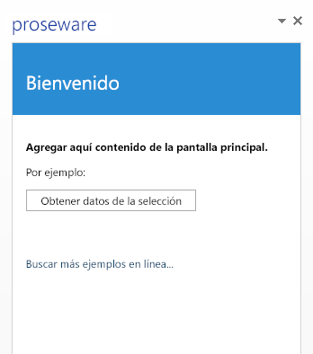

# Hospedar un complemento para Office en Microsoft Azure

El complemento de Office más sencillo está compuesto por un archivo de manifiesto XML y una página HTML. El archivo de manifiesto XML describe las características del complemento, como su nombre, las aplicaciones cliente de Office donde se puede ejecutar y la URL de la página HTML del complemento. La página HTML está contenida en un sitio web de complemento de Office y los usuarios pueden verla e interactuar con ella cuando instalan y ejecutan el complemento. 

Puede hospedar el sitio web de un complemento de Office en diferentes plataformas de hospedaje web (por ejemplo, Azure). Para hospedar un complemento de Office en Azure, tiene que publicarlo en un sitio web de Azure. 

En este tema se da por sentado que no tiene experiencia en el uso de Azure. Cuando termine, obtendrá una Complemento de Office sencilla que tiene el sitio web hospedado en Azure. Aprenderá a:

- Agregar un catálogo de complementos de confianza a Office 2013
    
- Crear un sitio web en Azure mediante Visual Studio 2015 o el Portal de administración de Azure
    
- Publicar y hospedar una Complemento de Office en un sitio web de Azure
    

**Sitio web de un complemento de Office hospedado en Azure**

## Configure su equipo de desarrollo con el SDK de Azure para .NET, una suscripción a Azure y Office 2013

1. Instale el SDK de Azure para .NET desde la [página de descargas de Azure](http://azure.microsoft.com/en-us/downloads/). Si no tiene Visual Studio instalado, se instala Visual Studio Express para Web con el SDK.
    
    - En  **Idiomas**, elija  **.NET**.
    
    - Elija la versión del SDK de Azure para .NET que coincida con su versión de Visual Studio, si ya tiene Visual Studio instalado.
    
    - Cuando se le pregunte si quiere ejecutar o guardar el archivo ejecutable, elija  **Ejecutar**.
    
    - En la ventana Instalador de plataforma web, elija  **Instalar**.
    
2. Instale Office 2013 si aún no lo hizo. 
    
     >**Nota:**  puede obtener una [versión de prueba durante un mes](http://office.microsoft.com/en-us/try/?WT%2Eintid1=ODC%5FENUS%5FFX101785584%5FXT104056786).
3. Obtenga su cuenta de Azure.
    
     >**Nota:**  si está suscrito a MSDN, [obtiene una suscripción a Azure como parte de su suscripción a MSDN](http://www.windowsazure.com/en-us/pricing/member-offers/msdn-benefits/). Si no está suscrito a MSDN, todavía puede [obtener una prueba gratuita de Azure en el sitio web de Windows Azure](https://azure.microsoft.com/en-us/pricing/free-trial/). 

Para que el tutorial sea sencillo y se centre en el uso de Azure con un complemento de Office, usará un recurso compartido de archivos local, como un catálogo de confianza donde almacenará el archivo de manifiesto XML del complemento. Si va a usar el complemento en una o varias empresas, puede conservar el archivo de manifiesto del complemento en SharePoint o publicar el complemento en la Tienda Office. 

## Paso 1: crear un recurso compartido de archivos de red para hospedar el archivo de manifiesto del complemento

1. Abra el Explorador de archivos (o el Explorador de Windows si usa Windows 7 o una versión anterior de Windows) en su equipo de desarrollo.
    
2. Haga clic con el botón derecho en la unidad C:\ y luego elija  **Nuevo**  >  **Carpeta**.
    
3. Asígnele a la carpeta nueva el nombre AddinManifests.
    
4. Haga clic con el botón derecho en la carpeta AddinManifests y luego elija  **Compartir con**  >  **Personas específicas**.
    
5. En **Uso compartido de archivos**, elija la flecha desplegable y, después, elija **Todos** >  **Agregar**  >  **Compartir**.
    

## Paso 2: agregar el recurso compartido de archivos al catálogo de complementos de confianza de modo que las aplicaciones cliente de Office confíen en la ubicación en la que instala las Complementos de Office

1.  Inicie Word 2013 y cree un documento. (Aunque en este ejemplo se usa Word 2013, puede usar cualquier aplicación de Office que sea compatible con complementos de Office, como Excel, Outlook, PowerPoint o Project 2013).
    
2.  Elija **Archivo**  >  **Opciones**.
    
3.  En **Opciones de Word**, elija  **Centro de confianza** y luego **Configuración del Centro de confianza**. 
    
4.  En el **Centro de confianza**, haga clic en  **Catálogos de complementos de confianza**. Escriba la ruta de acceso a la convención de nomenclatura universal (UNC) para el recurso compartido de archivo que creó anteriormente como la  **Dirección URL del catálogo**. Por ejemplo, \\NombreDeLaMáquina\AddinManifests.Luego, elija  **Agregar catálogo**. 
    
5. Active la casilla  **Mostrar en el menú**. Cuando almacena un archivo de manifiesto XML de un complemento en un recurso compartido que es un catálogo de complementos de confianza, el complemento aparece en  **Carpeta compartida** en el cuadro de diálogo **Complementos de Office**.
    

## Paso 3: crear un sitio web en Azure

Hay varias formas de crear un sitio web de Azure vacío. Si usa Visual Studio 2015, siga los pasos que se describen en [Uso de Visual Studio 2015](../publish/host-an-office-add-in-on-microsoft-azure.md#using-visual-studio-2015) para crear un sitio web de Azure desde el IDE de Visual Studio. También puede seguir los pasos descritos en [Uso del portal de administración de Azure](../publish/host-an-office-add-in-on-microsoft-azure.md#using-the-azure-management-portal) para crear el sitio web de Azure.

### Uso de Visual Studio 2015

1. En Visual Studio, en el menú  **Vista**, elija **Explorador de servidores**. Haga clic con el botón derecho en  **Azure** y elija **Conectar a la suscripción de Microsoft Azure**. Siga las instrucciones para conectarse a la suscripción de Azure.
    
2. En Visual Studio, en **Explorador de servidores**, expanda **Azure**, haga clic con el botón derecho en **Servicio de aplicaciones** y luego elija **Crear nueva aplicación web**.
    
3. Escriba un  **Nombre de aplicación web** exclusivo para el sitio. Azure comprueba que el nombre del sitio sea exclusivo en el dominio azurewebsites.net.
    
      - Escriba un  **Nombre de aplicación web** exclusivo para el sitio.
    
  - Elija el  **Plan de servicio de aplicaciones** de que está usando para autorizar la creación de este sitio web.
    
  - Elija el  **Grupo de recursos** para el sitio.
    
  - Elija una **Región** adecuada para usted.
    
  - The new website appears under the chosen resource group under  **App Service** under **Azure** in **Server Explorer**.
    

    El nuevo sitio web aparecerá en el grupo de recursos elegido en **Servicio de aplicaciones** en **Azure** en **Explorador de servidores**.
    
4. Haga clic con el botón derecho en el sitio web nuevo y luego elija  **Ver en el explorador**.
    
5. En la barra de direcciones del explorador, cambie la dirección URL del sitio web para que use HTTPS y presione  **Entrar** para confirmar que el protocolo HTTPS esté habilitado.
    
6. En Visual Studio 2015, haga clic con el botón derecho en el nuevo sitio web en el **Explorador de servidores**, elija **Descargar perfil de publicación** y, después, guarde el perfil en el equipo. El perfil de publicación contiene sus credenciales y le permite realizar el [Paso 5: Publicar el complemento de Office en el sitio web de Azure](../publish/host-an-office-add-in-on-microsoft-azure.md#step-5-publish-your-office-add-in-to-the-azure-website).
    

### Uso del portal de administración de Azure

1. Inicie sesión en el [Portal de administración de Azure](https://manage.windowsazure.com/) con su cuenta de Azure.
    
2. Elija **NUEVO** > **PROCESO** > **APLICACIÓN WEB** > **CREACIÓN RÁPIDA**. 
    
3. En  **Dirección URL**, escriba un nombre de sitio exclusivo para completar la dirección URL para el sitio web.
    
4. Elija una **REGIÓN** geográfica apropiada para el sitio.
    
5. Elija  **CREAR APLICACIÓN WEB**. El Portal de administración de Azure crea el sitio web y lo redirige a la página de  **sitios web** en la que puede ver el estado del sitio web.
    
    Cuando el estado del sitio web sea **En ejecución**, elija la dirección URL para el sitio web bajo la columna **NOMBRE**. El navegador se abre y muestra una página web con el mensaje **Se ha creado la aplicación web**. 
    
    En la barra de direcciones del explorador, cambie la dirección URL del sitio web para que use HTTPS y presione  **Entrar** para confirmar que el protocolo HTTPS esté habilitado.
    
6. En la página **Aplicaciones web**, elija el sitio web nuevo.
    
7. En  **Publicar la aplicación**, elija  **Descargar el perfil de publicación** para guardar el perfil de publicación en el equipo.
    
    Paso 4: crear un complemento para Office en Visual Studio 
    

## Paso 4: crear un complemento para Office en Visual Studio

1. Inicie Visual Studio como administrador.
    
2. Elija **Archivo** > **Nuevo** > **Proyecto**.
    
3. En **Plantillas**, expanda **Visual C#** (o **Visual Basic**), expanda **Office/SharePoint** y luego elija **Complementos de Office**.
    
4. Cuando aparezca  **Crear complemento de Office**, deje la opción predeterminada para un complemento del panel de tareas y elija  **Siguiente**.
    
5. Cuando aparezca **Crear complemento de Office**, deje la opción predeterminada para un complemento del panel de tareas y elija **Siguiente**.
    
6. En la siguiente página, desactive todas las casillas excepto la de Word y, después, elija **Finalizar**.
    
Se crea una Complemento de Office básica que está lista para publicar en Azure. Dado que nos estamos enfocando en cómo debe publicarse en Azure, no realizaremos cambios en este complemento de ejemplo que creó mediante la plantilla estándar de Complemento de Office en Visual Studio.

## Paso 5: publicar el complemento para Office en el sitio web de Azure

1. Haga clic con el botón derecho en el proyecto web y luego elija  **Publicar**.
    
2. Haga clic con el botón derecho en el proyecto web y luego elija **Publicar**. 
    
    El proyecto web contiene archivos del sitio web del complemento de Office, así que este es el proyecto que publica en Azure.
    
3. En **Publicación web**, elija **Importar**. 
    
4. En  **Importar configuración de publicación**, elija  **Examinar** y luego vaya hasta la ubicación en la que guardó el perfil de publicación anteriormente en este tema. Elija **Aceptar** para importar el perfil.
    
5. En **Publicación web**, en la pestaña **Conexión**, acepte los valores predeterminados y elija **Siguiente**. 
    
    Elija **Siguiente ** para aceptar la configuración predeterminada.
    
6. En la pestaña  **Vista previa**, elija  **Iniciar vista previa**.
    
7. Elija  **Publicar**. 
    
8. Cuando Visual Studio termina de publicar el proyecto web, el explorador se abre y muestra una página web con el texto "La aplicación web se ha creado correctamente". Esta es la página predeterminada actual del sitio web.
    
    To see the webpage for your add-in, change the URL to use https: and add the path of your add-in's default HTML page.
    

## Paso 6: editar el archivo de manifiesto del complemento para que apunte a la Complemento de Office en Azure.

1. En Visual Studio con el complemento de Office de ejemplo abierto en el **Explorador de soluciones**, expanda la solución para que aparezcan ambos proyectos.
    
2. Expanda el proyecto de la Complemento de Office, por ejemplo  **OfficeAdd-in1**, haga clic con el botón derecho en la carpeta del manifiesto y luego elija  **Abrir**.
    
3. En  **Ubicación de origen**, escriba la dirección URL de la página HTML principal del complemento que copió en el paso anterior tras publicar el complemento, por ejemplo: https://SuDominio.azurewebsites.net/Addin/Home/Home.html. 
    
4. Elija  **Archivo** y luego elija **Guardar todo**.
    
5. Nuevamente en el **Explorador de soluciones**, haga clic con el botón derecho en la carpeta del manifiesto y elija **Abrir carpeta en el Explorador de archivos**.
    
6. Copie el archivo del manifiesto del complemento, por ejemplo, OfficeAdd-in1.xml. 
    
7. Vaya al recurso compartido de archivos de red que creó anteriormente en este tema y pegue el archivo de manifiesto en la carpeta.
    

## Paso 7: insertar y ejecutar el complemento en la aplicación cliente de Office

1. Inicie Word y abra un documento nuevo.
    
2. En la cinta, elija **Insertar** > **Mis aplicaciones** y, después, elija **Ver todo**.
    
3. En el cuadro de diálogo  **Aplicaciones para Office**, elija  **CARPETA COMPARTIDA**.
    
4. Elija el icono del complemento y luego **Insertar**. El complemento se inserta en el lado de la aplicación cliente.
    
5. Para ello, cree texto en el documento, seleccione el texto y luego elija  **Obtener datos de la selección**.
    

## Recursos adicionales

- [Publicar el complemento de Office](../publish/publish.md)
    
- [Empaquetar el complemento con Visual Studio para prepararlo para su publicación](../publish/package-your-add-in-using-visual-studio.md)
    
