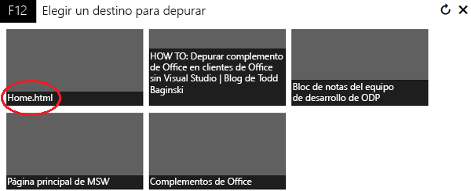
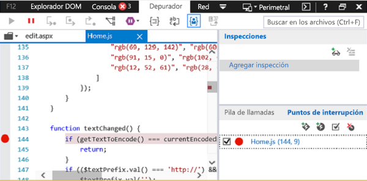
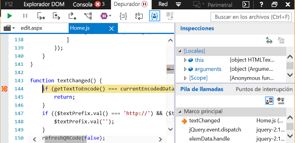

# Depurar complementos con las herramientas de desarrollo F12 en Windows 10

Las Herramientas de desarrollo F12 que se incluyen en Windows 10 pueden ayudarle a desarrollar, depurar y hacer que se carguen más rápido sus páginas web. También puede usarlas para desarrollar y depurar complementos de Office (por ejemplo, si no usa un IDE como Visual Studio o si necesita investigar un problema mientras ejecuta el complemento fuera del IDE). Puede iniciar las Herramientas de desarrollo F12 después de ejecutar el complemento.

En este artículo se muestra cómo usar la herramienta Depurador de las Herramientas de desarrollo F12 en Windows 10 para probar un complemento de Office. Puede probar complementos de la Tienda Office o complementos que agregó de otras ubicaciones. Las Herramientas de desarrollo F12 se muestran en una ventana separada y no usan Visual Studio.

 >**Nota** El Depurador forma parte de las Herramientas de desarrollo F12 en Windows 10 e Internet Explorer. En las versiones anteriores de Windows no se incluye el Depurador. 

### Requisitos previos

Necesita el siguiente software:

- Las Herramientas de desarrollo F12, que se incluyen en Windows 10. 
    
- La aplicación cliente de Office que hospeda el complemento. 
    
- Su complemento. 
    
### Usar el depurador

En este ejemplo se usa Word y un complemento gratuito de la Tienda Office.

1. Abra Word y elija un documento en blanco.  
    
2. En la pestaña **Insertar**, en el grupo de complementos, almacene y seleccione el complemento QR4Office. (Puede cargar cualquier complemento de la Tienda o de su propio catálogo de complementos).
    
3. Inicie las herramientas de desarrollo F12 que se correspondan con su versión de Office:
    
      - Para la versión de Office de 32 bits, use C:\Windows\System32\F12\F12Chooser.exe
    
  - Para la versión de Office de 64 bits, use C:\Windows\SysWOW64\F12\F12Chooser.exe
    

    Al iniciar F12Chooser, una ventana independiente (denominada "Elija un destino para la depuración") muestra las aplicaciones que se pueden depurar. Seleccione la aplicación que le interesa. Si está escribiendo su propio complemento, seleccione el sitio web donde tiene implementado el complemento, que puede ser una dirección URL de localhost. 
    
    Por ejemplo, seleccione **home.html**.  
    
    

4. En la ventana de F12, seleccione el archivo que desee depurar.
    
    Para seleccionar el archivo, elija el icono de carpeta que aparece encima del panel **script** (a la izquierda). La lista desplegable muestra los archivos disponibles. Seleccione home.js.
    
5. Establezca el punto de interrupción.
    
    Para establecer el punto de interrupción en home.js, elija la línea 144, que se encuentra en la función _textChanged_. Verá un punto rojo a la izquierda de la línea y una línea correspondiente en el panel **Pila de llamadas y puntos de interrupción** (abajo a la derecha). Para conocer otras formas de establecer un punto de interrupción, consulte [Inspeccionar el JavaScript que se está ejecutando con el depurador](https://msdn.microsoft.com/library/dn255007%28v=vs.85%29.aspx). 
    
    

6. Ejecute el complemento para activar el punto de interrupción.
    
    Seleccione el cuadro de texto de dirección URL situado en la parte superior del panel de QR4Office para cambiar el texto. En el depurador, en el panel **Pila de llamadas y puntos de interrupción**, verá que el punto de interrupción se ha activado y muestra información diversa. Es posible que tenga que actualizar la herramienta F12 para ver los resultados.
    
    

## Recursos adicionales

- 
  [Inspeccionar el JavaScript que se está ejecutando con el depurador](https://msdn.microsoft.com/library/dn255007%28v=vs.85%29.aspx)
    
- 
  [Usar las herramientas de desarrollo F12](https://msdn.microsoft.com/en-us/library/bg182326%28v=vs.85%29.aspx)
    
