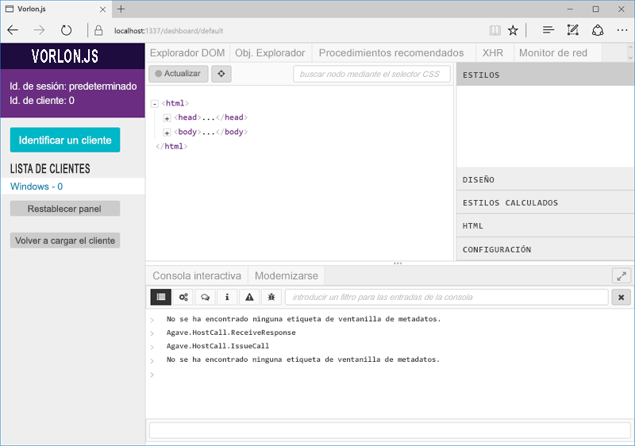

# Depurar complementos de Office en dispositivos iPad y Mac

Puede usar Visual Studio para desarrollar y depurar add-ins en Windows, pero no se puede usar para depurar add-ins en un iPad ni en un Mac. Como los add-ins se desarrollan en HTML y Javascript, están diseñados para que funcionen en distintas plataformas, pero puede haber diferencias sutiles en la forma en que cada explorador presenta el código HTML. En este tema se describe cómo depurar los add-ins que se ejecutan en iPad o Mac. 

## Depurar con Vorlon.js 

Vorlon.js es un depurador de páginas web, similar a las herramientas de F12, que está diseñado para trabajar de forma remota y permite depurar páginas web en diferentes dispositivos. Para más información, vea el [sitio web de Vorlon](http://www.vorlonjs.com).  

Para instalar y configurar Vorlon: 

1.  Instale [Node.js](https://nodejs.org) y [Git](https://git-scm.com/) (si aún no lo ha hecho). 

2.  Instale Vorlon con git usando el comando siguiente: `git clone https://github.com/MicrosoftDX/Vorlonjs.git`

3.  Instale las dependencias con `npm install`.

4.  Los complementos requieren HTTPS. Por extensión, los scripts que usan también deben ser HTTPS, incluyendo el script de Vorlon. Por lo tanto, para usar Vorlon con complementos deberá configurarlo de forma que use SSL. En la carpeta en la que instaló Vorlon, vaya a la carpeta /Server y edite el archivo config.json. Cambie la propiedad **useSSL** a **true**. De paso, puede habilitar también el complemento de complementos de Office (cambie su propiedad "enabled" a true). 

5.  Ejecute el servidor Vorlon con el comando `sudo vorlon`. 

6.  Abra una ventana del explorador y vaya a [http://localhost:1337](http://localhost:1337), que es la interfaz de Vorlon. Confíe en el certificado de seguridad cuando se le solicite. El certificado de seguridad se encuentra también en la carpeta Vorlon, en /Server/cert. 

7.  Agregue la siguiente etiqueta de secuencia de comandos a la sección `<head>` del archivo home.html (o al archivo HTML principal) del complemento:
```    
<script src="https://localhost:1337/vorlon.js"></script>    
```  

Ahora, cuando abra el complemento en un dispositivo, se mostrará en la lista de clientes en Vorlon (en la parte izquierda de la interfaz de Vorlon). Puede resaltar de forma remota elementos DOM, ejecutar comandos de forma remota y mucho más.  



El complemento de Office agrega capacidades adicionales a Office.js, como las de explorar el modelo de objetos y ejecutar llamadas a Office.js. 
