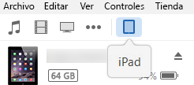
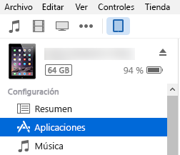
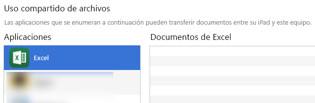
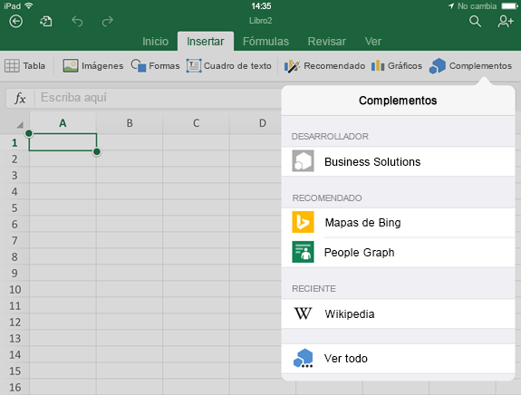
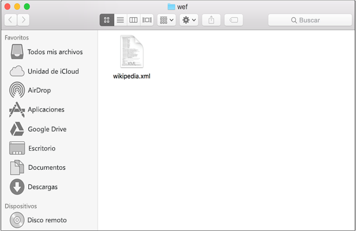
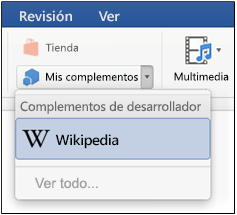
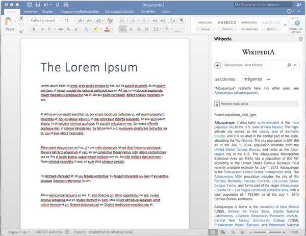

# Transferir localmente complementos de Office para pruebas en dispositivos iPad y Mac

Para ver cómo se ejecutará el complemento en Office para iOS, puede transferir localmente el manifiesto del complemento a un iPad mediante iTunes o transferir localmente el manifiesto del complemento directamente en Office para Mac. Esta acción no le permite establecer puntos de interrupción ni depurar el código del complemento mientras se está ejecutando, pero puede ver cómo se comporta y comprobar que la interfaz de usuario es utilizable y se representa adecuadamente. 

## Requisitos previos de Office para iOS

- Un equipo Windows o Mac con [iTunes](http://www.apple.com/itunes/download/) instalado.
    
- Un dispositivo iPad con iOS 8.2 o posterior con [Excel para iPad](https://itunes.apple.com/us/app/microsoft-excel/id586683407?mt=8) instalado y un cable de sincronización.
    
- El archivo de manifiesto .xml del complemento que desea probar.
    

## Requisitos previos de Office para Mac

- Un Mac que ejecute OS X v10.10 "Yosemite" (o versiones posteriores) con [Office para Mac](https://products.office.com/en-us/buy/compare-microsoft-office-products?tab=omac) instalado.
    
- Word para Mac versión 15.18 (160109).
   
- Excel para Mac versión 15.19 (160206).

- PowerPoint para Mac versión 15.24 (160614)
    
- El archivo de manifiesto .xml del complemento que quiere probar.
    

## Transferir localmente un complemento en Excel o Word para iPad

1. Use un cable de sincronización para conectar su iPad al equipo. Si es la primera vez que conecta el iPad al equipo, verá la pregunta **¿Confiar en este equipo?**. Elija **Confiar** para continuar.

2. En iTunes, seleccione el icono **iPad** debajo de la barra de menús.
    
    

3. En  **Configuración**, en el lado izquierdo de iTunes, seleccione  **Apps**.
    
    

4. En el lado derecho de iTunes, desplácese hacia abajo hasta  **Uso compartido de archivos** y luego seleccione **Excel** o **Word** en la columna **Complementos**.
    
    

5. En la parte inferior de la columna  **Excel** o **Documentos de Word**, seleccione  **Agregar archivo** y luego seleccione el archivo de manifiesto .xml del complemento que quiere transferir localmente. 
    
6. Abra la aplicación de Excel o Word en el iPad. Si la aplicación de Excel o Word ya se está ejecutando, elija el botón  **Inicio** y luego cierre y reinicie la aplicación.
    
7. Abra un documento.
    
8. Seleccione  **Complementos** en la pestaña **Insertar**. El complemento transferido localmente está disponible para insertar bajo el encabezado  **Desarrollador** de la interfaz de usuario **Complementos**.
    
    

## Transferir localmente un complemento en Office para Mac

> **Nota:** Para transferir de forma local un complemento de Outlook 2016 para Mac, consulte [Transferir localmente complementos de Outlook para pruebas](sideload-outlook-add-ins-for-testing.md).

1. Abra **Terminal** y vaya a una de las siguientes carpetas, donde guardará el archivo de manifiesto del complemento. Si la carpeta `wef` no existe en el equipo, créela.
    
    - Para Word: `/Users/<username>/Library/Containers/com.microsoft.Word/Data/documents/wef`    
    - Para Excel: `/Users/<username>/Library/Containers/com.microsoft.Excel/Data/documents/wef`
    - Para PowerPoint: `/Users/<username>/Library/Containers/com.microsoft.Powerpoint/Data/documents/wef`
    
2. Abra la carpeta en **Finder** con el comando `open .` (incluyendo el punto). Copie el archivo de manifiesto del complemento a esta carpeta.
    
    

3. Inicie Word y abra un documento. Si ya se está ejecutando, reinicie Word.
    
4. En Word, elija **Insertar** > **Complementos** > **Mis complementos** (menú desplegable) y luego elija su complemento.
    
    

  > **Importante:** Los complementos transferidos localmente no aparecen en el cuadro de diálogo Mis complementos. Solo son visibles en el menú desplegable (pequeña flecha abajo a la derecha de Mis complementos). Los complementos transferidos localmente se muestran en la lista bajo el encabezado "Complementos de desarrollador". 
    
5. Compruebe si su complemento se muestra en Word.
    
    
    
> **Nota:** a menudo en Office para Mac los complementos se almacenan en caché, por motivos de rendimiento. Si necesita forzar una recarga del complemento mientras lo está desarrollando, puede borrar la carpeta Users/<usr>/Library/Containers/com.Microsoft.OsfWebHost/Data/. 

## Recursos adicionales

- [Depurar complementos de Office en dispositivos iPad y Mac](../testing/debug-office-add-ins-on-ipad-and-mac.md)
    
