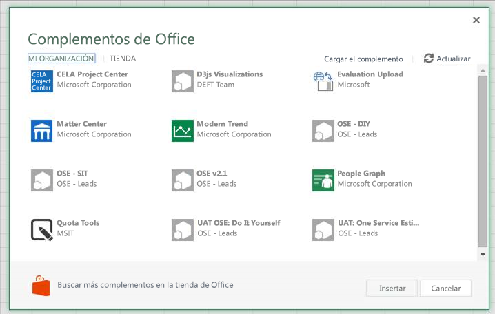
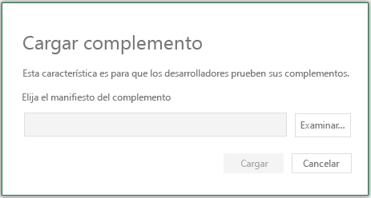
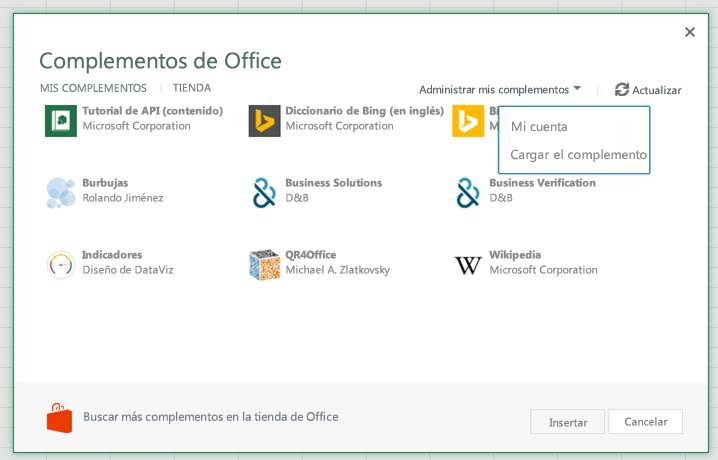

# Transferir localmente complementos de Office en Office Online para pruebas

Puede instalar un complemento de Office para realizar pruebas sin tener que colocarlo primero en un catálogo de complementos con una instalación de prueba. La instalación de prueba se puede realizar en Office 365 o en Office Online. El procedimiento es ligeramente distinto para las dos plataformas. 

Cuando se transfiere localmente un complemento, el manifiesto de este se almacena en el almacenamiento local del navegador, por lo que si se quiere borrar el caché del navegador o cambiar a un navegador diferente, el complemento se debe transferir localmente de nuevo.

 >**Nota**  Sideloading as described in this article is supported on Word, Excel, and PowerPoint. To sideload an Outlook add-in, see [Transferir localmente complementos de Outlook para pruebas](sideload-outlook-add-ins-for-testing.md).

## Sideload an Office Add-in on Office 365

1. Inicie sesión en su cuenta de Office 365.
    
2. Abra el iniciador de aplicaciones en el extremo izquierdo de la barra de herramientas y seleccione **Excel**, **Word** o **PowerPoint** y, después, cree un documento.
    
3. Abra la pestaña **Insertar** en la cinta de opciones y, en la sección **Complementos**, elija **Complementos de Office**.
    
4. En el cuadro de diálogo **Complementos de Office**, seleccione la pestaña **MI ORGANIZACIÓN** y, después, **Cargar mis complementos**.
    
    

5.  **Busque** en el archivo de manifiesto de complementos y, después, seleccione **Cargar**.
    
    

6. Verify that your complemento is installed. For example, if it is an add-in command, it should appear on either the ribbon or the context menu. If it is a task pane add-in the pane should appear.
    

## Transferir localmente un complemento de Office en Office Online

1. Open [Microsoft Office Online](https://office.live.com/).
    
2. En **Comenzar a trabajar con las aplicaciones en línea**, elija **Excel**, **Word** o **PowerPoint** y, después, abra un documento nuevo.
    
3. Abra la pestaña **Insertar** en la cinta de opciones y, en la sección **Complementos**, elija **Complementos de Office**.
    
4. En el cuadro de diálogo **Complementos de Office**, seleccione la pestaña **MIS COMPLEMENTOS**, elija **Administrar mis complementos** y, después, **Cargar mi complemento**.
    
    

5.  **Busque** en el archivo de manifiesto de complementos y, después, seleccione **Cargar**.
    
    

6. Compruebe que el complemento está instalado. Por ejemplo, si es un comando de complemento, aparecerá en la cinta o en el menú contextual. Si es un complemento de panel de tareas, se mostrará el panel.
    
